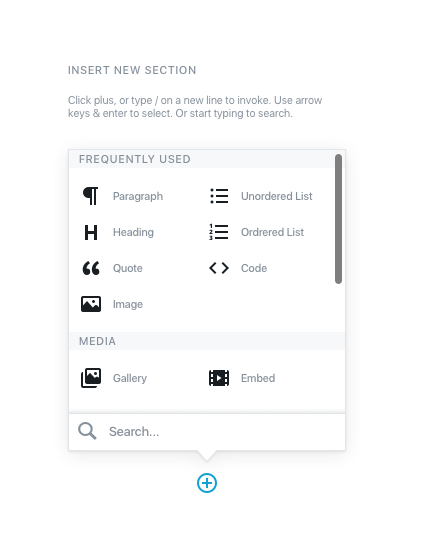
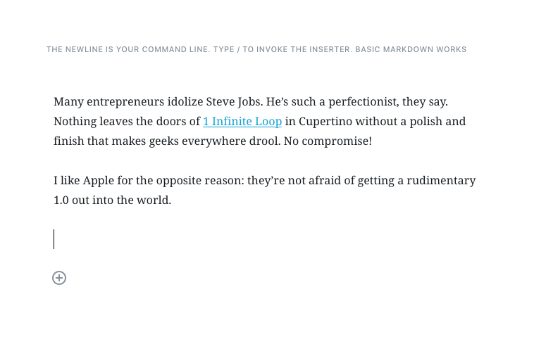
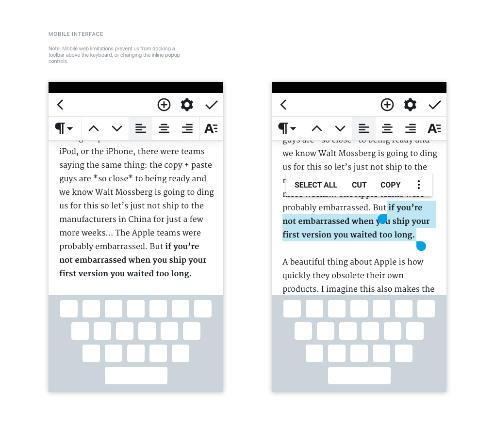

# Gutenberg

Prototyping since 1440.

This is the development and prototyping hub for the editor focus in core.
Gutenberg is the project name. Conversations and discussions take place in #core-editor in Slack.

> The editor will endeavour to create a new page and post building experience that makes writing rich posts effortless, and has “blocks” to make it easy what today might take shortcodes, custom HTML, or “mystery meat” embed discovery. — Matt Mullenweg

WordPress already supports a large amount of "blocks", but doesn't surface them very well, nor give them many rich layout options. By embracing the blocky nature, we can hopefully surface blocks that already exist, as well as attach more advanced layout options to each of them, allowing you to easily write richer posts.

## Overview

- <a href="https://make.wordpress.org/design/2017/01/25/what-are-little-blocks-made-of">What are little blocks made of?</a>
- <a href="https://make.wordpress.org/core/2017/01/17/editor-technical-overview/">Editor Technical Overview</a>

## Prototypes

- <a href="https://wordpress.github.io/gutenberg/">UI prototype</a>.
- <a href="https://calypso.live/blocks?branch=try/block-parsing-extension">Parsing HTML comments and separate TinyMCE instances</a>.
- <a href="http://fiddle.tinymce.com/block/">TinyMCE block concept</a>.

## Parser

- <a href="https://github.com/Automattic/wp-post-grammar">WP Post grammar parser</a>.

## How Designers Can Contribute

The editor we're building means to make the editing experience better for every WordPress user, by creating an interface that "makes writing rich posts effortless, and has 'blocks' to make it easy what today might take shortcodes, custom HTML, or 'mystery meat' embed discovery", to quote the kickoff goal.

That is difficult. So your designer eyes and help is appreciated, in what capacity you'd like to contribute.

A good place to start is having a look at <a href="https://github.com/WordPress/gutenberg#mockups">the current mockups</a> and <a href="https://wordpress.github.io/gutenberg/">the UI prototype</a>. We also have a GitHub repository, where <a href="https://github.com/WordPress/gutenberg/issues?q=is%3Aissue+is%3Aopen+label%3ADesign">anything labelled "Design"</a> could use thoughtful replies, mockups, animatics, sketches, doodles.

With regards to specific changes to the design, the details & execution (like colors, borders, shadows), those are best done as minimal and specific iterations on the work that precedes it, so we can ideally compare. That doesn't preclude wild ideas, but should be considered for precise tasks like "give the pressed buttons more contrast", things in that vein.

Grab the Sketch file so you don't have to start from scratch:

**<a href="https://cloudup.com/cMPXM8Va2cy">Download, Updated Mar. 15th.</a>**

## Mockups

These mockups are all subject to change and feedback.

**Basic Blocks**

_Text_

_Text, Hover_

_Text, Selected_

---

_Empty Image_

_Empty Image, Hover_

_Image_

_Image, Hover_

_Image, Selected_

_Image, Caption_

---

_Empty Quote_

_Empty Quote, Hover_

_Quote_

_Quote, Hover_

_Quote, Selected_

_Quote, Citation_

_Quote 2_

_Quote 2, Hover_

_Quote 2, Selected_

---

_Heading_

_Heading, Hover_

_Heading, Selected_

---

_Empty Embed_

_Empty Embed, Hover_

_Embed, Neutral_

_Embed, Hover_

_Embed, Selected_

_Embed, Caption_

---

_Gallery_

_Gallery, Hover_

_Gallery, Selected_

_Gallery, Selected Image_

_Gallery, Caption_

---

_Basic UI controls_

**Early Admin UI Concept**

**Note:** This is how it _could_ look.

**Early Mobile UI Concept**

