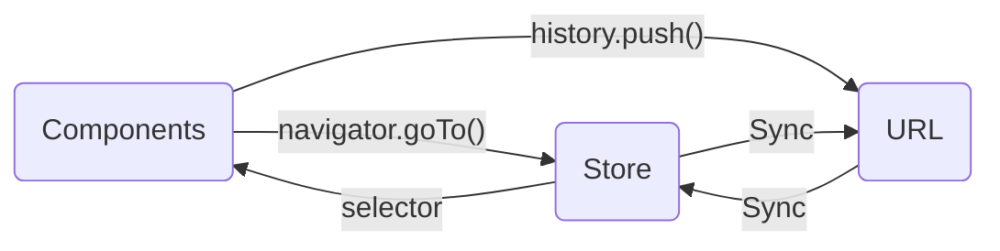
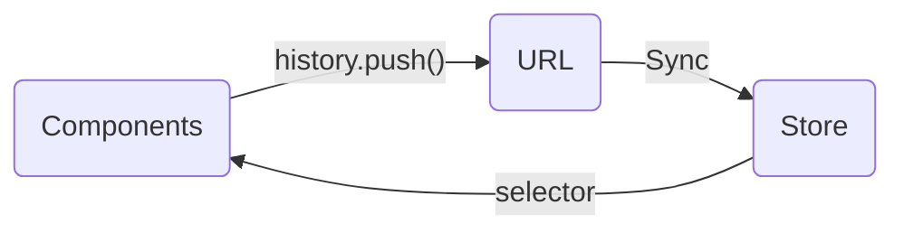

# Issue #37355: `Navigator` component and the client-side router in side editor

- URL: https://github.com/WordPress/gutenberg/issues/37355
- Author: ciampo
- Created: 2021-12-14T08:55:28Z
- Updated: 2023-06-26T11:16:15Z
- Comments: 20 of 20

## Body

In https://github.com/WordPress/gutenberg/pull/37223#issuecomment-993095821,  @kevin940726 wrote:

> Not sure if you're aware of this, but we've recently done other approach to try to implement a custom client side router in the side editor. See https://github.com/WordPress/gutenberg/pull/36488 for the basic implementation and https://github.com/WordPress/gutenberg/pull/37314 for focus management and some refactor.
>
> The approach we take there is to make it browser-first, and use the `history` package to manage the routing for most parts. We can easily switch back to in-memory router by changing `createBrowserHistory` to `createMemoryHistory`.
>
> Even though we currently don't have the need to implement a real browser-based client side router, I think it's still good to take it into account in case we ever have the requirement to do so.
>
> Maybe we could combine the two into this component and learn from each other?
>
> Not sure if you're aware of this, but we've recently done other approach to try to implement a custom client side router in the side editor. See #36488 for the basic implementation and #37314 for focus management and some refactor.

And in https://github.com/WordPress/gutenberg/pull/37223#issuecomment-993304783 @youknowriad  answered:

> @kevin940726 yeah browser navigation has actually been part of the initial implementation of the Navigator component but we felt that it's not something that is needed in all use-cases and not something that should be backed into a UI component, for this reason we decided to built a generic UI component and still have an API that allow syncing with browser history if needed for non-mobile/web apps like edit-site. The original prototype here https://github.com/WordPress/gutenberg/pull/32923 has a mechanism to sync navigation state with history that could serve as inspiration.

## Issue comments

### ciampo on 2021-12-14T08:55:58Z

URL: https://github.com/WordPress/gutenberg/issues/37355#issuecomment-993316199

> Not sure if you're aware of this, but we've recently done other approach to try to implement a custom client side router in the side editor. See #36488 for the basic implementation and #37314 for focus management and some refactor.

No, I wasn't aware of it, and thank you for letting me know!

> The approach we take there is to make it browser-first, and use the `history` package to manage the routing for most parts. We can easily switch back to in-memory router by changing `createBrowserHistory` to `createMemoryHistory`.
>
> Even though we currently don't have the need to implement a real browser-based client side router, I think it's still good to take it into account in case we ever have the requirement to do so.
> 
> Maybe we could combine the two into this component and learn from each other?

It is indeed not ideal that we have many routing solutions within the same repo. Out of curiosity, did you consider `@wordpress/components` and `Navigator` before deciding to build a new routing solution? I know that `Navigator` doesn't currently offer all the features that you needed, but it would have definitely been a good conversation to have.

When working on the Global Styles sidebar and discussing what features the `Navigator` component should have offered, I had initially suggested that `Navigator` should offer a complete client-side routing solution, and that should have used an existing third-party library as an internal dependency (since routing is quite complicated and there's no need to reinvent it and maintain our solution).

As @youknowriad just explained above, it was decided that there wasn't a need or any of those "advanced" routing features, and that `Navigator` should have just been a very simple memory router (i.e. no browser history, no capability to read/write from browser history).

The fact that a client-side router in the site editor was implemented just a few weeks later raises some questions:

- Should that implementation exist separately from `@wordpress/components` and be proprietary to the site editor package?
- Should we instead make `Navigator` more featureful, and use it in the site-editor package?
- As we add more and more client-side routing features, should we reconsider using a third-party routing solution (of course without exposing it directly as a dependency) ?

### kevin940726 on 2021-12-14T09:19:29Z

URL: https://github.com/WordPress/gutenberg/issues/37355#issuecomment-993335961

> Out of curiosity, did you consider `@wordpress/components` and `Navigator` before deciding to build a new routing solution?

No I didn't even know it exists when first implementing the custom CSR 😅 .

> As @youknowriad just explained above, it was decided that there wasn't a need or any of those "advanced" routing features, and that `Navigator` should have just been a very simple memory router (i.e. no browser history, no capability to read/write from browser history).

I was not there in the discussion, so I'm obviously biased here, but IMHO it's a missed opportunity that we didn't choose to implement a more robust solution. Especially given that it's not impossible nor very difficult to support both situations.

Many challenges we're facing in this `<Navigator>` component also apply to the browser-based approach. Furthermore, most of them have already been tackled or have best practices in other popular CSR solutions. I believe targeting browser's history is a good default, getting it to a pure in-memory approach should be easier than the other way around.

Making it browser-first is preferred if we ever want to implement a client side router in WordPress in the future, which seems like a trend in most modern front-end web apps. It can also unify the client routing solutions in the WP plugins ecosystem (maybe even in Calypso?).

> - Should that implementation exist separately from `@wordpress/components` and be proprietary to the site editor package?
> - Should we instead make `Navigator` more featureful, and use it in the site-editor package?

I believe we can make `<Navigator>` more featureful by refactoring it to be browser-first, so that we don't have to maintain yet another routing solution in the site editor package.

> - As we add more and more client-side routing features, should we reconsider using a third-party routing solution (of course without exposing it directly as a dependency) ?

Yes. This is my original thought when first implementing it using `history`. `react-router` and `react-location` seem like overkills for the use case in site editor for now though.

### youknowriad on 2021-12-14T09:48:01Z

URL: https://github.com/WordPress/gutenberg/issues/37355#issuecomment-993359866

Some missing point of discussions here:

 - We want the global styles navigation (and navigation elsewhere like preferences panel) to not impact the browser URL at all.
 - We want the navigation components to be cross platform as UI components are supposed to work on native apps as well.

I think these are solution indications that the current approach is sound. A lightway navigator that we can plug into the browser history if needed.

### kevin940726 on 2021-12-14T10:19:50Z

URL: https://github.com/WordPress/gutenberg/issues/37355#issuecomment-993389556

If we want the implementation to be cross-platform, shouldn't we take browser's history stack into account from the start as well? [`history`](https://github.com/remix-run/history/blob/main/docs/api-reference.md#creatememoryhistory) supports both `createBrowserHistory` and `createMemoryHistory` with almost the same API, so that if we want to plug it into browser's history, we don't have to implement the synchronization ourselves. Using the API from `history` also makes sure that we won't accidentally introduce memory-only APIs in our component (or at least makes it explicit).

### ciampo on 2023-06-22T10:24:15Z

URL: https://github.com/WordPress/gutenberg/issues/37355#issuecomment-1602393388

@youknowriad , considering the introduction of the `@wordpress/router` package, is this issue still relevant? Or should we close it?

### youknowriad on 2023-06-23T07:49:28Z

URL: https://github.com/WordPress/gutenberg/issues/37355#issuecomment-1603873583

Yes, I think over time I grow convinced that "Navigator" and routing are independent and we should close this one.

### kevin940726 on 2023-06-23T11:15:32Z

URL: https://github.com/WordPress/gutenberg/issues/37355#issuecomment-1604132109

Based on my recent experience working on the routing logic in the site editor, I have found it to be rather confusing and unnecessarily complicated. If `Navigator` and the router are independent, then we have to decide which one is the single source of truth. In either case we have to synchronize states from one to the other.

1. If `Navigator` is the source of truth, we have to synchronize local states to the URL states. This means everywhere we update our url we want to use the `Navigator`'s API (`goTo`, `goToParent`, etc.)
2. If the router is the source of truth, i.e. the URL is the source of truth, we want to use the API from `history` instead (`push`, `back`, etc).

Currently, both are the sources of truth, and we use both API from `Navigator` and the router,  so we need to do some two-way syncing in [`use-sync-path-with-url`](https://github.com/WordPress/gutenberg/blob/1c3c161382e7bb157778f0d50d885324953ec076/packages/edit-site/src/components/sync-state-with-url/use-sync-path-with-url.js#L51-L118) and other custom hooks. IMHO, this is the primary reason behind the confusion and difficulty in working with this system.

We should just choose one as the single source of truth, and this is the reason why I advocate using `history` as the single API for navigating. By using `createBrowserHistory`, we can easily change the URL, and if the navigation is purely in memory or intended to function in a native environment, we can effortlessly switch to `createMemoryHistory` while retaining the same API.

This is a [practice](https://twitter.com/kentcdodds/status/1349173470567964673?s=20) that has been [discussed](https://twitter.com/tannerlinsley/status/1671901592692600832?s=20) many times before. Implementing this approach ensures a clear and direct data flow, while abstracting away the intricacies of syncing behind a standardized abstraction.

Adopting this architecture still allows for the implementation of advanced logic, such as focus management and `goToParent`. An additional benefit is that it empowers developers to leverage `history.replace` and `history.state` for advanced routing requirements without the need to implement them within the Navigator component.

Many have also voiced their frustration working with the Site Editor's router. I hope that a more architectural change could help mitigate that. Especially since `Navigator` is still considered _experimental_ now 😆. WDYT?

### ciampo on 2023-06-23T14:29:29Z

URL: https://github.com/WordPress/gutenberg/issues/37355#issuecomment-1604366050

> Currently, both are the sources of truth, and we use both API from Navigator and the router, so we need to do some two-way syncing in [use-sync-path-with-url](https://github.com/WordPress/gutenberg/blob/1c3c161382e7bb157778f0d50d885324953ec076/packages/edit-site/src/components/sync-state-with-url/use-sync-path-with-url.js#L51-L118) and other custom hooks. IMHO, this is the primary reason behind the confusion and difficulty in working with this system.

That is true, and I have in fact recently opened https://github.com/WordPress/gutenberg/issues/51760, since that two way syncing is breaking the focus restoration in `Navigator`

I've been personally advocating for having a fully-fledged router in `Navigator` from the start (or at least for an API that resembled browser `history` as much as possible), but the general feedback received was for navigator to be "dumber", and basically have a very limited internal "history" logic and mostly provide an easy way to animate between different screens. After that, "parent" navigation was added, thus deviating from a traditional linear history (forwards/backwards) navigation.

> We should just choose one as the single source of truth, and this is the reason why I advocate using history as the single API for navigating. By using createBrowserHistory, we can easily change the URL, and if the navigation is purely in memory or intended to function in a native environment, we can effortlessly switch to createMemoryHistory while retaining the same API.

Judging from Riad's comment above and from the reply in https://github.com/WordPress/gutenberg/issues/51760, Riad's proposed solution is that `NavigatorProvider` can be controlled, ie. that it accepts a `path` and `onChange` props. What I'm missing, in that case, is how we may want to keep the components' back/forward navigation and the focus restoration functionality, without basically replicating the same logic also outside of the component.

Is your suggestion basically to remove all of the history logic from `Navigator`, and basically make it a bunch of animated divs reacting to a change in the `path` or `location` props?

> Especially since Navigator is still considered experimental now 😆. WDYT?

Given previous feedback received on other components, is looks like the "experimental" prefix has little value when it comes to defining whether a component is experimental or not. What matters seems to be whether the code has been merged in a core release or not — and in the case of `Navigator`, it has.

### youknowriad on 2023-06-23T19:27:06Z

URL: https://github.com/WordPress/gutenberg/issues/37355#issuecomment-1604771396

> Judging from Riad's comment above and from the reply in https://github.com/WordPress/gutenberg/issues/51760, Riad's proposed solution is that NavigatorProvider can be controlled, ie. that it accepts a path and onChange props. What I'm missing, in that case, is how we may want to keep the components' back/forward navigation and the focus restoration functionality, without basically replicating the same logic also outside of the component.

I think the Navigator can still keep the history but base it on the "path" prop instead (history of path changes). That said, I still need to experiment with that.

### youknowriad on 2023-06-23T19:36:53Z

URL: https://github.com/WordPress/gutenberg/issues/37355#issuecomment-1604789092

@kevin940726 My proposal is to use @wordpress/data stores (edit-site store) as the source of truth because that's already the source of truth for all Gutenberg code base. This still requires two-way syncing between "store" and "url" but that's simple. The problem right now is that we also need to sync with the "path" of the navigator component but that won't be needed when we make the navigator component controlled.

### kevin940726 on 2023-06-25T13:43:26Z

URL: https://github.com/WordPress/gutenberg/issues/37355#issuecomment-1606098789

> My proposal is to use @wordpress/data stores (edit-site store) as the source of truth because that's already the source of truth for all Gutenberg code base. This still requires two-way syncing between "store" and "url" but that's simple.

I don't know how two-way syncing would be "simple" to implement though 😅. Even if it is simple to implement, is it simple to maintain, debug, and document? I've never seen any client side router library use the local state as the source of truth, but maybe you have some specific ideas in mind?

As pointed out by [Dan](https://stackoverflow.com/questions/36722584/how-to-sync-redux-state-and-url-hash-tag-params/36749963#36749963) and [the Redux doc](https://v5.reactrouter.com/web/guides/deep-redux-integration), it's not recommended to use local state as the source of truth for URL routing. The only solution I found in the community is [`connected-react-router`](https://github.com/supasate/connected-react-router), the successor of [`react-router-redux`](https://github.com/reactjs/react-router-redux). However, not even `connected-react-router` updates the local states directly, it still uses URL state as the single source of truth.

> Is your suggestion basically to remove all of the history logic from Navigator, and basically make it a bunch of animated divs reacting to a change in the path or location props?

If the goal is to keep it "dumber", then I don't see why making them a bunch of pre-styled divs a bad idea. We can instruct people to integrate them with whatever routing library they prefer, so it's not strictly coupled with `@wordpress/router`. AI might also be able to provide more helpful guidance because we're not creating our own routing API.

Or, we can accept a `history` prop from the `NavigatorProvider` component so that it can choose to use `MemoryRouter` for in-memory navigation or `BrowserRouter` for URL navigation. This might be a safer solution since we can make it backward-compatible.

I'd like to challenge the idea of using the local state as the source of truth. The complication of the router has already been a pain point of working with the Site Editor. I believe keeping a uni-direction data flow can help in the long term. Maybe it's not the problem here? Or maybe I'm missing the bigger picture? Further feedback will be greatly appreciated! 🙏

### youknowriad on 2023-06-25T19:48:43Z

URL: https://github.com/WordPress/gutenberg/issues/37355#issuecomment-1606237252

> I'd like to challenge the idea of using the local state as the source of truth.

**Example:** We do already offer APIs like `getCanvasMode` and APIs like `setCanvasMode` and the `canvas` is also in the URL.

So, we have two options:

 - In order for `getCanvasMode` to work, it needs to get the value from state (selectors are pure). So we need to sync the `canvas` from the URL to state.
 - Now, we also offer `setCanvasMode` action as API. So users can actually update the canvas in the state without updating the URL, so we need something to sync back that value to the URL. The fact is that `@wordpress/data` is the primary API for interacting with WordPress (site editor, post editor). So we can't easily avoid two way sync.

Personally, I still think that's the best approach. A single source of truth of all WP state (stores) and URL is just a side effect.

### kevin940726 on 2023-06-26T00:31:29Z

URL: https://github.com/WordPress/gutenberg/issues/37355#issuecomment-1606360401

> We do already offer APIs like getCanvasMode and APIs like setCanvasMode and the canvas is also in the URL.
> ...So we can't easily avoid two way sync.

What's stopping us from taking the [`connected-react-router` approach](https://github.com/supasate/connected-react-router/blob/master/src/middleware.js) and updating the URL in `setCanvasMode` directly via a middleware (or resolver/control) instead? That way we can still keep the one-way data flow but also sync states from the URL to the store.

### youknowriad on 2023-06-26T08:09:11Z

URL: https://github.com/WordPress/gutenberg/issues/37355#issuecomment-1606937451

@kevin940726 That's basically the same thing as what I'm suggesting, the only difference is that the syncing happens in the middleware. It's still two way syncing.

### kevin940726 on 2023-06-26T09:36:40Z

URL: https://github.com/WordPress/gutenberg/issues/37355#issuecomment-1607086015

Maybe we have a misunderstanding of the terms used here. By "two-way syncing", I mean that we have multiple sources of truth that can be updated directly. In this case, there are local state (`@wordpress/data` store) and URL state.

For navigating to a new path, the current two-way syncing model looks like:

If we're not careful, we might introduce an infinite loop while updating one of the state. The two-way data flow is also hard to debug and maintain.

What I mean by a unidirectional data flow is to treat the URL state as the single source of truth and only update that directly.

This data flow is IMO much easier to understand and debug. This is also what React and Redux are famous for compared to their competitors at the time (anyone remembers `Angular.js`? 😅)

This is not to say that two-day data flow is absolutely the worst, but it needs to be dealt with very carefully. I don't think we have the resources to maintain such a complex system. I also don't see the benefits of the two-way syncing router from either developer's or user's perspective.

Maybe I misunderstood you though! Maybe the proposal you mentioned above is exactly what I described here too? In that case, I'd say we're on the same page! ✋

### youknowriad on 2023-06-26T09:56:18Z

URL: https://github.com/WordPress/gutenberg/issues/37355#issuecomment-1607117406

In both cases, people can still do `wp.data.dispatch().setCanvas()` instead of doing `history.push` and then the syncing will happen within `setCanvas` (aka middleware). So basically you're missing an arrow in the second graph between components and "store" too which makes both graphs similar. 

And IMO, Syncing "Store <> URL" is easy to write in a single hook without any risk of breakage if there was no need to update some local state like we do now (navigator internal state). So let's start by doing that first because it's a requirement anyway for any approach (make the navigator controlled)

### ciampo on 2023-06-26T10:11:12Z

URL: https://github.com/WordPress/gutenberg/issues/37355#issuecomment-1607146627

I think that it's important that `Navigator` doesn't get tightly coupled with other editor APIs (like the router and the store).

Assuming that `Navigator`, as of today, is used in an "uncontrolled" mode (ie. the locations / paths / logic to update is all internal to the component), we could add support for a "controlled" mode, as Riad suggested:

- we would need to add a prop for specifying the controlled `value` (name TBD). This could be an object in the same shape as the [`NavigatorLocation`](https://github.com/WordPress/gutenberg/blob/trunk/packages/components/src/navigator/types.ts#L19-L23)
- we would need to add an `onChange` prop (name TBD) so that consumers of the component can react to internal changes and set the controlled `value` prop correctly

We'd need to be careful in understanding how much of the internal `Navigator` logic we'd like to run when in controlled mode (ie. `back/forward`, focus restoration, go to parent) and how much of that should be delegated to the app "controlling" `Navigator`.

### kevin940726 on 2023-06-26T10:30:54Z

URL: https://github.com/WordPress/gutenberg/issues/37355#issuecomment-1607176918

> In both cases, people can still do `wp.data.dispatch().setCanvas()` instead of doing `history.push` and then the syncing will happen within `setCanvas` (aka middleware). So basically you're missing an arrow in the second graph between components and "store" too which makes both graphs similar.

That's not what I'm proposing though. In `connected-react-router`, it simply updates the URL directly inside the action (by using middleware), without updating the store. The store only gets updated once URL has been updated. This ensures a unidirectional data flow that matches React and Redux's core principles.

### youknowriad on 2023-06-26T10:53:18Z

URL: https://github.com/WordPress/gutenberg/issues/37355#issuecomment-1607207125

Personally I don't like when I see "principles" and "guidelines" mentioned everywhere. I don't think we should be following "principles" blindly, people share principles and ideas on twitter and on the internet because it suits their applications and needs, but adapting them to our own architecture and constraints is something else. Most applications don't need the extensibility APIs of WordPress and its data module. Most applications don't care about providing APIs to register middlewares... Most applications don't care about backward compatibility as much as we do.

That said, I'm fine with exploring both approaches and seeing which one is simpler. The reality is that we need to make the navigator component controlled regardless of the approach.

### kevin940726 on 2023-06-26T11:16:15Z

URL: https://github.com/WordPress/gutenberg/issues/37355#issuecomment-1607253813

I'm not saying we should follow the "principle", maybe I misused the word though. It's certainly not _blindly_ either, I think it's important to know why it's an established best practice so that we can learn from them. The proposed unidirectional data flow also came from personal experience and issues others and I have encountered in the Site Editor. FWIW, since we care so much about backward compatibility, I think it's also important to make sure we ship the _simplest_ (can't think of a better word for now) API we can think of so we don't have to risk changing it and deprecating it later.

I'm just voicing my opinions and concerns on this subject. I also provided my proposed solutions. We might end up settling on different solutions or making different trade-offs, and that's perfectly okay to me! However, I think it's important and healthy to share my opinions and communicate as much as possible! 🙂 I don't think I have anything else to add here, so I'll back up a little. Thanks for jumping into the discussion with me! 🙇

