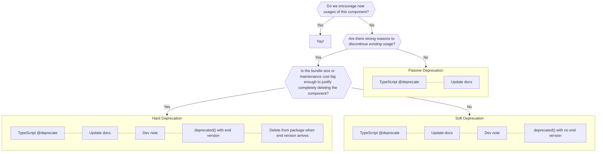

# Issue #61099: Components: Document our deprecation procedures

- URL: https://github.com/WordPress/gutenberg/issues/61099
- Author: mirka
- Created: 2024-04-25T13:18:03Z
- Updated: 2024-12-20T00:25:36Z
- Comments: 12 of 12

## Body

## What problem does this address?

In the past, there has been a lot of ambiguity in our back compat policy. We've been working to bring more clarity around these issues, through efforts like [Private APIs](https://developer.wordpress.org/block-editor/reference-guides/packages/packages-private-apis/) and removing `__experimental` prefixes (#59418).

Here, I'd like to increase clarity around component deprecations. The goal of this is twofold:

- Minimize uncertainty and disruption for **extenders**, by setting clearer expectations.
- Simplify the decision-making process for **maintainers**, by having unambiguous guidelines.

## What is your proposed solution?

A "deprecation", at the very basic level, means that we don't encourage new usages of the component.

There are two reasons we may feel this way:

- **Reduce maintenance cost**. Some components are not used enough to justify their continued maintenance. In general, anything that is marked as deprecated will no longer receive enhancements or bug fixes.
- **Encourage use of a better alternative**. There may be a new, improved version in the component library. Or, it's now easier to use standard HTML elements and CSS, rather than a component that abstracted or polyfilled it.

If there is no big harm in keeping existing usages, we will be as unobtrusive as possible about the deprecation ("passive deprecation"). On the other hand, if there are strong enough reasons to discourage continued usage, we will also log a deprecation warning in the console and write a Dev Note ("soft deprecation"). Additionally, if the bundle size or maintenance cost justifies the eventual removal of the code, the deprecation warning will include an end version ("hard deprecation").

If circumstances change, a component may later progress into a stronger level of deprecation.

### Deprecation levels

#### Passive deprecation

- Mark with TypeScript [`@deprecate`](https://www.typescriptlang.org/play/?#example/jsdoc-deprecated)
- Update docs (readme, JSDoc, Storybook)

#### Soft deprecation

- Mark with TypeScript `@deprecate`
- Update docs (readme, JSDoc, Storybook)
- [Dev note](https://make.wordpress.org/core/handbook/tutorials/writing-developer-notes/)
- [`deprecated()`](https://developer.wordpress.org/block-editor/reference-guides/packages/packages-deprecated/#default) warning with no end version

#### Hard deprecation

- Mark with TypeScript `@deprecate`
- Update docs (readme, JSDoc, Storybook)
- Dev note
- `deprecated()` warning with end version
- Delete from package when end version arrives

## Issue comments

### mirka on 2024-04-25T13:18:33Z

URL: https://github.com/WordPress/gutenberg/issues/61099#issuecomment-2077162372

It is not easy to strike a balance between all the concerns involved (consumer disruption, discoverability, maintenance cost, bundle size, etc).

With that in mind though, please chime in with any feedback that might be relevant. (Including but not limited to: @WordPress/outreach @WordPress/gutenberg-components)

### youknowriad on 2024-04-25T17:57:36Z

URL: https://github.com/WordPress/gutenberg/issues/61099#issuecomment-2077847664

Great initiative, I think we should not limit this to components. I think the same constraints apply to any API.

### youknowriad on 2024-04-25T17:59:53Z

URL: https://github.com/WordPress/gutenberg/issues/61099#issuecomment-2077851149

> Delete from package when end version arrives

The only change I'd make the flow chart above, is that before actually doing this. I'd check existing usage using wp-directory.net. If the impact of removing an API is still big, I'd do make an outreach campaign (post, contact plugin authors) and potentially delay the removal by one or two versions.

### annezazu on 2024-04-26T00:28:45Z

URL: https://github.com/WordPress/gutenberg/issues/61099#issuecomment-2078389229

+1 to what Riad said! I've been a part of those efforts more than a few times and I think it goes a long way.

### t-hamano on 2024-04-26T07:05:30Z

URL: https://github.com/WordPress/gutenberg/issues/61099#issuecomment-2078758452

I found out that there is already documentation regarding backwards compatibility policy:

[Backward Compatibility – Block Editor Handbook | Developer.WordPress.org](https://developer.wordpress.org/block-editor/contributors/code/backward-compatibility/)

We may also find the discussion in the core ticket below helpful.

[#49957 (Adopt a policy to remove deprecated functions) – WordPress Trac](https://core.trac.wordpress.org/ticket/49957)

### mirka on 2024-04-26T14:38:47Z

URL: https://github.com/WordPress/gutenberg/issues/61099#issuecomment-2079526076

> I think we should not limit this to components. I think the same constraints apply to any API.

Probably. If this works out for the components case, I think it can be adapted into the general API case, with some tweaks in procedure and language.

> I found out that there is already documentation regarding backwards compatibility policy

Yes, the intention is not to replace that, but to supplement a missing part of it. We were frequently running into repetitive discussions about the deprecation procedures, because we didn't have a common framework that acknowledged how not all deprecations are equal.

### peterwilsoncc on 2024-04-26T22:36:23Z

URL: https://github.com/WordPress/gutenberg/issues/61099#issuecomment-2080198919

I think WordPress needs a consistent deprecation policy that covers both JavaScript and PHP. It's too confusing for implementers if one part of the code base has one policy, another part of the code base a different policy. From an implementation perspective, it's all the same.

To that end, I suggest a proposal be written up on make/core so all participants can be aware of it.

### mcsf on 2024-05-02T16:22:55Z

URL: https://github.com/WordPress/gutenberg/issues/61099#issuecomment-2090956741

This makes sense, with the provisions already mentioned by Riad, Peter, etc.

My only note is that the messaging seems to stress "bundle size cost" as the only meaningful reason for a hard deprecation. In the narrow context of the Components package, I understand why (a deprecated component or prop is relatively easy to isolate, thereby mitigating the cost in code complexity), but I think it's sensible to explain that there may be other costs to be weighed empirically and not _a priori_.

### mirka on 2024-05-07T13:56:52Z

URL: https://github.com/WordPress/gutenberg/issues/61099#issuecomment-2098473515

> I think WordPress needs a consistent deprecation policy that covers both JavaScript and PHP. It's too confusing for implementers if one part of the code base has one policy, another part of the code base a different policy. 

The only concern I have with making a universal policy covering both JS and PHP is that, I personally have no practical experience maintaining the non-components JS packages, much less the PHP APIs. This proposal is based on an intimate understanding of the components package, and all the specific aspects (including TypeScript and Storybook documentation) that need to be balanced there.

If someone with more familiarity with the non-components APIs would like to extract a more generalized deprecation policy out of this draft, that would be great. (I think we would still want to keep this level of specificity when making decisions for the components package, though.)

> the messaging seems to stress "bundle size cost" as the only meaningful reason for a hard deprecation. In the narrow context of the Components package, I understand why (a deprecated component or prop is relatively easy to isolate, thereby mitigating the cost in code complexity), but I think it's sensible to explain that there may be other costs to be weighed empirically and not a priori.

I completely agree. This is one of the things that should be re-written in a more generalized way if we want to extract a universal deprecation policy out of this.

### youknowriad on 2024-05-07T17:29:54Z

URL: https://github.com/WordPress/gutenberg/issues/61099#issuecomment-2098958114

> I think we would still want to keep this level of specificity when making decisions for the components package, though.

Personally, while I can see some differences between PHP and JS when it comes to decision making (mainly because the impact is not similar), I have a hard time seeing anything specific to the components package compared to any other JS API. So I'd love to understand why you think there are specificities here?

### tyxla on 2024-05-08T14:29:32Z

URL: https://github.com/WordPress/gutenberg/issues/61099#issuecomment-2100722344

Thanks for opening it up @mirka and for the discussion so far everyone!

The cost of shipping deprecated code in PHP has historically been cheaper than doing it in JS since in JS it may impact bundle size. But that doesn't mean that the sole reason for hard deprecation is bundle size impact - there might be other reasons, like abandoning a poorly designed API in favor of a better one, or just the fact that we have a better alternative that everyone should be using in order to get a better user experience and optimal performance.

That being said, I agree with the gist of @mirka's proposal and I also agree with @youknowriad that it might be a good idea to generalize the suggested deprecation procedures for any other JS API in Gutenberg. For many components and APIs, it might actually be simpler, because of fewer usages across the plugin directory, and because they're not so thoroughly covered by storybook stories and tests. 

However, I think that there might be parts of the policy that don't necessarily make sense for PHP APIs - historically, we've kept close to full backward compatibility on the backend side - if a PHP API worked in 2005, it's likely to be still working. If we keep that, we might never hard-deprecate anything in our JS packages, and with their experimental and swift-moving nature, I think that would be a downside. 

If we agree that we're looking at crafting a universal deprecation procedure for JS APIs, in addition to thoroughly documenting it and publicizing it, there are three things I'd propose as corrections to the existing plan: 

1. Considering that the policy applies not only to components but any JS APIs in general (props, hooks, utils, etc.).
2. Stressing on the fact that it applies to JS APIs and components only, and doesn't necessarily affect PHP APIs.
3. Reconsidering the hard vs soft deprecation decision flow to account for other important factors, like known existing usage being low or none, better alternatives being available, and existing good reasons not to use (like perf implications, etc).

### peterwilsoncc on 2024-05-09T01:41:52Z

URL: https://github.com/WordPress/gutenberg/issues/61099#issuecomment-2101776318

There's a few reasons I think WordPress needs a universal policy for PHP and JS proposed on make/core:

1. It's the only way you'll get buy in from all contributors. 
2. The affect on end users is near identical: a white screen of death at worst, an error message at best. A users doesn't know or care if it's caused client or server side.
3. The performance impact of deprecated APIs in PHP can be equally terrible, for example `get_usermeta()` has much poorer performance than `get_user_meta()`.

