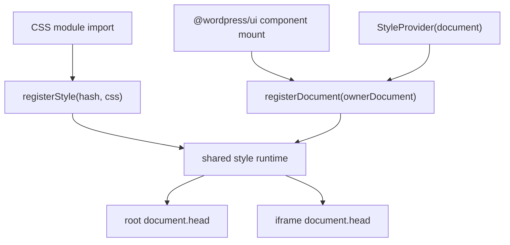

# PR #77965: Style Runtime: Support CSS module style injection across documents

- URL: https://github.com/WordPress/gutenberg/pull/77965
- Author: mirka
- Created: 2026-05-05T16:09:01Z
- Updated: 2026-05-08T14:17:53Z
- Comments: 6 of 6
- Review threads: 11 of 11
- Changed files: 29 of 29
- Diff: ../pr-diffs/77965.diff

## Body

## What?

Fixes an issue reported in https://github.com/WordPress/gutenberg/pull/77575#issuecomment-4357883662

Adds a shared `@wordpress/style-runtime` package for registering package styles and injecting them into one or more documents.

## Why?

CSS module imports are evaluated as JavaScript side effects, so their generated style tags are inserted into the root document. That does not cover components rendered into another document, such as the editor iframe canvas.

## How?

Adds a runtime registry that stores compiled CSS by hash and tracks target documents. Generated CSS module output now registers styles with the runtime, and `StyleProvider` registers its target document so previously registered styles can be replayed into that document.

## Next steps

1. The solution in this PR is good, but it hinges on the change in `@wordpress/components` `StyleProvider`. This means that the fix won't be available in older versions of WordPress, if plugin developers want to start using `@wordpress/ui` components there. To solve this, we can add temporary workarounds in `@wordpress/ui` itself to register their own styles in their owner document, not relying on `StyleProvider`.
2. Any package that directly imports any CSS modules will now need to declare `style-runtime` as a package.json and tsconfig dependency. We probably need some kind of CI check to enforce this, since it's hard to even know about.

<details><summary>Full strategy plan</summary>
<p>

## Direction

Use a shared runtime as the single source of truth for CSS module style registration, and add an `@wordpress/ui` mount-time bridge for compatibility.

The key idea is:



## PR 1: Shared Runtime And Host Integration

- Replace direct CSS module style-tag injection in [`/Users/lena/Documents/Work/Automattic/gutenberg/packages/wp-build/lib/build.mjs`](/Users/lena/Documents/Work/Automattic/gutenberg/packages/wp-build/lib/build.mjs) with an import of a shared runtime package.
- Add a small shared runtime package, `@wordpress/style-runtime`, that exposes:
  - `registerStyle( hash, css )`
  - `registerDocument( document )`
  - deduped injection into every registered document
  - root `document` registration by default when available
- Update CSS module output in [`/Users/lena/Documents/Work/Automattic/gutenberg/packages/wp-build/lib/build.mjs`](/Users/lena/Documents/Work/Automattic/gutenberg/packages/wp-build/lib/build.mjs) so generated modules stay tiny:
  - import `registerStyle`
  - call `registerStyle( hash, css )`
  - export the CSS module class map as before
- Update [`/Users/lena/Documents/Work/Automattic/gutenberg/packages/components/src/style-provider/index.tsx`](/Users/lena/Documents/Work/Automattic/gutenberg/packages/components/src/style-provider/index.tsx) to register its target document with the shared runtime.
- Keep `StyleProvider` support as the long-term host-level path for portals, SlotFill, and iframe canvas documents.

## PR 2: `@wordpress/ui` Mount-Time Hook

- Add `@wordpress/ui` short-term compatibility via a hook, likely [`/Users/lena/Documents/Work/Automattic/gutenberg/packages/ui/src/utils/use-styles.ts`](/Users/lena/Documents/Work/Automattic/gutenberg/packages/ui/src/utils/use-styles.ts), that registers `node.ownerDocument` on mount.
- Apply that hook to `@wordpress/ui` components that import CSS modules, by merging its ref with each component's forwarded/root ref. This makes iframe support travel with `@wordpress/ui`, rather than requiring a newer WordPress `StyleProvider`.
- Keep this PR scoped to `@wordpress/ui` and use the shared runtime from PR 1 rather than adding another injection path.

## Optional PR 3: Dependency Validation

- Add a validation script that scans `packages/*/src` for direct imports of `.module.css` or `.module.scss`.
- For every package with direct CSS module imports, assert that:
  - `package.json` declares `@wordpress/style-runtime` in `dependencies`
  - `tsconfig.json` references `../style-runtime`
- Exclude `@wordpress/style-runtime` itself.
- Wire the script into existing CI validation, likely near `lint:pkg-json` or `lint:tsconfig`, so packages that start importing CSS modules directly cannot forget the runtime dependency metadata.

## Approaches Considered And Discarded

- Put all iframe support in `StyleProvider`. This is the right long-term host integration point, but plugin consumers on older WordPress versions would not get the fix.
- Detect all same-origin iframes from the root document and mirror style tags automatically. This may still be useful as a fallback later, but it is too broad and implicit for the primary fix.

</p>
</details> 

## Testing Instructions

In the site editor, add a Navigation block. This block contains a `VisuallyHidden` description which is _not_ properly hidden in trunk due to missing styles in the editor iframe. With this PR, the styles should be injected in the iframe, and the visually hidden description should be hidden.


## Issue comments

### github-actions on 2026-05-05T16:17:43Z

URL: https://github.com/WordPress/gutenberg/pull/77965#issuecomment-4381054581

**Size Change:** +8.62 kB (+0.11%) 

**Total Size:** 7.92 MB

<details open><summary>📦 <strong>View Changed</strong></summary>

| Filename | Size | Change |
| :--- | :---: | :---: |
| `build/modules/boot/index.min.js` | 19.1 kB | +553 B (+2.98%) |
| `build/modules/content-types/index.min.js` | 135 kB | +2.33 kB (+1.76%) |
| `build/scripts/block-directory/index.min.js` | 10.3 kB | +296 B (+2.96%) |
| `build/scripts/block-editor/index.min.js` | 343 kB | +895 B (+0.26%) |
| `build/scripts/block-library/index.min.js` | 319 kB | +257 B (+0.08%) |
| `build/scripts/components/index.min.js` | 266 kB | +804 B (+0.3%) |
| `build/scripts/customize-widgets/index.min.js` | 14.6 kB | +276 B (+1.93%) |
| `build/scripts/edit-post/index.min.js` | 18.7 kB | +288 B (+1.57%) |
| `build/scripts/edit-site/index.min.js` | 265 kB | +863 B (+0.33%) |
| `build/scripts/edit-widgets/index.min.js` | 22.2 kB | +277 B (+1.26%) |
| `build/scripts/editor/index.min.js` | 428 kB | +866 B (+0.2%) |
| `build/scripts/format-library/index.min.js` | 13.1 kB | +280 B (+2.19%) |
| `build/scripts/media-utils/index.min.js` | 79.9 kB | +341 B (+0.43%) |
| `build/scripts/theme/index.min.js` | 22.3 kB | +288 B (+1.31%) |

</details>

<details><summary>ℹ️ <strong>View Unchanged</strong></summary>

| Filename | Size |
| :--- | :---: |
| `build/modules/a11y/index.min.js` | 355 B |
| `build/modules/abilities/index.min.js` | 42.3 kB |
| `build/modules/block-editor/utils/fit-text-frontend.min.js` | 617 B |
| `build/modules/block-library/accordion/view.min.js` | 595 B |
| `build/modules/block-library/file/view.min.js` | 346 B |
| `build/modules/block-library/form/view.min.js` | 528 B |
| `build/modules/block-library/image/view.min.js` | 2.64 kB |
| `build/modules/block-library/navigation/view.min.js` | 1.14 kB |
| `build/modules/block-library/playlist/view.min.js` | 10.9 kB |
| `build/modules/block-library/query/view.min.js` | 518 B |
| `build/modules/block-library/search/view.min.js` | 498 B |
| `build/modules/block-library/tabs/view.min.js` | 946 B |
| `build/modules/connectors/index.min.js` | 2.05 kB |
| `build/modules/core-abilities/index.min.js` | 907 B |
| `build/modules/edit-site-init/index.min.js` | 1.4 kB |
| `build/modules/interactivity-router/full-page.min.js` | 451 B |
| `build/modules/interactivity-router/index.min.js` | 11.6 kB |
| `build/modules/interactivity/index.min.js` | 15.3 kB |
| `build/modules/latex-to-mathml/index.min.js` | 56.5 kB |
| `build/modules/latex-to-mathml/loader.min.js` | 131 B |
| `build/modules/lazy-editor/index.min.js` | 14.1 kB |
| `build/modules/route/index.min.js` | 25.2 kB |
| `build/modules/vips/loader.min.js` | 127 B |
| `build/modules/vips/worker.min.js` | 4.56 MB |
| `build/modules/workflow/index.min.js` | 19.9 kB |
| `build/scripts/a11y/index.min.js` | 1.06 kB |
| `build/scripts/annotations/index.min.js` | 2.49 kB |
| `build/scripts/api-fetch/index.min.js` | 2.83 kB |
| `build/scripts/autop/index.min.js` | 2.18 kB |
| `build/scripts/base-styles/index.min.js` | 98 B |
| `build/scripts/blob/index.min.js` | 631 B |
| `build/scripts/block-serialization-default-parser/index.min.js` | 1.16 kB |
| `build/scripts/block-serialization-spec-parser/index.min.js` | 3.08 kB |
| `build/scripts/blocks/index.min.js` | 57 kB |
| `build/scripts/commands/index.min.js` | 21 kB |
| `build/scripts/compose/index.min.js` | 11.1 kB |
| `build/scripts/core-commands/index.min.js` | 4.33 kB |
| `build/scripts/core-data/index.min.js` | 31 kB |
| `build/scripts/data-controls/index.min.js` | 795 B |
| `build/scripts/data/index.min.js` | 9.66 kB |
| `build/scripts/date/index.min.js` | 23.6 kB |
| `build/scripts/deprecated/index.min.js` | 756 B |
| `build/scripts/dom-ready/index.min.js` | 476 B |
| `build/scripts/dom/index.min.js` | 5 kB |
| `build/scripts/element/index.min.js` | 5.17 kB |
| `build/scripts/escape-html/index.min.js` | 587 B |
| `build/scripts/hooks/index.min.js` | 1.83 kB |
| `build/scripts/html-entities/index.min.js` | 494 B |
| `build/scripts/i18n/index.min.js` | 2.47 kB |
| `build/scripts/is-shallow-equal/index.min.js` | 572 B |
| `build/scripts/keyboard-shortcuts/index.min.js` | 1.61 kB |
| `build/scripts/keycodes/index.min.js` | 1.56 kB |
| `build/scripts/list-reusable-blocks/index.min.js` | 2.49 kB |
| `build/scripts/notices/index.min.js` | 1.85 kB |
| `build/scripts/nux/index.min.js` | 1.89 kB |
| `build/scripts/patterns/index.min.js` | 7.96 kB |
| `build/scripts/plugins/index.min.js` | 2.15 kB |
| `build/scripts/preferences-persistence/index.min.js` | 2.15 kB |
| `build/scripts/preferences/index.min.js` | 3.3 kB |
| `build/scripts/primitives/index.min.js` | 1.01 kB |
| `build/scripts/priority-queue/index.min.js` | 1.62 kB |
| `build/scripts/private-apis/index.min.js` | 1.11 kB |
| `build/scripts/react-i18n/index.min.js` | 833 B |
| `build/scripts/redux-routine/index.min.js` | 3.37 kB |
| `build/scripts/reusable-blocks/index.min.js` | 3.1 kB |
| `build/scripts/rich-text/index.min.js` | 14 kB |
| `build/scripts/router/index.min.js` | 5.96 kB |
| `build/scripts/server-side-render/index.min.js` | 1.91 kB |
| `build/scripts/shortcode/index.min.js` | 1.59 kB |
| `build/scripts/style-engine/index.min.js` | 2.42 kB |
| `build/scripts/sync/index.min.js` | 38.8 kB |
| `build/scripts/token-list/index.min.js` | 739 B |
| `build/scripts/undo-manager/index.min.js` | 918 B |
| `build/scripts/upload-media/index.min.js` | 11.2 kB |
| `build/scripts/url/index.min.js` | 3.98 kB |
| `build/scripts/vendors/react-dom.min.js` | 43.3 kB |
| `build/scripts/vendors/react-jsx-runtime.min.js` | 667 B |
| `build/scripts/vendors/react.min.js` | 2.77 kB |
| `build/scripts/viewport/index.min.js` | 1.22 kB |
| `build/scripts/warning/index.min.js` | 454 B |
| `build/scripts/widgets/index.min.js` | 7.8 kB |
| `build/scripts/wordcount/index.min.js` | 1.04 kB |
| `build/styles/base-styles/admin-schemes-rtl.css` | 1.71 kB |
| `build/styles/base-styles/admin-schemes-rtl.min.css` | 775 B |
| `build/styles/base-styles/admin-schemes.css` | 1.71 kB |
| `build/styles/base-styles/admin-schemes.min.css` | 775 B |
| `build/styles/block-directory/style-rtl.css` | 1.97 kB |
| `build/styles/block-directory/style-rtl.min.css` | 1.06 kB |
| `build/styles/block-directory/style.css` | 1.98 kB |
| `build/styles/block-directory/style.min.css` | 1.06 kB |
| `build/styles/block-editor/content-rtl.css` | 5.44 kB |
| `build/styles/block-editor/content-rtl.min.css` | 4.01 kB |
| `build/styles/block-editor/content.css` | 5.44 kB |
| `build/styles/block-editor/content.min.css` | 4.01 kB |
| `build/styles/block-editor/default-editor-styles-rtl.css` | 697 B |
| `build/styles/block-editor/default-editor-styles-rtl.min.css` | 224 B |
| `build/styles/block-editor/default-editor-styles.css` | 697 B |
| `build/styles/block-editor/default-editor-styles.min.css` | 224 B |
| `build/styles/block-editor/style-rtl.css` | 18.7 kB |
| `build/styles/block-editor/style-rtl.min.css` | 15.9 kB |
| `build/styles/block-editor/style.css` | 18.7 kB |
| `build/styles/block-editor/style.min.css` | 15.9 kB |
| `build/styles/block-library/accordion-heading/style-rtl.css` | 346 B |
| `build/styles/block-library/accordion-heading/style-rtl.min.css` | 325 B |
| `build/styles/block-library/accordion-heading/style.css` | 346 B |
| `build/styles/block-library/accordion-heading/style.min.css` | 325 B |
| `build/styles/block-library/accordion-item/style-rtl.css` | 239 B |
| `build/styles/block-library/accordion-item/style-rtl.min.css` | 180 B |
| `build/styles/block-library/accordion-item/style.css` | 238 B |
| `build/styles/block-library/accordion-item/style.min.css` | 180 B |
| `build/styles/block-library/accordion-panel/style-rtl.css` | 110 B |
| `build/styles/block-library/accordion-panel/style-rtl.min.css` | 99 B |
| `build/styles/block-library/accordion-panel/style.css` | 110 B |
| `build/styles/block-library/accordion-panel/style.min.css` | 99 B |
| `build/styles/block-library/accordion/style-rtl.css` | 69 B |
| `build/styles/block-library/accordion/style-rtl.min.css` | 62 B |
| `build/styles/block-library/accordion/style.css` | 69 B |
| `build/styles/block-library/accordion/style.min.css` | 62 B |
| `build/styles/block-library/archives/style-rtl.css` | 101 B |
| `build/styles/block-library/archives/style-rtl.min.css` | 90 B |
| `build/styles/block-library/archives/style.css` | 101 B |
| `build/styles/block-library/archives/style.min.css` | 90 B |
| `build/styles/block-library/audio/editor-rtl.css` | 166 B |
| `build/styles/block-library/audio/editor-rtl.min.css` | 149 B |
| `build/styles/block-library/audio/editor.css` | 166 B |
| `build/styles/block-library/audio/editor.min.css` | 151 B |
| `build/styles/block-library/audio/style-rtl.css` | 945 B |
| `build/styles/block-library/audio/style-rtl.min.css` | 132 B |
| `build/styles/block-library/audio/style.css` | 945 B |
| `build/styles/block-library/audio/style.min.css` | 132 B |
| `build/styles/block-library/audio/theme-rtl.css` | 967 B |
| `build/styles/block-library/audio/theme-rtl.min.css` | 134 B |
| `build/styles/block-library/audio/theme.css` | 967 B |
| `build/styles/block-library/audio/theme.min.css` | 134 B |
| `build/styles/block-library/avatar/editor-rtl.css` | 127 B |
| `build/styles/block-library/avatar/editor-rtl.min.css` | 115 B |
| `build/styles/block-library/avatar/editor.css` | 127 B |
| `build/styles/block-library/avatar/editor.min.css` | 115 B |
| `build/styles/block-library/avatar/style-rtl.css` | 117 B |
| `build/styles/block-library/avatar/style-rtl.min.css` | 104 B |
| `build/styles/block-library/avatar/style.css` | 117 B |
| `build/styles/block-library/avatar/style.min.css` | 104 B |
| `build/styles/block-library/breadcrumbs/style-rtl.css` | 233 B |
| `build/styles/block-library/breadcrumbs/style-rtl.min.css` | 203 B |
| `build/styles/block-library/breadcrumbs/style.css` | 233 B |
| `build/styles/block-library/breadcrumbs/style.min.css` | 203 B |
| `build/styles/block-library/button/editor-rtl.css` | 306 B |
| `build/styles/block-library/button/editor-rtl.min.css` | 265 B |
| `build/styles/block-library/button/editor.css` | 317 B |
| `build/styles/block-library/button/editor.min.css` | 265 B |
| `build/styles/block-library/button/style-rtl.css` | 651 B |
| `build/styles/block-library/button/style-rtl.min.css` | 596 B |
| `build/styles/block-library/button/style.css` | 662 B |
| `build/styles/block-library/button/style.min.css` | 596 B |
| `build/styles/block-library/buttons/editor-rtl.css` | 391 B |
| `build/styles/block-library/buttons/editor-rtl.min.css` | 291 B |
| `build/styles/block-library/buttons/editor.css` | 391 B |
| `build/styles/block-library/buttons/editor.min.css` | 291 B |
| `build/styles/block-library/buttons/style-rtl.css` | 452 B |
| `build/styles/block-library/buttons/style-rtl.min.css` | 349 B |
| `build/styles/block-library/buttons/style.css` | 453 B |
| `build/styles/block-library/buttons/style.min.css` | 349 B |
| `build/styles/block-library/calendar/style-rtl.css` | 271 B |
| `build/styles/block-library/calendar/style-rtl.min.css` | 239 B |
| `build/styles/block-library/calendar/style.css` | 271 B |
| `build/styles/block-library/calendar/style.min.css` | 239 B |
| `build/styles/block-library/categories/editor-rtl.css` | 171 B |
| `build/styles/block-library/categories/editor-rtl.min.css` | 132 B |
| `build/styles/block-library/categories/editor.css` | 170 B |
| `build/styles/block-library/categories/editor.min.css` | 131 B |
| `build/styles/block-library/categories/style-rtl.css` | 226 B |
| `build/styles/block-library/categories/style-rtl.min.css` | 169 B |
| `build/styles/block-library/categories/style.css` | 235 B |
| `build/styles/block-library/categories/style.min.css` | 169 B |
| `build/styles/block-library/classic-rtl.css` | 402 B |
| `build/styles/block-library/classic-rtl.min.css` | 358 B |
| `build/styles/block-library/classic.css` | 402 B |
| `build/styles/block-library/classic.min.css` | 358 B |
| `build/styles/block-library/code/editor-rtl.css` | 59 B |
| `build/styles/block-library/code/editor-rtl.min.css` | 53 B |
| `build/styles/block-library/code/editor.css` | 59 B |
| `build/styles/block-library/code/editor.min.css` | 53 B |
| `build/styles/block-library/code/style-rtl.css` | 158 B |
| `build/styles/block-library/code/style-rtl.min.css` | 140 B |
| `build/styles/block-library/code/style.css` | 178 B |
| `build/styles/block-library/code/style.min.css` | 140 B |
| `build/styles/block-library/code/theme-rtl.css` | 135 B |
| `build/styles/block-library/code/theme-rtl.min.css` | 122 B |
| `build/styles/block-library/code/theme.css` | 135 B |
| `build/styles/block-library/code/theme.min.css` | 122 B |
| `build/styles/block-library/columns/editor-rtl.css` | 119 B |
| `build/styles/block-library/columns/editor-rtl.min.css` | 108 B |
| `build/styles/block-library/columns/editor.css` | 119 B |
| `build/styles/block-library/columns/editor.min.css` | 108 B |
| `build/styles/block-library/columns/style-rtl.css` | 1.3 kB |
| `build/styles/block-library/columns/style-rtl.min.css` | 421 B |
| `build/styles/block-library/columns/style.css` | 1.3 kB |
| `build/styles/block-library/columns/style.min.css` | 421 B |
| `build/styles/block-library/comment-author-avatar/editor-rtl.css` | 136 B |
| `build/styles/block-library/comment-author-avatar/editor-rtl.min.css` | 124 B |
| `build/styles/block-library/comment-author-avatar/editor.css` | 136 B |
| `build/styles/block-library/comment-author-avatar/editor.min.css` | 124 B |
| `build/styles/block-library/comment-author-name/style-rtl.css` | 79 B |
| `build/styles/block-library/comment-author-name/style-rtl.min.css` | 72 B |
| `build/styles/block-library/comment-author-name/style.css` | 79 B |
| `build/styles/block-library/comment-author-name/style.min.css` | 72 B |
| `build/styles/block-library/comment-content/style-rtl.css` | 137 B |
| `build/styles/block-library/comment-content/style-rtl.min.css` | 120 B |
| `build/styles/block-library/comment-content/style.css` | 137 B |
| `build/styles/block-library/comment-content/style.min.css` | 120 B |
| `build/styles/block-library/comment-date/style-rtl.css` | 72 B |
| `build/styles/block-library/comment-date/style-rtl.min.css` | 65 B |
| `build/styles/block-library/comment-date/style.css` | 72 B |
| `build/styles/block-library/comment-date/style.min.css` | 65 B |
| `build/styles/block-library/comment-edit-link/style-rtl.css` | 77 B |
| `build/styles/block-library/comment-edit-link/style-rtl.min.css` | 70 B |
| `build/styles/block-library/comment-edit-link/style.css` | 77 B |
| `build/styles/block-library/comment-edit-link/style.min.css` | 70 B |
| `build/styles/block-library/comment-reply-link/style-rtl.css` | 78 B |
| `build/styles/block-library/comment-reply-link/style-rtl.min.css` | 71 B |
| `build/styles/block-library/comment-reply-link/style.css` | 78 B |
| `build/styles/block-library/comment-reply-link/style.min.css` | 71 B |
| `build/styles/block-library/comment-template/style-rtl.css` | 213 B |
| `build/styles/block-library/comment-template/style-rtl.min.css` | 191 B |
| `build/styles/block-library/comment-template/style.css` | 213 B |
| `build/styles/block-library/comment-template/style.min.css` | 191 B |
| `build/styles/block-library/comments-pagination-numbers/editor-rtl.css` | 135 B |
| `build/styles/block-library/comments-pagination-numbers/editor-rtl.min.css` | 122 B |
| `build/styles/block-library/comments-pagination-numbers/editor.css` | 144 B |
| `build/styles/block-library/comments-pagination-numbers/editor.min.css` | 121 B |
| `build/styles/block-library/comments-pagination/editor-rtl.css` | 184 B |
| `build/styles/block-library/comments-pagination/editor-rtl.min.css` | 168 B |
| `build/styles/block-library/comments-pagination/editor.css` | 184 B |
| `build/styles/block-library/comments-pagination/editor.min.css` | 168 B |
| `build/styles/block-library/comments-pagination/style-rtl.css` | 224 B |
| `build/styles/block-library/comments-pagination/style-rtl.min.css` | 201 B |
| `build/styles/block-library/comments-pagination/style.css` | 236 B |
| `build/styles/block-library/comments-pagination/style.min.css` | 201 B |
| `build/styles/block-library/comments-title/editor-rtl.css` | 83 B |
| `build/styles/block-library/comments-title/editor-rtl.min.css` | 75 B |
| `build/styles/block-library/comments-title/editor.css` | 83 B |
| `build/styles/block-library/comments-title/editor.min.css` | 75 B |
| `build/styles/block-library/comments/editor-rtl.css` | 968 B |
| `build/styles/block-library/comments/editor-rtl.min.css` | 842 B |
| `build/styles/block-library/comments/editor.css` | 968 B |
| `build/styles/block-library/comments/editor.min.css` | 842 B |
| `build/styles/block-library/comments/style-rtl.css` | 754 B |
| `build/styles/block-library/comments/style-rtl.min.css` | 637 B |
| `build/styles/block-library/comments/style.css` | 752 B |
| `build/styles/block-library/comments/style.min.css` | 637 B |
| `build/styles/block-library/common-rtl.css` | 2.48 kB |
| `build/styles/block-library/common-rtl.min.css` | 1.12 kB |
| `build/styles/block-library/common.css` | 2.5 kB |
| `build/styles/block-library/common.min.css` | 1.12 kB |
| `build/styles/block-library/cover/editor-rtl.css` | 1.05 kB |
| `build/styles/block-library/cover/editor-rtl.min.css` | 631 B |
| `build/styles/block-library/cover/editor.css` | 1.05 kB |
| `build/styles/block-library/cover/editor.min.css` | 631 B |
| `build/styles/block-library/cover/style-rtl.css` | 2.5 kB |
| `build/styles/block-library/cover/style-rtl.min.css` | 1.82 kB |
| `build/styles/block-library/cover/style.css` | 2.51 kB |
| `build/styles/block-library/cover/style.min.css` | 1.81 kB |
| `build/styles/block-library/details/editor-rtl.css` | 72 B |
| `build/styles/block-library/details/editor-rtl.min.css` | 65 B |
| `build/styles/block-library/details/editor.css` | 72 B |
| `build/styles/block-library/details/editor.min.css` | 65 B |
| `build/styles/block-library/details/style-rtl.css` | 97 B |
| `build/styles/block-library/details/style-rtl.min.css` | 86 B |
| `build/styles/block-library/details/style.css` | 97 B |
| `build/styles/block-library/details/style.min.css` | 86 B |
| `build/styles/block-library/editor-elements-rtl.css` | 117 B |
| `build/styles/block-library/editor-elements-rtl.min.css` | 75 B |
| `build/styles/block-library/editor-elements.css` | 117 B |
| `build/styles/block-library/editor-elements.min.css` | 75 B |
| `build/styles/block-library/editor-rtl.css` | 12.5 kB |
| `build/styles/block-library/editor-rtl.min.css` | 10.3 kB |
| `build/styles/block-library/editor.css` | 12.5 kB |
| `build/styles/block-library/editor.min.css` | 10.3 kB |
| `build/styles/block-library/elements-rtl.css` | 84 B |
| `build/styles/block-library/elements-rtl.min.css` | 54 B |
| `build/styles/block-library/elements.css` | 84 B |
| `build/styles/block-library/elements.min.css` | 54 B |
| `build/styles/block-library/embed/editor-rtl.css` | 391 B |
| `build/styles/block-library/embed/editor-rtl.min.css` | 331 B |
| `build/styles/block-library/embed/editor.css` | 390 B |
| `build/styles/block-library/embed/editor.min.css` | 331 B |
| `build/styles/block-library/embed/style-rtl.css` | 1.29 kB |
| `build/styles/block-library/embed/style-rtl.min.css` | 448 B |
| `build/styles/block-library/embed/style.css` | 1.29 kB |
| `build/styles/block-library/embed/style.min.css` | 448 B |
| `build/styles/block-library/embed/theme-rtl.css` | 967 B |
| `build/styles/block-library/embed/theme-rtl.min.css` | 133 B |
| `build/styles/block-library/embed/theme.css` | 967 B |
| `build/styles/block-library/embed/theme.min.css` | 133 B |
| `build/styles/block-library/file/editor-rtl.css` | 352 B |
| `build/styles/block-library/file/editor-rtl.min.css` | 324 B |
| `build/styles/block-library/file/editor.css` | 353 B |
| `build/styles/block-library/file/editor.min.css` | 324 B |
| `build/styles/block-library/file/style-rtl.css` | 318 B |
| `build/styles/block-library/file/style-rtl.min.css` | 278 B |
| `build/styles/block-library/file/style.css` | 331 B |
| `build/styles/block-library/file/style.min.css` | 278 B |
| `build/styles/block-library/footnotes/style-rtl.css` | 220 B |
| `build/styles/block-library/footnotes/style-rtl.min.css` | 198 B |
| `build/styles/block-library/footnotes/style.css` | 219 B |
| `build/styles/block-library/footnotes/style.min.css` | 197 B |
| `build/styles/block-library/form-input/editor-rtl.css` | 286 B |
| `build/styles/block-library/form-input/editor-rtl.min.css` | 265 B |
| `build/styles/block-library/form-input/editor.css` | 285 B |
| `build/styles/block-library/form-input/editor.min.css` | 264 B |
| `build/styles/block-library/form-input/style-rtl.css` | 467 B |
| `build/styles/block-library/form-input/style-rtl.min.css` | 366 B |
| `build/styles/block-library/form-input/style.css` | 467 B |
| `build/styles/block-library/form-input/style.min.css` | 366 B |
| `build/styles/block-library/form-submission-notification/editor-rtl.css` | 368 B |
| `build/styles/block-library/form-submission-notification/editor-rtl.min.css` | 344 B |
| `build/styles/block-library/form-submission-notification/editor.css` | 368 B |
| `build/styles/block-library/form-submission-notification/editor.min.css` | 341 B |
| `build/styles/block-library/form-submit-button/style-rtl.css` | 77 B |
| `build/styles/block-library/form-submit-button/style-rtl.min.css` | 69 B |
| `build/styles/block-library/form-submit-button/style.css` | 77 B |
| `build/styles/block-library/form-submit-button/style.min.css` | 69 B |
| `build/styles/block-library/freeform/editor-rtl.css` | 1.12 kB |
| `build/styles/block-library/freeform/editor-rtl.min.css` | 288 B |
| `build/styles/block-library/freeform/editor.css` | 1.12 kB |
| `build/styles/block-library/freeform/editor.min.css` | 288 B |
| `build/styles/block-library/gallery/editor-rtl.css` | 1.52 kB |
| `build/styles/block-library/gallery/editor-rtl.min.css` | 615 B |
| `build/styles/block-library/gallery/editor.css` | 1.52 kB |
| `build/styles/block-library/gallery/editor.min.css` | 616 B |
| `build/styles/block-library/gallery/style-rtl.css` | 2.84 kB |
| `build/styles/block-library/gallery/style-rtl.min.css` | 1.84 kB |
| `build/styles/block-library/gallery/style.css` | 2.84 kB |
| `build/styles/block-library/gallery/style.min.css` | 1.84 kB |
| `build/styles/block-library/gallery/theme-rtl.css` | 941 B |
| `build/styles/block-library/gallery/theme-rtl.min.css` | 108 B |
| `build/styles/block-library/gallery/theme.css` | 941 B |
| `build/styles/block-library/gallery/theme.min.css` | 108 B |
| `build/styles/block-library/group/editor-rtl.css` | 772 B |
| `build/styles/block-library/group/editor-rtl.min.css` | 335 B |
| `build/styles/block-library/group/editor.css` | 772 B |
| `build/styles/block-library/group/editor.min.css` | 335 B |
| `build/styles/block-library/group/style-rtl.css` | 120 B |
| `build/styles/block-library/group/style-rtl.min.css` | 103 B |
| `build/styles/block-library/group/style.css` | 120 B |
| `build/styles/block-library/group/style.min.css` | 103 B |
| `build/styles/block-library/group/theme-rtl.css` | 468 B |
| `build/styles/block-library/group/theme-rtl.min.css` | 79 B |
| `build/styles/block-library/group/theme.css` | 468 B |
| `build/styles/block-library/group/theme.min.css` | 79 B |
| `build/styles/block-library/heading/style-rtl.css` | 604 B |
| `build/styles/block-library/heading/style-rtl.min.css` | 205 B |
| `build/styles/block-library/heading/style.css` | 604 B |
| `build/styles/block-library/heading/style.min.css` | 205 B |
| `build/styles/block-library/html/editor-rtl.css` | 1.29 kB |
| `build/styles/block-library/html/editor-rtl.min.css` | 464 B |
| `build/styles/block-library/html/editor.css` | 1.3 kB |
| `build/styles/block-library/html/editor.min.css` | 464 B |
| `build/styles/block-library/icon/editor-rtl.css` | 776 B |
| `build/styles/block-library/icon/editor-rtl.min.css` | 377 B |
| `build/styles/block-library/icon/editor.css` | 776 B |
| `build/styles/block-library/icon/editor.min.css` | 377 B |
| `build/styles/block-library/icon/style-rtl.css` | 218 B |
| `build/styles/block-library/icon/style-rtl.min.css` | 154 B |
| `build/styles/block-library/icon/style.css` | 218 B |
| `build/styles/block-library/icon/style.min.css` | 154 B |
| `build/styles/block-library/image/editor-rtl.css` | 1.64 kB |
| `build/styles/block-library/image/editor-rtl.min.css` | 782 B |
| `build/styles/block-library/image/editor.css` | 1.64 kB |
| `build/styles/block-library/image/editor.min.css` | 780 B |
| `build/styles/block-library/image/style-rtl.css` | 2.92 kB |
| `build/styles/block-library/image/style-rtl.min.css` | 1.86 kB |
| `build/styles/block-library/image/style.css` | 2.92 kB |
| `build/styles/block-library/image/style.min.css` | 1.85 kB |
| `build/styles/block-library/image/theme-rtl.css` | 971 B |
| `build/styles/block-library/image/theme-rtl.min.css` | 137 B |
| `build/styles/block-library/image/theme.css` | 971 B |
| `build/styles/block-library/image/theme.min.css` | 137 B |
| `build/styles/block-library/latest-comments/style-rtl.css` | 392 B |
| `build/styles/block-library/latest-comments/style-rtl.min.css` | 352 B |
| `build/styles/block-library/latest-comments/style.css` | 390 B |
| `build/styles/block-library/latest-comments/style.min.css` | 352 B |
| `build/styles/block-library/latest-posts/editor-rtl.css` | 154 B |
| `build/styles/block-library/latest-posts/editor-rtl.min.css` | 139 B |
| `build/styles/block-library/latest-posts/editor.css` | 153 B |
| `build/styles/block-library/latest-posts/editor.min.css` | 138 B |
| `build/styles/block-library/latest-posts/style-rtl.css` | 1.36 kB |
| `build/styles/block-library/latest-posts/style-rtl.min.css` | 520 B |
| `build/styles/block-library/latest-posts/style.css` | 1.37 kB |
| `build/styles/block-library/latest-posts/style.min.css` | 520 B |
| `build/styles/block-library/list/style-rtl.css` | 498 B |
| `build/styles/block-library/list/style-rtl.min.css` | 107 B |
| `build/styles/block-library/list/style.css` | 498 B |
| `build/styles/block-library/list/style.min.css` | 107 B |
| `build/styles/block-library/loginout/style-rtl.css` | 68 B |
| `build/styles/block-library/loginout/style-rtl.min.css` | 61 B |
| `build/styles/block-library/loginout/style.css` | 68 B |
| `build/styles/block-library/loginout/style.min.css` | 61 B |
| `build/styles/block-library/math/editor-rtl.css` | 491 B |
| `build/styles/block-library/math/editor-rtl.min.css` | 105 B |
| `build/styles/block-library/math/editor.css` | 502 B |
| `build/styles/block-library/math/editor.min.css` | 105 B |
| `build/styles/block-library/math/style-rtl.css` | 70 B |
| `build/styles/block-library/math/style-rtl.min.css` | 61 B |
| `build/styles/block-library/math/style.css` | 70 B |
| `build/styles/block-library/math/style.min.css` | 61 B |
| `build/styles/block-library/media-text/editor-rtl.css` | 389 B |
| `build/styles/block-library/media-text/editor-rtl.min.css` | 321 B |
| `build/styles/block-library/media-text/editor.css` | 389 B |
| `build/styles/block-library/media-text/editor.min.css` | 320 B |
| `build/styles/block-library/media-text/style-rtl.css` | 873 B |
| `build/styles/block-library/media-text/style-rtl.min.css` | 552 B |
| `build/styles/block-library/media-text/style.css` | 901 B |
| `build/styles/block-library/media-text/style.min.css` | 550 B |
| `build/styles/block-library/more/editor-rtl.css` | 796 B |
| `build/styles/block-library/more/editor-rtl.min.css` | 393 B |
| `build/styles/block-library/more/editor.css` | 798 B |
| `build/styles/block-library/more/editor.min.css` | 393 B |
| `build/styles/block-library/navigation-link/editor-rtl.css` | 1.28 kB |
| `build/styles/block-library/navigation-link/editor-rtl.min.css` | 710 B |
| `build/styles/block-library/navigation-link/editor.css` | 1.27 kB |
| `build/styles/block-library/navigation-link/editor.min.css` | 713 B |
| `build/styles/block-library/navigation-link/style-rtl.css` | 579 B |
| `build/styles/block-library/navigation-link/style-rtl.min.css` | 190 B |
| `build/styles/block-library/navigation-link/style.css` | 579 B |
| `build/styles/block-library/navigation-link/style.min.css` | 188 B |
| `build/styles/block-library/navigation-overlay-close/style-rtl.css` | 260 B |
| `build/styles/block-library/navigation-overlay-close/style-rtl.min.css` | 237 B |
| `build/styles/block-library/navigation-overlay-close/style.css` | 260 B |
| `build/styles/block-library/navigation-overlay-close/style.min.css` | 237 B |
| `build/styles/block-library/navigation-submenu/editor-rtl.css` | 1.12 kB |
| `build/styles/block-library/navigation-submenu/editor-rtl.min.css` | 295 B |
| `build/styles/block-library/navigation-submenu/editor.css` | 1.12 kB |
| `build/styles/block-library/navigation-submenu/editor.min.css` | 294 B |
| `build/styles/block-library/navigation/editor-rtl.css` | 3.28 kB |
| `build/styles/block-library/navigation/editor-rtl.min.css` | 2.28 kB |
| `build/styles/block-library/navigation/editor.css` | 3.29 kB |
| `build/styles/block-library/navigation/editor.min.css` | 2.28 kB |
| `build/styles/block-library/navigation/style-rtl.css` | 3.59 kB |
| `build/styles/block-library/navigation/style-rtl.min.css` | 2.52 kB |
| `build/styles/block-library/navigation/style.css` | 3.59 kB |
| `build/styles/block-library/navigation/style.min.css` | 2.5 kB |
| `build/styles/block-library/nextpage/editor-rtl.css` | 799 B |
| `build/styles/block-library/nextpage/editor-rtl.min.css` | 392 B |
| `build/styles/block-library/nextpage/editor.css` | 800 B |
| `build/styles/block-library/nextpage/editor.min.css` | 392 B |
| `build/styles/block-library/page-list/editor-rtl.css` | 1.18 kB |
| `build/styles/block-library/page-list/editor-rtl.min.css` | 356 B |
| `build/styles/block-library/page-list/editor.css` | 1.18 kB |
| `build/styles/block-library/page-list/editor.min.css` | 356 B |
| `build/styles/block-library/page-list/style-rtl.css` | 207 B |
| `build/styles/block-library/page-list/style-rtl.min.css` | 192 B |
| `build/styles/block-library/page-list/style.css` | 207 B |
| `build/styles/block-library/page-list/style.min.css` | 192 B |
| `build/styles/block-library/paragraph/editor-rtl.css` | 315 B |
| `build/styles/block-library/paragraph/editor-rtl.min.css` | 292 B |
| `build/styles/block-library/paragraph/editor.css` | 314 B |
| `build/styles/block-library/paragraph/editor.min.css` | 292 B |
| `build/styles/block-library/paragraph/style-rtl.css` | 746 B |
| `build/styles/block-library/paragraph/style-rtl.min.css` | 341 B |
| `build/styles/block-library/paragraph/style.css` | 752 B |
| `build/styles/block-library/paragraph/style.min.css` | 340 B |
| `build/styles/block-library/playlist-track/style-rtl.css` | 453 B |
| `build/styles/block-library/playlist-track/style-rtl.min.css` | 420 B |
| `build/styles/block-library/playlist-track/style.css` | 453 B |
| `build/styles/block-library/playlist-track/style.min.css` | 420 B |
| `build/styles/block-library/playlist/editor-rtl.css` | 120 B |
| `build/styles/block-library/playlist/editor-rtl.min.css` | 112 B |
| `build/styles/block-library/playlist/editor.css` | 120 B |
| `build/styles/block-library/playlist/editor.min.css` | 112 B |
| `build/styles/block-library/playlist/style-rtl.css` | 1.52 kB |
| `build/styles/block-library/playlist/style-rtl.min.css` | 1.42 kB |
| `build/styles/block-library/playlist/style.css` | 1.52 kB |
| `build/styles/block-library/playlist/style.min.css` | 1.42 kB |
| `build/styles/block-library/post-author-biography/style-rtl.css` | 96 B |
| `build/styles/block-library/post-author-biography/style-rtl.min.css` | 86 B |
| `build/styles/block-library/post-author-biography/style.css` | 96 B |
| `build/styles/block-library/post-author-biography/style.min.css` | 86 B |
| `build/styles/block-library/post-author-name/style-rtl.css` | 76 B |
| `build/styles/block-library/post-author-name/style-rtl.min.css` | 69 B |
| `build/styles/block-library/post-author-name/style.css` | 76 B |
| `build/styles/block-library/post-author-name/style.min.css` | 69 B |
| `build/styles/block-library/post-author/editor-rtl.css` | 490 B |
| `build/styles/block-library/post-author/editor-rtl.min.css` | 104 B |
| `build/styles/block-library/post-author/editor.css` | 490 B |
| `build/styles/block-library/post-author/editor.min.css` | 104 B |
| `build/styles/block-library/post-author/style-rtl.css` | 213 B |
| `build/styles/block-library/post-author/style-rtl.min.css` | 188 B |
| `build/styles/block-library/post-author/style.css` | 214 B |
| `build/styles/block-library/post-author/style.min.css` | 189 B |
| `build/styles/block-library/post-comments-count/style-rtl.css` | 79 B |
| `build/styles/block-library/post-comments-count/style-rtl.min.css` | 72 B |
| `build/styles/block-library/post-comments-count/style.css` | 79 B |
| `build/styles/block-library/post-comments-count/style.min.css` | 72 B |
| `build/styles/block-library/post-comments-form/editor-rtl.css` | 104 B |
| `build/styles/block-library/post-comments-form/editor-rtl.min.css` | 96 B |
| `build/styles/block-library/post-comments-form/editor.css` | 104 B |
| `build/styles/block-library/post-comments-form/editor.min.css` | 96 B |
| `build/styles/block-library/post-comments-form/style-rtl.css` | 585 B |
| `build/styles/block-library/post-comments-form/style-rtl.min.css` | 525 B |
| `build/styles/block-library/post-comments-form/style.css` | 584 B |
| `build/styles/block-library/post-comments-form/style.min.css` | 525 B |
| `build/styles/block-library/post-comments-link/style-rtl.css` | 78 B |
| `build/styles/block-library/post-comments-link/style-rtl.min.css` | 71 B |
| `build/styles/block-library/post-comments-link/style.css` | 78 B |
| `build/styles/block-library/post-comments-link/style.min.css` | 71 B |
| `build/styles/block-library/post-content/style-rtl.css` | 68 B |
| `build/styles/block-library/post-content/style-rtl.min.css` | 61 B |
| `build/styles/block-library/post-content/style.css` | 68 B |
| `build/styles/block-library/post-content/style.min.css` | 61 B |
| `build/styles/block-library/post-date/style-rtl.css` | 69 B |
| `build/styles/block-library/post-date/style-rtl.min.css` | 62 B |
| `build/styles/block-library/post-date/style.css` | 69 B |
| `build/styles/block-library/post-date/style.min.css` | 62 B |
| `build/styles/block-library/post-excerpt/editor-rtl.css` | 78 B |
| `build/styles/block-library/post-excerpt/editor-rtl.min.css` | 71 B |
| `build/styles/block-library/post-excerpt/editor.css` | 78 B |
| `build/styles/block-library/post-excerpt/editor.min.css` | 71 B |
| `build/styles/block-library/post-excerpt/style-rtl.css` | 171 B |
| `build/styles/block-library/post-excerpt/style-rtl.min.css` | 155 B |
| `build/styles/block-library/post-excerpt/style.css` | 171 B |
| `build/styles/block-library/post-excerpt/style.min.css` | 155 B |
| `build/styles/block-library/post-featured-image/editor-rtl.css` | 1.14 kB |
| `build/styles/block-library/post-featured-image/editor-rtl.min.css` | 719 B |
| `build/styles/block-library/post-featured-image/editor.css` | 1.14 kB |
| `build/styles/block-library/post-featured-image/editor.min.css` | 717 B |
| `build/styles/block-library/post-featured-image/style-rtl.css` | 392 B |
| `build/styles/block-library/post-featured-image/style-rtl.min.css` | 347 B |
| `build/styles/block-library/post-featured-image/style.css` | 392 B |
| `build/styles/block-library/post-featured-image/style.min.css` | 347 B |
| `build/styles/block-library/post-navigation-link/style-rtl.css` | 234 B |
| `build/styles/block-library/post-navigation-link/style-rtl.min.css` | 215 B |
| `build/styles/block-library/post-navigation-link/style.css` | 245 B |
| `build/styles/block-library/post-navigation-link/style.min.css` | 214 B |
| `build/styles/block-library/post-template/style-rtl.css` | 1.27 kB |
| `build/styles/block-library/post-template/style-rtl.min.css` | 441 B |
| `build/styles/block-library/post-template/style.css` | 1.27 kB |
| `build/styles/block-library/post-template/style.min.css` | 441 B |
| `build/styles/block-library/post-terms/style-rtl.css` | 108 B |
| `build/styles/block-library/post-terms/style-rtl.min.css` | 96 B |
| `build/styles/block-library/post-terms/style.css` | 108 B |
| `build/styles/block-library/post-terms/style.min.css` | 96 B |
| `build/styles/block-library/post-time-to-read/style-rtl.css` | 77 B |
| `build/styles/block-library/post-time-to-read/style-rtl.min.css` | 70 B |
| `build/styles/block-library/post-time-to-read/style.css` | 77 B |
| `build/styles/block-library/post-time-to-read/style.min.css` | 70 B |
| `build/styles/block-library/post-title/style-rtl.css` | 175 B |
| `build/styles/block-library/post-title/style-rtl.min.css` | 162 B |
| `build/styles/block-library/post-title/style.css` | 175 B |
| `build/styles/block-library/post-title/style.min.css` | 162 B |
| `build/styles/block-library/preformatted/style-rtl.css` | 511 B |
| `build/styles/block-library/preformatted/style-rtl.min.css` | 125 B |
| `build/styles/block-library/preformatted/style.css` | 511 B |
| `build/styles/block-library/preformatted/style.min.css` | 125 B |
| `build/styles/block-library/pullquote/editor-rtl.css` | 146 B |
| `build/styles/block-library/pullquote/editor-rtl.min.css` | 133 B |
| `build/styles/block-library/pullquote/editor.css` | 146 B |
| `build/styles/block-library/pullquote/editor.min.css` | 133 B |
| `build/styles/block-library/pullquote/style-rtl.css` | 765 B |
| `build/styles/block-library/pullquote/style-rtl.min.css` | 365 B |
| `build/styles/block-library/pullquote/style.css` | 764 B |
| `build/styles/block-library/pullquote/style.min.css` | 365 B |
| `build/styles/block-library/pullquote/theme-rtl.css` | 195 B |
| `build/styles/block-library/pullquote/theme-rtl.min.css` | 176 B |
| `build/styles/block-library/pullquote/theme.css` | 195 B |
| `build/styles/block-library/pullquote/theme.min.css` | 176 B |
| `build/styles/block-library/query-pagination-numbers/editor-rtl.css` | 134 B |
| `build/styles/block-library/query-pagination-numbers/editor-rtl.min.css` | 121 B |
| `build/styles/block-library/query-pagination-numbers/editor.css` | 144 B |
| `build/styles/block-library/query-pagination-numbers/editor.min.css` | 118 B |
| `build/styles/block-library/query-pagination/editor-rtl.css` | 168 B |
| `build/styles/block-library/query-pagination/editor-rtl.min.css` | 154 B |
| `build/styles/block-library/query-pagination/editor.css` | 168 B |
| `build/styles/block-library/query-pagination/editor.min.css` | 154 B |
| `build/styles/block-library/query-pagination/style-rtl.css` | 254 B |
| `build/styles/block-library/query-pagination/style-rtl.min.css` | 237 B |
| `build/styles/block-library/query-pagination/style.css` | 265 B |
| `build/styles/block-library/query-pagination/style.min.css` | 237 B |
| `build/styles/block-library/query-title/style-rtl.css` | 71 B |
| `build/styles/block-library/query-title/style-rtl.min.css` | 64 B |
| `build/styles/block-library/query-title/style.css` | 71 B |
| `build/styles/block-library/query-title/style.min.css` | 64 B |
| `build/styles/block-library/query-total/style-rtl.css` | 71 B |
| `build/styles/block-library/query-total/style-rtl.min.css` | 64 B |
| `build/styles/block-library/query-total/style.css` | 71 B |
| `build/styles/block-library/query-total/style.min.css` | 64 B |
| `build/styles/block-library/query/editor-rtl.css` | 1.28 kB |
| `build/styles/block-library/query/editor-rtl.min.css` | 438 B |
| `build/styles/block-library/query/editor.css` | 1.28 kB |
| `build/styles/block-library/query/editor.min.css` | 438 B |
| `build/styles/block-library/quote/style-rtl.css` | 255 B |
| `build/styles/block-library/quote/style-rtl.min.css` | 238 B |
| `build/styles/block-library/quote/style.css` | 256 B |
| `build/styles/block-library/quote/style.min.css` | 238 B |
| `build/styles/block-library/quote/theme-rtl.css` | 253 B |
| `build/styles/block-library/quote/theme-rtl.min.css` | 233 B |
| `build/styles/block-library/quote/theme.css` | 254 B |
| `build/styles/block-library/quote/theme.min.css` | 236 B |
| `build/styles/block-library/read-more/style-rtl.css` | 146 B |
| `build/styles/block-library/read-more/style-rtl.min.css` | 131 B |
| `build/styles/block-library/read-more/style.css` | 146 B |
| `build/styles/block-library/read-more/style.min.css` | 131 B |
| `build/styles/block-library/reset-rtl.css` | 936 B |
| `build/styles/block-library/reset-rtl.min.css` | 467 B |
| `build/styles/block-library/reset.css` | 936 B |
| `build/styles/block-library/reset.min.css` | 467 B |
| `build/styles/block-library/rss/editor-rtl.css` | 144 B |
| `build/styles/block-library/rss/editor-rtl.min.css` | 126 B |
| `build/styles/block-library/rss/editor.css` | 144 B |
| `build/styles/block-library/rss/editor.min.css` | 126 B |
| `build/styles/block-library/rss/style-rtl.css` | 1.11 kB |
| `build/styles/block-library/rss/style-rtl.min.css` | 284 B |
| `build/styles/block-library/rss/style.css` | 1.12 kB |
| `build/styles/block-library/rss/style.min.css` | 283 B |
| `build/styles/block-library/search/editor-rtl.css` | 217 B |
| `build/styles/block-library/search/editor-rtl.min.css` | 199 B |
| `build/styles/block-library/search/editor.css` | 217 B |
| `build/styles/block-library/search/editor.min.css` | 199 B |
| `build/styles/block-library/search/style-rtl.css` | 1.1 kB |
| `build/styles/block-library/search/style-rtl.min.css` | 665 B |
| `build/styles/block-library/search/style.css` | 1.1 kB |
| `build/styles/block-library/search/style.min.css` | 666 B |
| `build/styles/block-library/search/theme-rtl.css` | 130 B |
| `build/styles/block-library/search/theme-rtl.min.css` | 113 B |
| `build/styles/block-library/search/theme.css` | 130 B |
| `build/styles/block-library/search/theme.min.css` | 113 B |
| `build/styles/block-library/separator/editor-rtl.css` | 106 B |
| `build/styles/block-library/separator/editor-rtl.min.css` | 100 B |
| `build/styles/block-library/separator/editor.css` | 106 B |
| `build/styles/block-library/separator/editor.min.css` | 100 B |
| `build/styles/block-library/separator/style-rtl.css` | 284 B |
| `build/styles/block-library/separator/style-rtl.min.css` | 248 B |
| `build/styles/block-library/separator/style.css` | 297 B |
| `build/styles/block-library/separator/style.min.css` | 248 B |
| `build/styles/block-library/separator/theme-rtl.css` | 226 B |
| `build/styles/block-library/separator/theme-rtl.min.css` | 195 B |
| `build/styles/block-library/separator/theme.css` | 226 B |
| `build/styles/block-library/separator/theme.min.css` | 195 B |
| `build/styles/block-library/shortcode/editor-rtl.css` | 1.1 kB |
| `build/styles/block-library/shortcode/editor-rtl.min.css` | 286 B |
| `build/styles/block-library/shortcode/editor.css` | 1.1 kB |
| `build/styles/block-library/shortcode/editor.min.css` | 286 B |
| `build/styles/block-library/site-logo/editor-rtl.css` | 1.12 kB |
| `build/styles/block-library/site-logo/editor-rtl.min.css` | 696 B |
| `build/styles/block-library/site-logo/editor.css` | 1.12 kB |
| `build/styles/block-library/site-logo/editor.min.css` | 692 B |
| `build/styles/block-library/site-logo/style-rtl.css` | 239 B |
| `build/styles/block-library/site-logo/style-rtl.min.css` | 218 B |
| `build/styles/block-library/site-logo/style.css` | 238 B |
| `build/styles/block-library/site-logo/style.min.css` | 218 B |
| `build/styles/block-library/site-tagline/editor-rtl.css` | 94 B |
| `build/styles/block-library/site-tagline/editor-rtl.min.css` | 87 B |
| `build/styles/block-library/site-tagline/editor.css` | 94 B |
| `build/styles/block-library/site-tagline/editor.min.css` | 87 B |
| `build/styles/block-library/site-tagline/style-rtl.css` | 72 B |
| `build/styles/block-library/site-tagline/style-rtl.min.css` | 65 B |
| `build/styles/block-library/site-tagline/style.css` | 72 B |
| `build/styles/block-library/site-tagline/style.min.css` | 65 B |
| `build/styles/block-library/site-title/editor-rtl.css` | 93 B |
| `build/styles/block-library/site-title/editor-rtl.min.css` | 85 B |
| `build/styles/block-library/site-title/editor.css` | 93 B |
| `build/styles/block-library/site-title/editor.min.css` | 85 B |
| `build/styles/block-library/site-title/style-rtl.css` | 153 B |
| `build/styles/block-library/site-title/style-rtl.min.css` | 143 B |
| `build/styles/block-library/site-title/style.css` | 153 B |
| `build/styles/block-library/site-title/style.min.css` | 143 B |
| `build/styles/block-library/social-link/editor-rtl.css` | 346 B |
| `build/styles/block-library/social-link/editor-rtl.min.css` | 314 B |
| `build/styles/block-library/social-link/editor.css` | 348 B |
| `build/styles/block-library/social-link/editor.min.css` | 314 B |
| `build/styles/block-library/social-links/editor-rtl.css` | 737 B |
| `build/styles/block-library/social-links/editor-rtl.min.css` | 339 B |
| `build/styles/block-library/social-links/editor.css` | 738 B |
| `build/styles/block-library/social-links/editor.min.css` | 338 B |
| `build/styles/block-library/social-links/style-rtl.css` | 1.57 kB |
| `build/styles/block-library/social-links/style-rtl.min.css` | 1.51 kB |
| `build/styles/block-library/social-links/style.css` | 1.57 kB |
| `build/styles/block-library/social-links/style.min.css` | 1.51 kB |
| `build/styles/block-library/spacer/editor-rtl.css` | 774 B |
| `build/styles/block-library/spacer/editor-rtl.min.css` | 346 B |
| `build/styles/block-library/spacer/editor.css` | 774 B |
| `build/styles/block-library/spacer/editor.min.css` | 346 B |
| `build/styles/block-library/spacer/style-rtl.css` | 55 B |
| `build/styles/block-library/spacer/style-rtl.min.css` | 48 B |
| `build/styles/block-library/spacer/style.css` | 55 B |
| `build/styles/block-library/spacer/style.min.css` | 48 B |
| `build/styles/block-library/style-rtl.css` | 21.5 kB |
| `build/styles/block-library/style-rtl.min.css` | 18 kB |
| `build/styles/block-library/style.css` | 21.6 kB |
| `build/styles/block-library/style.min.css` | 18 kB |
| `build/styles/block-library/tab-list/editor-rtl.css` | 107 B |
| `build/styles/block-library/tab-list/editor-rtl.min.css` | 97 B |
| `build/styles/block-library/tab-list/editor.css` | 107 B |
| `build/styles/block-library/tab-list/editor.min.css` | 97 B |
| `build/styles/block-library/tab-panel/style-rtl.css` | 238 B |
| `build/styles/block-library/tab-panel/style-rtl.min.css` | 215 B |
| `build/styles/block-library/tab-panel/style.css` | 238 B |
| `build/styles/block-library/tab-panel/style.min.css` | 215 B |
| `build/styles/block-library/tab-panels/style-rtl.css` | 76 B |
| `build/styles/block-library/tab-panels/style-rtl.min.css` | 65 B |
| `build/styles/block-library/tab-panels/style.css` | 76 B |
| `build/styles/block-library/tab-panels/style.min.css` | 65 B |
| `build/styles/block-library/tab/editor-rtl.css` | 160 B |
| `build/styles/block-library/tab/editor-rtl.min.css` | 148 B |
| `build/styles/block-library/tab/editor.css` | 160 B |
| `build/styles/block-library/tab/editor.min.css` | 148 B |
| `build/styles/block-library/tab/style-rtl.css` | 397 B |
| `build/styles/block-library/tab/style-rtl.min.css` | 352 B |
| `build/styles/block-library/tab/style.css` | 398 B |
| `build/styles/block-library/tab/style.min.css` | 356 B |
| `build/styles/block-library/table-of-contents/style-rtl.css` | 89 B |
| `build/styles/block-library/table-of-contents/style-rtl.min.css` | 83 B |
| `build/styles/block-library/table-of-contents/style.css` | 89 B |
| `build/styles/block-library/table-of-contents/style.min.css` | 83 B |
| `build/styles/block-library/table/editor-rtl.css` | 1.25 kB |
| `build/styles/block-library/table/editor-rtl.min.css` | 394 B |
| `build/styles/block-library/table/editor.css` | 1.25 kB |
| `build/styles/block-library/table/editor.min.css` | 394 B |
| `build/styles/block-library/table/style-rtl.css` | 1.06 kB |
| `build/styles/block-library/table/style-rtl.min.css` | 641 B |
| `build/styles/block-library/table/style.css` | 1.06 kB |
| `build/styles/block-library/table/style.min.css` | 640 B |
| `build/styles/block-library/table/theme-rtl.css` | 985 B |
| `build/styles/block-library/table/theme-rtl.min.css` | 152 B |
| `build/styles/block-library/table/theme.css` | 985 B |
| `build/styles/block-library/table/theme.min.css` | 152 B |
| `build/styles/block-library/tabs/style-rtl.css` | 64 B |
| `build/styles/block-library/tabs/style-rtl.min.css` | 57 B |
| `build/styles/block-library/tabs/style.css` | 64 B |
| `build/styles/block-library/tabs/style.min.css` | 57 B |
| `build/styles/block-library/tag-cloud/style-rtl.css` | 283 B |
| `build/styles/block-library/tag-cloud/style-rtl.min.css` | 248 B |
| `build/styles/block-library/tag-cloud/style.css` | 283 B |
| `build/styles/block-library/tag-cloud/style.min.css` | 248 B |
| `build/styles/block-library/template-part/editor-rtl.css` | 1.2 kB |
| `build/styles/block-library/template-part/editor-rtl.min.css` | 368 B |
| `build/styles/block-library/template-part/editor.css` | 1.2 kB |
| `build/styles/block-library/template-part/editor.min.css` | 368 B |
| `build/styles/block-library/template-part/theme-rtl.css` | 492 B |
| `build/styles/block-library/template-part/theme-rtl.min.css` | 113 B |
| `build/styles/block-library/template-part/theme.css` | 492 B |
| `build/styles/block-library/template-part/theme.min.css` | 113 B |
| `build/styles/block-library/term-count/style-rtl.css` | 70 B |
| `build/styles/block-library/term-count/style-rtl.min.css` | 63 B |
| `build/styles/block-library/term-count/style.css` | 70 B |
| `build/styles/block-library/term-count/style.min.css` | 63 B |
| `build/styles/block-library/term-description/style-rtl.css` | 138 B |
| `build/styles/block-library/term-description/style-rtl.min.css` | 126 B |
| `build/styles/block-library/term-description/style.css` | 138 B |
| `build/styles/block-library/term-description/style.min.css` | 126 B |
| `build/styles/block-library/term-name/style-rtl.css` | 69 B |
| `build/styles/block-library/term-name/style-rtl.min.css` | 62 B |
| `build/styles/block-library/term-name/style.css` | 69 B |
| `build/styles/block-library/term-name/style.min.css` | 62 B |
| `build/styles/block-library/term-template/editor-rtl.css` | 267 B |
| `build/styles/block-library/term-template/editor-rtl.min.css` | 225 B |
| `build/styles/block-library/term-template/editor.css` | 267 B |
| `build/styles/block-library/term-template/editor.min.css` | 225 B |
| `build/styles/block-library/term-template/style-rtl.css` | 124 B |
| `build/styles/block-library/term-template/style-rtl.min.css` | 114 B |
| `build/styles/block-library/term-template/style.css` | 124 B |
| `build/styles/block-library/term-template/style.min.css` | 114 B |
| `build/styles/block-library/text-columns/editor-rtl.css` | 481 B |
| `build/styles/block-library/text-columns/editor-rtl.min.css` | 95 B |
| `build/styles/block-library/text-columns/editor.css` | 481 B |
| `build/styles/block-library/text-columns/editor.min.css` | 95 B |
| `build/styles/block-library/text-columns/style-rtl.css` | 177 B |
| `build/styles/block-library/text-columns/style-rtl.min.css` | 165 B |
| `build/styles/block-library/text-columns/style.css` | 177 B |
| `build/styles/block-library/text-columns/style.min.css` | 165 B |
| `build/styles/block-library/theme-rtl.css` | 1.59 kB |
| `build/styles/block-library/theme-rtl.min.css` | 715 B |
| `build/styles/block-library/theme.css` | 1.6 kB |
| `build/styles/block-library/theme.min.css` | 719 B |
| `build/styles/block-library/verse/style-rtl.css` | 155 B |
| `build/styles/block-library/verse/style-rtl.min.css` | 137 B |
| `build/styles/block-library/verse/style.css` | 155 B |
| `build/styles/block-library/verse/style.min.css` | 137 B |
| `build/styles/block-library/video/editor-rtl.css` | 839 B |
| `build/styles/block-library/video/editor-rtl.min.css` | 428 B |
| `build/styles/block-library/video/editor.css` | 840 B |
| `build/styles/block-library/video/editor.min.css` | 428 B |
| `build/styles/block-library/video/style-rtl.css` | 1.02 kB |
| `build/styles/block-library/video/style-rtl.min.css` | 202 B |
| `build/styles/block-library/video/style.css` | 1.02 kB |
| `build/styles/block-library/video/style.min.css` | 202 B |
| `build/styles/block-library/video/theme-rtl.css` | 967 B |
| `build/styles/block-library/video/theme-rtl.min.css` | 134 B |
| `build/styles/block-library/video/theme.css` | 967 B |
| `build/styles/block-library/video/theme.min.css` | 134 B |
| `build/styles/commands/style-rtl.css` | 2.07 kB |
| `build/styles/commands/style-rtl.min.css` | 1.17 kB |
| `build/styles/commands/style.css` | 2.06 kB |
| `build/styles/commands/style.min.css` | 1.17 kB |
| `build/styles/components/style-rtl.css` | 17.6 kB |
| `build/styles/components/style-rtl.min.css` | 14.4 kB |
| `build/styles/components/style.css` | 17.7 kB |
| `build/styles/components/style.min.css` | 14.4 kB |
| `build/styles/customize-widgets/style-rtl.css` | 2.35 kB |
| `build/styles/customize-widgets/style-rtl.min.css` | 1.44 kB |
| `build/styles/customize-widgets/style.css` | 2.35 kB |
| `build/styles/customize-widgets/style.min.css` | 1.44 kB |
| `build/styles/edit-post/classic-rtl.css` | 1.29 kB |
| `build/styles/edit-post/classic-rtl.min.css` | 425 B |
| `build/styles/edit-post/classic.css` | 1.31 kB |
| `build/styles/edit-post/classic.min.css` | 428 B |
| `build/styles/edit-post/style-rtl.css` | 3.51 kB |
| `build/styles/edit-post/style-rtl.min.css` | 2.21 kB |
| `build/styles/edit-post/style.css` | 3.51 kB |
| `build/styles/edit-post/style.min.css` | 2.21 kB |
| `build/styles/edit-site/style-rtl.css` | 20.3 kB |
| `build/styles/edit-site/style-rtl.min.css` | 16.5 kB |
| `build/styles/edit-site/style.css` | 20.3 kB |
| `build/styles/edit-site/style.min.css` | 16.5 kB |
| `build/styles/edit-widgets/style-rtl.css` | 4.85 kB |
| `build/styles/edit-widgets/style-rtl.min.css` | 3.52 kB |
| `build/styles/edit-widgets/style.css` | 4.85 kB |
| `build/styles/edit-widgets/style.min.css` | 3.52 kB |
| `build/styles/editor/style-rtl.css` | 28.4 kB |
| `build/styles/editor/style-rtl.min.css` | 24 kB |
| `build/styles/editor/style.css` | 28.4 kB |
| `build/styles/editor/style.min.css` | 24 kB |
| `build/styles/format-library/style-rtl.css` | 735 B |
| `build/styles/format-library/style-rtl.min.css` | 326 B |
| `build/styles/format-library/style.css` | 746 B |
| `build/styles/format-library/style.min.css` | 326 B |
| `build/styles/list-reusable-blocks/style-rtl.css` | 1.07 kB |
| `build/styles/list-reusable-blocks/style-rtl.min.css` | 250 B |
| `build/styles/list-reusable-blocks/style.css` | 1.07 kB |
| `build/styles/list-reusable-blocks/style.min.css` | 249 B |
| `build/styles/media-utils/style-rtl.css` | 2.08 kB |
| `build/styles/media-utils/style-rtl.min.css` | 1.17 kB |
| `build/styles/media-utils/style.css` | 2.08 kB |
| `build/styles/media-utils/style.min.css` | 1.17 kB |
| `build/styles/nux/style-rtl.css` | 1.48 kB |
| `build/styles/nux/style-rtl.min.css` | 622 B |
| `build/styles/nux/style.css` | 1.5 kB |
| `build/styles/nux/style.min.css` | 618 B |
| `build/styles/patterns/style-rtl.css` | 1.46 kB |
| `build/styles/patterns/style-rtl.min.css` | 611 B |
| `build/styles/patterns/style.css` | 1.46 kB |
| `build/styles/patterns/style.min.css` | 611 B |
| `build/styles/preferences/style-rtl.css` | 1.26 kB |
| `build/styles/preferences/style-rtl.min.css` | 415 B |
| `build/styles/preferences/style.css` | 1.26 kB |
| `build/styles/preferences/style.min.css` | 415 B |
| `build/styles/reusable-blocks/style-rtl.css` | 1.11 kB |
| `build/styles/reusable-blocks/style-rtl.min.css` | 275 B |
| `build/styles/reusable-blocks/style.css` | 1.11 kB |
| `build/styles/reusable-blocks/style.min.css` | 275 B |
| `build/styles/widgets/style-rtl.css` | 2.05 kB |
| `build/styles/widgets/style-rtl.min.css` | 1.16 kB |
| `build/styles/widgets/style.css` | 2.06 kB |
| `build/styles/widgets/style.min.css` | 1.16 kB |

</details>


<a href="https://github.com/preactjs/compressed-size-action"><sub>compressed-size-action</sub></a>

### github-actions on 2026-05-05T17:05:44Z

URL: https://github.com/WordPress/gutenberg/pull/77965#issuecomment-4381388233

The following accounts have interacted with this PR and/or linked issues. I will continue to update these lists as activity occurs. You can also manually ask me to refresh this list by adding the `props-bot` label.

If you're merging code through a pull request on GitHub, copy and paste the following into the bottom of the merge commit message.

```
Co-authored-by: mirka <0mirka00@git.wordpress.org>
Co-authored-by: ciampo <mciampini@git.wordpress.org>
Co-authored-by: youknowriad <youknowriad@git.wordpress.org>
Co-authored-by: t-hamano <wildworks@git.wordpress.org>
Co-authored-by: tyxla <tyxla@git.wordpress.org>
Co-authored-by: henriqueiamarino <iamarinoh@git.wordpress.org>
```

**To understand the WordPress project's expectations around crediting contributors, please [review the Contributor Attribution page in the Core Handbook](https://make.wordpress.org/core/handbook/best-practices/contributor-attribution-props/).**

### github-actions on 2026-05-05T18:38:46Z

URL: https://github.com/WordPress/gutenberg/pull/77965#issuecomment-4382009782

<!-- flaky-tests-report-comment -->
**Flaky tests detected in 60321f7a214dbb41076f88dc6100fa721bd57d50.**
Some tests passed with failed attempts. The failures may not be related to this commit but are still reported for visibility. See [the documentation](https://github.com/WordPress/gutenberg/blob/HEAD/docs/contributors/code/testing-overview.md#flaky-tests) for more information.

🔍  Workflow run URL: https://github.com/WordPress/gutenberg/actions/runs/25517261443
📝  Reported issues:
- #77720 in `/test/e2e/specs/editor/various/post-content-focus-mode.spec.js`

### youknowriad on 2026-05-05T19:07:10Z

URL: https://github.com/WordPress/gutenberg/pull/77965#issuecomment-4382201913

Consider how this impacts folks using wp-build outside Gutenberg. Ideally things should continue to work without any change on their part.

### mirka on 2026-05-07T19:30:33Z

URL: https://github.com/WordPress/gutenberg/pull/77965#issuecomment-4400422601

All feedback items addressed. This should now work without any changes for external consumers.

### mirka on 2026-05-08T14:17:06Z

URL: https://github.com/WordPress/gutenberg/pull/77965#issuecomment-4407110320

Backported to the `release/23.1` branch (d72d463f90d6a14f6c3f0d2c81dcc0212cf472ea).

## Review threads

### Review thread 1

#### mirka on 2026-05-05T16:15:31Z

URL: https://github.com/WordPress/gutenberg/pull/77965#discussion_r3189953476
Path: packages/dependency-extraction-webpack-plugin/lib/util.js

```diff
@@ -7,6 +7,7 @@ const BUNDLED_PACKAGES = [
 	'@wordpress/grid',
 	'@wordpress/icons',
 	'@wordpress/interface',
+	'@wordpress/style-runtime',
```

This can be a bundled package for now.

### Review thread 2

#### mirka on 2026-05-05T17:00:43Z

URL: https://github.com/WordPress/gutenberg/pull/77965#discussion_r3190202701
Path: packages/components/src/style-provider/index.tsx

This component already existed to solve a similar problem for Emotion styles. Here we hook into the same provider.

### Review thread 3 (resolved)

#### mirka on 2026-05-05T18:01:39Z

URL: https://github.com/WordPress/gutenberg/pull/77965#discussion_r3190539493
Path: packages/wp-build/lib/build.mjs

```diff
@@ -220,7 +220,13 @@ function compileInlineStyle( { cssModules = false, minify = true } = {} ) {
 			.digest( 'hex' )
 			.slice( 0, 10 );
 
-		let cssModule = `if (typeof document !== 'undefined' && process.env.NODE_ENV !== 'test' && !document.head.querySelector("style[data-wp-hash='${ hash }']")) {
+		let cssModule = cssModules
+			? `import { registerStyle } from '@wordpress/style-runtime';
+if (typeof process === 'undefined' || process.env.NODE_ENV !== 'test') {
+	registerStyle("${ hash }", ${ JSON.stringify( css ) });
+}
```

I'm gating this behavior to CSS modules only for now, because we eventually want to stop injecting non-module styles (#76744). Eventually, only CSS modules will be processed by this `compileInlineStyle` function.

#### ciampo on 2026-05-06T08:56:50Z

URL: https://github.com/WordPress/gutenberg/pull/77965#discussion_r3194158415
Path: packages/wp-build/lib/build.mjs

```diff
@@ -220,7 +220,13 @@ function compileInlineStyle( { cssModules = false, minify = true } = {} ) {
 			.digest( 'hex' )
 			.slice( 0, 10 );
 
-		let cssModule = `if (typeof document !== 'undefined' && process.env.NODE_ENV !== 'test' && !document.head.querySelector("style[data-wp-hash='${ hash }']")) {
+		let cssModule = cssModules
+			? `import { registerStyle } from '@wordpress/style-runtime';
+if (typeof process === 'undefined' || process.env.NODE_ENV !== 'test') {
+	registerStyle("${ hash }", ${ JSON.stringify( css ) });
+}
```

This could be a bit unexpected for anyone writing a test that asserts on actual rendered styles or queries the document head expecting the same behavior as production. The gating exists for non-module styles too, but it's worth at least:

- A code comment explaining why registration is skipped in tests.
- A short note in the `style-runtime` README (something like "In Jest, the `wp-build`-generated `registerStyle` calls are skipped; tests that need styles in the DOM should call `registerStyle` explicitly.")

### Review thread 4 (resolved)

#### ciampo on 2026-05-06T08:47:12Z

URL: https://github.com/WordPress/gutenberg/pull/77965#discussion_r3194111679
Path: packages/wp-build/lib/build.mjs

```diff
@@ -220,7 +220,13 @@ function compileInlineStyle( { cssModules = false, minify = true } = {} ) {
 			.digest( 'hex' )
 			.slice( 0, 10 );
 
-		let cssModule = `if (typeof document !== 'undefined' && process.env.NODE_ENV !== 'test' && !document.head.querySelector("style[data-wp-hash='${ hash }']")) {
+		let cssModule = cssModules
+			? `import { registerStyle } from '@wordpress/style-runtime';
+if (typeof process === 'undefined' || process.env.NODE_ENV !== 'test') {
+	registerStyle("${ hash }", ${ JSON.stringify( css ) });
+}
+`
+			: `if (typeof document !== 'undefined' && process.env.NODE_ENV !== 'test' && !document.head.querySelector("style[data-wp-hash='${ hash }']")) {
```

Similar concern to what @youknowriad raised: even if the the PR description already acknowledges this ("Any package that directly imports any CSS modules will now need to declare `style-runtime` as a package.json and tsconfig dependency"), this is still a breaking change for external consumers. Ideally, if consumers install `@wordpress/build`, that should be enough.

In fact, for downstream plugins that call `wp-build`, esbuild has to resolve `@wordpress/style-runtime` from the consumer's package context. `@wordpress/style-runtime` is a `dependencies` (not `peerDependencies`) of `@wordpress/build`, so:

- npm and yarn classic should hoist it into the consumer's top-level `node_modules` and esbuild will find it. Likely works.
- pnpm with default isolation does not expose transitive dependencies to the consumer's tree by default. Consumer plugins that use CSS modules would silently fail to resolve `@wordpress/style-runtime` when running `wp-build`.
- Even with npm/yarn, a workspace where the consumer's own package is in a nested location can defeat hoisting.

Brainstorming a solution with AI, a possible idea is to alias `@wordpress/style-runtime` in `wp-build`'s own esbuild config so it always resolves to the copy bundled with `wp-build`, regardless of the consumer's `node_modules` layout.

<details>
<summary>Sketch of an alias plugin</summary>

```js
import { createRequire } from 'node:module';

const require = createRequire( import.meta.url );
const styleRuntimePath = require.resolve( '@wordpress/style-runtime' );

const styleRuntimeAliasPlugin = {
	name: 'style-runtime-alias',
	setup( build ) {
		build.onResolve(
			{ filter: /^@wordpress\/style-runtime$/ },
			() => ( { path: styleRuntimePath } )
		);
	},
};
```

Add this plugin to both `createStyleBundlingPlugins` (so the generated shim resolves) and the bundling phase (so the second bundling pass also resolves). This way external consumers don't need to add anything to their `package.json`.

</details>

What do you think?

#### mirka on 2026-05-07T19:29:03Z

URL: https://github.com/WordPress/gutenberg/pull/77965#discussion_r3204172387
Path: packages/wp-build/lib/build.mjs

```diff
@@ -220,7 +220,13 @@ function compileInlineStyle( { cssModules = false, minify = true } = {} ) {
 			.digest( 'hex' )
 			.slice( 0, 10 );
 
-		let cssModule = `if (typeof document !== 'undefined' && process.env.NODE_ENV !== 'test' && !document.head.querySelector("style[data-wp-hash='${ hash }']")) {
+		let cssModule = cssModules
+			? `import { registerStyle } from '@wordpress/style-runtime';
+if (typeof process === 'undefined' || process.env.NODE_ENV !== 'test') {
+	registerStyle("${ hash }", ${ JSON.stringify( css ) });
+}
+`
+			: `if (typeof document !== 'undefined' && process.env.NODE_ENV !== 'test' && !document.head.querySelector("style[data-wp-hash='${ hash }']")) {
```

Adopted 👍

### Review thread 5 (resolved)

#### ciampo on 2026-05-06T08:47:51Z

URL: https://github.com/WordPress/gutenberg/pull/77965#discussion_r3194114691
Path: packages/wp-build/lib/build.mjs

We should probabl add a CHANGELOG entry for `wp-build` too?

### Review thread 6 (resolved)

#### ciampo on 2026-05-06T08:52:35Z

URL: https://github.com/WordPress/gutenberg/pull/77965#discussion_r3194137545
Path: packages/style-runtime/src/index.ts

```diff
@@ -0,0 +1,117 @@
+type GlobalScopeWithStyleRuntime = typeof globalThis & {
+	__wpStyleRuntime?: {
+		documents: Map< Document, number >;
+		styles: Map< string, string >;
+	};
+};
+
+const STYLE_HASH_ATTRIBUTE = 'data-wp-hash';
+
+/**
+ * Returns the shared style runtime registry.
+ *
+ * The registry is stored on `globalThis` so separately bundled copies of this
+ * package can coordinate through the same document and style maps.
+ *
+ * @return The shared runtime registry.
+ */
+function getRuntime() {
+	const globalScope = globalThis as GlobalScopeWithStyleRuntime;
+
+	if ( globalScope.__wpStyleRuntime ) {
+		return globalScope.__wpStyleRuntime;
+	}
+
+	globalScope.__wpStyleRuntime = {
+		documents: new Map(),
+		styles: new Map(),
+	};
+
+	if ( typeof document !== 'undefined' ) {
+		registerDocument( document );
+	}
+
+	return globalScope.__wpStyleRuntime;
+}
+
+/**
+ * Injects a registered style into a document, unless that document already
+ * contains a style tag for the same hash.
+ *
+ * @param targetDocument Document to inject the style into.
+ * @param hash           Stable hash for the transformed CSS.
+ * @param css            CSS text to inject.
+ */
+function injectStyle( targetDocument: Document, hash: string, css: string ) {
+	if (
+		! targetDocument.head ||
+		targetDocument.head.querySelector(
+			`style[${ STYLE_HASH_ATTRIBUTE }="${ hash }"]`
+		)
+	) {
```

For extra robustness, since there's no constraint that the hash is limited to `[a-f0-9]+`, a consumer could pass a hash containing `"`, `]`, `\`, etc., and the selector breaks (and dedup silently fails).

Probably the best option is to track which hashes have been injected per document (with a `WeakMap<Document, Set<string>>` or a `Map<string, Set<Document>>`).

No DOM query needed, and also faster: `injectStyle` in fact is called for each `runtime.styles` later in code, which could quickly become a performance bottleneck. Using some form of map would make the lookup a lot faster.

### Review thread 7 (resolved)

#### ciampo on 2026-05-06T08:55:47Z

URL: https://github.com/WordPress/gutenberg/pull/77965#discussion_r3194153560
Path: packages/style-runtime/src/index.ts

```diff
@@ -0,0 +1,117 @@
+type GlobalScopeWithStyleRuntime = typeof globalThis & {
+	__wpStyleRuntime?: {
+		documents: Map< Document, number >;
+		styles: Map< string, string >;
+	};
+};
```

Since this code is meant to work across multiple bundled copies (that may not resolve to the same version), the `__wpStyleRuntime` global object shape becomes a fundamental part of the contract that needs to stay backwards compatible across future versions of the package.

This type is currently invisible to external consumers of the package 

I feel that we should consider:
- A comment in the source explicitly calling out that `__wpStyleRuntime`'s shape is part of the contract across versions.
- A note in the README mentioning the global is reserved.
- Optionally, a `global.d.ts` (or augmenting the types from a public type) so consumers' tools know about it. Even just internally-augmented types would be a step forward from `globalThis as ...` casts.

### Review thread 8 (resolved)

#### ciampo on 2026-05-06T08:59:00Z

URL: https://github.com/WordPress/gutenberg/pull/77965#discussion_r3194168895
Path: packages/style-runtime/src/index.ts

```diff
@@ -0,0 +1,117 @@
+type GlobalScopeWithStyleRuntime = typeof globalThis & {
+	__wpStyleRuntime?: {
+		documents: Map< Document, number >;
+		styles: Map< string, string >;
+	};
+};
+
+const STYLE_HASH_ATTRIBUTE = 'data-wp-hash';
+
+/**
+ * Returns the shared style runtime registry.
+ *
+ * The registry is stored on `globalThis` so separately bundled copies of this
+ * package can coordinate through the same document and style maps.
+ *
+ * @return The shared runtime registry.
+ */
+function getRuntime() {
+	const globalScope = globalThis as GlobalScopeWithStyleRuntime;
+
+	if ( globalScope.__wpStyleRuntime ) {
+		return globalScope.__wpStyleRuntime;
+	}
+
+	globalScope.__wpStyleRuntime = {
+		documents: new Map(),
+		styles: new Map(),
+	};
```

Noting that this object will continue growing indefinitely for the duration of the "window".

Maybe it's worth adding a note in the package README or in the JSDoc on `registerStyle` so future maintainers don't try to "fix" it, and so consumers know every `registerStyle` call sticks around for the lifetime of the page?

If style turnover ever becomes a real concern (e.g., dynamic CSS-in-JS-style usage), we could even consider adding an `unregisterStyle( hash )` companion?

### Review thread 9 (resolved)

#### ciampo on 2026-05-08T08:52:33Z

URL: https://github.com/WordPress/gutenberg/pull/77965#discussion_r3207530249
Path: packages/wp-build/lib/build.mjs

```diff
@@ -1335,8 +1375,8 @@ async function transpilePackage( packageName ) {
 		dsTokenFallbacksJs,
 		needsEmotionPlugin && emotionPlugin,
 		wasmInlinePlugin,
-		externalizeAllExceptCssPlugin,
 		...createStyleBundlingPlugins( packageDir ),
+		externalizeAllExceptCssPlugin,
```

[minor] Flagged during a final round of AI-assisted review:


The re-ordering here looks correct, but there may be a non-obvious side effect: the alias plugin now also fires during the **transpilation** step, so the published `build/` and `build-module/` outputs of every `@wordpress/*` package that imports a CSS module no longer carry an external `import { registerStyle } from '@wordpress/style-runtime'` — the runtime is **inlined** into each package's published artifacts.

This is consistent with `@wordpress/style-runtime` being listed in `BUNDLED_PACKAGES` in `dependency-extraction-webpack-plugin/lib/util.js`, and it has a real upside: third-party plugins consuming `@wordpress/components` from npm won't need `@wordpress/style-runtime` resolvable in their build.

But it has two consequences worth being explicit about:

- Each published package that uses CSS modules now ships a copy of the runtime (~small, but multiplied across packages).
- Anyone reading the published `build-module/.../index.mjs` will see the runtime body inlined rather than a clean `@wordpress/style-runtime` import. The coordination through `globalThis.__wpStyleRuntime` covers this at runtime, but it's worth documenting the implication.

Suggested actions, pick one or both:

- Add a short comment above the plugin array explaining the ordering requirement (`styleRuntimeAliasPlugin` must run before `externalizeAllExceptCssPlugin` so that the runtime is bundled, not externalized).
- Mention in the `style-runtime` README (or `wp-build` README) that the runtime is intentionally inlined into every package that imports CSS modules and coordinates through a shared `globalThis` slot.

This is not blocking — just making the implicit choice explicit so future maintainers don't undo it accidentally.

### Review thread 10 (resolved)

#### ciampo on 2026-05-08T08:54:05Z

URL: https://github.com/WordPress/gutenberg/pull/77965#discussion_r3207537656
Path: packages/wp-build/lib/build.mjs

```diff
@@ -161,6 +162,31 @@ const wordpressExternalsPlugin = createWordpressExternalsPlugin(
 	HANDLE_PREFIX
 );
 
+const styleRuntimeRequire = createNodeRequire( import.meta.url );
+const STYLE_RUNTIME_PACKAGE_NAME = '@wordpress/style-runtime';
+const STYLE_RUNTIME_ENTRY = path.join(
+	path.dirname(
+		styleRuntimeRequire.resolve(
+			`${ STYLE_RUNTIME_PACKAGE_NAME }/package.json`
+		)
+	),
+	'src/index.ts'
+);
```

[minor] 

A potential improvement over the current internal node mode resolution.

The current code works, but it's tightly coupled to the internal file layout of the project, making it brittle (if the file moves, the alias silently breaks)

A couple of safer alternatives:

1. Resolve through Node's normal entry resolution: `styleRuntimeRequire.resolve( STYLE_RUNTIME_PACKAGE_NAME )`, which honors `module`/`main`. This points at `build-module/index.mjs` or `build/index.cjs`, both of which are stable contracts. The drawback is that it requires the package to be built first — fine for npm consumers (where the package is published already built), but a bootstrapping concern in the monorepo.

2. Read the actual entry from the resolved `package.json`:

  ```js
  const pkgJsonPath = styleRuntimeRequire.resolve(
      `${ STYLE_RUNTIME_PACKAGE_NAME }/package.json`
  );
  const pkgJson = JSON.parse( readFileSync( pkgJsonPath, 'utf8' ) );
  const STYLE_RUNTIME_ENTRY = path.join(
      path.dirname( pkgJsonPath ),
      pkgJson.exports?.[ '.' ]?.import ?? pkgJson.module ?? pkgJson.main
  );
  ```

If the current `src/index.ts` is intentionally chosen so the bootstrap works without first building `style-runtime`, a one-line comment to that effect would be enough.

### Review thread 11 (resolved)

#### ciampo on 2026-05-08T08:57:05Z

URL: https://github.com/WordPress/gutenberg/pull/77965#discussion_r3207553260
Path: packages/style-runtime/src/index.ts

```diff
@@ -0,0 +1,163 @@
+type GlobalScopeWithStyleRuntime = typeof globalThis & {
+	// This global is shared by separately bundled copies of this package.
+	// Keep its shape backward compatible after release.
+	__wpStyleRuntime?: {
+		documents: Map< Document, number >;
+		styles: Map< string, string >;
+		injectedStyles: WeakMap< Document, Set< string > >;
+	};
+};
+
+const STYLE_HASH_ATTRIBUTE = 'data-wp-hash';
+
+/**
+ * Returns the shared style runtime registry.
+ *
+ * The registry is stored on `globalThis` so separately bundled copies of this
+ * package can coordinate through the same document and style maps.
+ *
+ * @return The shared runtime registry.
+ */
+function getRuntime() {
+	const globalScope = globalThis as GlobalScopeWithStyleRuntime;
+
+	if ( globalScope.__wpStyleRuntime ) {
+		return globalScope.__wpStyleRuntime;
+	}
+
+	globalScope.__wpStyleRuntime = {
+		documents: new Map(),
+		styles: new Map(),
+		injectedStyles: new WeakMap(),
+	};
+
+	if ( typeof document !== 'undefined' ) {
+		registerDocument( document );
+	}
+
+	return globalScope.__wpStyleRuntime;
+}
+
+/**
+ * Checks whether a document already contains a style tag for a hash.
+ *
+ * @param targetDocument Document to inspect.
+ * @param hash           Stable hash for the transformed CSS.
+ *
+ * @return Whether the style hash already exists in the document.
+ */
+function documentContainsStyleHash(
+	targetDocument: Document,
+	hash: string
+): boolean {
+	if ( ! targetDocument.head ) {
+		return false;
+	}
+
+	for ( const style of targetDocument.head.querySelectorAll(
+		`style[${ STYLE_HASH_ATTRIBUTE }]`
+	) ) {
+		if ( style.getAttribute( STYLE_HASH_ATTRIBUTE ) === hash ) {
+			return true;
+		}
+	}
+
+	return false;
+}
+
+/**
+ * Injects a registered style into a document, unless that document already
+ * contains a style tag for the same hash.
+ *
+ * @param targetDocument Document to inject the style into.
+ * @param hash           Stable hash for the transformed CSS.
+ * @param css            CSS text to inject.
+ */
+function injectStyle( targetDocument: Document, hash: string, css: string ) {
+	if ( ! targetDocument.head ) {
+		return;
+	}
+
+	const runtime = getRuntime();
+	let injectedStyles = runtime.injectedStyles.get( targetDocument );
+
+	if ( ! injectedStyles ) {
+		injectedStyles = new Set();
+		runtime.injectedStyles.set( targetDocument, injectedStyles );
+	}
+
+	if ( injectedStyles.has( hash ) ) {
+		return;
+	}
+
+	if ( documentContainsStyleHash( targetDocument, hash ) ) {
```

[minor, potentially premature optimization, but worth flagging]

The new `injectedStyles` cache works well for the hot path, but on a freshly registered document the cache is empty, so each of the N replayed styles still triggers a full `documentContainsStyleHash` scan (which iterates all `style[data-wp-hash]` tags currently in the head). As styles get injected one by one, the head grows from 0 to N, giving an O(N²) replay cost in the worst case.

A potential improvement is to flatten the complexity and **populate the cache once on first contact with a document** by walking `head.querySelectorAll('style[data-wp-hash]')` and seeding the `Set` with their hashes — then `documentContainsStyleHash` is no longer needed for subsequent injections.

#### mirka on 2026-05-08T12:04:08Z

URL: https://github.com/WordPress/gutenberg/pull/77965#discussion_r3208508874
Path: packages/style-runtime/src/index.ts

```diff
@@ -0,0 +1,163 @@
+type GlobalScopeWithStyleRuntime = typeof globalThis & {
+	// This global is shared by separately bundled copies of this package.
+	// Keep its shape backward compatible after release.
+	__wpStyleRuntime?: {
+		documents: Map< Document, number >;
+		styles: Map< string, string >;
+		injectedStyles: WeakMap< Document, Set< string > >;
+	};
+};
+
+const STYLE_HASH_ATTRIBUTE = 'data-wp-hash';
+
+/**
+ * Returns the shared style runtime registry.
+ *
+ * The registry is stored on `globalThis` so separately bundled copies of this
+ * package can coordinate through the same document and style maps.
+ *
+ * @return The shared runtime registry.
+ */
+function getRuntime() {
+	const globalScope = globalThis as GlobalScopeWithStyleRuntime;
+
+	if ( globalScope.__wpStyleRuntime ) {
+		return globalScope.__wpStyleRuntime;
+	}
+
+	globalScope.__wpStyleRuntime = {
+		documents: new Map(),
+		styles: new Map(),
+		injectedStyles: new WeakMap(),
+	};
+
+	if ( typeof document !== 'undefined' ) {
+		registerDocument( document );
+	}
+
+	return globalScope.__wpStyleRuntime;
+}
+
+/**
+ * Checks whether a document already contains a style tag for a hash.
+ *
+ * @param targetDocument Document to inspect.
+ * @param hash           Stable hash for the transformed CSS.
+ *
+ * @return Whether the style hash already exists in the document.
+ */
+function documentContainsStyleHash(
+	targetDocument: Document,
+	hash: string
+): boolean {
+	if ( ! targetDocument.head ) {
+		return false;
+	}
+
+	for ( const style of targetDocument.head.querySelectorAll(
+		`style[${ STYLE_HASH_ATTRIBUTE }]`
+	) ) {
+		if ( style.getAttribute( STYLE_HASH_ATTRIBUTE ) === hash ) {
+			return true;
+		}
+	}
+
+	return false;
+}
+
+/**
+ * Injects a registered style into a document, unless that document already
+ * contains a style tag for the same hash.
+ *
+ * @param targetDocument Document to inject the style into.
+ * @param hash           Stable hash for the transformed CSS.
+ * @param css            CSS text to inject.
+ */
+function injectStyle( targetDocument: Document, hash: string, css: string ) {
+	if ( ! targetDocument.head ) {
+		return;
+	}
+
+	const runtime = getRuntime();
+	let injectedStyles = runtime.injectedStyles.get( targetDocument );
+
+	if ( ! injectedStyles ) {
+		injectedStyles = new Set();
+		runtime.injectedStyles.set( targetDocument, injectedStyles );
+	}
+
+	if ( injectedStyles.has( hash ) ) {
+		return;
+	}
+
+	if ( documentContainsStyleHash( targetDocument, hash ) ) {
```

We couldn't just populate on first contact because older builds with the older style injection system could inject new styles in a document at any time. Added a code comment about that.

## Changed files

- docs/manifest.json (MODIFIED, +6/-0)
- package-lock.json (MODIFIED, +19/-0)
- packages/admin-ui/package.json (MODIFIED, +1/-0)
- packages/admin-ui/tsconfig.json (MODIFIED, +1/-0)
- packages/components/CHANGELOG.md (MODIFIED, +1/-0)
- packages/components/package.json (MODIFIED, +1/-0)
- packages/components/src/style-provider/index.tsx (MODIFIED, +10/-7)
- packages/components/src/style-provider/test/index.tsx (ADDED, +38/-0)
- packages/components/tsconfig.json (MODIFIED, +1/-0)
- packages/dependency-extraction-webpack-plugin/lib/util.js (MODIFIED, +1/-0)
- packages/grid/package.json (MODIFIED, +1/-0)
- packages/grid/tsconfig.json (MODIFIED, +5/-1)
- packages/style-runtime/CHANGELOG.md (ADDED, +5/-0)
- packages/style-runtime/README.md (ADDED, +82/-0)
- packages/style-runtime/package.json (ADDED, +47/-0)
- packages/style-runtime/src/index.ts (ADDED, +166/-0)
- packages/style-runtime/test/index.ts (ADDED, +93/-0)
- packages/style-runtime/tsconfig.json (ADDED, +4/-0)
- packages/theme/package.json (MODIFIED, +1/-0)
- packages/theme/tsconfig.json (MODIFIED, +1/-0)
- packages/theme/tsconfig.src.json (MODIFIED, +5/-1)
- packages/ui/package.json (MODIFIED, +1/-0)
- packages/ui/tsconfig.json (MODIFIED, +1/-0)
- packages/wp-build/CHANGELOG.md (MODIFIED, +4/-0)
- packages/wp-build/README.md (MODIFIED, +7/-0)
- packages/wp-build/lib/build.mjs (MODIFIED, +55/-7)
- packages/wp-build/package.json (MODIFIED, +1/-0)
- packages/wp-build/tsconfig.json (MODIFIED, +1/-0)
- tsconfig.json (MODIFIED, +1/-0)
