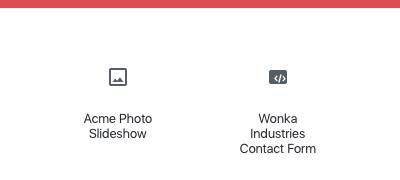
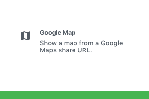
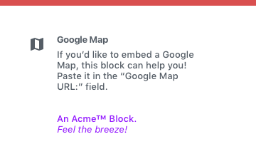
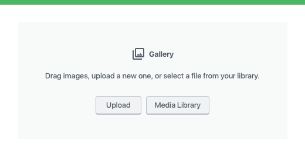
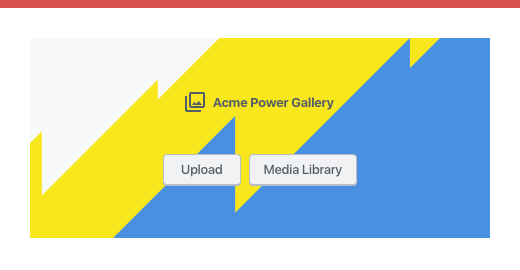
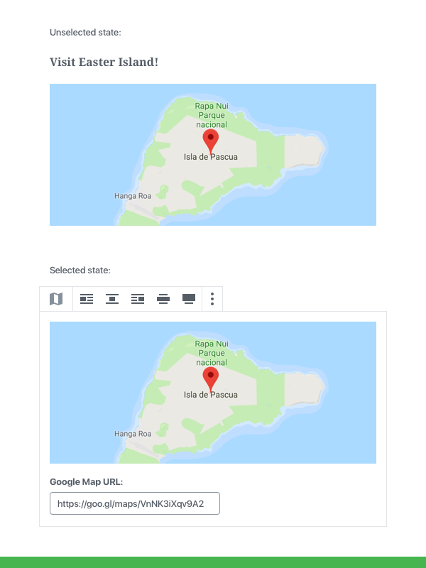
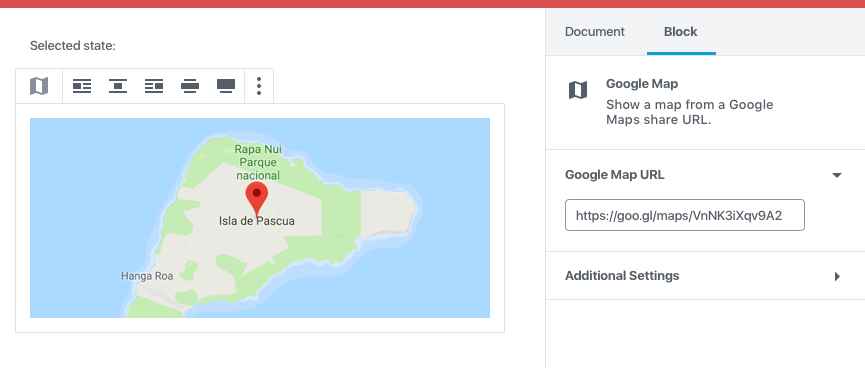
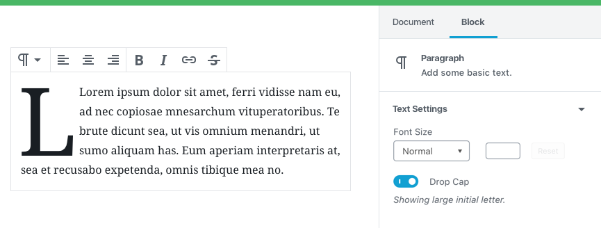

# Block Design

The following are best practices for designed a new block, with recommendations and detailed descriptions of existing blocks to illustrate our approach to creating blocks.

## Best Practices

### Blocks

A block should have a straightforward, short name so users can easily find it in the Block Library. A block named "YouTube" is easy to find and understand. The same block, named "Embedded Video (YouTube)", would be less clear and harder to find in the Block Library.

Blocks should have an identifying icon, ideally using a single color. Try to avoid using the same icon used by an existing block. The core block icons are based on [Material Design Icons](https://material.io/tools/icons/). Look to that icon set, or to [Dashicons](https://developer.wordpress.org/resource/dashicons/) for style inspiration.

#### Do:

#### Don't:

### Block Description

Every block should include a description in the “Block” tab of the Settings sidebar. This description should explain your block's function clearly. Keep it to a single sentence.

#### Do:

#### Don't:

### Placeholders

If your block requires a user to configure some options before you can display it, you should provide an instructive placeholder state.

#### Do:

#### Don't

### Selected and Unselected States

When unselected, your block should preview its content as closely to the front-end output as possible.

When selected, your block may surface additional options like input fields or buttons to configure the block directly, especially when they are necessary for basic operation.

#### Do:

*In this example, the block is not functional unless the URL has supplied, it's an essential control that should be rendered inside the block edit view.*

#### Don't:

*In this example, the block's essential options do not appear functional to a user who has dismissed the sidebar.*

### Advanced Block Settings

The “Block” tab of the Settings Sidebar can contain additional block options and configuration. Keep in mind that a user can dismiss the sidebar and never use it. You should not put critical options in the Sidebar.

#### Do:

*In this example, the Drop Cap feature is not necessary for the basic operation of the block, and can be put in the Block tab as optional configuration.*

### Consider mobile

Check how your block looks, feels, and works on as many devices and screen sizes as you can.

## Examples

To demonstrate some of these practices, here are a few annotated examples of default Gutenberg blocks:

### Paragraph

The most basic unit of the editor. The paragraph block is a simple input field.

### Placeholder:

- Simple placeholder text that says “Add text or type / to add content.” The placeholder disappears when the block is selected.

### Selected state:

- Block Toolbar: Has a switcher to perform transformations to headings, etc.
- Block Toolbar: Has basic text alignments
- Block Toolbar: Has inline formatting options, bold, italic, strikethrough and link

### Image

Basic image block.

### Placeholder:

- A generic gray placeholder block with options to upload an image, drag and drop an image directly on it, or pick an image from the media library.

### Selected state:

- Block Toolbar: Alignments, including wide and full-width if the theme supports it.
- Block Toolbar: Edit Image, to open the Media Library
- Block Toolbar: Link button
- When an image is uploaded, a caption input field appears with a “Write caption…” placeholder text below the image:

### Block settings:

- Has description: “They're worth 1,000 words! Insert a single image.”
- Has options for changing or adding alt text and adding additional custom CSS classes.

_Future improvements to the Image block could include getting rid of the media modal, in place of letting users select images directly from the placeholder itself. In general, try to avoid modals._

### Latest Post

### Placeholder:

Has no placeholder, as it works immediately upon insertion. The default inserted state shows the last 5 posts.

### Selected state:

- Block Toolbar: Alignments
- Block Toolbar: Options for picking list view or grid view

_Note that the Block Toolbar does not include the Block Chip in this case, since there are no similar blocks to switch to._

### Block settings:

- Has description: “Display a list of your most recent posts.”
- Has options for post order, narrowing the list by category, changing the default number of posts to show, and showing the post date.

_Latest Posts is fully functional as soon as it’s inserted, because it comes with good defaults._
