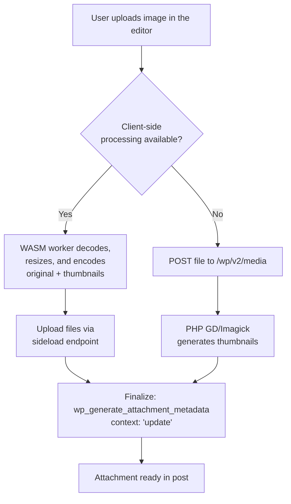
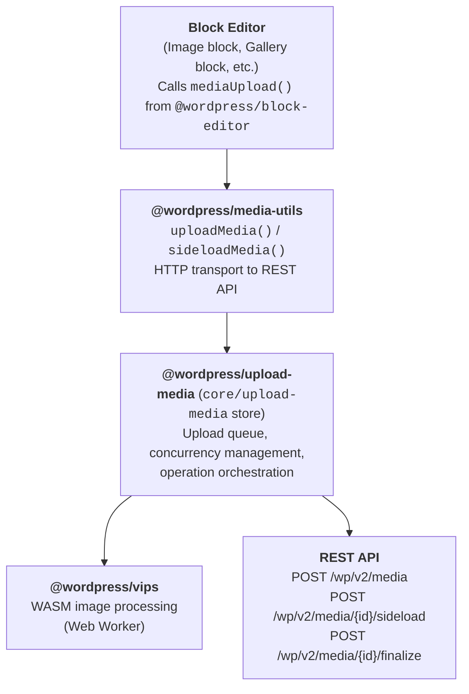

# Client-Side Media Processing

## Introduction

Client-side media processing is a capability shipping in WordPress 7.1 that handles image compression, resizing, format conversion, rotation, and thumbnail generation directly in the user's browser using WebAssembly, rather than on the server.

Key benefits include:

-   **Reduced server load**: Image processing is offloaded to the user's device, freeing server resources.
-   **No PHP memory limits**: Server-side image processing is often constrained by PHP's memory limit, causing failures with large images. Browser-based processing avoids these limits entirely.
-   **Consistent processing**: All users get the same high-quality image processing powered by [libvips](https://www.libvips.org/) via WebAssembly, regardless of which PHP image editor (GD or Imagick) is available on the server.
-   **Faster downloads**: libvips produces better-compressed output than GD/Imagick, so the generated images visitors receive are smaller and load faster.

When client-side processing is not available (unsupported browser, insufficient device resources, or explicitly disabled), WordPress transparently falls back to traditional server-side processing with no user intervention required.

## Upload flow

Both paths converge at `wp_generate_attachment_metadata`, so server-side hooks see the same surface regardless of which path was taken:



## Architecture overview

The client-side media processing pipeline flows through several layers:



## Three-package split

Client-side media processing is split across three packages, each with a distinct responsibility:

### `@wordpress/upload-media` — Queue and orchestration

The `core/upload-media` data store manages the upload queue and coordinates the processing pipeline. It:

-   Maintains a queue of items with statuses (queued, processing, paused, uploaded, error).
-   Enforces concurrency limits (max 5 concurrent uploads, max 2 concurrent image processing operations).
-   Chains operations sequentially per item: prepare → transcode → upload → thumbnail generation → sideload → finalize.
-   Handles batch grouping, progress tracking, retry logic, and error handling.
-   Manages blob URLs for image previews and revokes them after use.

**Key source files:**

-   `packages/upload-media/src/store/` — Redux-like store with actions, selectors, and reducer.
-   `packages/upload-media/src/feature-detection.ts` — Browser capability checks.

### `@wordpress/vips` — WASM image processing

A JavaScript wrapper around [wasm-vips](https://github.com/kleisauke/wasm-vips) (a WebAssembly compilation of libvips). It runs in a Web Worker to avoid blocking the main thread and provides:

-   Format conversion (JPEG, PNG, WebP, AVIF, GIF).
-   Resizing and cropping with smart crop support.
-   EXIF orientation-based rotation.
-   Transparency detection (to avoid converting transparent PNGs to JPEG).
-   Compression with configurable quality (0–1, default `0.82`).

**Key source files:**

-   `packages/vips/src/index.ts` — Core processing functions.
-   `packages/vips/src/worker.ts` — Web Worker entry point dynamically imported by the loader.
-   `packages/vips/src/vips-worker.ts` — Worker wrapper with lazy initialization.
-   `packages/vips/src/loader.ts` — Minimal loader for WordPress script module discovery.

### `@wordpress/media-utils` — HTTP transport

Provides the `uploadMedia()` and `sideloadMedia()` functions that handle the actual HTTP requests to the WordPress REST API. This package is responsible for file upload, sideload requests, and communicating server responses back to the upload store.

## Processing pipeline

When a user uploads an image in the block editor, the following pipeline executes:

### 1. Prepare

The `prepareItem()` operation examines the file type and determines which operations to run. For images supported by the WASM processor, the full pipeline is used. For other file types (video, audio, documents), the file is uploaded directly to the server with standard server-side processing.

### 2. Transcode (optional)

If the site is configured to convert image formats (e.g., JPEG → WebP via the `image_editor_output_format` filter), the `transcodeImageItem()` operation converts the image using `@wordpress/vips`. Special handling exists for PNGs with transparency — these are not converted to JPEG to preserve the alpha channel.

### 3. Upload original

The `uploadItem()` operation uploads the (optionally transcoded) image to the server via the REST API. The request includes `generate_sub_sizes: false` to tell the server _not_ to generate thumbnails, since the client will handle that.

### 4. Thumbnail generation

After the upload completes, the server responds with `missing_image_sizes` — a list of thumbnail sizes that still need to be generated. The `generateThumbnails()` operation creates sideload items for each missing size.

Sizes are deduplicated by their effective output dimensions before processing. When a theme registers an image size with the same width/height/crop as a built-in size (for example, Twenty Eleven's `large` matches WordPress core's `medium_large` at 768×1024), the client generates one physical file and tells the server to register it under both names by passing an array to the sideload route's `image_size` parameter. This matches how the server-side path handles duplicate dimensions and avoids producing extra files with `-1` suffixes.

For images that exceed the `big_image_size_threshold` (default: 2560px), a scaled version is also generated and sideloaded. The unscaled original is what gets uploaded first (step 3); sub-size filenames derive from that original basename, and only the scaled full-size copy carries the `-scaled` suffix. This matches WordPress core's `wp_create_image_subsizes()` naming and avoids propagating `-scaled` into every thumbnail filename.

If the original image requires EXIF rotation (orientation ≠ 1), a rotated version is generated and sideloaded as well.

### 5. Sideload sub-sizes

Each thumbnail is processed client-side (resize/crop → optional format conversion) and then uploaded to the server via the sideload endpoint (`POST /wp/v2/media/{id}/sideload`). The server stores each sub-size in the attachment metadata, registering it under each size name supplied in `image_size`.

To prevent race conditions, sideload uploads to the same post are serialized — if one item is being sideloaded, other items targeting the same post are paused until the sideload completes.

### 6. Finalize

After all sideloads for an item complete, the `finalizeItem()` operation calls `POST /wp/v2/media/{id}/finalize`. This endpoint applies the `wp_generate_attachment_metadata` filter with context `'update'` so server-side plugins (watermarking, CDN sync, custom metadata processing, etc.) can post-process the attachment after all sub-sizes are written.

The filter was already fired once with context `'create'` during the initial upload, so plugins see two passes per client-side upload. This double-fire pattern matches how WordPress handles big-image uploads on the server, where sub-size generation is deferred and triggers a second `'update'` pass — plugins that already work with big-image uploads accommodate it without modification, but they should be written idempotently.

The finalize step uses a gate: if any child sideloads are still pending, the operation waits. Once the last sideload completes, it triggers the parent item's pending Finalize operation.

If the finalize request fails, the error is logged but the upload is still considered successful — finalization is best-effort so that a plugin failure doesn't block the user's upload.

## Extension points

### `editor.media.imageQuality` (JavaScript filter)

The `editor.media.imageQuality` filter allows plugins to control the quality setting (0–1) used during client-side image resize and crop operations. It is called via `@wordpress/hooks` in the `resizeCropItem()` action.

```js
wp.hooks.addFilter(
	'editor.media.imageQuality',
	'my-plugin/custom-quality',
	( quality, context ) => {
		// context: { item, mimeType, resize }
		return quality;
	}
);
```

The quality value is passed through to the vips worker during resize and crop operations.

## WASM module loading

The WASM worker bundle is loaded lazily — only when the first image needs processing:

1.  **Loader discovery**: `@wordpress/vips/loader` is a thin module that dynamically imports `@wordpress/vips/worker`, so WordPress's script module system can discover the dependency without pulling the WASM binary into the initial editor bundle.

2.  **Worker creation**: A Web Worker is spawned from an inline blob URL on first use. `vips.wasm` and `vips-heif.wasm` are inlined as base64 data URLs at build time, avoiding separate file downloads and WASM MIME-type issues.

3.  **Single instance**: `getVips()` caches a promise so concurrent first-time calls share one initialization. The worker stays alive across uploads and is terminated by `terminateVipsWorker()` when the upload queue empties or when it is recycled (see Memory management below).

4.  **Memory management**: WASM linear memory can only grow, never shrink, so the pipeline actively limits how much it accumulates:
    -   The libvips operation cache is disabled at startup (`Cache.max(0)`). libvips otherwise caches the results of previous operations, which grows WASM memory unbounded across a batch of uploads and can trigger out-of-memory crashes.
    -   The worker is recycled (terminated and recreated on next use) after every 50 completed vips operations, counting both successes and failures so a burst of failures can't bypass the budget. Recycling is deferred while any operation is still in flight so an active worker is never killed mid-operation.
    -   Emscripten's `setAutoDeleteLater(true)` handles automatic cleanup, and each operation also runs a manual cleanup after completion. Operations are tracked in an `inProgressOperations` set so they can be cancelled mid-flight via a progress-callback kill switch.

5.  **Batch thumbnail generation**: `batchResizeImage()` decodes the source image once with `newFromBuffer()` and calls `image.copyMemory()` to materialize the pixels in WASM memory. Each sub-size is then generated by `thumbnailImage()` against the in-memory copy and written directly to the output format.

## Cross-origin isolation

Client-side media processing requires `SharedArrayBuffer` for WASM threading, which browsers only expose in [cross-origin isolated](https://developer.mozilla.org/en-US/docs/Web/API/Window/crossOriginIsolated) contexts.

### PHP headers

WordPress sends the `Document-Isolation-Policy` (DIP) header on block editor screens for Chromium 137+:

```
Document-Isolation-Policy: isolate-and-credentialless
```

This header provides per-document cross-origin isolation without affecting other iframes on the page, avoiding the breakage that the older `Cross-Origin-Embedder-Policy` / `Cross-Origin-Opener-Policy` headers caused for third-party plugins and embeds.

The header is set via `gutenberg_start_cross_origin_isolation_output_buffer()` (in `lib/media/load.php`), which uses PHP output buffering on `load-post.php`, `load-post-new.php`, `load-site-editor.php`, and `load-widgets.php` screens. DIP is skipped on admin pages with an `action` parameter other than `edit` to avoid conflicts with page builders that rely on same-origin iframe access.

The `gutenberg_use_document_isolation_policy` filter can be used to control whether DIP is applied:

```php
// Force DIP on or off regardless of browser version.
add_filter( 'gutenberg_use_document_isolation_policy', '__return_true' );
```

### HTML attribute injection

Cross-origin isolation requires that cross-origin resources include proper CORS attributes. WordPress handles this at two levels:

**Server-side** (PHP output buffer): The `wp_add_crossorigin_attributes()` function uses `WP_HTML_Tag_Processor` to add `crossorigin="anonymous"` to `<audio>`, `<link>`, `<script>`, `<video>`, and `<source>` tags that load cross-origin URLs.

**Client-side** (JavaScript MutationObserver): A MutationObserver in `packages/block-editor/src/hooks/cross-origin-isolation.js` monitors the DOM for dynamically added elements and adds `crossorigin="anonymous"` attributes at runtime.

> **Note:** `` is intentionally excluded from the mutated-element list. Document-Isolation-Policy doesn't require `` resources to be CORS-enabled, and forcing `crossorigin="anonymous"` on cross-origin images would break previews for the common case of an Image block linking to a third-party URL without CORS headers.

### Browser support

Client-side media processing is limited to Chromium-based browsers that support `Document-Isolation-Policy`:

| Browser | Minimum Version | Notes |
| --- | --- | --- |
| Chrome | 137+ | Full support via Document-Isolation-Policy. |
| Edge | 137+ | Full support via Document-Isolation-Policy. |
| Firefox | — | Not supported. |
| Safari | — | Not supported for the WASM pipeline; the HEIC canvas fallback still works. |

Browsers that do not support DIP fall back automatically to server-side processing.

## Feature detection

Before enabling client-side processing, the browser's capabilities are checked in `packages/upload-media/src/feature-detection.ts`. All checks must pass; failure at any point causes a transparent fallback to server-side processing.

| Check | Threshold | Reason |
| --- | --- | --- |
| WebAssembly available | — | Required for wasm-vips |
| SharedArrayBuffer available | — | Required for WASM threading (implies Document-Isolation-Policy is active) |
| Web Worker available | — | Required for the off-main-thread vips worker |
| Device memory | > 2 GB | WASM image processing can hold the full image in memory plus working buffers; very low-memory devices can OOM |
| Hardware concurrency | ≥ 2 CPU cores | WASM workers can monopolize a core for tens of seconds during encode |
| Network connection | not `2g`/`slow-2g`, no Save-Data | Avoid the ~13 MB worker download on connections that can't bear it |
| CSP allows `blob:` workers | — | Required for inline worker creation; verified by attempting to construct a worker from a blob URL |

The PHP-side feature flag (`wp_client_side_media_processing_enabled` filter) is also checked before any JavaScript feature detection runs. The Document-Isolation-Policy header is only sent on Chromium 137+, which short-circuits the JavaScript path on browsers that don't support cross-origin isolation through DIP.

A separate `isHeicCanvasSupported()` check (`createImageBitmap` + `OffscreenCanvas`) gates the HEIC fallback path. This runs independently of full VIPS support so Safari (which can't run the WASM pipeline but can decode HEIC natively) can still handle iPhone photos in the browser.

## Supported formats

The following formats are processed in the WASM/vips pipeline (`CLIENT_SIDE_SUPPORTED_MIME_TYPES`):

| Format | Read | Write | Transparency | Animation | Progressive/Interlace |
| --- | --- | --- | --- | --- | --- |
| JPEG | Yes | Yes | No | No | Yes |
| PNG | Yes | Yes | Yes | No | Yes |
| WebP | Yes | Yes | Yes | Yes | No |
| AVIF | Yes | Yes | Yes | No | No |
| GIF | Yes | Yes | No | Yes | Yes |

Notes:
-   AVIF encoding uses `effort: 2` to balance encoding speed with quality.
-   Animated GIF and WebP images preserve all frames during processing in the vips pipeline.
-   Opaque animated GIFs are additionally converted to a companion video (MP4/WebM) outside the vips pipeline — see [Animated GIF to video conversion](#animated-gif-to-video-conversion) below.
-   PNG-to-JPEG conversion is skipped when the PNG has transparency.
-   AVIF uploads bypass the server's `wp_prevent_unsupported_mime_type_uploads` check when `generate_sub_sizes=false`, so a host without server-side AVIF support can still accept client-processed AVIF files.

### HEIC/HEIF

HEIC/HEIF is handled via a canvas-based fallback path rather than wasm-vips, since the HEVC codec used by HEIC has patent/licensing restrictions that prevent shipping a decoder in the browser bundle.

When a HEIC file is uploaded, the client tries three decoding strategies in order:

1.  **`createImageBitmap()`** — Works in Safari (which can decode HEIC via macOS platform codecs) and any future browser that adds HEIC to its image pipeline.
2.  **OS-licensed image decoders via `HTMLImageElement` → `OffscreenCanvas`** — A second-tier path for browsers with platform HEIC support.
3.  **HEIC container parsing + WebCodecs `VideoDecoder`** — Chromium 107+ can decode HEVC bitstreams via the platform codec (VideoToolbox on macOS, the Microsoft HEVC Video Extension on Windows) even without HEIC image support. The client parses the ISOBMFF container, extracts the HEVC tiles, and re-assembles them on a canvas.

The decoded image is exported as a JPEG (`.jpg`, MIME `image/jpeg`) and uploaded with the original HEIC kept as a companion file in `$metadata['original']`. The server is responsible for sub-size generation in this path (`generate_sub_sizes: true`, `convert_format: true`), so the `image_editor_output_format` mapping is preserved for the JPEG sub-sizes.

## Animated GIF to video conversion

Animated GIFs are large and inefficient compared to modern video. When an opaque animated GIF is uploaded, the client converts it to an MP4 (or WebM) video so it plays like the original GIF but downloads far less data. This is a distinct pipeline from the wasm-vips image path described above — it uses the browser's native [WebCodecs](https://developer.mozilla.org/en-US/docs/Web/API/WebCodecs_API) APIs plus the [mediabunny](https://www.npmjs.com/package/mediabunny) library rather than libvips.

### `@wordpress/video-conversion` package

Conversion lives in a dedicated package that mirrors the `@wordpress/vips` worker pattern: a Web Worker is bundled with mediabunny and exposed to the main thread through a Comlink-style proxy, so the memory-intensive encode runs off the main thread.

**Key source files:**

-   `packages/video-conversion/src/index.ts` — The `convertGifToVideo()` frame pipeline.
-   `packages/video-conversion/src/worker.ts` — Worker API surface (Comlink endpoint).
-   `packages/video-conversion/src/video-conversion-worker.ts` — Worker host wrapper.
-   `packages/video-conversion/src/loader.ts` — Thin loader for WordPress script-module discovery.

### Conversion pipeline

1.  **Detection.** `isAnimatedGif()` (in `packages/upload-media/src/utils.ts`) inspects the GIF89a Graphic Control Extension blocks to confirm the file is actually animated. Transparent GIFs are excluded — a `<video>` cannot reproduce GIF transparency — so they upload as a normal image with no companion.
2.  **Decode.** The browser's `ImageDecoder` decodes each GIF frame, honoring the real per-frame `delay` values (defaulting to the GIF spec's 100ms / 10fps when a frame reports none).
3.  **Encode.** Each decoded `VideoFrame` is fed to mediabunny's `VideoSampleSource` and encoded via the WebCodecs `VideoEncoder` — `avc` (H.264) into an `Mp4OutputFormat`, or `vp9` into a `WebMOutputFormat`. Output dimensions are forced even, as the codecs require.
4.  **Store as companion files.** The converted video and a static first-frame poster are sideloaded as **companion files** of the original GIF attachment (the same model as the HEIC original), recorded in `media_details.animated_video` and `media_details.animated_video_poster`. The GIF remains a single `image/gif` attachment — the video and poster are never separate attachments.

The operation is wired into the upload store as `OperationType.TranscodeGif` with its own `transcodeGifItem()` action, chained from `prepareItem()`. It runs with a **video processing concurrency limit of 1** (tracked by `getActiveVideoProcessingCount()`), independent of the image-processing limit, because the encode is memory-intensive.

### Editor block switch

Unlike HEIC (which only swaps the stored file), the GIF→video swap changes the _block_ in the editor — there is no render-time PHP filter.

-   **A "GIF" variation of the Video block.** `core/video` declares two variations, "Video" and "GIF", distinguished purely by their attribute combination — the GIF variation is `! controls && loop && autoplay && muted && playsInline` (`isGifVariation()` in `packages/block-library/src/video/variations.js`). No new block attribute is introduced. The variation is scoped to `block` + `transform` (not the inserter), since it represents a converted GIF rather than something inserted directly. Its editor preview autoplays, loops, and is muted, so it behaves like the original GIF.
-   **Swap on upload.** Once the companion video is available, a **standalone** `core/image` block is replaced by the Video block's GIF variation playing the companion. Images inside a **Gallery** are left as GIFs (a gallery only accepts image blocks); **Media & Text** and **Cover** are unaffected because their media is not a `core/image` block. A `.gif`-URL gate prevents non-GIF images from triggering an attachment fetch, and a client-id guard keeps **undo** from immediately re-converting.
-   **Fully reversible.** A "Display as GIF" toolbar control on the GIF video block switches it back to the original `core/image` and opts it out of re-conversion; the Image block's "Display as original GIF" toggle (`preserveAnimatedGif`) governs the editor conversion, so the round-trip works in both directions.
-   **Native front-end rendering.** Because the converted block is a real `core/video`, it serializes a native `<video autoplay loop muted playsinline poster>` and renders on the front end with no filtering.

### Browser support and fallback

The conversion path requires WebCodecs encode, which is gated on `typeof ImageDecoder !== 'undefined' && typeof VideoEncoder !== 'undefined'` at `prepareItem` time, plus a per-codec `canEncodeVideo()` check. When WebCodecs is unavailable (for example Firefox, which lacks `VideoEncoder`), the worker returns an `Unsupported` error and the original GIF is left in the queue to upload as-is. Like the rest of client-side media, the fallback is transparent.

### PHP

The PHP footprint is minimal (`lib/media/animated-gif-to-video.php` plus an enqueue and a sideload allowance):

-   Enqueues the `@wordpress/video-conversion/loader` script module in the editor (`lib/client-assets.php`).
-   Allows the converted video and poster as valid sideload sizes on the attachment (`class-gutenberg-rest-attachments-controller.php`).
-   Cleans up the sideloaded companion video and poster when their attachment is deleted (`gutenberg_delete_animated_gif_video()` on the `delete_attachment` hook), since core's `wp_delete_attachment_files()` does not know about them. Deletion is delegated to `wp_delete_file_from_directory()`, scoped to the uploads directory.

## Fallback behavior

Client-side media processing is designed with transparent fallback. When the browser does not support WASM processing — or when the feature is disabled — uploads proceed through the traditional server-side path:

1.  The file is uploaded to `POST /wp/v2/media` with default parameters.
2.  The server generates thumbnails using `wp_generate_attachment_metadata()`.
3.  Server-side image processing uses GD or Imagick as configured.
4.  The user experience is identical — no errors or additional prompts.

The fallback is automatic and requires no configuration.

## REST API extensions

Client-side media processing extends the WordPress REST API in several ways:

### New request parameters

| Parameter | Endpoint | Type | Default | Description |
| --- | --- | --- | --- | --- |
| `generate_sub_sizes` | `POST /wp/v2/media`, `POST /wp/v2/media/{id}/sideload` | boolean | `true` | When `false`, the server skips thumbnail generation. The client generates and sideloads thumbnails itself. |
| `convert_format` | `POST /wp/v2/media`, `POST /wp/v2/media/{id}/sideload` | boolean | `true` | When `false`, the server skips format conversion via the `image_editor_output_format` filter. |
| `replace_file` | `POST /wp/v2/media/{id}/sideload` | boolean | `false` | When `true`, replaces the attachment's main file with the sideloaded file, updating the MIME type and metadata and deleting the old file. Used for the HEIC → JPEG companion path. |
| `image_size` | `POST /wp/v2/media/{id}/sideload` | string \| string[] | — | The image size name (e.g., `thumbnail`, `medium`, `scaled`, `original`). An array of names registers a single physical file under multiple sizes that share dimensions. |

When `generate_sub_sizes` is `false`, the following server-side filters are also temporarily disabled:
-   `intermediate_image_sizes_advanced` — Prevents sub-size generation.
-   `fallback_intermediate_image_sizes` — Prevents fallback size generation.
-   `wp_image_maybe_exif_rotate` — Prevents server-side EXIF rotation (client handles it).
-   `big_image_size_threshold` — Prevents server-side big image scaling (client handles it).

### New response fields

| Field | Type | Description |
| --- | --- | --- |
| `exif_orientation` | integer | EXIF orientation value (1–8). A value other than 1 indicates the image needs rotation. |
| `missing_image_sizes` | array | List of registered image size names that have not yet been generated for this attachment. |
| `filename` | string | Original attachment file name. |
| `filesize` | integer | Attachment file size in bytes. |

### Sideload endpoint

```
POST /wp/v2/media/{id}/sideload
```

Uploads a processed image variant (thumbnail, scaled version, or rotated original) to an existing attachment. The `image_size` parameter specifies which variant is being uploaded and accepts any registered image size name, plus `original` and `scaled`.

Before writing the file to the attachment metadata, the endpoint validates that the uploaded dimensions are appropriate for the declared `image_size`. Every size must have positive dimensions; an `original` upload must match the attachment's stored original dimensions exactly; and a regular registered size must not exceed that size's registered width or height (with a 1px tolerance for rounding). The `scaled`, `full`, and `original-heic` sizes are exempt from the maximum-dimension check. When validation fails, the uploaded file is deleted and the request returns a `400` error: `rest_upload_dimension_mismatch`, `rest_upload_invalid_dimensions`, or `rest_upload_unknown_size`. This prevents a mis-sized file (for example, a full-resolution image sideloaded under the `thumbnail` size name) from corrupting the attachment's responsive image set.

### Finalize endpoint

```
POST /wp/v2/media/{id}/finalize
```

Applies the `wp_generate_attachment_metadata` filter with context `'update'` after all client-side operations (upload, thumbnail generation, sideloads) are complete. The filter was already fired once with `'create'` during the initial upload — this second pass is what lets server-side plugins (watermarking, CDN sync, custom image sizes) see the full sub-size metadata.

The endpoint requires `edit_post` and `upload_files` capabilities. It reads the existing attachment metadata, applies the filter, saves the result, and returns the refreshed attachment record. The editor consumes this response to update the block's stored media URL to the final server-side file, for example the `-scaled` copy generated for images that exceed `big_image_size_threshold`. Without this refresh the block would keep the unscaled original's URL, which would prevent `wp_calculate_image_srcset()` from matching the sub-size files and emit no `srcset` on the front end.

### REST index media settings

When client-side processing is enabled, the REST API root index (`GET /`) is augmented (for users with `upload_files` capability) with:

-   `image_sizes` — All registered image sizes with dimensions and crop settings, derived from `wp_get_registered_image_subsizes()`.
-   `image_size_threshold` — The current `big_image_size_threshold` filter value.

Other server-side filters (`image_editor_output_format`, `image_save_progressive`) are read at upload time on the server rather than exposed via the index. The set of MIME types eligible for client-side processing is fixed at `CLIENT_SIDE_SUPPORTED_MIME_TYPES` (JPEG, PNG, GIF, WebP, AVIF) — there is no public filter for this list.

## Concurrency

The upload store enforces two separate concurrency limits to balance performance and resource usage:

| Limit | Default | Reason |
| --- | --- | --- |
| Max concurrent uploads | 5 | Uploads are network-bound and can run in parallel. |
| Max concurrent image processing operations | 2 | WASM image processing is memory-intensive. Running too many operations simultaneously risks out-of-memory crashes. |

When a concurrency limit is reached, new items wait in the queue. As operations complete, pending items are automatically dequeued and processed.

Additionally, sideload uploads to the same WordPress post are serialized to prevent race conditions in attachment metadata updates. If one sideload is in progress for a post, other sideloads targeting the same post are paused until the first completes.

## Post-save locking

While uploads are in flight, the editor takes a post-saving lock so the user can't publish or save a draft that references attachments which haven't finished sideloading. Both the legacy upload path and the client-side path share this behavior:

-   `useUploadSaveLock` watches the `core/upload-media` store and dispatches `lockPostSaving`/`unlockPostSaving` against the editor store as items enter and leave the queue.
-   The legacy (`uploadMedia`-only) path also locks via `UploadSaveLockWrapper`, which counts active uploads instead of tracking a queue.

The Save Draft button, Publish button, and `Ctrl/Cmd+S` shortcut all check `isPostSavingLocked()`. The lock releases when all items are uploaded or any in-flight item is cancelled.

## See also

-   [Client-side media processing how-to guide](/docs/how-to-guides/client-side-media.md) — practical guidance for plugin and theme developers (disabling, customizing, and debugging the feature).
-   [Editor filters reference: Client-side media processing](/docs/reference-guides/filters/editor-filters.md#client-side-media-processing) — full filter and REST API parameter reference.
