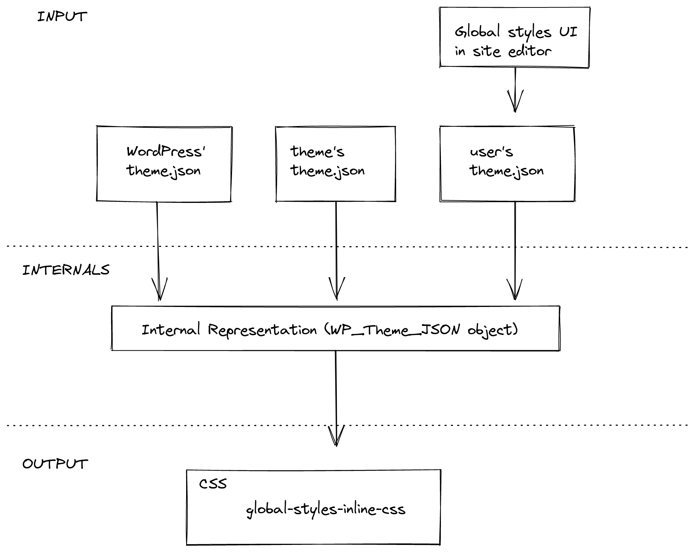

## Styles in the block editor

This document introduces the main concepts related to styles that affect the user content in the block editor. It points to the relevant reference guides and tutorials for readers to dig deeper into each one of the ideas presented. It's aimed to block authors and people working in the block editor project.

1. HTML and CSS
2. Block styles
  - From UI controls to HTML markup
  - Block Supports API
  - Current limits of the Block Supports API
3. Global styles
  - Gather data
  - Consolidate data
  - From data to styles
  - Current limits of the Global styles API

### HTML and CSS

By creating a post in the block editor the user is creating a number of artifacts: a HTML document plus a number of CSS stylesheets, either embedded in the document or external.

The final HTML document is the result of a few things:

- the [WordPress templates](https://developer.wordpress.org/themes/basics/template-files/) provided by the theme, either via PHP (classic theme) or via HTML templates (block theme) ([learn more](https://developer.wordpress.org/themes/block-themes/#differences-and-similarities-between-classic-themes-and-block-themes) about the differences)
- the [blocks](https://developer.wordpress.org/block-editor/reference-guides/core-blocks/) and patterns in use that come with a predefined structure (HTML markup)
- the user modifications to the content: adding content, transforming existing content (convert a given paragraph into a heading), or modifying it (attaching a class or inline styles to a block)

The stylesheets loaded in the front end include:

- **Blocks**. The stylesheets that come with the block. In the front end, you can find a single stylesheet with all block styles defined by WordPress (`wp-block-library-*` ) or separate stylesheets per block in use (as in `wp-block-group-*`, `wp-block-columns-*`, etc). See [this note](https://make.wordpress.org/core/2021/07/01/block-styles-loading-enhancements-in-wordpress-5-8/) for the full details.
- **Global styles**. These styles are generated on the fly by using data coming from a theme.json file: see [note](https://make.wordpress.org/core/2021/06/25/introducing-theme-json-in-wordpress-5-8/), [reference](https://developer.wordpress.org/block-editor/reference-guides/theme-json-reference/), and [how to guide](https://developer.wordpress.org/block-editor/how-to-guides/themes/theme-json/). Specifically, it merges the contents of the theme.json coming with WordPress, the theme.json coming with the theme if any, and the user data provided via the global styles sidebar in the site editor. The result of processing this data is visible in the  `global-styles-inline-css` stylesheet.
- **Theme**. Historically, themes have enqueued their own stylesheets, where the id is based on the theme name, as in `twentytwentytwo-style-css`. In addition to having their own stylesheets they can now declare a theme.json file containing styles that will be part of the global stylesheet.
- **User**. Some of the user actions in the editor will generate style content. This is the case for features such as duotone, layout, or link color.
- **Other**. WordPress and plugins can also enqueue stylesheets.

### Block styles

Since the introduction of the block editor in WordPress 5.0, there were tools for the users to "add styles" to specific blocks. By using these tools, the user would attach new classes or inline styles to the blocks, modifying their visual aspect.

By default, blocks come with a given HTML markup. Think of the paragraph block, for example:

```html
<p></p>
```

In its simplest form, any style rule that targets the `p` selector will apply styles to this block, whether it comes from a block, a theme, etc.

The user may change the state of this block by applying different styles: a text alignment, a color, a font size, a line height, etc. These states are reflected in the HTML markup of the block in the form of HTML attributes, mainly through the `class` or `style` attributes, though it can be any other the block author sees fit.

After some user modifications to the block, the initial markup may become something like this:

```html
<p
	class="has-color has-green-color has-font-size has-small-font-size my-custom-class"
	style="line-height: 1em"
></p>
```

This is what we refer to as "user-provided block styles". Other names people use are local styles or serialized styles. Essentially, each tool (font size, color, etc) ends up adding some classes and/or inline styles to the block markup. The CSS styling for these classes is part of the block, global, or theme stylesheets.

The ability to modify a block state coupled with the fact that a block can live within any other block (think of a paragraph within a group), creates a vast amount of potential states and style possibilities.

#### From UI controls to HTML markup

If you follow the [block tutorial](https://developer.wordpress.org/block-editor/how-to-guides/block-tutorial/) you can learn up about the different parts of the [block API](https://developer.wordpress.org/block-editor/reference-guides/block-api/) presented here in more detail and also build your own block. This is an introduction to the general concepts of how a block can let users edit its state.

To build an experience like the one described above a block author needs a few pieces:

1. **A UI control**. It presents the user some choices, for example, to be able to change the font size of the block. The control takes care of reading the data from the block (does this block already have a font size assigned?) and other data it needs (what are the font sizes a user can use in this block?). See available [component library](https://developer.wordpress.org/block-editor/reference-guides/components/).
2. **A block attribute**. The block needs to hold data to know which modifications were applied to it: whether it has been given a font size already, for example. See how blocks can define [attributes](https://developer.wordpress.org/block-editor/reference-guides/block-api/block-attributes/).
3. **Access to style data**. A control may need external information about the styles available for a given block: the list of colors, or the list of font sizes, for example. These are called "style presets", as they are a preselection of styles usually defined by the theme, although WordPress provides some defaults. Check the [list of data](https://developer.wordpress.org/block-editor/reference-guides/theme-json-reference/theme-json-living/#settings) a theme can provide to the editor and how a block author can get access to it via [useSetting](https://developer.wordpress.org/block-editor/reference-guides/packages/packages-block-editor/#usesetting).
4. **Serialize the user style into HTML markup**. Upon a user action, the block HTML markup needs to be updated accordingly (apply the proper class or inline style). This process is called serialization and it is the [edit, save](https://developer.wordpress.org/block-editor/reference-guides/block-api/block-edit-save/), and [render_callback](https://developer.wordpress.org/block-editor/how-to-guides/block-tutorial/creating-dynamic-blocks/) functions' responsibility: these functions take block data and convert it into HTML.

In essence, these are the essential mechanics a block author needs to care about for their block to be able to be styled by the user. While this can be done completely manually, there's an API that automates this process for common style needs: Block Supports.

#### Block Supports API

[Block supports](https://developer.wordpress.org/block-editor/reference-guides/block-api/block-supports/) is an API that allows a block to declare what features it supports. By adding some info to their [block.json file](https://developer.wordpress.org/block-editor/reference-guides/block-api/block-metadata/), the block tells the system what kind of actions a user can do to it.

For example:

```json
{
  "name": "core/paragraph", 
  "...": "...",
  "supports": {
	"typography": {
		"fontSize": true
	}
  }
}
```

The paragraph declares support for font size in its `block.json`. This means the block will show a UI control for users to tweak its font size, unless it's disabled by the theme (learn more about how themes can disable UI controls in [the `theme.json` reference](https://developer.wordpress.org/block-editor/reference-guides/theme-json-reference/)). The system will also take care of setting up the UI control data (the font size of the block if it has one already assigned, the list of available font sizes to show), and will serialize the block data into HTML markup upon user changes (attach classes and inline styles appropriately).

By using the block supports mechanism via `block.json`, the block author is able to create the same experience as before just by writing a couple of lines.

Besides the benefit of having to do less work to achieve the same results, there's a few other advantages:

- the style information of the block becomes available for the native mobile apps and in the server
- the block will use the UI controls other blocks use for the same styles, creating a more coherent user experience
- the UI controls in use by the block will be automatically updated as they are improved, without the block author having to do anything

#### Current limits of the Block Supports API

While the Block Supports API provides value, it also comes with some limitations a block author needs to be aware of. To better visualize what they are, let's run with the following example of a table block:

```html
<table>
  <thead><tr><th>Header</th></tr></thead>
  <tbody>
    <tr><th>First</th></tr>
    <tr><th>Second</th></tr>
  </tbody>
  <tfoot>
    <tr><th>Footer</th></tr>
  </tfoot>
</table>
```

1. **Only one style type per block.**

One of the limitations is that, from all the [styles available](https://developer.wordpress.org/block-editor/reference-guides/block-api/block-supports/), there can be only one instance of any them in use by the block. Following the example, the table block can only have a single font size. If the block author wanted to have three different font sizes (head, body, and footer) it can't do it using the current block supports API. See [this issue](https://github.com/WordPress/gutenberg/issues/33255) for more detailed info and ways forward.

2. **Styles are serialized to the outermost HTML node of the block, the wrapper.**

The Block Supports API only serializes the font size value to the wrapper, resulting in the following HTML `<table class="has-small-font-size">` . The current block supports API doesn't serialize this value to a different node, for example, the `<tbody>`.

This is an active area of work you can follow [in the tracking issue](https://github.com/WordPress/gutenberg/issues/38167). The linked proposal is exploring a different way to serialize the user changes: instead of each block support serializing its own data (for example, classes such as `has-small-font-size`, `has-green-color`) the idea is the block would get a single class instead (for example, `wp-style-UUID`) and the CSS styling for that class will be generated in the server by WordPress.

While work continues in that proposal, there's an escape hatch, an experimental option block authors can use. Any block support can skip the serialization to HTML markup by using  `__experimentalSkipSerialization`. For example:

```
{
  "name": "core/paragraph", 
  "...": "...",
  "supports": {
	"typography": {
		"fontSize": true,
		"__experimentalSkipSerialization": true
	}
  }
}
```

This means that the typography block support will do all of the things (create a UI control, bind the block attribute to the control, etc) except serializing the user values into the HTML markup. The classes and inline styles will not be automatically applied to the wrapper and it is the block author's responsibility to implement this in the `edit`, `save`, and `render_callback` functions. See [this issue](https://github.com/WordPress/gutenberg/issues/28913) for examples of how it was done for some blocks provided by WordPress.

Note that, once `__experimentalSkipSerialization` is enabled for a group (typography, color, spacing) it affects all block supports within this group (font size, line height, and font family within typography, and so on). There's [ongoing work](https://github.com/WordPress/gutenberg/pull/36293) to be able to disable block supports individually, you can follow that issue to check the status.

### Global styles

Global Styles refers to a mechanism that generates site-wide styles. Unlike the block styles described in the previous section, these are not serialized into the post content and are not attached to the block HTML. Instead, the output of this system is a new stylesheet with id `global-styles-inline-css`.

This mechanism was [introduced in WordPress 5.8](https://make.wordpress.org/core/2021/06/25/introducing-theme-json-in-wordpress-5-8/). At the time, it only took data from WordPress and the active theme. WordPress 5.9 expanded the system to also take style data from users.

This is the general data flow:



The process of generating the stylesheet has, in essence, three steps:

1. Gather data: the `theme.json` file [bundled with WordPress](https://github.com/WordPress/wordpress-develop/blob/trunk/src/wp-includes/theme.json)), the `theme.json` file of the active theme if it exists, and the user's styles provided via the global styles UI in the site editor.
2. Consolidate data: the structured information from different origins -WordPress defaults, theme, and user- is normalized and merged into a single structure.
3. Convert data into a stylesheet: convert the internal representation into CSS style rules and enqueue them as a stylesheet.

#### Gather data

The data can come from three different origins: WordPress defaults, the active theme, or the user. All three of them use the same [`theme.json` format](https://developer.wordpress.org/block-editor/reference-guides/theme-json-reference/).

 Data from WordPress and the active theme is retrieved from the corresponding `theme.json` file. Data from the user is pulled from the database, where it's stored after the user saves the changes they did via the global styles sidebar in the site editor.

#### Consolidate data

The goal of this phase is to build a consolidated structure.

There are two important processes going on in this phase. First, the system needs to normalize all the incoming data, as different origins may be using different versions of the `theme.json` format. For example, a theme may be using [v1](https://developer.wordpress.org/block-editor/reference-guides/theme-json-reference/theme-json-v1/) while the WordPress base is using [the latest version](https://developer.wordpress.org/block-editor/reference-guides/theme-json-reference/theme-json-living/). Second, the system needs to decide how to merge the input into a single structure. This will be the focus of the following sections.

##### Styles

Different parts of the incoming `theme.json` structure are treated differently. The data present in the `styles` section is blended together following this logic: user data overrides theme data, and theme data overrides WordPress data.

For example, if we had the following three `theme.json` structures coming from WordPress, the theme, and the user respectively:

```json
{
  "styles": {
    "color": {
      "background": <WordPress value>
	},
    "typography": {
      "fontSize": <WordPress value>
	}
  }
}
```

```json
{
  "styles": {
    "typography": {
      "fontSize": <theme value>,
      "lineHeight": <theme value>
	}
  }
}
```

```json
{
  "styles": {
    "typography": {
      "lineHeight": <user value>
	}
  }
}
```

The result after the consolidation would be:

```json
{
  "styles": {
    "color": {
      "background": <WordPress value>
    },
    "typography": {
      "fontSize": <theme value>
      "lineHeight": <user value>
	}
  }
}
```

##### Settings

The `settings` section works differently than styles. Most of the settings are only used to configure the editor and have no effect on the global styles. Only a few of them are part of the resulting stylesheet: the presets.

Presets are the predefined styles that are shown to the user in different parts of the UI: the color palette or the font sizes, for example. They comprise the following settings: `color.duotone`, `color.gradients`, `color.palette`, `typography.fontFamilies`, `typography.fontSizes`. Unlike `styles`, presets from an origin don't override values from other origins. Instead, all of them are stored in the consolidated structure.

For example, if we have the following `theme.json` structures coming from WordPress, the theme, and the user respectively:

```json
{
  "settings": {
    "color": {
      "palette": [ <WordPress values> ],
      "gradients": [ <WordPress values> ]
	}
  }
}
```

```json
{
  "settings": {
    "color": {
      "palette": [ <theme values> ]
	},
    "typography": {
      "fontFamilies": [ <theme values> ]
	}
  }
}
```

```json
{
  "settings": {
    "color": {
      "palette": [ <user values> ]
	}
  }
}
```

The result after the consolidation would be:

```json
{
  "settings": {
    "color": {
      "palette": {
        "default": [ <WordPress values> ],
        "theme": [ <theme values> ],
        "user": [ <user values> ]
	  },
	  "gradients": {
        "default": [ <WordPress values> ]
	  }
    },
    "typography": {
      "fontFamilies": {
        "theme": [ <theme values> ]
	  }
	}
  }
}
```

#### From data to styles

The last phase of generating the stylesheet is converting the consolidated data into CSS style rules.

##### Styles to CSS rules

The `styles` section can be thought of as a structured representation of CSS rules, each chunk representing a CSS rule:

- A key/value in theme.json maps to a CSS declaration (`property: value`).
- The CSS selector for a given chunk is generated based on its semantics:
	- The top-level section uses the `body` selector.
	- The top-level elements use an ID selector matching the HTML element they represent (for example, `h1` or `a`).
	- Blocks use the default class name they generate (`core/group` becomes `.wp-block-group`) unless they explicitly set a different one using their `block.json` (`core/paragraph` becomes `p`). See the "Current limits" section for more about this.
	- Elements within a block use the concatenation of the block and element selector.

For example, the following `theme.json` structure:

```json
{
  "styles": {
    "typography": {
      "fontSize": <top-level value>
	},
    "elements": {
      "h1": {
        "typography": {
          "fontSize": <h1 value>
		}
	  }
	},
	"blocks": 
      "core/paragraph": {
        "color": {
          "text": <paragraph value>
		}
	  }
      "core/group": {
        "color": {
          "text": <group value>
		},
		"elements": {
          "h1": {
            "color": {
              "text": <h1 within group value>
			}
		  }
		}
	  },
	}
  }
}
```

is converted to the following CSS:

```css
body {
  font-size: <top-level value>;
}
h1 {
  font-size: <h1 value>;
}
p {
  color: <paragraph value>;
}
.wp-block-group {
  color: <group value>;
}
.wp-block-group h1 {
  color: <h1 within group value>;
}
```

##### Settings to CSS rules

From the `settings` section, all the values of any given presets will be converted to a CSS Custom Property that follows this naming structure: `--wp--preset--<category>-<slug>`. The selectors follow the same rules described in the styles section above.

For example, the following theme.json

```json
{
  "settings": {
    "color": {
      "palette": {
        "default": [
          { "slug": "vivid-red", "value": "#cf2e2e", "name": "Vivid Red" }
        ],
        "theme": [
          { "slug": "foreground", "value": "#000", "name": "Foreground" }
		]
      }
	},
    "blocks": {
      "core/site-title": {
        "color": {
          "palette": {
            "theme": [
              { "slug": "foreground", "value": "#1a4548", "name": "Foreground" }
			]
		  }
		}
	  }
	}
  }
}
```

Will be converted to the following CSS style rule:

```CSS
body {
  --wp--preset--color--vivid-red: #cf2e2e;
  --wp--preset--color--foreground: #000;
}

.wp-block-site-title {
  --wp--preset--color--foreground: #1a4548;
}
```

In addition to the CSS Custom Properties, all presets but duotone generate CSS classes for each value. The example above will generate the following CSS classes as well:

```CSS
/* vivid-red */
.has-vivid-red-color { color: var(--wp--preset--color--vivid-red) !important; }
.has-vivid-red-background-color { background-color: var(--wp--preset--color--vivid-red) !important; }
.has-vivid-red-bordfer-color { border-color: var(--wp--preset--color--vivid-red) !important; }

/* foreground */
.has-foreground-color { color: var(--wp--preset--color--foreground) !important; }
.has-foreground-background-color { background-color: var(--wp--preset--color--foreground) !important; }
.has-foreground-border-color { border-color: var(--wp--preset--color--foreground) !important; }

/* foreground within site title*/
.wp-block-site-title .has-foreground-color { color: var(--wp--preset--color--foreground) !important; }
.wp-block-site-title .has-foreground-background-color { background-color: var(--wp--preset--color--foreground) !important; }
.wp-block-site-title .has-foreground-border-color { border-color: var(--wp--preset--color--foreground) !important; }
```

#### Current limits of the Global Styles API

##### Set a different CSS selector for blocks requires server-registration

By default, the selector assigned to a block is `.wp-block-<block-name>`. However, blocks can change this should they need. They can provide a CSS selector via the `__experimentalSelector` property in its `block.json`.

If blocks do this, they need to be registered in the server using the `block.json`, otherwise, the global styles code doesn't have access to that information and will use the default CSS selector for the block.

##### Can't target different parts of the block

Every chunk of styles can only use a single selector.

This is particularly relevant if the block is using `__experimentalSkipSerialization` to serialize the different style properties to different nodes other than the wrapper. See "Current limits of blocks supports" for more.

##### Only a single property per block

Similarly to block supports, there can be only one instance of any style in use by the block. For example, the block can only have a single font size. See related "Current limits of block supports".
