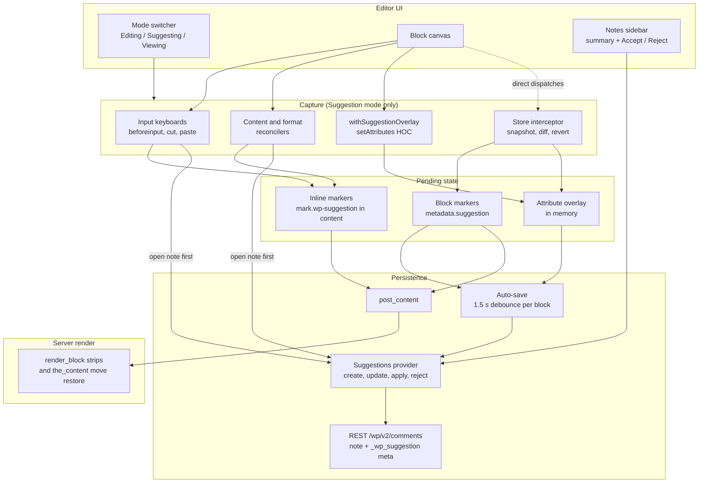
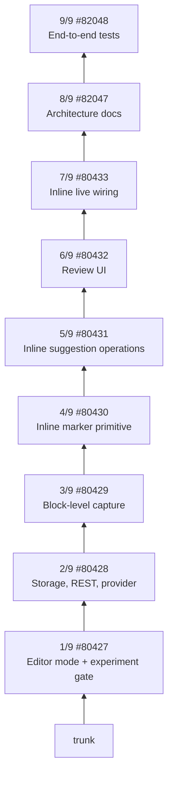
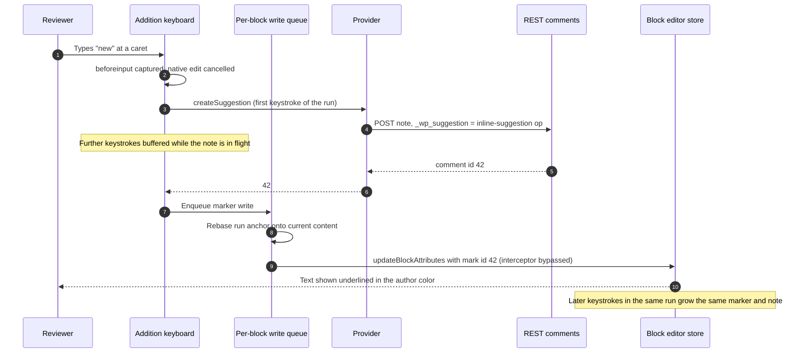
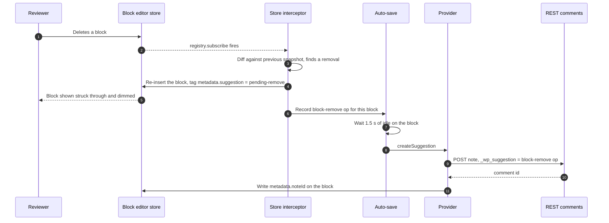
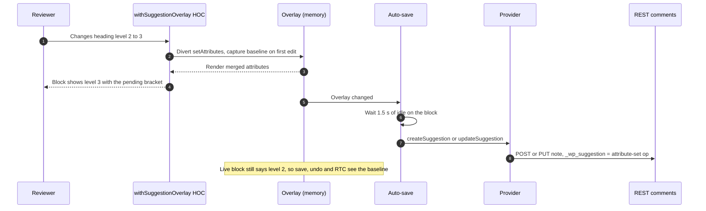
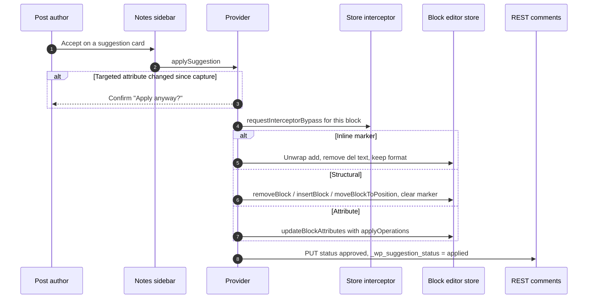
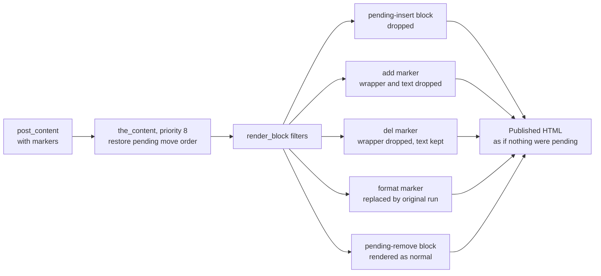

# Suggestion mode: Architecture Overview for Reviewers

This page is the map. It explains how Suggestion mode fits together across the whole nine-PR stack, which PR owns which part, and where the design is still moving. The detailed reference, with every module, payload field and known limitation, is [Suggestions Architecture](./suggestions.md).

Tracking issue: [#73411](https://github.com/WordPress/gutenberg/issues/73411). Try it: [Playground for the combined branch #78994](https://playground.wordpress.net/gutenberg.html?pr=78994).

## Short version

**A suggestion is a pending change that lives in the post content, linked to a Note that carries its review thread.** A reviewer switches the editor to **Suggesting** (Suggestion mode), edits normally, and every edit is captured as a suggestion instead of being applied. The post author **Accepts** or **Rejects** each one from the Notes sidebar.

**There are three kinds of suggestion, and today each uses a different capture and storage path.** That split is the most important thing to understand before reading the code.

| | Inline text and formatting | Structural (insert, remove, move) | Block attributes (alignment, heading level, color) |
| --- | --- | --- | --- |
| Example | Type, delete, paste, bold a word | Delete a block, add a block, drag a block | Change H2 to H3, align center |
| Captured by | `beforeinput` / `cut` / `paste` "keyboards", plus a content reconciler for IME, autocorrect and drag-drop | Store interceptor (`registry.subscribe` diff) | `setAttributes` HOC, plus the store interceptor for direct dispatches |
| Pending state lives in | A `<mark class="wp-suggestion">` in the block's content | `metadata.suggestion` marker on the block, saved in `post_content` | An in-memory overlay |
| Note payload | `inline-suggestion` op | `block-insert-after` / `block-remove` / `block-move` op | `attribute-set` op |
| Survives reload | Yes | Yes | The Note does; the in-canvas preview does not |
| Front end before accept | `add` text hidden, `del` text shown, `format` shows the original | Pending insert hidden, pending move shown in its original order | Unchanged, the live block was never touched |

**Glossary**

- **Mode** (the `editorIntent` in code): Editing, Suggesting or Viewing, as in Google Docs. A session-only editor state, separate from the visual/code editor mode. Reloading always returns to Editing.
- **Note**: a `note`-type comment (the Notes feature, GA in WordPress 6.9). A suggestion is a Note with a JSON payload in `_wp_suggestion` comment meta and a lifecycle in `_wp_suggestion_status`.
- **Marker**: the in-content record of a pending suggestion. Inline markers are rich-text formats. Block markers live in `metadata.suggestion`. Both carry the Note's comment id.
- **Overlay**: the in-memory store that holds attribute suggestions so they never touch the live block.
- **Interceptor**: a data-registry subscriber that catches store changes made outside a block's own `setAttributes`, reverts them, and turns them into suggestions.

## At a glance



Inline and structural markers are content, so they save with the post, sync over RTC and replay through undo like any other edit. Notes are created through the provider and linked back to the block through `metadata.noteId` and the marker's id.

## The PR stack

Nine PRs, each based on the one below it. Review bottom up, and comment on the PR that owns the code. If time is short, [#80429](https://github.com/WordPress/gutenberg/pull/80429) and [#80431](https://github.com/WordPress/gutenberg/pull/80431) hold most of the logic.



| Layer | PR | What it owns | Where to look |
| --- | --- | --- | --- |
| 1 | [#80427](https://github.com/WordPress/gutenberg/pull/80427) Editor mode (intent) | Session-scoped `editorIntent` in `core/editor` (private `setEditorIntent` / `getEditorIntent`), the Editing / Suggesting / Viewing switcher in the Options menu, Google Docs shortcuts (Shift+Alt+Cmd+Z/X/C), Viewing as read-only via `isPreviewMode`, the experiment gate `isSuggestionModeEnabled` / `useCanSuggest` | `editor/src/store/*`, `intent-switcher/`, `suggestion-mode/gate.ts` |
| 2 | [#80428](https://github.com/WordPress/gutenberg/pull/80428) Storage, REST, provider | `_wp_suggestion` and `_wp_suggestion_status` meta (64 KB cap, KSES on block snapshots), the 7.1 REST comment controller subclass, the provider (create, update, apply, reject, schema versioning), the overlay store, the auto-save loop. No capture yet | `lib/compat/wordpress-7.1/block-suggestions.php`, `suggestion-mode/provider.ts`, `overlay-context.tsx`, `auto-save.ts` |
| 3 | [#80429](https://github.com/WordPress/gutenberg/pull/80429) Block-level capture | Store interceptor (attribute drift and structural insert / remove / move, list indent and outdent), the `setAttributes` HOC, pending treatments and move ghosts, revert and undo guards, PHP structural strip and move-order restore | `suggestion-mode/store-interceptor.ts`, `with-suggestion-overlay.tsx`, `block-list/content-suggestion.scss` |
| 4 | [#80430](https://github.com/WordPress/gutenberg/pull/80430) Inline marker primitive | Format-agnostic rich-text utilities shared with Notes: wrap a range, find a marker by id (the only offset resolver), read caret and selection, reconcile after edits, decorate via annotations | `editor/src/components/inline-markers/` |
| 5 | [#80431](https://github.com/WordPress/gutenberg/pull/80431) Inline operations | Pure functions: the `core/suggestion` format, create / accept / reject for `add`, `del` and `format`, edit and format planners, word and line delete ranges, marker stripping | `editor/src/components/inline-suggestions/` |
| 6 | [#80432](https://github.com/WordPress/gutenberg/pull/80432) Review UI | Accept / Reject in the note header, the Docs-style summary ("Add: ...", "Delete: ...", "Change: heading level 2 to 3") with a bounded word diff | `collab-sidebar/suggestion-actions.tsx`, `suggestion-mode/suggestion-summary.tsx` |
| 7 | [#80433](https://github.com/WordPress/gutenberg/pull/80433) Inline live wiring | The addition, deletion and format keyboards, the content reconciler, author colors and marker reveal, Note garbage collection, post title suggestions, clipboard strip, refusals (post status, publish), List View labels, PHP inline strip, a `core-data` CRDT serializer fix | `suggestion-mode/suggestion-*-keyboard.ts`, `suggestion-content-reconciler.ts`, `suggestion-note-gc.ts` |
| 8 | [#82047](https://github.com/WordPress/gutenberg/pull/82047) Docs | This page and [suggestions.md](./suggestions.md) | `docs/explanations/architecture/` |
| 9 | [#82048](https://github.com/WordPress/gutenberg/pull/82048) E2E | 18 Playwright specs covering every path above, plus perf harness changes. No production code | `test/e2e/specs/editor/various/suggestion-mode*.spec.ts` |

Some files are deliberately split across layers: `with-suggestion-overlay.tsx` and `store-interceptor.ts` start in #80429 and gain inline hand-offs in #80433; `provider.ts` starts in #80428 and gains inline apply / reject in #80433; `block-suggestions.php` gains meta in #80428, the structural strip in #80429 and the inline strip in #80433.

About 30 focused fix PRs (F-01 to F-34, for example [#81661](https://github.com/WordPress/gutenberg/pull/81661), [#81669](https://github.com/WordPress/gutenberg/pull/81669), [#81656](https://github.com/WordPress/gutenberg/pull/81656)) were reviewed on their own and then folded into the layer that owns the code. They are listed in [#73411](https://github.com/WordPress/gutenberg/issues/73411).

## Data model

```mermaid
erDiagram
    POST ||--o{ BLOCK : "post_content"
    BLOCK ||--o{ INLINE_MARKER : "rich-text content"
    BLOCK ||--o| BLOCK_MARKER : "metadata.suggestion"
    BLOCK }o--o{ NOTE : "metadata.noteId"
    INLINE_MARKER }o--|| NOTE : "data-suggestion-id"
    BLOCK_MARKER }o--|| NOTE : "commentId"
    NOTE ||--|| PAYLOAD : "_wp_suggestion meta"

    INLINE_MARKER {
        string type "add, del, format"
        int suggestionId "note comment id"
        int author "user id"
    }
    BLOCK_MARKER {
        string type "pending-insert, pending-remove, pending-move"
        int commentId
        int authorId
        bool crossedParents
    }
    NOTE {
        string comment_type "note"
        string status "hold or approved"
        string suggestion_status "pending, applied, rejected"
    }
    PAYLOAD {
        int schemaVersion "2"
        string blockName
        array operations
    }
```



Three rules hold the model together:

1. **Offsets are never stored.** An inline marker is found by id on every read (`findMarkerRange`), so unrelated edits elsewhere in the block do not break it. This is also the planned swap point for Yjs attribution.
2. **Operations describe intent, not diffs.** A payload is a list of declarative ops (`attribute-set`, `block-insert-after`, `block-remove`, `block-move`, `inline-suggestion`, `post-attribute-set`). Accept replays them against the current block, and conflicts are checked per attribute.
3. **Two status axes.** The comment status (open or resolved discussion) and `_wp_suggestion_status` (pending, applied, rejected) are independent, so a decided suggestion can keep its thread open.

The inline marker serializes as:

```html
<mark class="wp-suggestion" data-suggestion-id="42" data-suggestion-type="add" data-author="7">new words</mark>
```

## Data flow: an inline text suggestion

Typing in Suggestion mode never lets the browser edit the text directly. The keyboard cancels the native input, opens a Note, then writes the marked text.



Deletes work the same way, wrapping the removed range in a `del` marker. Type-over produces one `replace` note with a `del` and an `add` run. Bold, italic and links produce one `format` marker whose Note records the original run as `beforeHTML`. Edits that arrive only as a new `content` value (IME commit, autocorrect, drag-drop) are diffed by the content reconciler into the same markers.

An edit that would overlap someone else's marker is declined with a notice rather than nesting markers.

## Data flow: a structural suggestion

Structural changes are caught after the fact, because they can come from many places (toolbar, keyboard, drag, List View, block switcher).



Inserts keep the new block in place and tag it `pending-insert`. Moves keep the block at its new position, tag it `pending-move` with from and to anchors, and draw a ghost at the origin. A list indent or outdent is captured as a move of the item, not as an insert plus a remove.

## Data flow: a block attribute suggestion



Changes that skip `setAttributes` (for example the block switcher's variation picker dispatching `updateBlockAttributes` directly) are caught by the interceptor, reverted, and routed into the same overlay.

## Review: accept and reject



Reject is the mirror image: drop an `add` with its text, unwrap a `del`, restore a `format` run from `beforeHTML`, undo a pending insert or move, or just clear a `pending-remove` marker. Decisions are kept out of undo history (`history: 'ignore'`).

## Persistence and the front end

Because inline and structural markers are saved in `post_content`, the server must keep pending suggestions off the published page. It does that at render time, so the stored content and REST `raw` keep the markers for the editor.



All of this lives in `lib/compat/wordpress-7.1/block-suggestions.php`. Permissions are core's: any user who can `edit_post` on the parent can resolve a Note. The REST controller subclass only adds payload validation (413 for oversize, 400 for invalid JSON) and allows empty note content.

## Collaboration and undo

- **RTC.** Inline and structural markers sync as ordinary content. When one peer accepts an attribute suggestion, the other peer's interceptor would see that change as drift and revert it. `isAcceptedSuggestionChange` checks the linked Notes' payloads and adopts the change instead. Locally, `requestInterceptorBypass` does the same for the accepting peer.
- **Undo.** Undoing a suggestion edit removes its marker. `SuggestionNoteGC` notices the anchor is gone and trashes the Note, and restores it on redo. Notes with replies are spared. `suggestion-undo-guard.ts` handles adoption so undo and redo do not get captured as fresh suggestions.
- **Concurrency.** Each block has a serial write queue, so the format keyboard and content reconciler cannot interleave their note-then-marker writes. A run whose surrounding text changed during the Note request is abandoned and its Note trashed.

## In-flight changes

An architecture review on 2026-10-04 found the data model sound and the cost concentrated in the mechanism. Two changes from it are under way and will land in the owning layers:

- **A2: attribute suggestions as content markers.** Approved design. The overlay stops being a persistence model. A new `pending-attributes` marker type stores the proposed values in `metadata.suggestion.after`, so attribute suggestions survive reload, sync over RTC and undo like the other two kinds. The table at the top becomes one column wide for storage. No schema, REST or PHP change. Visible change: the proposed value shows in Editing and Viewing modes too.
- **A5: a real storage boundary.** `provider.ts` splits into a `SuggestionStore` (create, update, trash a Note, set its status: the swap point for a Yjs backend), a submission hook and a decision hook, with the pure operations in `operations/`.

Other review findings are recorded but not scheduled:

- **A1.** The interceptor is effectively a second reducer outside the store. A private block-editor action interceptor would be cleaner.
- **A3.** Marker ids are server comment ids, so the first keystroke waits on a REST round trip. Client-generated ids would remove the buffering.
- **A4.** Input is captured at the DOM `beforeinput` level. A private `transformChange` hook on `useRichText` would sit at the right altitude, and depends on A3.

## Questions for reviewers

1. Is the three-kind split (inline markers, block markers, overlay) the right shape, and is A2 the right way to collapse it to two?
2. Is a data-registry subscriber the right capture point for structural changes, or should block-editor grow a private action-interceptor API (A1)?
3. Should the marker id stay the server comment id, or move to a client-generated id that the Note adopts (A3)?
4. Is it acceptable that pending `add` text is visible in `post_content` and REST `raw` to anyone who can read raw content?
5. Should suggestions be tied to a post revision?
6. Should the `core-data` CRDT serializer fix and the perf harness change land on trunk ahead of the stack?
7. `block-suggestions.php` targets `lib/compat/wordpress-7.1/`. Which release should it target now?

## Further reading

- [Suggestions Architecture](./suggestions.md): the full reference (module tables, payload schema, every known limitation).
- [#73411](https://github.com/WordPress/gutenberg/issues/73411): tracking issue, testing walkthrough and fix PR list.
- [#78994](https://github.com/WordPress/gutenberg/pull/78994): combined branch for Playground testing.
- [#77005](https://github.com/WordPress/gutenberg/pull/77005): Yjs v14 and `AttributionManager`, the future storage backend.
- [#78218](https://github.com/WordPress/gutenberg/pull/78218): the Notes inline anchor the marker primitive grew from.
