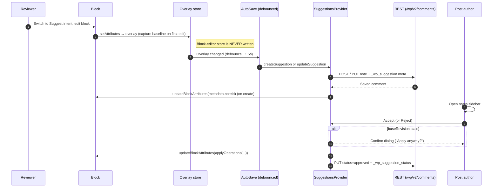

# Suggestions Architecture

## Overview

Suggestions extend the Notes feature (block-level comments) to support proposed content changes. A reviewer switches to **Suggest** intent and edits a block; the change is captured as a versioned suggestion payload on a note comment, auto-saved in the background after a short idle window. The post author then **Accepts** (merges the change) or **Rejects** (dismisses it) from the notes sidebar.

The feature is designed around a swappable provider interface so the storage backend can evolve from comment-meta (v1, current) to Yjs `AttributionManager` (v2, future) without changing the UI or accept/reject logic.

## End-to-end lifecycle



## Editor Intent

An `editorIntent` preference (orthogonal to the visual/code `editorMode`) controls the editing purpose:

| Intent    | Behaviour |
|-----------|-----------|
| `edit`    | Default — direct editing. |
| `suggest` | Edits are diverted into an in-memory overlay; the block-editor store is never mutated. |
| `view`    | Read-only preview via `isPreviewMode`. |

The intent is stored in the preferences store under `core.editorIntent` and surfaced as an **Edit / Suggest / View** menu in the editor's "Options" kebab, gated behind the `editor.notes` post-type support flag.

## Suggestion Overlay

When the intent is `suggest`, an `editor.BlockEdit` filter (`withSuggestionOverlay`) wraps every block's `Edit` component:

1. **Baseline capture** — on the first `setAttributes` call, the block's current attributes are snapshotted.
2. **Diversion** — `setAttributes` writes to a React-context-backed overlay (`SuggestionOverlayProvider`) keyed by `clientId`, not the block-editor store.
3. **Merge for render** — the block receives `{ ...realAttributes, ...overlayAttributes }` so the user sees their in-progress change live.

A companion `editor.BlockListBlock` filter tags each block that has a pending overlay with an `is-suggestion-pending` class, which renders the green bracket/outline treatment so edited blocks are discoverable without relying on the selected-block toolbar.

Because the store is never touched, autosave, undo/redo, and RTC sync stay at the real baseline.

### Auto-save

There is no manual "Submit" step — `SuggestionAutoSave` watches the overlay and, after ~1.5 s of idle time on a given block, persists the current operations as a note comment. The overlay entry tracks the resulting `commentId` and a fingerprint of the last synced operations, so subsequent edits update the same note rather than creating new ones. If an edit is undone back to baseline the auto-saver trashes the note instead.

### Store interceptor

The HOC only catches edits that flow through a block's own `setAttributes` prop. Some Gutenberg paths bypass the prop chain and dispatch `updateBlockAttributes` directly to the block-editor store — most notably the block-switcher's variation picker (e.g. swapping a heading from H2 → H3). Those mutations would otherwise land in the post unchanged, defeating Suggest mode.

`SuggestionStoreInterceptor` is a companion subscriber that closes that gap:

1. On Suggest activation it snapshots every block's attributes.
2. It subscribes to the data registry. On every store update it diffs the live attributes against the snapshot.
3. For drift on a tracked block it routes the changed attributes into the overlay and dispatches a revert that restores the snapshot. An `isReverting` flag suppresses the recursive subscribe fire that the revert itself triggers.
4. New blocks (no snapshot entry) are tracked but not intercepted — inserting a block in Suggest mode is currently a real edit, not a suggestion.
5. System-managed metadata (`metadata.noteId` written by the suggestion provider after creating a note comment) is folded into the snapshot before diffing so it's invisible to the diff and never leaks into the user-pending overlay.

The interceptor uses `registry.subscribe` rather than a React `useSelect` because (a) it must run synchronously after each dispatch, before any re-render serializes the now-wrong state, and (b) `subscribe` also catches dispatches from non-React paths.

### Apply-time bypass and the collaborative round-trip

Apply is a deliberate exception to the "store is never written" rule: when the post author clicks **Apply**, the merged attributes do need to land on the live block. The provider opts the next dispatch out of interception via `requestInterceptorBypass(clientId)` — without it, the interceptor would treat the apply as a new user edit and revert it back into the overlay, producing a frustrating feedback loop.

In real-time collaboration the same scenario plays out across peers. When peer A clicks Apply, the dispatched attribute change syncs to peer B (the original suggester). Peer B's interceptor sees a delta from its own snapshot and would revert it, which would then sync back to peer A and undo the apply on their screen. To prevent this the interceptor calls `isAcceptedSuggestionChange()`: for each note linked to the block via `metadata.noteId`, it consults the suggestion payload and checks whether every changed attribute lands on a payload's `after` value. If so, the interceptor adopts the new attributes as its baseline rather than reverting.

The two halves are complementary — `requestInterceptorBypass` covers the local apply, `isAcceptedSuggestionChange` covers the synced apply on the other peer.

### Implementation files

The Suggest-mode subsystem lives in `packages/editor/src/components/suggestion-mode/`:

| File | Role |
|------|------|
| `overlay-context.js`        | `SuggestionOverlayProvider`, `useSuggestionOverlay`. The in-memory overlay store and bypass refs. |
| `with-suggestion-overlay.js`| `editor.BlockEdit` HOC that diverts `setAttributes` into the overlay. |
| `store-interceptor.js`      | Snapshot/diff/revert subscriber for store-level mutations; multi-peer accept logic. |
| `provider.js`               | `useSuggestionsProvider` — the `createSuggestion` / `applySuggestion` / `rejectSuggestion` API. Owns `operationsFromOverlay`, `applyOperations`, `parseSuggestionPayload`, and the wrapper-aware equality check. |
| `suggestion-diff.js`        | Inline diff preview rendered in a comment thread (word-level for text attributes, label fallback otherwise). |
| `suggestion-summary.js`     | Compact sidebar summary ("Add: …", "Delete: …", "Format: …") used in collapsed thread lists. |
| `auto-save.js`              | Debounced background persistence of pending overlays as note comments (replaces the explicit "Submit" affordance from earlier phases). |

REST/PHP surface lives in `lib/compat/wordpress-6.9/`:

| File | Role |
|------|------|
| `block-comments.php`                              | Registers the `_wp_note_status`, `_wp_suggestion`, and `_wp_suggestion_status` comment meta and adds `editor.notes` post-type support. |
| `class-gutenberg-rest-comment-controller-6-9.php` | REST controller subclass remapping permissions for `note`-type comments (post editors get `edit_post`-based access; updates are gated by an allowlist of suggestion-lifecycle fields). |

## Suggestion Payload (v1)

Stored as a JSON string in the `_wp_suggestion` comment meta on a `note` comment:

```json
{
  "schemaVersion": 1,
  "blockName": "core/paragraph",
  "baseRevision": "2026-04-15T12:34:56",
  "operations": [
    {
      "type": "attribute-set",
      "attribute": "content",
      "before": "Hello world",
      "after": "Hello beautiful world"
    }
  ]
}
```

| Field | Purpose |
|-------|---------|
| `schemaVersion` | Allows future schema evolution without breaking old payloads. |
| `blockName` | Safety check — apply is refused if the block type has changed. |
| `baseRevision` | `post_modified_gmt` at capture time. A mismatch at apply time triggers a staleness warning. |
| `operations` | Declarative transforms on the block tree. Currently only `attribute-set`; designed to extend to `block-insert-after`, `block-remove` in the future. |

Operations are **declarative transforms**, not HTML diffs. This makes them compatible with Yjs attribution semantics and resilient to concurrent edits on unrelated attributes.

### Schema versioning

`schemaVersion` is incremented whenever the payload shape changes. Consumers apply the following rule:

| Parsed version vs. consumer's known version | Behavior |
|---|---|
| `parsed < known` | Migrate the payload forward to the current shape before applying. Migrations are additive: missing fields are filled with defaults. |
| `parsed === known` | Apply normally. |
| `parsed > known` | Refuse to apply — show a "this suggestion was made by a newer editor" notice and offer only Reject. |

When bumping the version, add a migration step in `parseSuggestionPayload` that lifts `parsed.schemaVersion < SCHEMA_VERSION` payloads into the current shape. Ship the bump and the migration in the same PR; do not read unknown future payloads.

## Provider Interface

```
useSuggestionsProvider() → {
  createSuggestion({ clientId, blockName, operations })  → Promise<comment>
  updateSuggestion({ commentId, blockName, operations }) → Promise<comment>
  deleteSuggestion({ commentId })                        → Promise<void>
  applySuggestion({ commentId, clientId, payload })      → Promise<void>
  rejectSuggestion({ commentId })                        → Promise<void>
}
```

The current implementation (`provider.js`) uses comment meta. A future Yjs-backed implementation would read from `AttributionManager` and write changes through the CRDT document, exposing the same methods.

## Accept / Reject

- **Accept**: runs `applyOperations(currentAttributes, payload.operations)` to produce new attributes, dispatches `updateBlockAttributes`, marks the note as resolved with `_wp_suggestion_status = 'applied'`.
- **Reject**: marks the note as resolved with `_wp_suggestion_status = 'rejected'`. No content change.
- **Conflict detection**: accept-time staleness is checked at the attribute level, not the post level. `hasAttributeConflict(currentAttributes, operations)` compares each operation's captured `before` to the block's current value; only a real divergence on a targeted attribute prompts the "apply anyway" confirmation. Post-level `baseRevision` is still stamped into the payload for provenance, but does not drive the prompt — every auto-save bumps `post_modified_gmt`, so a post-level compare would flag nearly every suggestion as stale.

## Review UI

In the notes sidebar, a suggestion thread renders:

- **`SuggestionSummary`** — a Docs-style "Add: …", "Delete: …", "Format: …" summary derived from the operations.
- **Accept / Reject icon buttons** — checkmark and close icons that trigger the provider's apply/reject flows.
- **`SuggestionDiff`** (still available) — the full word-level diff preview for when a more detailed view is needed.

## Yjs v2 Migration Path

When PR [#77005](https://github.com/WordPress/gutenberg/pull/77005) (Yjs v14 / `AttributionManager`) stabilizes:

1. Create `yjs-provider.js` implementing the same `useSuggestionsProvider` interface.
2. `createSuggestion` → write attributed changes to the Yjs doc instead of comment meta.
3. `applySuggestion` / `rejectSuggestion` → accept/reject attributed changes in the Yjs doc, then persist the resolution to comment meta for non-RTC users.
4. The overlay and diff UI remain unchanged — they consume operations, not storage details.

Server-side persistence (comment meta) is still needed for users without RTC, so the comment-meta provider won't be fully retired — it becomes the fallback for non-collaborative sessions.

## Implementation wrinkles worth knowing

These are non-obvious quirks reviewers should keep in mind when reading the code:

- **RichTextData / wrapper-vs-primitive comparison**: text-valued block attributes (notably `core/paragraph`'s `content`) are wrapped in `RichTextData` objects whose payload sits in private class fields. Plain `Object.keys()` reflection returns empty arrays for these wrappers, so a deep structural comparison would consider every wrapper "different from itself" after a JSON round-trip. The provider's `isAttributeEqual` and the interceptor's `shallowAttributeEquals` detect the wrapper-vs-primitive case and fall back to `String(a) === String(b)`. Without this, every suggestion would be flagged stale or trigger an apparent attribute conflict on apply.
- **`DEEP_MERGE_KEYS` (object-valued attributes)**: `setAttributes({ style: { color: 'red' } })` semantically replaces the whole `style` object on the live block. The overlay HOC instead does a one-level-deep merge for keys in `DEEP_MERGE_KEYS` (`style`, `metadata`) so that editing `style.color` preserves untouched fields like `style.fontSize`. Other attribute types are replaced wholesale, matching core `setAttributes` semantics. Add a key to `DEEP_MERGE_KEYS` only when the attribute is reliably a flat object.
- **Comment status vs. suggestion status**: a note comment's WP status (`hold` / `approved`) tracks whether the discussion is open or resolved. `_wp_suggestion_status` (`pending` / `applied` / `rejected`) is a parallel axis tracking the suggestion lifecycle. The two are independent: a resolved suggestion can leave its comment thread open for follow-up discussion.
- **Payload size limit**: both the client (`PAYLOAD_MAX_BYTES` in `provider.js`) and the server (`GUTENBERG_SUGGESTION_PAYLOAD_MAX_BYTES` in `block-comments.php`) cap payloads at 64 KB. The client check rejects oversized payloads before they leave the browser; the REST controller is the authoritative gate. The meta `sanitize_callback` rejects (rather than truncates) oversized values because mid-string truncation produces invalid JSON that `parseSuggestionPayload` would silently drop.

## Known Limitations

- **Structural suggestions** (block insert, remove, move) are not yet supported. The `operations` array is designed to accept `block-insert-after` and `block-remove` types in the future.
- **Inline text selections** are not anchored — suggestions apply to the entire attribute, not a sub-range. Fragment-level suggestions depend on inline annotation infrastructure tracked separately.
- **Permissions**: the Gutenberg REST comment controller overrides `update_item_permissions_check` so users with `edit_post` on the parent can update note comments — **but only for suggestion-lifecycle fields** (`status` limited to `approved`/`hold`, plus `meta._wp_suggestion_status`). Any other field in the update body falls back to core's `edit_comment` check, preventing post editors from rewriting another user's note content. The `_wp_suggestion` and `_wp_suggestion_status` meta `auth_callback`s follow the same `edit_post`-on-parent pattern.
- **Payload size**: `_wp_suggestion` meta is capped at 64 KB via a `sanitize_callback`. Requests exceeding that limit are truncated to prevent arbitrarily large JSON blobs from flooding comment meta storage.
- **Rich-text format fidelity**: the word-level diff operates on the serialized HTML string, which may produce noisy diffs when formatting (bold, links) changes. Progressive enhancement planned.
