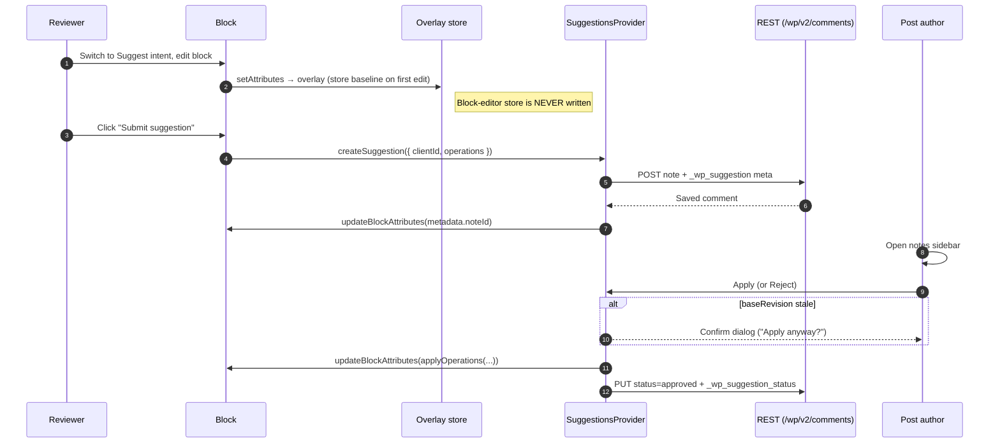

# Suggestions Architecture

## Overview

Suggestions extend the Notes feature (block-level comments) to support proposed content changes. A reviewer switches to **Suggest** intent, edits a block, and the change is captured as a versioned suggestion payload stored on a note comment. The post author can then **Apply** (merge the change) or **Reject** (dismiss it) from the notes sidebar.

The feature is designed around a swappable provider interface so the storage backend can evolve from comment-meta (v1, current) to Yjs `AttributionManager` (v2, future) without changing the UI or apply/reject logic.

## End-to-end lifecycle



## Editor Intent

An `editorIntent` preference (orthogonal to the visual/code `editorMode`) controls the editing purpose:

| Intent    | Behaviour |
|-----------|-----------|
| `edit`    | Default — direct editing. |
| `suggest` | Edits are diverted into an in-memory overlay; the block-editor store is never mutated. |
| `view`    | Read-only preview via `isPreviewMode`. |

The intent is stored in the preferences store under `core.editorIntent` and surfaced as an **Edit / Suggest / View** menu in the editor's "Options" kebab, gated behind the `editor.notes` post-type support flag.

## Suggestion Overlay

When the intent is `suggest`, an `editor.BlockEdit` filter (`withSuggestionOverlay`) wraps every block's `Edit` component:

1. **Baseline capture** — on the first `setAttributes` call, the block's current attributes are snapshotted.
2. **Diversion** — `setAttributes` writes to a React-context-backed overlay (`SuggestionOverlayProvider`) keyed by `clientId`, not the block-editor store.
3. **Merge for render** — the block receives `{ ...realAttributes, ...overlayAttributes }` so the user sees their in-progress change live.

Because the store is never touched, autosave, undo/redo, and RTC sync stay at the real baseline. On commit, the overlay is serialized into a suggestion payload and sent to the server as comment meta; on discard, the overlay is cleared.

## Suggestion Payload (v1)

Stored as a JSON string in the `_wp_suggestion` comment meta on a `note` comment:

```json
{
  "schemaVersion": 1,
  "blockName": "core/paragraph",
  "baseRevision": "2026-04-15T12:34:56",
  "operations": [
    {
      "type": "attribute-set",
      "attribute": "content",
      "before": "Hello world",
      "after": "Hello beautiful world"
    }
  ]
}
```

| Field | Purpose |
|-------|---------|
| `schemaVersion` | Allows future schema evolution without breaking old payloads. |
| `blockName` | Safety check — apply is refused if the block type has changed. |
| `baseRevision` | `post_modified_gmt` at capture time. A mismatch at apply time triggers a staleness warning. |
| `operations` | Declarative transforms on the block tree. Currently only `attribute-set`; designed to extend to `block-insert-after`, `block-remove` in the future. |

Operations are **declarative transforms**, not HTML diffs. This makes them compatible with Yjs attribution semantics and resilient to concurrent edits on unrelated attributes.

### Schema versioning

`schemaVersion` is incremented whenever the payload shape changes. Consumers apply the following rule:

| Parsed version vs. consumer's known version | Behavior |
|---|---|
| `parsed < known` | Migrate the payload forward to the current shape before applying. Migrations are additive: missing fields are filled with defaults. |
| `parsed === known` | Apply normally. |
| `parsed > known` | Refuse to apply — show a "this suggestion was made by a newer editor" notice and offer only Reject. |

When bumping the version, add a migration step in `parseSuggestionPayload` that lifts `parsed.schemaVersion < SCHEMA_VERSION` payloads into the current shape. Ship the bump and the migration in the same PR; do not read unknown future payloads.

## Provider Interface

```
useSuggestionsProvider() → {
  createSuggestion({ clientId, blockName, operations }) → Promise<comment>
  applySuggestion({ commentId, clientId, payload })     → Promise<void>
  rejectSuggestion({ commentId })                       → Promise<void>
}
```

The current implementation (`provider.js`) uses comment meta. A future Yjs-backed implementation would read from `AttributionManager` and write changes through the CRDT document, exposing the same three methods.

## Apply / Reject

- **Apply**: runs `applyOperations(currentAttributes, payload.operations)` to produce new attributes, dispatches `updateBlockAttributes`, marks the note as resolved with `_wp_suggestion_status = 'applied'`.
- **Reject**: marks the note as resolved with `_wp_suggestion_status = 'rejected'`. No content change.
- **Staleness**: if `baseRevision` differs from the current `post_modified_gmt`, a warning snackbar is shown but apply is not blocked (conservative approach — the user reviews and decides).

## Diff Preview

The `SuggestionDiff` component renders operations in the notes sidebar:
- **Text attributes**: word-level LCS diff with green underlined insertions and red strikethrough deletions.
- **Non-text attributes**: `attribute: before → after` label.

## Yjs v2 Migration Path

When PR [#77005](https://github.com/WordPress/gutenberg/pull/77005) (Yjs v14 / `AttributionManager`) stabilizes:

1. Create `yjs-provider.js` implementing the same `useSuggestionsProvider` interface.
2. `createSuggestion` → write attributed changes to the Yjs doc instead of comment meta.
3. `applySuggestion` / `rejectSuggestion` → accept/reject attributed changes in the Yjs doc, then persist the resolution to comment meta for non-RTC users.
4. The overlay and diff UI remain unchanged — they consume operations, not storage details.

Server-side persistence (comment meta) is still needed for users without RTC, so the comment-meta provider won't be fully retired — it becomes the fallback for non-collaborative sessions.

## Known Limitations

- **Structural suggestions** (block insert, remove, move) are not yet supported. The `operations` array is designed to accept `block-insert-after` and `block-remove` types in the future.
- **Inline text selections** are not anchored — suggestions apply to the entire attribute, not a sub-range. Fragment-level suggestions depend on inline annotation infrastructure tracked separately.
- **Permissions**: the Gutenberg REST comment controller overrides `update_item_permissions_check` so users with `edit_post` on the parent can update note comments (and their suggestion meta). This lets post editors apply or reject suggestions authored by other users. The `_wp_suggestion` and `_wp_suggestion_status` meta `auth_callback`s follow the same pattern.
- **Rich-text format fidelity**: the word-level diff operates on the serialized HTML string, which may produce noisy diffs when formatting (bold, links) changes. Progressive enhancement planned.
