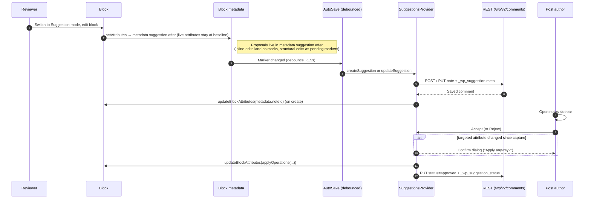

# Suggestions Architecture

## Overview

Suggestions extend the Notes feature (block-level comments) to support proposed content changes. A reviewer switches the editor to **Suggesting** (Suggestion mode) and edits the content; each change is captured as a suggestion linked to a note comment, and the post author then **Accepts** (merges the change) or **Rejects** (dismisses it) from the notes sidebar.

There are two complementary mechanisms, by change type:

- **Inline text and formatting changes** (typing, deleting, type-over, paste, bold/italic/link toggles, and the residual `onChange` seams — IME commits, autocorrect, drag-drop) live as anchored `core/suggestion` `<mark>` markers **in block content** (Option B), re-resolved on read — edit-resilient and per-author. See [Inline suggestion markers](#inline-suggestion-markers).
- **Non-text attribute changes** (alignment, heading level, color) and **structural changes** (insert / remove / move blocks) are recorded on the block's `metadata.suggestion` **marker** in `post_content` (a `pending-attributes` marker carries the proposed values in `after`; structural markers tag what happened to the block) and captured as versioned operation payloads on a note comment, auto-saved in the background after a short idle window. Nothing pending lives only in memory except the post title.

The feature is designed around a swappable provider interface so the storage backend can evolve from comment-meta (today) to Yjs `AttributionManager` (future) without changing the UI or accept/reject logic.

## End-to-end lifecycle


```mermaid
sequenceDiagram
    autonumber
    participant U as Reviewer
    participant B as Block
    participant M as Block metadata
    participant AS as AutoSave (debounced)
    participant P as SuggestionsProvider
    participant R as REST (/wp/v2/comments)
    participant A as Post author

    U->>B: Switch to Suggestion mode, edit block
    B->>M: setAttributes → metadata.suggestion.after (live attributes stay at baseline)
    Note right of M: Proposals live in metadata.suggestion.after<br/>(inline edits land as marks, structural edits as pending markers)
    M->>AS: Marker changed (debounce ~1.5s)
    AS->>P: createSuggestion or updateSuggestion
    P->>R: POST / PUT note + _wp_suggestion meta
    R-->>P: Saved comment
    P->>B: updateBlockAttributes(metadata.noteId) (on create)

    A->>A: Open notes sidebar
    A->>P: Accept (or Reject)
    alt targeted attribute changed since capture
        P-->>A: Confirm dialog ("Apply anyway?")
    end
    P->>B: updateBlockAttributes(applyOperations(...))
    P->>R: PUT status=approved + _wp_suggestion_status
```

## Editor Intent

A session-scoped `editorIntent` state (orthogonal to the visual/code `editorMode` preference) controls the editing purpose:

| Intent    | Behaviour |
|-----------|-----------|
| `edit`    | Default — direct editing. |
| `suggest` | Attribute edits are written as a proposal on the block's `metadata.suggestion` marker and never change the live attributes; inline text and structural edits are written as pending markers too (see below). |
| `view`    | Read-only: the canvas is a preview via `isPreviewMode`, and `editPost` refuses post-level field changes (excerpt, author, slug and so on). |

The intent lives in the `core/editor` store's reducer (not the preferences store), so reloading the editor always returns to `edit`. It is surfaced as an **Editing / Suggesting / Viewing** menu (the Google Docs names) in the editor's "Options" kebab, gated behind the `editor.notes` post-type support flag; the `setEditorIntent` / `getEditorIntent` store APIs are private while Suggestion mode is experimental.

## Pending attribute markers

When the intent is `suggest`, an `editor.BlockEdit` filter (`withSuggestionOverlay`) wraps every block's `Edit` component:

1. **Proposal** - `setAttributes` writes the changed values into the block's `metadata.suggestion.after` (a `pending-attributes` marker, or the `after` of a structural marker the block already carries) as a normal persistent change, through the block-editor store. Keys whose value equals the live value are dropped; a marker left proposing nothing is removed.
2. **Baseline untouched** - the live attributes never change. The marker is JSON in `post_content`, so the proposal survives a reload, syncs to peers, and sits on the undo stack: Ctrl+Z withdraws it and the note collector trashes its note. The front end renders the baseline with no PHP involvement, since `metadata` never reaches front-end markup.
3. **Merge for render** - in every intent, a block with a proposal receives `{ ...liveAttributes, ...after }` so the suggester, the author and reviewers all see what is proposed, exactly as they see a pending removal or an inline mark.

Attribute proposals are persistent changes to the block's metadata, so undo withdraws them and the note collector trashes their note; the live attributes stay at the baseline until Apply.

A companion `editor.BlockListBlock` filter tags each block with a pending change so it is discoverable without relying on the selected-block toolbar. A proposal gets an `is-suggestion-pending` class (the bracket/outline treatment); pending structural changes get `is-suggestion-pending-remove` (strikethrough/dim), `is-suggestion-pending-insert`, or `is-suggestion-pending-move`, mapped from the block's `metadata.suggestion` marker. When the suggester's user id is known, `getAvatarBorderColor` resolves their avatar color and it rides on the block wrapper as an inline `style="--suggestion-author-color: …"`, so two suggesters' pending treatments are distinguishable at a glance.

For **attribute suggestions** the store is never touched, so autosave, undo/redo, and RTC sync stay at the real baseline. **Structural suggestions** are different: their pending state (the `metadata.suggestion` markers, and pending-insert blocks themselves) lives in the real block tree and **saves into `post_content`** — the structural counterpart of inline markers living in content. That persistence is what lets a pending move/remove/insert (and its `metadata.noteId` linkage) survive a reload instead of orphaning its note. The front end is protected at render time, not save time: `gutenberg_strip_pending_structural_suggestions` (a `render_block` filter) drops `pending-insert` blocks from public output, mirroring how `add` markers are stripped; `pending-remove` blocks render normally (their content is real until the removal is accepted).

### Inline text and formatting changes (Option B: marks in content)

Inline **text** changes — typing, deleting (character, word, or line), type-over, cut, and single-line paste — do **not** become attribute proposals. They live as marked text directly in block content (Option B), anchored to the #78218 inline-`<mark>` marker primitive. This is the edit-resilient model Riad asked for ([#73411](https://github.com/WordPress/gutenberg/issues/73411)): a suggestion is "this anchored range is proposed for deletion / this inserted run is proposed for addition", re-resolved against current content on read, rather than a whole-attribute before/after snapshot. It also makes concurrent per-author inline suggestions on one block work for free, dissolving [#79220](https://github.com/WordPress/gutenberg/issues/79220).

Inline **formatting** changes (bold / italic / link toggled over a run, the text unchanged) are markers too: the reformatted run is wrapped in a single `format`-type marker carrying the *proposed* formatting — the Google Docs model, the text shown once and never duplicated into a paired del/ins diff. The `withSuggestionOverlay` HOC's `setAttributes` seam detects the format-only diff (`planFormatMarkers`) and hands it to the singleton `SuggestionFormatKeyboard`, which opens the note (recording the original run as `beforeHTML` so a reject can restore it) and writes the marker.

Text edits that reach a block as a whole new `content` value with no interceptable input event — a committed IME composition, autocorrect (`insertReplacementText`), drag-drop — are diffed into markers by the singleton content reconciler (`SuggestionContentReconciler`): the HOC plans the edit against the previous value (`planEditMarkers`) and, when every planned action opens a fresh note, the reconciler executes it. Both singletons serialize their note-then-marker writes per block through a shared write queue and re-validate the live content around the async note POST, abandoning (and trashing the note of) a plan the content has moved past.

See [Inline suggestion markers](#inline-suggestion-markers) below for the full model. The proposal path described in this section handles what's left: **non-text attribute** suggestions (alignment, heading level, color) and inline edits the marker planners decline (an edit straddling an existing marker, a format toggle overlapping one). Values written into a proposal are stripped of live `core/suggestion` markers first (`stripSuggestionMarkers`) and stored JSON-safe (a `RichTextData` as its string), so accepting an attribute suggestion later can never replay (and resurrect) a marker whose suggestion was resolved in the interim. A proposal never renders inline content diffs: the old `<del>`/`<ins>` preview and its display-only format types are gone.

### Auto-save

There is no manual "Submit" step: `SuggestionAutoSave` watches the blocks that carry a `metadata.suggestion` marker and, after ~1.5 s of idle time on a given block, persists the operations derived from the marker and the live tree as a note comment (`operationsFromMarker` for the proposal, the interceptor's recorded capture or `structuralOpFromMarker` for the structural op). The note id is written back onto the marker as `commentId`, and the hook keeps a fingerprint of the last synced operations per block, so subsequent edits update the same note rather than creating new ones. A marker left proposing nothing trashes the note; a marker that disappears is the note collector's business. Ids read from content are only hints: auto-save updates or trashes a note on their account only when core-data shows it as a pending note on this post.

### Store interceptor

The HOC only catches edits that flow through a block's own `setAttributes` prop. Some Gutenberg paths bypass the prop chain and dispatch `updateBlockAttributes` directly to the block-editor store — most notably the block-switcher's variation picker (e.g. swapping a heading from H2 → H3). Those mutations would otherwise land in the post unchanged, defeating Suggestion mode.

`SuggestionStoreInterceptor` is a companion subscriber that closes that gap:

1. On Suggest activation it snapshots every block's attributes.
2. It subscribes to the data registry. On every store update it diffs the live attributes against the snapshot.
3. For drift on a tracked block it writes the changed attributes into the block's marker proposal (`metadata.suggestion.after`) and dispatches a revert that restores the snapshot. A reentrancy gate (`isDispatchingOwnWrite`) suppresses the synchronous subscribe fire the revert itself triggers, while per-revert identity tokens (`createRevertGuard`, in `attribute-suggestions/revert-guard.ts`) recognize revert echoes that arrive later — a batched or deferred dispatch — by matching the exact restored values instead of swallowing everything inside a time window.
4. Structural mutations (a block inserted, removed, or moved) are captured too — see [Structural suggestions](#structural-suggestions) below.
5. System-managed metadata (`metadata.noteId` written by the suggestion provider after creating a note comment) is folded into the snapshot before diffing so it's invisible to the diff and never leaks into a proposal.

The interceptor uses `registry.subscribe` rather than a React `useSelect` because (a) it must run synchronously after each dispatch, before any re-render serializes the now-wrong state, and (b) `subscribe` also catches dispatches from non-React paths.

### Structural suggestions

Inserting, removing, and moving blocks are captured as suggestions, not applied to the post. The interceptor follows the same "keep the store at baseline" principle as attribute edits — it **reverts the structural mutation and tags the block** with a `metadata.suggestion` marker, so the canvas keeps showing blocks at their baseline positions with a pending treatment until the change is accepted or rejected:

| User action | Interceptor response | Persisted op | Reject undoes by |
|-------------|----------------------|--------------|------------------|
| Delete a block | Re-inserts the subtree from the previous-tick snapshot at its prior parent + index, tags it `pending-remove`. A block with a pending move goes back to the move's origin first: the removal replaces the move | `block-remove` (carries the serialized `block`) | clearing the marker (the block stays) |
| Insert a block | Leaves the new block in place, tags it `pending-insert` (it has no baseline to revert to) | `block-insert-after` (with `anchorClientId` / `parentClientId`) | dispatching `removeBlock` |
| Move a block | Leaves it at the proposed position, tags it `pending-move` with the from/to anchors, and renders a non-interactive ghost at the origin | `block-move` (`from*` / `to*` anchor + index fields) | dispatching `moveBlockToPosition` back |
| Change an attribute | Writes the proposal to the block's marker (`pending-attributes`, or `after` on an existing structural marker) | `attribute-set` (rides along after any structural op) | clearing the proposal |

The marker's shape:

```ts
interface SuggestionMarker {
	type: 'pending-attributes' | 'pending-remove' | 'pending-insert' | 'pending-move';
	/** Proposed attribute values. JSON-safe; permitted on every type. */
	after?: Record< string, unknown >;
	/** Filled by auto-save once the note exists. */
	commentId?: number;
	authorId?: number | null;
	groupId?: string;
	crossedParents?: boolean;
	// pending-move: fromAnchorClientId, fromParentClientId, fromIndex, fromParentBlock
}
```

`after` never contains `metadata.suggestion` or `metadata.noteId`. A marker whose `after` is not a plain object, or whose `type` is unknown, is treated as absent by every reader (`readSuggestionMarker`).

The interceptor records each structural op it captured on the session (`recordStructuralCapture`) so auto-save persists it as its own note (attribute-set ops ride along in the same payload, but the structural op leads); a marker with no capture in this session (it came in with the post) is derived from the marker and the live tree. Apply dispatches the real block-editor action (`removeBlock` / `insertBlock` / `moveBlockToPosition`); both Apply and Reject finish by clearing the structural marker via `clearSuggestionMarkerAttributes`, which keeps a proposal that rode on it as its own `pending-attributes` marker.

Same-parent move attribution is selection-first: an adjacent swap is ambiguous to order-diffing alone ("B moved up" and "A moved down" produce identical orders), so the detector prefers the reading in which the currently selected blocks are the movers — the block a user moves via the toolbar, keyboard, or drag stays selected — and falls back to a longest-common-subsequence heuristic when the selection doesn't explain the reorder. This keeps a nudged block's marker (and its single note) on the block the user acted on, however many hops they make. Rejecting a pending move batches the marker-clear and the restoring `moveBlockToPosition` into one store update; the interceptor recognizes that shape (marker present in the previous tick, gone from the live block) as the suggestion landing rather than a fresh move to re-capture — the same shape a remote reject arrives in through sync.

Indenting or outdenting a list item creates or empties a nested list in the same update as the move. A new block whose children all existed and left a parent of the same type (an indent's nested list) is a carrier, not an insertion: it gets no marker, and each item it carries is captured as a cross-parent `pending-move`. A removed block whose children are all live in a parent of the same type (an outdent's emptied nested list) goes with the move instead of becoming a `pending-remove`, and the move records where it sat as `fromParentBlock`. Rejecting the move rebuilds that list there, copying the type and attributes of the list the item sits in now (never the note payload, which the suggester writes), or removes the nested list the item leaves empty. Any other removal re-inserts its subtree without the descendants that are still live elsewhere, so a moved block is never duplicated.

### Apply-time bypass and the collaborative round-trip

Apply is a deliberate exception to the rule that an attribute suggestion never reaches the live block: when the post author clicks **Apply**, the proposed attributes do need to land on the live block, and the same update drops the proposal from the marker. The provider opts the next dispatch out of interception via `requestInterceptorBypass(clientId)`; without it, the interceptor would treat the apply as a new user edit and divert it back into a proposal, producing a frustrating feedback loop.

In real-time collaboration the same scenario plays out across peers. When peer A clicks Apply, the dispatched attribute change syncs to peer B (the original suggester). Peer B's interceptor sees a delta from its own snapshot and would revert it, which would then sync back to peer A and undo the apply on their screen. To prevent this the interceptor calls `isAcceptedSuggestionChange()`: for each note linked to the block via `metadata.noteId`, it consults the suggestion payload and checks whether every changed attribute lands on a payload's `after` value. If so, the interceptor adopts the new attributes as its baseline rather than reverting.

The two halves are complementary — `requestInterceptorBypass` covers the local apply, `isAcceptedSuggestionChange` covers the synced apply on the other peer.

### Inline suggestion markers

Inline text suggestions are built on a shared, format-agnostic marker primitive in `packages/editor/src/components/inline-markers/`, generalized from the #78218 Notes anchor (`findMarkerRange`, `wrapInlineMarker`, `readInlineSelection`, `readInlineCaret`, `reconcileMarkerRemoval`, `useAnnotateRanges`). Notes and Suggestions both consume it; each passes its own format type, id attribute, and annotation source so the two coexist on one block.

**Marker.** A suggested inline change serializes as

```html
<mark class="wp-suggestion" data-suggestion-id="N" data-suggestion-type="del|add|format" data-author="A">…</mark>
```

where `data-suggestion-id` is the linked note's comment id, `data-suggestion-type` is `del` (existing text proposed for removal), `add` (proposed new text), or `format` (a run whose formatting change is proposed — the run carries the proposed formatting, the note's `beforeHTML` holds the original), and `data-author` tags the suggester. **Offsets are never stored** — `findMarkerRange` re-scans the rich-text `formats` array for the marker by id on every read, so a marker survives unrelated edits elsewhere in the same attribute. This is the single offset-resolution chokepoint and the intended Yjs `AttributionManager` swap point.

**Edit-driven creation.** In Suggestion mode every edit is a suggestion, so there are no toolbar buttons — the act of editing produces the marker. Two `beforeinput`-capture keyboards own the input-event paths (plus `paste`/`cut`-capture handlers), cancelling the native edit and writing the marker instead; two singleton `onChange`-side components (the format keyboard and the content reconciler) own edits that surface only as a fresh `content` value. All of them key the marker to a freshly created `note` comment and bypass the store interceptor so the marker lands in content:

| User action | Result |
|-------------|--------|
| Select text + Delete/Backspace | `del` marker over the selection |
| Backspace / Delete at a caret | `del` marker on the adjacent grapheme; repeating in one direction grows a single marker |
| Word / line delete (`deleteWordBackward`, `deleteHardLineForward`, …) | `del` marker over the exact range the delete would remove (`computeDeleteRange`) |
| Cut (Cmd/Ctrl+X) | `del` marker over the selection; the cut run is written to the clipboard as both `text/plain` and `text/html` |
| Type at a caret | `add` marker; contiguous typing grows one marker (the whole span is re-stamped so it stays a single `<mark>`) |
| Type over a selection | one `replace` note: an `add` run for the new text followed by a `del` run over the replaced text, both carrying the note's id |
| Single-line plain-text paste | `add` marker (handled on the `paste` event, ahead of the editor's paste pipeline), but only when the pipeline would insert the exact plain text |
| Single-line paste the editor transforms | left to the editor's paste pipeline so the result matches Editing mode, then proposed like any other edit: Markdown and auto-linked emails become an `add` marker carrying the formatting, a Code, Preformatted or Verse block drops the formatting, an http(s) URL over a selection becomes a `format` marker for the link (an `add` marker with the link at a caret), and a paste that converts to a block (a URL in an empty paragraph to an Embed, LaTeX to a Math block) is a block replacement: `pending-remove` paragraph plus `pending-insert` block in one group. |
| Bold / italic / link toggle | single `format` marker wrapping the reformatted run (via `SuggestionFormatKeyboard`) |
| IME commit, autocorrect, drag-drop | diffed into `add`/`del` markers by `SuggestionContentReconciler` |
| Enter inside a block (split) | the head gets a `del` marker over the base text that moved to the new block, which becomes a `pending-insert` block. The author's own `add` text in the moved run leaves the head outright (its note is collected once no marker anchors it) and arrives in the new block as plain text. Markers the new block inherits are settled the way the front end renders them (`del` and `format` unwrapped, the author's own `add` unwrapped, another author's `add` dropped with its text), and it keeps no note link that another block holds. A split whose moved run carries any other marker (another author's, or the author's own `del` or `format`) is declined with the overlap notice. |
| Multi-line paste | the paste pipeline commits the merged value to the block-editor store directly (not through `setAttributes`), so the store interceptor captures it as a whole-attribute proposal — never a raw commit, never an inline diff. Converting this capture into inline markers is a possible follow-up. |

The first keystroke of a run opens the note asynchronously; keystrokes during that window are buffered (typing) or counted (deletion) while the caret stays where the run started, and applied when the comment id resolves. The deferred write is anchored to the block's content, not to the caret: each run records its offsets and the attribute's text when it starts (`rebaseRunAnchor` in `run-anchor.ts`), so clicking another block, pressing Enter, or typing elsewhere during the round trip still writes the run's marker in its own block, at its own offsets (shifted past any edit that landed before them). The caret follows the marker only when the user is still at the run. The run is dropped, and its note trashed, only when the text around its anchor changed or Suggestion mode was left. Edits whose range overlaps an existing suggestion marker are left alone (guarded by `formatsRangeHasSuggestion` / `valueRangeHasSuggestion`) rather than nesting or re-attributing another suggestion's marker. The exception is a type-over that touches the author's own pending `add` marker (`reviseOwnAddition`): a selection wholly inside it revises the addition in place (same marker, same note), and a selection that also covers plain original text on one side turns that text into a `del` run under the same note, which becomes a replacement. Deleting a selection that crosses only the author's own `add` and `del` markers (`deleteAcrossOwnMarkers`) removes the additions, keeps the deletions, and marks any original text left between them as one new deletion. That includes a selection of a block's whole text, which rich text removes on `keydown` rather than through `beforeinput`, so the deletion keyboard takes that keystroke first.

**Decoration.** `SuggestionAnnotations` re-derives each pending marker's live range (`findSuggestionRange`) and decorates it through the annotations API at runtime — nothing is written back to content. `content-suggestion.scss` keys the visual off `data-suggestion-type` (`del` → strikethrough, `add` → underline, `format` → dotted underline marking the already-visible proposed formatting as provisional) and consumes `--suggestion-author-color`; `SuggestionAuthorColors` injects one `.wp-suggestion[data-author="N"]{--suggestion-author-color:…}` rule per author so the **decoration conveys del-vs-add while the color conveys who** (Google-Docs model). The redundant per-thread annotation highlight is neutralized for suggestion markers.

**Selection.** The `core/suggestion` format's `edit` (`collab-sidebar/suggestion-format-edit.tsx`, passed in at registration by the editor provider) mirrors `NoteFormat` for inline notes: while a notes sidebar is open, the caret inside a marker selects that marker's note, so a block holding several suggestions points at the one under the caret rather than the block's primary note. Both halves of a replacement carry one id and resolve to one note. Moving the caret from a marker to plain text in the same block deselects that note if it is still selected; a pending sidebar focus request is left alone, and leaving the block stays with the block-level sync. `RevealSelectedSuggestion` keys its tint and outline off the selected note, so the marker under the caret lights up too.

**Render strip (PHP).** `gutenberg_strip_inline_suggestion_markers` (a `render_block` filter in `lib/compat/wordpress-7.1/block-suggestions.php`) is type-aware: a `del` marker has its **wrapper stripped but text kept** (the text is real until the suggestion is accepted); an `add` marker has its **wrapper and text both stripped** (proposed additions never reach the published front-end until accepted). A pending `format` marker has its **whole span replaced with the original run** recorded on its note as `beforeHTML`, so the proposed formatting stays off the published front end until accepted. The marker is written as the outermost format on its run (`<mark …><strong>…</strong></mark>`) so the span covers the proposed formatting. Only a note on the post being rendered is read, so a marker pasted into another post cannot pull in that post's text; when the original cannot be resolved the marker is unwrapped like `del`. The raw `post_content` / REST `raw` / revisions keep the markers.

**Accept / reject.** Resolved by id against the live marker range: accept `del` removes text + marker; reject `del` drops the marker (text stays); accept `add` unwraps the marker (text becomes permanent); reject `add` removes text + marker; accept `format` unwraps the marker (the proposed formatting, already on the run, becomes permanent); reject `format` restores the original run captured on the note as `beforeHTML`. The inline op records only which attribute carries the marker, the marker kind, and (for `format`) the before/after run HTML — the range is always re-derived. Removal-type resolutions delete only the characters actually carrying the marker's id, so another suggestion's marker interleaved inside a fragmented run survives.

### Implementation files

The Suggestion mode subsystem lives in `packages/editor/src/components/suggestion-mode/`:

| File | Role |
|------|------|
| `index.ts`                  | Barrel that re-exports the subsystem's public surface. |
| `gate.ts`                   | `isSuggestionModeEnabled()` / `useCanSuggest`: the single feature-gating predicate for the Suggestion mode experiment. |
| `suggestion-session.tsx`    | `SuggestionSessionProvider`, `useSuggestionSession`. Session coordination only: bypass tokens, handler slots, write queue, deferred insertions, undo adoption, structural capture records, post-title slot. |
| `marker.ts`                 | The `metadata.suggestion` marker: `readSuggestionMarker`, `proposedAttributes`, `withProposedAttributes` (fold an edit into a proposal), `withoutProposedAttributes`, `mergeProposedAttributes` (merge for render). |
| `suggestion-write-queue.ts` | Per-block serial queue shared by the format keyboard and the content reconciler, so their note-then-marker flights can't interleave on one block. |
| `with-suggestion-overlay.tsx`| `editor.BlockEdit` HOC that detects format-only / reconcilable content edits and hands them to the marker singletons, diverting everything else into the block's marker proposal (marker-stripped) and merging a proposal for render in every intent; plus the `editor.BlockListBlock` filter for pending-state classes and move ghosts. |
| `store-interceptor.ts`      | Snapshot/diff/revert subscriber for store-level mutations (attribute and structural); multi-peer accept logic; revert-echo identity tokens. |
| `plan-store-content-edit.ts`| Plans a content change that reached the store directly (outside `setAttributes`) as inline markers where it can. |
| `block-tree-version.ts`     | A cheap "has any block changed?" signal from the identity of the store's block tree. |
| `provider.ts`               | `useSuggestionsProvider`: the `createSuggestion` / `applySuggestion` / `rejectSuggestion` API. Owns `operationsFromMarker`, `applyOperations`, `hasAttributeConflict`, `findStructuralOp`, `clearSuggestionMarkerAttributes`, `parseSuggestionPayload`, and the wrapper-aware equality check. |
| `auto-save.ts`              | Debounced persistence of marked blocks as note comments (replaces the explicit "Submit" affordance from earlier phases). |
| `operations/structural-from-marker.ts` | `structuralOpFromMarker`: the structural op a marker stands for, derived from the marker and the live tree when no capture was recorded this session. |
| `suggestion-summary.tsx`    | Compact sidebar summary ("Add: …", "Delete: …", "Add formatting: …", "Remove formatting: …") used in thread lists, the sole suggestion renderer in the sidebar. Inline format changes carry their direction, since adding and removing a format are opposite proposals. |
| `word-diff.ts`              | `wordDiff`: the word-level LCS behind the summary, bounded by `MAX_DIFF_LENGTH` (characters, applied by callers) and `MAX_DIFF_TOKENS` (tokens, applied internally). |
| `suggestion-deletion-keyboard.ts` | `beforeinput`/`cut`-capture handler turning selection, collapsed-cursor, word/line deletes and cut into `del` markers. |
| `suggestion-addition-keyboard.ts` | `beforeinput`/`paste`-capture handler turning typing, type-over, and single-line paste into `add` markers (and the `del` half of a type-over). |
| `suggestion-format-keyboard.ts` | Singleton owning the write side of `format` markers: opens the note (with `beforeHTML`/`afterHTML`) and writes the reformatted run wrapped in one marker. |
| `suggestion-content-reconciler.ts` | Singleton executing marker plans for `onChange`-only text edits (IME commit, autocorrect, drag-drop). |
| `keyboard-target.ts`        | Shared DOM-target guards (`isEventTargetSelectedRichText`, `getCandidateDocuments`) keeping the capture keyboards off sidebar/plugin editables. |
| `grapheme-boundaries.ts`    | Grapheme-safe range stepping for collapsed deletes (surrogate pairs, ZWJ sequences, combining marks). |
| `run-anchor.ts`             | `rebaseRunAnchor`: maps a keyboard run's offsets, read when its first keystroke opened the note, onto the attribute's text when the note id resolves, so the deferred write lands by content rather than at the caret. |
| `refuse-edit.ts`            | The one place Suggestion mode declines an edit outright (for example an edit overlapping a pending marker), with its notice. |
| `use-abandoned-note-cleanup.ts` | Trashes the notes opened for a gesture that was abandoned before its marker was written, and drops their ids from the block's note linkage. |
| `suggestion-note-gc.ts`     | `SuggestionNoteGC`: trashes a pending note whose anchor disappeared (undo, deleting the marked text while Editing), restores it when the anchor comes back, and spares notes with replies. Reopens a decided note when undo brings its marker back, and resolves it again when redo lands the decision again. |
| `suggestion-undo-guard.ts`  | Suggestion-aware undo/redo: undoing right after a suggestion withdraws it rather than capturing the undo as a new suggestion. Records every redo, in any intent, so the note collector can tell a redone decision from a withdrawal. |
| `clipboard-strip.ts`        | Keeps suggestion state off the clipboard: inline markers, `metadata.suggestion` and note links are stripped from copied and cut content. |
| `multi-block-format-notice.ts` | Explains why a format shortcut does nothing across a multi-block selection in Suggestion mode. |
| `move-ghost-index.ts`       | Pure builder of the anchor-to-ghost index from moved-block descriptors. |
| `use-move-ghosts.tsx`       | `MoveGhostsProvider`: computes the document-wide pending-move ghost index once and shares it over context; per-block `useMoveGhosts()` is a plain context read. |
| `suggestion-move-ghost.tsx` | Renders the non-interactive ghost at a pending move's origin. |
| `annotate-suggestions.ts`   | `SuggestionAnnotations`: re-derives each pending marker's range and decorates it via the annotations API (runtime-only). |
| `suggestion-author-colors.ts` | `SuggestionAuthorColors`: injects per-author `--suggestion-author-color` rules keyed on the marker's `data-author`. |
| `reveal-selected-suggestion.ts` | Gives the selected suggestion's in-content marker an active tint and ring in the suggester's color. |
| `style.scss`                | Sidebar and editor-chrome styles for suggestions (in-canvas treatments live in `block-editor`'s `content-suggestion.scss`). |

The shared inline-marker primitive and the suggestion format live alongside, consumed by both Notes and Suggestions:

| Directory | Role |
|-----------|------|
| `inline-markers/`    | Format-agnostic primitive: `findMarkerRange` (sole offset resolver / CRDT swap point), `wrapInlineMarker`, `readInlineSelection`, `readInlineCaret`, `reconcileMarkerRemoval`, `useAnnotateRanges`. |
| `inline-suggestions/`| The `core/suggestion` (`wp-suggestion`) marker format and everything that plans or executes marker changes: accept/reject/insert/grow operations and overlap guards (`operations.ts`), `delete-range.ts` (word/line delete ranges), `reconcile-edit.ts` (`planEditMarkers`/`applyEditPlan`), `reconcile-format.ts` (`planFormatMarkers`/`applyFormatPlan`), and `strip-markers.ts` (marker stripping for attribute proposals). |
| `attribute-suggestions/` | `revert-guard.ts` — identity tokens the store interceptor uses to recognize its own revert echoes (bounded FIFO queue per block). |

REST/PHP surface lives in `lib/compat/wordpress-7.1/`. Notes themselves (the `note` comment type, `_wp_note_status` and `editor.notes` post-type support) are core since WordPress 6.9.

| File | Role |
|------|------|
| `block-suggestions.php` | `gutenberg_register_suggestion_meta` registers `_wp_suggestion` (sanitized, 64 KB cap, KSES on serialized block snapshots) and `_wp_suggestion_status`, each with an `edit_post`-on-parent `auth_callback`. Also the render side: `gutenberg_strip_inline_suggestion_markers`, the type-aware `render_block` strip for inline `wp-suggestion` markers (`del` keeps text, `add` drops text, `format` restores the original run), and `gutenberg_strip_pending_structural_suggestions`, its structural counterpart (`pending-insert` blocks dropped, `pending-remove`/`pending-move` blocks kept). `gutenberg_restore_pending_move_order` runs earlier, on `the_content` ahead of `do_blocks()`, and restores the pre-move sibling order of any list holding a single pending move, so an un-accepted move does not change published output. |
| `class-gutenberg-rest-comment-controller-7-1.php` | Thin subclass of the core comments controller. Permissions stay core's. It adds only storage rules: `prepare_item_for_database` rejects an oversized `_wp_suggestion` with 413 and an invalid JSON payload with 400, and `check_is_comment_content_allowed` lets a note carrying a suggestion payload have empty content. |

## Suggestion Payload (v2)

Stored as a JSON string in the `_wp_suggestion` comment meta on a `note` comment:

```json
{
  "schemaVersion": 2,
  "blockName": "core/paragraph",
  "baseRevision": "2026-04-15T12:34:56",
  "operations": [
    {
      "type": "attribute-set",
      "attribute": "content",
      "before": "Hello world",
      "after": "Hello beautiful world"
    }
  ]
}
```

| Field | Purpose |
|-------|---------|
| `schemaVersion` | Allows future schema evolution without breaking old payloads. |
| `blockName` | Safety check — apply is refused if the block type has changed. |
| `baseRevision` | `post_modified_gmt` at capture time, kept for provenance only. Accept-time conflicts are detected per attribute; see **Conflict detection** below. |
| `operations` | Declarative transforms on the block tree. v1 emitted `attribute-set` only; v2 adds the structural variants (`block-insert-after`, `block-remove`, `block-move`), tracked in [#77434](https://github.com/WordPress/gutenberg/issues/77434). |

Operations are **declarative transforms**, not HTML diffs. This makes them compatible with Yjs attribution semantics and resilient to concurrent edits on unrelated attributes.

A payload carries at most one structural op. An inline note carries a single `inline-suggestion` op that names the attribute and marker kind; the range is never stored (the auto-save loop persists each structural mutation as its own note); `attribute-set` ops may ride along but the structural op leads. The op types and their distinguishing fields:

| `type` | Fields beyond `type` / `blockName` | Apply dispatches |
|--------|------------------------------------|------------------|
| `attribute-set`     | `attribute`, `before`, `after` | `updateBlockAttributes` |
| `inline-suggestion` | `attribute`, `suggestionType` (`add` / `del` / `replace` / `format`), plus `beforeHTML` / `afterHTML` for `format` | the marker operations in `inline-suggestions/operations.ts`, against the range found by id |
| `block-remove`      | the serialized `block` | `removeBlock` |
| `block-insert-after`| `anchorClientId`, `parentClientId`, the serialized `block` | `insertBlock` |
| `block-move`        | `fromAnchorClientId` / `fromParentClientId` / `fromIndex`, `toAnchorClientId` / `toParentClientId` | `moveBlockToPosition` |
| `post-attribute-set`| `attribute`, `before`, `after` | `editPost` |

### Post title suggestions

The post title is not a block, so it has its own capture path. In Suggestion mode `usePostTitle` never writes the post: it holds the proposed title in the session's post-title slot, and the title field shows the proposed value with the `is-suggestion-pending` class. The auto-saver turns that slot into `post-attribute-set` ops on a note with no block anchor (no `metadata.noteId` link is written). The sidebar labels such a note "Post title" rather than treating it as an orphan. Accept applies the ops with `editPost` (rolled back if the decision fails to save) and compares the post's current fields for the staleness prompt; Reject only records the decision and clears the slot, since the post was never touched. Unlike block proposals, the pending title preview is in-memory: after a reload the field shows the real title and the note alone carries the suggestion.

### v1 → v2 compatibility

The shape of a v1 payload is a strict subset of v2 (only `attribute-set` operations). v1 payloads are migrated forward in `parseSuggestionPayload` by stamping `schemaVersion: 2` — no rewriting needed. The bump matters because a v1 reader that encountered a v2 payload with structural ops would silently drop them at apply time; refusing the payload outright surfaces an explicit "newer editor" notice and offers only Reject.

### Schema versioning

`schemaVersion` is incremented whenever the payload shape changes. Consumers apply the following rule:

| Parsed version vs. consumer's known version | Behavior |
|---|---|
| `parsed < known` | Migrate the payload forward to the current shape before applying. Migrations are additive: missing fields are filled with defaults. |
| `parsed === known` | Apply normally. |
| `parsed > known` | Refuse to apply — show a "this suggestion was made by a newer editor" notice and offer only Reject. |

When bumping the version, add a migration step in `parseSuggestionPayload` that lifts `parsed.schemaVersion < SCHEMA_VERSION` payloads into the current shape. Ship the bump and the migration in the same PR; do not read unknown future payloads.

## Provider Interface

```text
useSuggestionsProvider() → {
  createSuggestion({ clientId, blockName, operations })  → Promise<comment>
  updateSuggestion({ commentId, blockName, operations }) → Promise<comment>
  deleteSuggestion({ commentId })                        → Promise<void>
  applySuggestion({ commentId, clientId, payload })      → Promise<void>
  rejectSuggestion({ commentId, clientId, payload })     → Promise<void>
}
```

The current implementation (`provider.ts`) uses comment meta. A future Yjs-backed implementation would read from `AttributionManager` and write changes through the CRDT document, exposing the same methods.

## Accept / Reject

- **Accept** (attribute ops): runs `applyOperations(currentAttributes, payload.operations)` to produce new attributes, dispatches `updateBlockAttributes`, marks the note as resolved with `_wp_suggestion_status = 'applied'`.
- **Accept** (structural ops): dispatches the corresponding block-editor action — `removeBlock` for `block-remove`, `insertBlock` for `block-insert-after`, `moveBlockToPosition` for `block-move` — then clears the `metadata.suggestion` marker via `clearSuggestionMarkerAttributes`.
- **Reject**: marks the note as resolved with `_wp_suggestion_status = 'rejected'` and clears any `metadata.suggestion` marker. For structural suggestions it also undoes the in-canvas pending state: `block-insert-after` runs `removeBlock`, `block-move` runs `moveBlockToPosition` back to the original spot, `block-remove` simply drops the marker (the block was never actually removed). Attribute rejects make no content change.
- **Conflict detection**: accept-time staleness is checked at the attribute level, not the post level. `hasAttributeConflict(currentAttributes, operations)` compares each operation's captured `before` to the block's current value; only a real divergence on a targeted attribute prompts the "apply anyway" confirmation. (`block-insert-after` is exempt — its baseline is `{}`, so a comparison against the already-typed-into block would always read as divergence.) Post-level `baseRevision` is still stamped into the payload for provenance, but does not drive the prompt — every auto-save bumps `post_modified_gmt`, so a post-level compare would flag nearly every suggestion as stale.

## Review UI

In the notes sidebar, a suggestion thread renders:

- **`SuggestionSummary`** — a Docs-style "Add: …", "Delete: …", "Change: …" summary derived from the operations. Inline formatting reads "Formatting: bold" and block attributes read "Change: heading level 3 → 4" (a scalar value names both sides; an object value such as `style` keeps the bare name), so the two families of suggestion stay tellable apart in a mixed list. Structural lines quote the block's text when it has some ("Insert block: paragraph “Brand new text”"); the sidebar reads it from the live block, falling back to the snapshot on the op, and a block without text keeps the bare label. It is the sidebar's sole suggestion renderer; its `wordDiff` engine lives in `word-diff.ts`, capped by `MAX_DIFF_LENGTH`/`MAX_DIFF_TOKENS` so a large payload can't freeze the sidebar. Quoted text is cut short so a card stays compact; when anything was cut, a "Show more" toggle (the same one a long note body uses) swaps in the full wording from `summarizeOperations( operations, { truncate: false } )`.
- **Accept / Reject icon buttons** — checkmark and close icons that trigger the provider's apply/reject flows.

## Yjs v2 Migration Path

When PR [#77005](https://github.com/WordPress/gutenberg/pull/77005) (Yjs v14 / `AttributionManager`) stabilizes:

1. Create `yjs-provider.ts` implementing the same `useSuggestionsProvider` interface.
2. `createSuggestion` → write attributed changes to the Yjs doc instead of comment meta.
3. `applySuggestion` / `rejectSuggestion` → accept/reject attributed changes in the Yjs doc, then persist the resolution to comment meta for non-RTC users.
4. The proposal and diff UI remain unchanged - they consume operations, not storage details.

Server-side persistence (comment meta) is still needed for users without RTC, so the comment-meta provider won't be fully retired — it becomes the fallback for non-collaborative sessions.

## Implementation wrinkles worth knowing

These are non-obvious quirks reviewers should keep in mind when reading the code:

- **RichTextData / wrapper-vs-primitive comparison**: text-valued block attributes (notably `core/paragraph`'s `content`) are wrapped in `RichTextData` objects whose payload sits in private class fields. Plain `Object.keys()` reflection returns empty arrays for these wrappers, so a deep structural comparison would consider every wrapper "different from itself" after a JSON round-trip. The provider's `isAttributeEqual` and the interceptor's `shallowAttributeEquals` detect the wrapper-vs-primitive case and fall back to `String(a) === String(b)`. Without this, every suggestion would be flagged stale or trigger an apparent attribute conflict on apply.
- **`DEEP_MERGE_KEYS` (object-valued attributes)**: the proposal helpers do a one-level-deep merge only for keys in `DEEP_MERGE_KEYS`, which today is just `metadata`. The system keys (`noteId`, `suggestion`) are stripped from a proposed `metadata`, so the proposed copy is partial and must merge. Every other attribute, `style` included, is replaced wholesale, matching core `setAttributes` semantics: a style reset sends a style object without the cleared fields, and a merge would resurrect them. Add a key only when a proposal holds a partial copy of it.
- **Comment status vs. suggestion status**: a note comment's WP status (`hold` / `approved`) tracks whether the discussion is open or resolved. `_wp_suggestion_status` (`pending` / `applied` / `rejected`) is a parallel axis tracking the suggestion lifecycle. The two are independent: a resolved suggestion can leave its comment thread open for follow-up discussion.
- **Payload size limit**: both the client (`PAYLOAD_MAX_BYTES` in `provider.ts`) and the server (`GUTENBERG_SUGGESTION_PAYLOAD_MAX_BYTES` in `block-suggestions.php`) cap payloads at 64 KB. The client check rejects oversized payloads before they leave the browser; the REST controller is the authoritative gate. The meta `sanitize_callback` rejects (rather than truncates) oversized values because mid-string truncation produces invalid JSON that `parseSuggestionPayload` would silently drop.

## Known Limitations

- **Sub-attribute anchoring**: resolved for inline **text and formatting** changes — these are now edit-resilient `core/suggestion` markers anchored in content and re-resolved on read (see [Inline suggestion markers](#inline-suggestion-markers)), so an unrelated edit elsewhere in the attribute no longer invalidates them. It still applies to **non-text attribute** suggestions (alignment, color), which remain whole-attribute marker proposals: if the author edits the same attribute while one is pending, the captured `before` no longer matches and Apply overwrites the interim edit (after a staleness confirmation) rather than merging it.
- **Marker-planner declines**: an edit that straddles an existing marker, a format toggle whose run overlaps one, or a text diff the planner can't resolve unambiguously falls back to the whole-attribute proposal path (captured marker-stripped). Live IME composition itself is not intercepted — only the committed composition is reconciled into markers.
- **Format markers saved before the outermost-marker change**: a `format` marker nested inside the formatting it proposes (`<strong><mark>…</mark></strong>`) still leaks that formatting to the front end, because the restored run lands inside it. The next format toggle on the run rewrites the marker in the current layout.
- **Permissions**: there is no Gutenberg permission override. Updating a note uses core's `edit_comment` check, which `map_meta_cap` resolves to `edit_post` on the note's parent post, so any post editor can apply or reject a suggestion on their post, and can also rewrite the content of any note on it. The `_wp_suggestion` and `_wp_suggestion_status` meta `auth_callback`s follow the same `edit_post`-on-parent rule. Stricter author-only protection for note content would be a separate policy with its own tests.
- **Payload size**: `_wp_suggestion` meta is capped at 64 KB via a `sanitize_callback`. Requests exceeding that limit are rejected (the callback returns an empty string), not truncated — mid-string truncation would produce invalid JSON that `parseSuggestionPayload` would silently drop.
- **Rich-text format fidelity**: the word-level diff operates on the serialized HTML string, which may produce noisy diffs when formatting (bold, links) changes. Progressive enhancement planned.
- **Cross-parent moves on the front end**: a pending-move block saves at its *proposed* position and `gutenberg_restore_pending_move_order` puts it back before render, but only within one sibling list. Client IDs do not survive to the server, so `fromParentClientId` cannot tell a move between two different nested parents from a reorder inside one. The marker writer therefore records `crossedParents` outright, and the renderer leaves any such block where it sits rather than applying an index that counts positions in a list the block has left. Markers saved before that field existed fall back to the root-boundary check, which still catches a root origin now sitting nested (or the reverse).
- **The front-end restore only covers `the_content`**: render paths that parse post content themselves never apply it — `render_block_core_block()` calls `parse_blocks()` on a synced pattern's `post_content` directly — so a pending move stored in one of those would publish in its proposed order. This is currently unreachable: Suggestion mode is gated on the `editor.notes` post-type support, which only `post` and `page` declare, and both render through `the_content`. A PHPUnit canary asserts that gating so the gap surfaces if a new post type gains `editor.notes`.
- **Only one pending move per sibling list is restored**: `fromIndex` is measured against the order the list was in when the move was made — the marker writer diffs each tick against the previous one — so a second move in the same list carries an index the first move already shifted. Replaying both would render an order that existed in no version of the document, and nothing in the serialized markers distinguishes a skewed pair from an honest one. A list holding more than one pending move therefore keeps its proposed order. Recording a baseline-relative index alongside `fromIndex` would lift the restriction; it has to be a separate field, because Reject wants the tick-relative meaning (undo one move, leave the rest pending) while the front end wants the baseline-relative one.
- **Cross-parent move anchors after a reload**: a `block-move` op's `fromParentClientId` anchor is a session-local clientId. Rejecting a *same-parent* move after a reload works (`fromIndex` plus the block's live parent are enough), but rejecting a *cross-parent* move in a later session can't resolve the original parent and restores the block within its current parent instead.
- **Orphaned notes and markers**: an inline marker and its backing note comment can drift apart. Deleting the backing comment leaves an orphaned marker in content — an orphaned `add` marker keeps hiding its text on the front end until the marker is removed manually. The other direction is covered: `SuggestionNoteGC` trashes a pending note whose anchor it has observed disappear (undo, deleting the marked text in Editing intent), restores it when the anchor comes back (redo bringing a marker back, or undoing the removal that replaced a pending move), and retries a failed trash a bounded number of times. A decision is undone and redone with its note: undo reopens the note when the decided marker comes back, and a redo that takes the marker away again resolves the note with its earlier decision instead of trashing it; a note opened for a keystroke that never wrote its marker (the text around the run's anchor changed or the intent changed during the note round trip) is trashed by the keyboard that opened it. The collector never trashes an anchor it has not observed, so a note stranded by a closed editor stays pending. Copying whole blocks strips markers and note links, and cut unwraps them from the clipboard HTML, but the browser's native copy of a partial rich-text selection still duplicates the `data-suggestion-id`, so two markers can point at one note.
