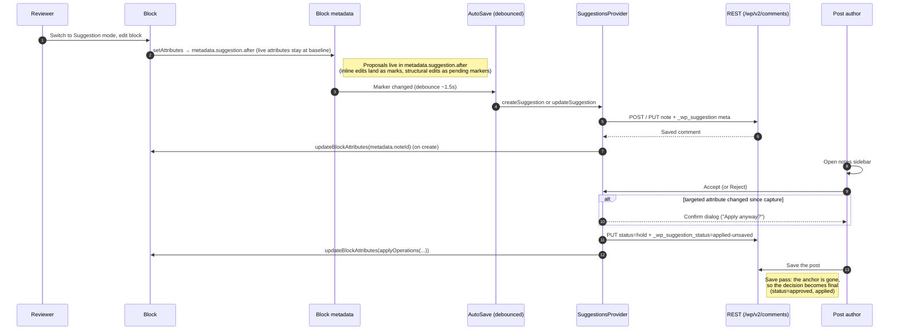
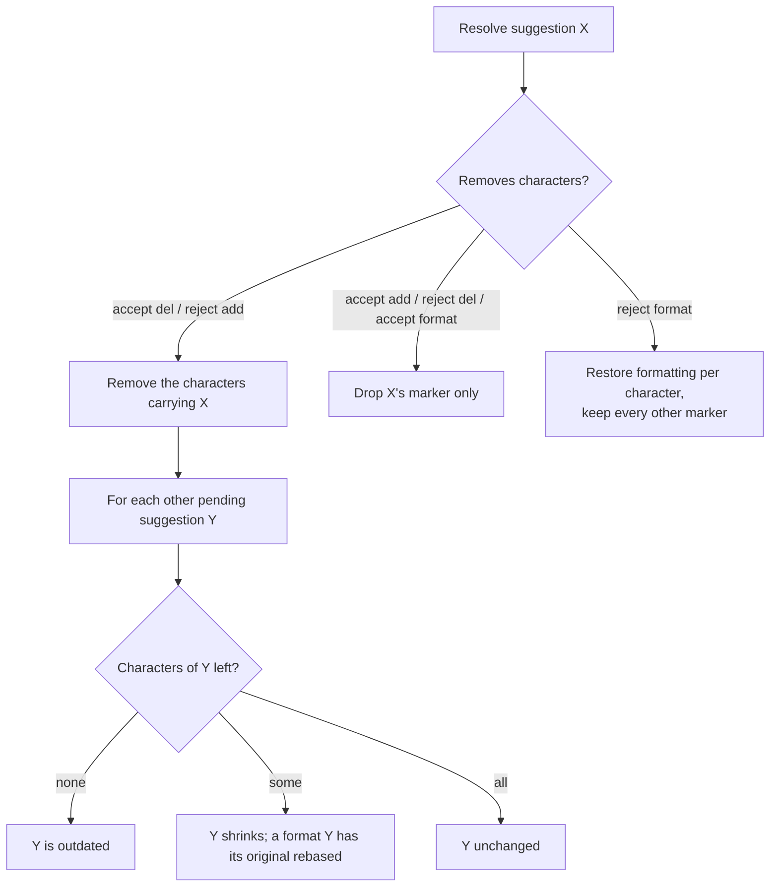
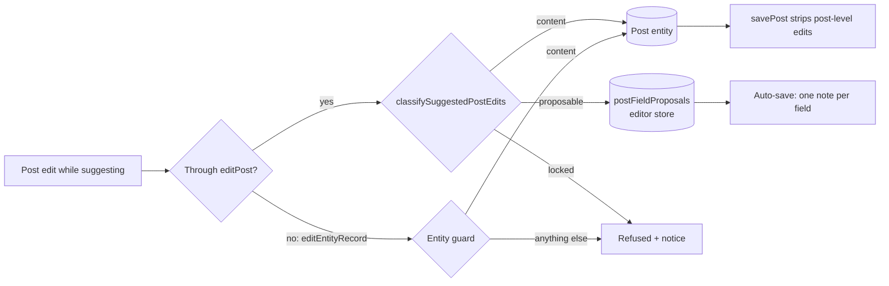
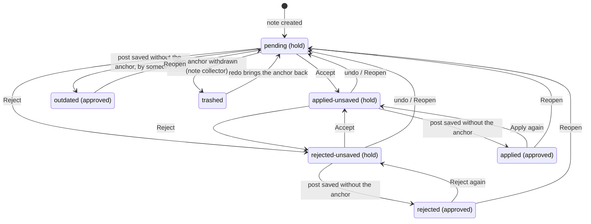
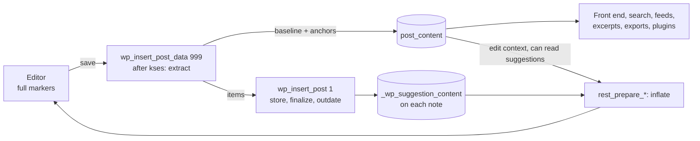

# Suggestions Architecture

## Overview

Suggestions extend the Notes feature (block-level comments) to support proposed content changes. A reviewer switches the editor to **Suggesting** (Suggestion mode) and edits the content; each change is captured as a suggestion linked to a note comment, and the post author then **Accepts** (merges the change) or **Rejects** (dismisses it) from the notes sidebar.

There are two complementary mechanisms, by change type:

- **Inline text and formatting changes** (typing, deleting, type-over, paste, bold/italic/link toggles, and the residual `onChange` seams — IME commits, autocorrect, drag-drop) live as anchored `<mark>` markers **in block content** (Option B), one rich-text format per kind (`core/suggestion-add`, `-del`, `-format`), re-resolved on read — edit-resilient and per-author. Markers of different kinds nest, so a deletion or formatting change can sit inside someone else's addition. See [Inline suggestion markers](#inline-suggestion-markers).
- **Non-text attribute changes** (alignment, heading level, color) and **structural changes** (insert / remove / move blocks) are recorded on the block's `metadata.suggestion` **marker** in `post_content` (a `pending-attributes` marker carries the proposed values in `after`; structural markers tag what happened to the block) and captured as versioned operation payloads on a note comment, auto-saved in the background after a short idle window. Nothing pending lives only in memory except post field proposals (the title, excerpt, featured image, slug, terms and meta), which are held in the editor store and saved as notes.

The feature is designed around a swappable provider interface so the storage backend can evolve from comment-meta (today) to Yjs `AttributionManager` (future) without changing the UI or accept/reject logic.

## End-to-end lifecycle


```mermaid
sequenceDiagram
    autonumber
    participant U as Reviewer
    participant B as Block
    participant M as Block metadata
    participant AS as AutoSave (debounced)
    participant P as SuggestionsProvider
    participant R as REST (/wp/v2/comments)
    participant A as Post author

    U->>B: Switch to Suggestion mode, edit block
    B->>M: setAttributes → metadata.suggestion.after (live attributes stay at baseline)
    Note right of M: Proposals live in metadata.suggestion.after<br/>(inline edits land as marks, structural edits as pending markers)
    M->>AS: Marker changed (debounce ~1.5s)
    AS->>P: createSuggestion or updateSuggestion
    P->>R: POST / PUT note + _wp_suggestion meta
    R-->>P: Saved comment
    P->>B: updateBlockAttributes(metadata.noteId) (on create)

    A->>A: Open notes sidebar
    A->>P: Accept (or Reject)
    alt targeted attribute changed since capture
        P-->>A: Confirm dialog ("Apply anyway?")
    end
    P->>R: PUT status=hold + _wp_suggestion_status=applied-unsaved
    P->>B: updateBlockAttributes(applyOperations(...))
    A->>R: Save the post
    Note right of R: Save pass: the anchor is gone,<br/>so the decision becomes final<br/>(status=approved, applied)
```

## Editor Intent

A session-scoped `editorIntent` state (orthogonal to the visual/code `editorMode` preference) controls the editing purpose:

| Intent    | Behaviour |
|-----------|-----------|
| `edit`    | Default — direct editing. |
| `suggest` | Attribute edits are written as a proposal on the block's `metadata.suggestion` marker and never change the live attributes; inline text and structural edits are written as pending markers too (see below). Post-level fields are proposed or locked (see [Post field suggestions](#post-field-suggestions)). |
| `view`    | Read-only: the canvas is a preview via `isPreviewMode`, and `editPost` refuses post-level field changes (excerpt, author, slug and so on). |

The intent lives in the `core/editor` store's reducer (not the preferences store), so reloading the editor always returns to `edit`. It is surfaced as an **Editing / Suggesting / Viewing** menu (the Google Docs names) in the editor's "Options" kebab, gated behind the `editor.notes` post-type support flag; the `setEditorIntent` / `getEditorIntent` store APIs are private while Suggestion mode is experimental.

## Pending attribute markers

When the intent is `suggest`, an `editor.BlockEdit` filter (`withSuggestionOverlay`) wraps every block's `Edit` component:

1. **Proposal** - `setAttributes` writes the changed values into the block's `metadata.suggestion.after` (a `pending-attributes` marker, or the `after` of a structural marker the block already carries) as a normal persistent change, through the block-editor store. Keys whose value equals the live value are dropped; a marker left proposing nothing is removed.
2. **Baseline untouched** - the live attributes never change. The marker is JSON in `post_content`, so the proposal survives a reload, syncs to peers, and sits on the undo stack: Ctrl+Z withdraws it and the note collector trashes its note. The front end renders the baseline with no PHP involvement, since `metadata` never reaches front-end markup.
3. **Merge for render** - in every intent, a block with a proposal receives `{ ...liveAttributes, ...after }` so the suggester, the author and reviewers all see what is proposed, exactly as they see a pending removal or an inline mark.

Attribute proposals are persistent changes to the block's metadata, so undo withdraws them and the note collector trashes their note; the live attributes stay at the baseline until Apply.

A companion `editor.BlockListBlock` filter tags each block with a pending change so it is discoverable without relying on the selected-block toolbar. A proposal gets an `is-suggestion-pending` class (the bracket/outline treatment); pending structural changes get `is-suggestion-pending-remove` (strikethrough/dim), `is-suggestion-pending-insert`, or `is-suggestion-pending-move`, mapped from the block's `metadata.suggestion` marker. When the suggester's user id is known, `getAvatarBorderColor` resolves their avatar color and it rides on the block wrapper as an inline `style="--suggestion-author-color: …"`, so two suggesters' pending treatments are distinguishable at a glance.

For **attribute suggestions** the store is never touched, so autosave, undo/redo, and RTC sync stay at the real baseline. **Structural suggestions** are different: their pending state (the `metadata.suggestion` markers, and pending-insert blocks themselves) lives in the real block tree and **saves into `post_content`** — the structural counterpart of inline markers living in content. That persistence is what lets a pending move/remove/insert (and its `metadata.noteId` linkage) survive a reload instead of orphaning its note. On save, the server moves the proposal itself out of the stored `post_content` onto the note and puts it back for editors on load (see [Save-time extraction](#save-time-extraction)), so the stored post holds the baseline. The render filters stay as defense in depth: `gutenberg_strip_pending_structural_suggestions` (a `render_block` filter) drops `pending-insert` blocks from public output, mirroring how `add` markers are stripped; `pending-remove` blocks render normally (their content is real until the removal is accepted).

### Inline text and formatting changes (Option B: marks in content)

Inline **text** changes — typing, deleting (character, word, or line), type-over, cut, and single-line paste — do **not** become attribute proposals. They live as marked text directly in block content (Option B), anchored to the #78218 inline-`<mark>` marker primitive. This is the edit-resilient model Riad asked for ([#73411](https://github.com/WordPress/gutenberg/issues/73411)): a suggestion is "this anchored range is proposed for deletion / this inserted run is proposed for addition", re-resolved against current content on read, rather than a whole-attribute before/after snapshot. It also makes concurrent per-author inline suggestions on one block work for free, dissolving [#79220](https://github.com/WordPress/gutenberg/issues/79220).

Inline **formatting** changes (bold / italic / link toggled over a run, the text unchanged) are markers too: the reformatted run is wrapped in a single `format`-type marker carrying the *proposed* formatting — the Google Docs model, the text shown once and never duplicated into a paired del/ins diff. The `withSuggestionOverlay` HOC's `setAttributes` seam detects the format-only diff (`planFormatMarkers`) and hands it to the singleton `SuggestionFormatKeyboard`, which opens the note (recording the original run as `beforeHTML` so a reject can restore it) and writes the marker.

Text edits that reach a block as a whole new `content` value with no interceptable input event — a committed IME composition, autocorrect (`insertReplacementText`), drag-drop — are diffed into markers by the singleton content reconciler (`SuggestionContentReconciler`): the HOC plans the edit against the previous value (`planEditMarkers`) and, when every planned action opens a fresh note, the reconciler executes it. Both singletons serialize their note-then-marker writes per block through a shared write queue and re-validate the live content around the async note POST, abandoning (and trashing the note of) a plan the content has moved past.

See [Inline suggestion markers](#inline-suggestion-markers) below for the full model. The proposal path described in this section handles what's left: **non-text attribute** suggestions (alignment, heading level, color) and inline edits the marker planners decline (an edit straddling an existing marker, a format toggle overlapping one). Values written into a proposal are stripped of live suggestion markers first (`stripSuggestionMarkers`) and stored JSON-safe (a `RichTextData` as its string), so accepting an attribute suggestion later can never replay (and resurrect) a marker whose suggestion was resolved in the interim. A proposal never renders inline content diffs: the old `<del>`/`<ins>` preview and its display-only format types are gone.

### Auto-save

There is no manual "Submit" step: `SuggestionAutoSave` watches the blocks that carry a `metadata.suggestion` marker and, after ~1.5 s of idle time on a given block, persists the operations derived from the marker and the live tree as a note comment (`operationsFromMarker` for the proposal, the interceptor's recorded capture or `structuralOpFromMarker` for the structural op). The note id is written back onto the marker as `commentId`, and the hook keeps a fingerprint of the last synced operations per block, so subsequent edits update the same note rather than creating new ones. A marker left proposing nothing trashes the note; a marker that disappears is the note collector's business. Ids read from content are only hints: auto-save updates or trashes a note on their account only when core-data shows it as a pending note on this post.

### Store interceptor

The HOC only catches edits that flow through a block's own `setAttributes` prop. Some Gutenberg paths bypass the prop chain and dispatch `updateBlockAttributes` directly to the block-editor store — most notably the block-switcher's variation picker (e.g. swapping a heading from H2 → H3). Those mutations would otherwise land in the post unchanged, defeating Suggestion mode.

`SuggestionStoreInterceptor` is a companion subscriber that closes that gap:

1. On Suggest activation it snapshots every block's attributes.
2. It subscribes to the data registry. On every store update it diffs the live attributes against the snapshot.
3. For drift on a tracked block it writes the changed attributes into the block's marker proposal (`metadata.suggestion.after`) and dispatches a revert that restores the snapshot. A reentrancy gate (`isDispatchingOwnWrite`) suppresses the synchronous subscribe fire the revert itself triggers, while per-revert identity tokens (`createRevertGuard`, in `attribute-suggestions/revert-guard.ts`) recognize revert echoes that arrive later — a batched or deferred dispatch — by matching the exact restored values instead of swallowing everything inside a time window.
4. Structural mutations (a block inserted, removed, or moved) are captured too — see [Structural suggestions](#structural-suggestions) below.
5. System-managed metadata (`metadata.noteId` written by the suggestion provider after creating a note comment) is folded into the snapshot before diffing so it's invisible to the diff and never leaks into a proposal.

The interceptor uses `registry.subscribe` rather than a React `useSelect` because (a) it must run synchronously after each dispatch, before any re-render serializes the now-wrong state, and (b) `subscribe` also catches dispatches from non-React paths.

### Structural suggestions

Inserting, removing, and moving blocks are captured as suggestions, not applied to the post. The interceptor follows the same "keep the store at baseline" principle as attribute edits — it **reverts the structural mutation and tags the block** with a `metadata.suggestion` marker, so the canvas keeps showing blocks at their baseline positions with a pending treatment until the change is accepted or rejected:

| User action | Interceptor response | Persisted op | Reject undoes by |
|-------------|----------------------|--------------|------------------|
| Delete a block | Re-inserts the subtree from the previous-tick snapshot at its prior parent + index, tags it `pending-remove`. A block with a pending move goes back to the move's origin first: the removal replaces the move | `block-remove` (carries the serialized `block`) | clearing the marker (the block stays) |
| Insert a block | Leaves the new block in place, tags it `pending-insert` (it has no baseline to revert to) | `block-insert-after` (with `anchorClientId` / `parentClientId`) | dispatching `removeBlock` |
| Move a block | Leaves it at the proposed position, tags it `pending-move` with the from/to anchors, and renders a non-interactive ghost at the origin | `block-move` (`from*` / `to*` anchor + index fields) | dispatching `moveBlockToPosition` back |
| Change an attribute | Writes the proposal to the block's marker (`pending-attributes`, or `after` on an existing structural marker) | `attribute-set` (rides along after any structural op) | clearing the proposal |

The marker's shape:

```ts
interface SuggestionMarker {
	type: 'pending-attributes' | 'pending-remove' | 'pending-insert' | 'pending-move';
	/** Proposed attribute values. JSON-safe; permitted on every type. */
	after?: Record< string, unknown >;
	/** Filled by auto-save once the note exists. */
	commentId?: number;
	authorId?: number | null;
	groupId?: string;
	crossedParents?: boolean;
	// pending-move: fromAnchorClientId, fromParentClientId, fromIndex, fromParentBlock
}
```

`after` never contains `metadata.suggestion` or `metadata.noteId`. A marker whose `after` is not a plain object, or whose `type` is unknown, is treated as absent by every reader (`readSuggestionMarker`).

The interceptor records each structural op it captured on the session (`recordStructuralCapture`) so auto-save persists it as its own note (attribute-set ops ride along in the same payload, but the structural op leads); a marker with no capture in this session (it came in with the post) is derived from the marker and the live tree. Apply dispatches the real block-editor action (`removeBlock` / `insertBlock` / `moveBlockToPosition`); both Apply and Reject finish by clearing the structural marker via `clearSuggestionMarkerAttributes`, which keeps a proposal that rode on it as its own `pending-attributes` marker.

Same-parent move attribution is selection-first: an adjacent swap is ambiguous to order-diffing alone ("B moved up" and "A moved down" produce identical orders), so the detector prefers the reading in which the currently selected blocks are the movers — the block a user moves via the toolbar, keyboard, or drag stays selected — and falls back to a longest-common-subsequence heuristic when the selection doesn't explain the reorder. This keeps a nudged block's marker (and its single note) on the block the user acted on, however many hops they make. Rejecting a pending move batches the marker-clear and the restoring `moveBlockToPosition` into one store update; the interceptor recognizes that shape (marker present in the previous tick, gone from the live block) as the suggestion landing rather than a fresh move to re-capture — the same shape a remote reject arrives in through sync.

Indenting or outdenting a list item creates or empties a nested list in the same update as the move. A new block whose children all existed and left a parent of the same type (an indent's nested list) is a carrier, not an insertion: it gets no marker, and each item it carries is captured as a cross-parent `pending-move`. A removed block whose children are all live in a parent of the same type (an outdent's emptied nested list) goes with the move instead of becoming a `pending-remove`, and the move records where it sat as `fromParentBlock`. Rejecting the move rebuilds that list there, copying the type and attributes of the list the item sits in now (never the note payload, which the suggester writes), or removes the nested list the item leaves empty. Any other removal re-inserts its subtree without the descendants that are still live elsewhere, so a moved block is never duplicated.

### Apply-time bypass and the collaborative round-trip

Apply is a deliberate exception to the rule that an attribute suggestion never reaches the live block: when the post author clicks **Apply**, the proposed attributes do need to land on the live block, and the same update drops the proposal from the marker. The provider opts the next dispatch out of interception via `requestInterceptorBypass(clientId)`; without it, the interceptor would treat the apply as a new user edit and divert it back into a proposal, producing a frustrating feedback loop.

In real-time collaboration the same scenario plays out across peers. When peer A clicks Apply, the dispatched attribute change syncs to peer B (the original suggester). Peer B's interceptor sees a delta from its own snapshot and would revert it, which would then sync back to peer A and undo the apply on their screen. To prevent this the interceptor calls `isAcceptedSuggestionChange()`: for each note linked to the block via `metadata.noteId`, it consults the suggestion payload and checks whether every changed attribute lands on a payload's `after` value. If so, the interceptor adopts the new attributes as its baseline rather than reverting.

The two halves are complementary — `requestInterceptorBypass` covers the local apply, `isAcceptedSuggestionChange` covers the synced apply on the other peer.

### Inline suggestion markers

Inline text suggestions are built on a shared, format-agnostic marker primitive in `packages/editor/src/components/inline-markers/`, generalized from the #78218 Notes anchor (`findMarkerRange`, `wrapInlineMarker`, `readInlineSelection`, `readInlineCaret`, `reconcileMarkerRemoval`, `useAnnotateRanges`). Notes and Suggestions both consume it; each passes its own format type, id attribute, and annotation source so the two coexist on one block.

**Marker.** A suggested inline change serializes as

```html
<mark class="wp-suggestion-add" data-suggestion-id="N" data-suggestion-type="add" data-author="A">…</mark>
```

with one class token, and one rich-text format, per kind:

| Kind | Format | Class | What the run is |
|------|--------|-------|-----------------|
| `add` | `core/suggestion-add` | `wp-suggestion-add` | proposed new text |
| `del` | `core/suggestion-del` | `wp-suggestion-del` | existing text proposed for removal |
| `format` | `core/suggestion-format` | `wp-suggestion-format` | existing text whose formatting change is proposed: the run carries the proposed formatting, the note's `beforeHTML` holds the original |

`data-suggestion-id` is the linked note's comment id and `data-author` tags the suggester. The class is authoritative; `data-suggestion-type` is written alongside it for styling and the screen-reader decoration. Every check of a marker's kind goes through the helpers in `inline-suggestions/format.ts` (`isSuggestionFormat`, `suggestionKindOf`, `suggestionMarkersAt`), the store keeps its own copy of the class tokens (`SUGGESTION_MARKER_CLASSES`), and PHP reads markers through `gutenberg_get_suggestion_marker_kind()`. The single `core/suggestion` format and its `wp-suggestion` class are gone; content still carrying them is not migrated (the feature is an experiment) and they parse as plain `<mark>`s. **Offsets are never stored** — `findMarkerRange` re-scans the rich-text `formats` array for the marker by id on every read, so a marker survives unrelated edits elsewhere in the same attribute. This is the single offset-resolution chokepoint and the intended Yjs `AttributionManager` swap point.

**Edit-driven creation.** In Suggestion mode every edit is a suggestion, so there are no toolbar buttons — the act of editing produces the marker. Two `beforeinput`-capture keyboards own the input-event paths (plus `paste`/`cut`-capture handlers), cancelling the native edit and writing the marker instead; two singleton `onChange`-side components (the format keyboard and the content reconciler) own edits that surface only as a fresh `content` value. All of them key the marker to a freshly created `note` comment and bypass the store interceptor so the marker lands in content:

| User action | Result |
|-------------|--------|
| Select text + Delete/Backspace | `del` marker over the selection |
| Backspace / Delete at a caret | `del` marker on the adjacent grapheme; repeating in one direction grows a single marker |
| Word / line delete (`deleteWordBackward`, `deleteHardLineForward`, …) | `del` marker over the exact range the delete would remove (`computeDeleteRange`) |
| Cut (Cmd/Ctrl+X) | `del` marker over the selection; the cut run is written to the clipboard as both `text/plain` and `text/html` |
| Type at a caret | `add` marker; contiguous typing grows one marker (the whole span is re-stamped so it stays a single `<mark>`) |
| Type over a selection | one `replace` note: an `add` run for the new text followed by a `del` run over the replaced text, both carrying the note's id |
| Single-line plain-text paste | `add` marker (handled on the `paste` event, ahead of the editor's paste pipeline), but only when the pipeline would insert the exact plain text |
| Single-line paste the editor transforms | left to the editor's paste pipeline so the result matches Editing mode, then proposed like any other edit: Markdown and auto-linked emails become an `add` marker carrying the formatting, a Code, Preformatted or Verse block drops the formatting, an http(s) URL over a selection becomes a `format` marker for the link (an `add` marker with the link at a caret), and a paste that converts to a block (a URL in an empty paragraph to an Embed, LaTeX to a Math block) is a block replacement: `pending-remove` paragraph plus `pending-insert` block in one group. |
| Bold / italic / link toggle | single `format` marker wrapping the reformatted run (via `SuggestionFormatKeyboard`) |
| IME commit, autocorrect, drag-drop | diffed into `add`/`del` markers by `SuggestionContentReconciler` |
| Enter inside a block (split) | the head gets a `del` marker over the base text that moved to the new block, which becomes a `pending-insert` block. The author's own `add` text in the moved run leaves the head outright (its note is collected once no marker anchors it) and arrives in the new block as plain text. Markers the new block inherits are settled the way the front end renders them (`del` and `format` unwrapped, the author's own `add` unwrapped, another author's `add` dropped with its text), and it keeps no note link that another block holds. A split whose moved run carries any other marker (another author's, or the author's own `del` or `format`) is declined with the overlap notice. |
| Multi-line paste | the paste pipeline commits the merged value to the block-editor store directly (not through `setAttributes`), so the store interceptor captures it as a whole-attribute proposal — never a raw commit, never an inline diff. Converting this capture into inline markers is a possible follow-up. |

The first keystroke of a run opens the note asynchronously; keystrokes during that window are buffered (typing) or counted (deletion) while the caret stays where the run started, and applied when the comment id resolves. The deferred write is anchored to the block's content, not to the caret: each run records its offsets and the attribute's text when it starts (`rebaseRunAnchor` in `run-anchor.ts`), so clicking another block, pressing Enter, or typing elsewhere during the round trip still writes the run's marker in its own block, at its own offsets (shifted past any edit that landed before them). The caret follows the marker only when the user is still at the run. The run is dropped, and its note trashed, only when the text around its anchor changed or Suggestion mode was left. An edit whose range overlaps an existing suggestion marker is checked against the overlap matrix (`classifyOverlap`, see [Overlapping suggestions](#overlapping-suggestions)): it nests a marker of another kind where that is expressible and is declined where it would re-attribute another suggestion's marker. The exception is a type-over that touches the author's own pending `add` marker (`reviseOwnAddition`): a selection wholly inside it revises the addition in place (same marker, same note), and a selection that also covers plain original text on one side turns that text into a `del` run under the same note, which becomes a replacement. Deleting a selection that crosses only the author's own `add` and `del` markers (`deleteAcrossOwnMarkers`) removes the additions, keeps the deletions, and marks any original text left between them as one new deletion. That includes a selection of a block's whole text, which rich text removes on `keydown` rather than through `beforeinput`, so the deletion keyboard takes that keystroke first.

**Decoration.** `SuggestionAnnotations` re-derives each pending marker's live range (`findSuggestionRange`) and decorates it through the annotations API at runtime — nothing is written back to content. The annotations API keeps one decoration per character, so ranges are applied widest first and the selected thread last: an addition stays highlighted around the suggestions nested in it. `content-suggestion.scss` keys the visual off each marker's class (`del` → strikethrough, `add` → underline, `format` → dotted underline marking the already-visible proposed formatting as provisional; a `format` nested in an `add` drops its dotted line below the addition's solid one) and consumes `--suggestion-author-color`; `SuggestionAuthorColors` injects one `:is(.wp-suggestion-add, .wp-suggestion-del, .wp-suggestion-format)[data-author="N"]{--suggestion-author-color:…}` rule per author so the **decoration conveys the kind while the color conveys who** (Google-Docs model). Text decorations propagate, so a deletion inside an addition shows both lines, each in its own author's color. Every marker in a nested stack gets its own screen-reader decoration, read outer start, inner start, text, inner end, outer end. The redundant per-thread annotation highlight is neutralized for suggestion markers.

**Selection.** The marker formats' `edit` (`collab-sidebar/suggestion-format-edit.tsx`, passed in at registration by the editor provider and registered on every kind) mirrors `NoteFormat` for inline notes: while a notes sidebar is open, the caret inside a marker selects that marker's note (where markers nest, the innermost: a deletion over a formatting change over an addition, so the several active instances agree), so a block holding several suggestions points at the one under the caret rather than the block's primary note. Both halves of a replacement carry one id and resolve to one note. Moving the caret from a marker to plain text in the same block deselects that note if it is still selected; a pending sidebar focus request is left alone, and leaving the block stays with the block-level sync. `RevealSelectedSuggestion` keys its tint and outline off the selected note, so the marker under the caret lights up too.

**Render strip (PHP).** `gutenberg_strip_inline_suggestion_markers` (a `render_block` filter in `lib/compat/wordpress-7.1/block-suggestions.php`) classifies each `<mark>` with `gutenberg_get_suggestion_marker_kind()` and is kind-aware: a `del` marker has its **wrapper stripped but text kept** (the text is real until the suggestion is accepted); an `add` marker has its **wrapper and text both stripped** (proposed additions never reach the published front-end until accepted). A pending `format` marker has its **whole span replaced with the original run** recorded on its note as `beforeHTML`, so the proposed formatting stays off the published front end until accepted. The marker is written as the outermost format on its run (`<mark …><strong>…</strong></mark>`) so the span covers the proposed formatting. Only a pending (not applied, rejected, trashed or spam) note on the post whose content is being rendered - tracked on `the_content`, not the block's `postId` context, which names each queried post inside a Query Loop - whose stored content holds the marker is read, and never for a password-protected post, so a marker pasted into other content cannot pull in another post's text; when the original cannot be resolved the marker is unwrapped like `del`. A marker whose `<mark>` and `</mark>` pairing disagrees with how a browser reads the markup (no closer, or an enclosing element ends it first) is unbalanced: a `del` still unwraps, but an unbalanced `add` or `format` is removed through the later of its possible ends, so pending content never renders. Nested markers resolve with the outer replacement winning: an `add` drops everything nested in it, a restored `format` original replaces the deletion inside it, and a `del` unwraps around whatever it holds. The editor never splits a `format` marker, but merged or hand-edited markup can, so within one render only the first fragment of a format id restores the original and later fragments render nothing. Markers with the old single `wp-suggestion` class fail closed the same way: an addition is dropped with its text, anything else is unwrapped. The strip pairs markers with `gutenberg_pair_inline_suggestion_markers()`, the walk the save pass shares, so both agree on where a run starts and ends. Since the save pass leaves only anchors in the stored content (see [Save-time extraction](#save-time-extraction)), the strip mostly sees an emptied `add` anchor (rendered as nothing) and a `format` anchor around the original run (unwrapped); full markers reach it only where the pass left them in place.

**Accept / reject.** Resolved by id and kind against the live marker range: accept `del` removes text + marker; reject `del` drops the marker (text stays); accept `add` unwraps the marker (text becomes permanent); reject `add` removes text + marker; accept `format` unwraps the marker (the proposed formatting, already on the run, becomes permanent); reject `format` gives each character of the run back the formatting recorded on the note as `beforeHTML`, keeping every other marker on it. Each decision acts on its own kind's marker only, so accepting an addition leaves the deletions and formatting changes nested in it pending. The inline op records only which attribute carries the marker, the marker kind, and (for `format`) the before/after run HTML — the range is always re-derived. Removal-type resolutions delete only the characters actually carrying the marker's id, so another suggestion's marker interleaved inside a fragmented run survives. What a decision does to the other suggestions is described next.

### Overlapping suggestions

Rich text keeps one format of a type per character. With a single marker format, a second author's marker over the same text replaced the first one there and took its attribution, so every overlap was refused. With one format per kind, markers of different kinds share characters. annezazu's example from #73411 is the case it serves: Anne suggests adding a sentence, Bob suggests bolding words in it, Carl suggests deleting words in it, including one Bob bolded.

**Canonical nesting.** Every marker write ends in `canonicalizeSuggestionStack()`, which orders each character's stack `add`, then `format`, then `del`, then content formats, and lets adjacent characters share one object per marker. The same state therefore always serializes to the same bytes (stable round trips and RTC merges), and a `format` marker is never split by a nested deletion:

```html
Intro.<mark class="wp-suggestion-add" …> Bright <mark class="wp-suggestion-format" …><strong>red </strong><mark class="wp-suggestion-del" …><strong>apples</strong></mark></mark><mark class="wp-suggestion-del" …> fell</mark>.</mark>
```

**What may overlap.** `classifyOverlap()` (`inline-suggestions/overlap.ts`) is the matrix every editing path asks: the keyboards, the format planner, the content reconciler.

| Gesture | Someone's `add` | Someone's `del` | Someone's `format` |
|---------|-----------------|-----------------|--------------------|
| Type at a caret inside the run | refused | refused | a new `add` next to it (the typed text does not join the change) |
| Delete inside, or across the run and plain text | a nested (or spanning) `del` | refused | a `del` inside it |
| Format inside the run | a nested `format` | a `format` around it | refused |
| Format across the run's edge | refused (its original would capture proposed text) | allowed | refused |
| Type over a selection | refused | refused | a replacement next to it |

Gestures over the author's own markers keep their own paths (growing or revising an addition, deleting across their own markers). Taking back your own addition also removes other authors' markers nested in it. A refusal names the author of the marker in the way, read from its note, says what they suggested, and offers **Reply to this suggestion**, which opens that thread (`notifyEditRefused` in `refuse-edit.ts`).

**Resolution.** One rule covers every combination, with no parent/child graph to keep: accepting a deletion or rejecting an addition removes characters, and any other pending suggestion that loses characters shrinks, or is emptied when it loses all of them. `resolveInlineSuggestion()` (`inline-suggestions/resolution.ts`) applies a decision and reports the suggestions it shrank or emptied.


```mermaid
flowchart TD
  op["Resolve suggestion X"] --> kind{"Removes characters?"}
  kind -->|"accept del / reject add"| rm["Remove the characters carrying X"]
  kind -->|"accept add / reject del / accept format"| un["Drop X's marker only"]
  kind -->|"reject format"| rf["Restore formatting per character,<br/>keep every other marker"]
  rm --> scan["For each other pending suggestion Y"]
  scan --> left{"Characters of Y left?"}
  left -->|none| out["Y is outdated"]
  left -->|some| sh["Y shrinks; a format Y has its original rebased"]
  left -->|all| same["Y unchanged"]
```

So rejecting Anne's addition takes Bob's and Carl's suggestions with it; accepting it leaves them pending as ordinary suggestions; accepting Bob's formatting first makes the bold part of Anne's proposal; accepting Carl's deletion first shrinks Anne's addition and Bob's formatting change, whose recorded original (and proposed run) is rebased on its note so a later reject cannot put the deleted words back. The decision hook (`use-suggestion-decisions.ts`) announces the suggestions a reject emptied. It does not touch their notes: the note collector trashes only the current user's own orphaned notes, and the save pass marks another author's note `outdated`. Undo brings the text and every nested marker back.

**Sidebar context.** `suggestionRelations()` derives, from the markers, whether a suggestion sits inside someone's addition, holds others' suggestions, or is only partly inside one, and the note shows it: "Inside a suggested addition by Anne", "Includes 2 suggestions from others", "Partly inside a suggested addition by Anne". While an addition holding others' suggestions is pending, a consequence line under it says "Rejecting also makes 2 suggestions outdated." There is no confirmation step.

**Synced content.** Real-time collaboration merges rich text as HTML strings, so two peers marking overlapping text with one kind can leave two markers of that kind on the same characters, and a last-writer-wins attribute merge can swap a marker's id. The local writers never produce either, so `SuggestionMarkerGuard` watches every rich-text attribute and resolves what it finds with `guardMarkerIntegrity()` (`inline-suggestions/marker-integrity.ts`): the older (lower) note id keeps the characters, and a pending marker whose id an attribute merge replaced gets them back. Every peer applies the same rule to the same merged state, so the corrective writes converge; they bypass the interceptor and stay off the undo stack.

### Implementation files

The Suggestion mode subsystem lives in `packages/editor/src/components/suggestion-mode/`:

| File | Role |
|------|------|
| `index.ts`                  | Barrel that re-exports the subsystem's public surface. |
| `gate.ts`                   | `isSuggestionModeEnabled()` / `useCanSuggest`: the single feature-gating predicate for the Suggestion mode experiment. |
| `suggestion-session.tsx`    | `SuggestionSessionProvider`, `useSuggestionSession`. Session coordination only: bypass tokens, handler slots, write queue, deferred insertions, undo adoption, structural capture records. |
| `marker.ts`                 | The `metadata.suggestion` marker: `readSuggestionMarker`, `proposedAttributes`, `withProposedAttributes` (fold an edit into a proposal), `withoutProposedAttributes`, `mergeProposedAttributes` (merge for render). |
| `suggestion-write-queue.ts` | Per-block serial queue shared by the format keyboard and the content reconciler, so their note-then-marker flights can't interleave on one block. |
| `with-suggestion-overlay.tsx`| `editor.BlockEdit` HOC that detects format-only / reconcilable content edits and hands them to the marker singletons, diverting everything else into the block's marker proposal (marker-stripped) and merging a proposal for render in every intent; plus the `editor.BlockListBlock` filter for pending-state classes and move ghosts. |
| `store-interceptor.ts`      | Snapshot/diff/revert subscriber for store-level mutations (attribute and structural); multi-peer accept logic; revert-echo identity tokens. |
| `plan-store-content-edit.ts`| Plans a content change that reached the store directly (outside `setAttributes`) as inline markers where it can. |
| `block-tree-version.ts`     | A cheap "has any block changed?" signal from the identity of the store's block tree. |
| `provider.ts`               | `useSuggestionsProvider`: the `createSuggestion` / `applySuggestion` / `rejectSuggestion` API. Owns `operationsFromMarker`, `applyOperations`, `hasAttributeConflict`, `findStructuralOp`, `clearSuggestionMarkerAttributes`, `parseSuggestionPayload`, and the wrapper-aware equality check. |
| `auto-save.ts`              | Debounced persistence of marked blocks as note comments (replaces the explicit "Submit" affordance from earlier phases). |
| `operations/structural-from-marker.ts` | `structuralOpFromMarker`: the structural op a marker stands for, derived from the marker and the live tree when no capture was recorded this session. |
| `suggestion-summary.tsx`    | Compact sidebar summary ("Add: …", "Delete: …", "Add formatting: …", "Remove formatting: …") used in thread lists, the sole suggestion renderer in the sidebar. Inline format changes carry their direction, since adding and removing a format are opposite proposals. |
| `word-diff.ts`              | `wordDiff`: the word-level LCS behind the summary, bounded by `MAX_DIFF_LENGTH` (characters, applied by callers) and `MAX_DIFF_TOKENS` (tokens, applied internally). |
| `suggestion-deletion-keyboard.ts` | `beforeinput`/`cut`-capture handler turning selection, collapsed-cursor, word/line deletes and cut into `del` markers. |
| `suggestion-addition-keyboard.ts` | `beforeinput`/`paste`-capture handler turning typing, type-over, and single-line paste into `add` markers (and the `del` half of a type-over). |
| `suggestion-format-keyboard.ts` | Singleton owning the write side of `format` markers: opens the note (with `beforeHTML`/`afterHTML`) and writes the reformatted run wrapped in one marker. |
| `suggestion-content-reconciler.ts` | Singleton executing marker plans for `onChange`-only text edits (IME commit, autocorrect, drag-drop). |
| `keyboard-target.ts`        | Shared DOM-target guards (`isEventTargetSelectedRichText`, `getCandidateDocuments`) keeping the capture keyboards off sidebar/plugin editables. |
| `grapheme-boundaries.ts`    | Grapheme-safe range stepping for collapsed deletes (surrogate pairs, ZWJ sequences, combining marks). |
| `run-anchor.ts`             | `rebaseRunAnchor`: maps a keyboard run's offsets, read when its first keystroke opened the note, onto the attribute's text when the note id resolves, so the deferred write lands by content rather than at the caret. |
| `refuse-edit.ts`            | The one place Suggestion mode declines an edit outright (for example an edit overlapping a pending marker), with its notice. |
| `use-abandoned-note-cleanup.ts` | Trashes the notes opened for a gesture that was abandoned before its marker was written, and drops their ids from the block's note linkage. |
| `suggestion-note-gc.ts`     | `SuggestionNoteGC`: trashes the current user's own pending note whose anchor disappeared (undo, deleting the marked text while Editing), after reading the note fresh from the server, restores it when the anchor comes back, and spares notes with replies. Reopens a note this session decided when undo brings its marker back, and decides it again (provisionally) when redo lands the decision again. |
| `anchor-index.ts`           | Where each suggestion note is anchored in the loaded content, shared by the note collector and the sidebar (`useSuggestionAnchorPresent`). |
| `suggestion-status.ts`      | `_wp_suggestion_status` values and predicates (`getSuggestionStatus`, `isProvisionalStatus`, `getDecision`). |
| `suggestion-undo-guard.ts`  | Suggestion-aware undo/redo: undoing right after a suggestion withdraws it rather than capturing the undo as a new suggestion. Records every redo, in any intent, so the note collector can tell a redone decision from a withdrawal. |
| `clipboard-strip.ts`        | Keeps suggestion state off the clipboard: inline markers, `metadata.suggestion` and note links are stripped from copied and cut content. |
| `multi-block-format-notice.ts` | Explains why a format shortcut does nothing across a multi-block selection in Suggestion mode. |
| `move-ghost-index.ts`       | Pure builder of the anchor-to-ghost index from moved-block descriptors. |
| `use-move-ghosts.tsx`       | `MoveGhostsProvider`: computes the document-wide pending-move ghost index once and shares it over context; per-block `useMoveGhosts()` is a plain context read. |
| `suggestion-move-ghost.tsx` | Renders the non-interactive ghost at a pending move's origin. |
| `annotate-suggestions.ts`   | `SuggestionAnnotations`: re-derives each pending marker's range and decorates it via the annotations API (runtime-only). |
| `suggestion-author-colors.ts` | `SuggestionAuthorColors`: injects per-author `--suggestion-author-color` rules keyed on the marker's `data-author`. |
| `reveal-selected-suggestion.ts` | Gives the selected suggestion's in-content marker an active tint and ring in the suggester's color. |
| `post-field-labels.ts`      | Names a post field suggestion's target ("Post title", "Excerpt", "Post meta: key") and its summary label. |
| `use-locked-post-field.ts`  | Read-only treatment for the post settings that cannot be proposed while suggesting. |
| `use-suggest-post-edit-guard.ts` | Installs the `editEntityRecord` guard for the editor's lifetime, before its children first render. |
| `style.scss`                | Sidebar and editor-chrome styles for suggestions (in-canvas treatments live in `block-editor`'s `content-suggestion.scss`). |

The shared inline-marker primitive and the suggestion format live alongside, consumed by both Notes and Suggestions:

| Directory | Role |
|-----------|------|
| `inline-markers/`    | Format-agnostic primitive: `findMarkerRange` (sole offset resolver / CRDT swap point), `wrapInlineMarker`, `readInlineSelection`, `readInlineCaret`, `reconcileMarkerRemoval`, `useAnnotateRanges`. |
| `inline-suggestions/`| The marker formats, one per kind, and their kind helpers and canonical order (`format.ts`), and everything that plans or executes marker changes: accept/reject/insert/grow operations (`operations.ts`), the overlap matrix (`overlap.ts`), what a decision does to other suggestions (`resolution.ts`), how a suggestion sits among others (`relations.ts`), the RTC guard's rule (`marker-integrity.ts`), `delete-range.ts` (word/line delete ranges), `reconcile-edit.ts` (`planEditMarkers`/`applyEditPlan`), `reconcile-format.ts` (`planFormatMarkers`/`applyFormatPlan`), and `strip-markers.ts` (marker stripping for attribute proposals). |
| `attribute-suggestions/` | `revert-guard.ts` — identity tokens the store interceptor uses to recognize its own revert echoes (bounded FIFO queue per block). |

REST/PHP surface lives in `lib/compat/wordpress-7.1/`. Notes themselves (the `note` comment type, `_wp_note_status` and `editor.notes` post-type support) are core since WordPress 6.9.

| File | Role |
|------|------|
| `suggestion-status.php` (7.2) | Provisional and final status lists, `_wp_suggestion_decided_by` stamping, and the REST refusal of final statuses. |
| `class-gutenberg-suggestion-reconciler.php`, `suggestion-reconciliation.php` (7.2) | The save pass, the edit-context re-inflation, `gutenberg_can_read_suggestions()`, the `core/suggestion-placeholder` block, and `gutenberg_get_suggestion_anchor_index()`, the one place that reads suggestion anchors from serialized content. |
| `class-gutenberg-suggestion-content.php` (7.2) | `Gutenberg_Suggestion_Content`: extraction of proposals into anchors plus items, and its exact inverse, re-inflation. |
| `class-gutenberg-suggestion-block-scanner.php`, `class-gutenberg-suggestion-marker-processor.php` (7.2) | Block delimiters with byte offsets (driving `WP_Block_Parser::next_token()`), and the Tag Processor that exposes token spans to the marker walk. |
| `block-suggestions.php` | `gutenberg_register_suggestion_meta` registers `_wp_suggestion` (sanitized, 64 KB cap, KSES on serialized block snapshots) and `_wp_suggestion_status`, each with an `edit_post`-on-parent `auth_callback`, plus the read-only provenance meta and the private storage of the save pass (`_wp_suggestion_content`, `_wp_suggestion_snapshot`, both kept out of WXR exports). Also the render side: `gutenberg_strip_inline_suggestion_markers`, the kind-aware `render_block` strip for inline markers (`del` keeps text, `add` drops text, `format` restores the original run), which reads markers through `gutenberg_get_suggestion_marker_kind()`, and `gutenberg_strip_pending_structural_suggestions`, its structural counterpart (`pending-insert` blocks dropped, `pending-remove`/`pending-move` blocks kept). `gutenberg_restore_pending_move_order` runs earlier, on `the_content` ahead of `do_blocks()`, and restores the pre-move sibling order of any list holding a single pending move, so an un-accepted move does not change published output. |
| `block-suggestions.php` (validation) | `gutenberg_validate_suggestion_post_operations` (on `rest_preprocess_comment`) refuses, with a 400, a note whose `post-attribute-set` op targets anything but the title, excerpt, featured image, slug, one of the post type's REST taxonomies, or a meta key registered with `show_in_rest` that the suggester could edit (`gutenberg_can_suggest_post_meta`, `edit_post_meta`). |
| `class-gutenberg-rest-comment-controller-7-1.php` | Thin subclass of the core comments controller. Permissions stay core's. It adds only storage rules: `prepare_item_for_database` rejects an oversized `_wp_suggestion` with 413 and an invalid JSON payload with 400, and `check_is_comment_content_allowed` lets a note carrying a suggestion payload have empty content. |

## Suggestion Payload (v2)

Stored as a JSON string in the `_wp_suggestion` comment meta on a `note` comment:

```json
{
  "schemaVersion": 2,
  "blockName": "core/paragraph",
  "baseRevision": "2026-04-15T12:34:56",
  "operations": [
    {
      "type": "attribute-set",
      "attribute": "content",
      "before": "Hello world",
      "after": "Hello beautiful world"
    }
  ]
}
```

| Field | Purpose |
|-------|---------|
| `schemaVersion` | Allows future schema evolution without breaking old payloads. |
| `blockName` | Safety check — apply is refused if the block type has changed. |
| `baseRevision` | `post_modified_gmt` at capture time, kept for provenance only. Accept-time conflicts are detected per attribute; see **Conflict detection** below. |
| `operations` | Declarative transforms on the block tree. v1 emitted `attribute-set` only; v2 adds the structural variants (`block-insert-after`, `block-remove`, `block-move`), tracked in [#77434](https://github.com/WordPress/gutenberg/issues/77434). |

Operations are **declarative transforms**, not HTML diffs. This makes them compatible with Yjs attribution semantics and resilient to concurrent edits on unrelated attributes.

A payload carries at most one structural op. An inline note carries a single `inline-suggestion` op that names the attribute and marker kind; the range is never stored (the auto-save loop persists each structural mutation as its own note); `attribute-set` ops may ride along but the structural op leads. The op types and their distinguishing fields:

| `type` | Fields beyond `type` / `blockName` | Apply dispatches |
|--------|------------------------------------|------------------|
| `attribute-set`     | `attribute`, `before`, `after` | `updateBlockAttributes` |
| `inline-suggestion` | `attribute`, `suggestionType` (`add` / `del` / `replace` / `format`), plus `beforeHTML` / `afterHTML` for `format` | the marker operations in `inline-suggestions/operations.ts`, against the range found by id |
| `block-remove`      | the serialized `block` | `removeBlock` |
| `block-insert-after`| `anchorClientId`, `parentClientId`, the serialized `block` | `insertBlock` |
| `block-move`        | `fromAnchorClientId` / `fromParentClientId` / `fromIndex`, `toAnchorClientId` / `toParentClientId` | `moveBlockToPosition` |
| `post-attribute-set`| `attribute`, `before`, `after` | `editPost` |

### Post field suggestions

Post-level fields are not blocks, so nothing in the content can carry a marker for them. Suggestion mode never lets one change the saved post while suggesting: each field is either **proposed** or **locked**.


```mermaid
flowchart LR
    W[Post edit while suggesting] --> E{Through editPost?}
    E -- yes --> C{classifySuggestedPostEdits}
    E -- "no: editEntityRecord" --> G{Entity guard}
    C -- content --> P[(Post entity)]
    C -- proposable --> S[(postFieldProposals<br/>editor store)]
    C -- locked --> R[Refused + notice]
    G -- content --> P
    G -- anything else --> R
    S --> A[Auto-save: one note per field]
    P --> SV[savePost strips post-level edits]
```

**Proposed fields** are the title, excerpt, featured image (`featured_media`), slug, the terms of each of the post type's taxonomies (by `rest_base`), and each post meta key the post's REST record carries (only keys registered with `show_in_rest`). `editPost` sorts its edits with the pure `classifySuggestedPostEdits` (`store/suggest-post-edits.ts`): content (`blocks`, `content`, `selection`, and the content-derived `footnotes` meta) passes through, a proposable change is held in the editor store's `postFieldProposals` (keyed by field, or `meta.<key>`, with the value the field had when first proposed as its `baseline`), and anything else is refused. While suggesting, the public `getEditedPostAttribute` selector returns a field's proposed value (its docblock says so), so every panel and plugin that reads the post through the editor store shows the proposal with no code of its own. Code that needs the value the post will be saved with reads the `core` entity record (`getEditedEntityRecord`), or the private `getPostFieldValueWithoutProposals`. A meta proposal is merged into `meta`; a terms proposal returns term ids only (see new terms below). The auto-saver saves each proposal as its own note holding one `post-attribute-set` op (`{ attribute, key?, before, after }`) with no block anchor; the sidebar names the field ("Post title", "Excerpt", "Featured image", "Categories", "Post meta: key") instead of treating the note as an orphan, the summary quotes text fields, lists added and removed terms, and shows thumbnails for the featured image. Accept applies the op with the private `applyPostFieldSuggestion`, which writes past the guard (rolled back if the decision fails to save); Reject only records the decision and drops the proposal. Undo withdraws the newest proposal when it is newer than every block capture, putting the field back at its baseline so the auto-saver trashes the note.

Proposals live in memory, so a reload empties them while their notes stay pending. When the post's notes load, `useHydratePostFieldProposals` restores a proposal from each of the current user's pending post-level notes (the note's `before` is the baseline), linked to the note by `commentId`. The field shows the proposal again while suggesting, editing it updates that note rather than opening a second one, and editing it back to the baseline trashes the note, as undo does. Undo after such a re-edit returns to the value the note holds (`noteValue`) rather than withdrawing a suggestion made in an earlier session. Other authors' notes are never restored: the current user's edit to the same field opens a note of their own, and a decision on someone else's note does not clear the user's own proposal for that field.

**New terms** can be proposed from the term pickers. Creating a term is a real write to the taxonomy, so a suggestion never creates one: a new term rides on the terms proposal as a `{ name, parent? }` entry beside the term ids (`[ 12, { name: 'Jazz', parent: 4 } ]`), the pickers show it like a proposed existing term (a chip, a checked checkbox) through the private `getProposedNewTerms`, and the note summary reads "New tag: Jazz". `getEditedPostAttribute` leaves the entries out, so readers only ever see term ids. Accept creates each new term as the reviewer (`createProposedTerms`), through the normal term REST permissions, reusing a term with the same name that appeared meanwhile, then assigns it; when the reviewer may not create terms in the taxonomy the accept fails with the REST error as a notice and the note stays pending. Reject writes nothing. The server validates each entry when the note is saved: a term id, or a new term with a sanitized, non-empty name and a parent only for a hierarchical taxonomy, as one of its terms. The suggester needs no capability to create terms, since nothing is created.

**Locked fields** are everything else: status, author, date, password and visibility, sticky, comment and ping status, format, parent, template and menu order. Moving the post to the trash is locked too, and so are the site settings the post editor shows (the template summary's blog title, posts per page and discussion default): none of them is a change to the post a reviewer could accept. Their sidebar controls are read-only while suggesting, with the reason as their description, and the post actions menu leaves out Trash, the delete actions and the homepage and posts page actions. Three seams refuse them whatever path a write takes:

- `editPost` refuses a call that changes a locked field (status keeps its own message; every other field shares "This setting can't be changed while suggesting."), dropping the whole call so a companion edit cannot land without it. Content in the same call still passes.
- `installSuggestPostEditGuard` (`store/suggest-post-edit-guard.ts`) wraps the core-data `editEntityRecord` action on the actions object `useDispatch` and thunks share, so a direct write to the current post (`useEntityProp`, a plugin, the console) is refused too. It refuses an edit of the site entity or the posts page outright, a `saveEntityRecord` or `saveEditedEntityRecord` of the site entity (so a site setting staged in Editing is not saved from Suggesting), and a `deleteEntityRecord` of the current post; `trashPost` refuses itself. A plugin's meta field that writes through `useEntityProp` is therefore refused, not proposed; one that writes through `editPost` is proposed. The wrap is installed for the editor's lifetime from the provider's first render and checks the intent per call, so a component that destructured the action before the intent changed is still covered.
- `savePost` strips every post-level edit from a save made while suggesting, after the `editor.preSavePost` filter. An edit staged in Editing before switching to Suggesting stays on the entity, unsaved, and is saved as usual back in Editing.

The server validates every `post-attribute-set` op before a note is stored (see the PHP table above), so a reviewer's accept can only ever write a field Suggestion mode proposes, and a meta key the suggester was allowed to edit; the reviewer's save checks the reviewer's own capabilities again.

### v1 → v2 compatibility

The shape of a v1 payload is a strict subset of v2 (only `attribute-set` operations). v1 payloads are migrated forward in `parseSuggestionPayload` by stamping `schemaVersion: 2` — no rewriting needed. The bump matters because a v1 reader that encountered a v2 payload with structural ops would silently drop them at apply time; refusing the payload outright surfaces an explicit "newer editor" notice and offers only Reject.

### Schema versioning

`schemaVersion` is incremented whenever the payload shape changes. Consumers apply the following rule:

| Parsed version vs. consumer's known version | Behavior |
|---|---|
| `parsed < known` | Migrate the payload forward to the current shape before applying. Migrations are additive: missing fields are filled with defaults. |
| `parsed === known` | Apply normally. |
| `parsed > known` | Refuse to apply — show a "this suggestion was made by a newer editor" notice and offer only Reject. |

When bumping the version, add a migration step in `parseSuggestionPayload` that lifts `parsed.schemaVersion < SCHEMA_VERSION` payloads into the current shape. Ship the bump and the migration in the same PR; do not read unknown future payloads.

## Provider Interface

```text
useSuggestionsProvider() → {
  createSuggestion({ clientId, blockName, operations })  → Promise<comment>
  updateSuggestion({ commentId, blockName, operations }) → Promise<comment>
  deleteSuggestion({ commentId })                        → Promise<void>
  applySuggestion({ commentId, clientId, payload })      → Promise<void>
  rejectSuggestion({ commentId, clientId, payload })     → Promise<void>
}
```

The current implementation (`provider.ts`) uses comment meta. A future Yjs-backed implementation would read from `AttributionManager` and write changes through the CRDT document, exposing the same methods.

## Accept / Reject

Every decision first writes a **provisional** status to the note (`applied-unsaved` or `rejected-unsaved`, comment kept `hold`), and only then changes the content. A failed status write leaves the editor untouched; a content change that fails puts the note back to `pending`. The decision becomes final when the post is saved (see [Decision lifecycle](#decision-lifecycle)).

- **Accept** (attribute ops): runs `applyOperations(currentAttributes, payload.operations)` to produce new attributes and dispatches `updateBlockAttributes`.
- **Accept** (structural ops): dispatches the corresponding block-editor action — `removeBlock` for `block-remove`, `insertBlock` for `block-insert-after`, `moveBlockToPosition` for `block-move` — then clears the `metadata.suggestion` marker via `clearSuggestionMarkerAttributes`.
- **Reject**: clears any `metadata.suggestion` marker. For structural suggestions it also undoes the in-canvas pending state: `block-insert-after` runs `removeBlock`, `block-move` runs `moveBlockToPosition` back to the original spot, `block-remove` simply drops the marker (the block was never actually removed). Attribute rejects make no content change.
- **Conflict detection**: accept-time staleness is checked at the attribute level, not the post level. `hasAttributeConflict(currentAttributes, operations)` compares each operation's captured `before` to the block's current value; only a real divergence on a targeted attribute prompts the "apply anyway" confirmation. (`block-insert-after` is exempt — its baseline is `{}`, so a comparison against the already-typed-into block would always read as divergence.) Post-level `baseRevision` is still stamped into the payload for provenance, but does not drive the prompt — every auto-save bumps `post_modified_gmt`, so a post-level compare would flag nearly every suggestion as stale.

## Decision lifecycle

A decision is content: Accept and Reject change the post, and the change only exists once the post is saved. `_wp_suggestion_status` records where a note is on that path, and only the server writes a final value.

| `_wp_suggestion_status` | Comment status | Meaning | Written by |
|---|---|---|---|
| absent / `pending` | `hold` | Awaiting a decision | Client (create, reopen) |
| `applied-unsaved` | `hold` | Accepted in an editor that has not saved the post | Client |
| `rejected-unsaved` | `hold` | Rejected in an editor that has not saved the post | Client |
| `applied` / `rejected` | `approved` | Final: a saved post no longer carries the suggestion | Server (save pass) |
| `outdated` | `approved` | Someone else's save removed the suggestion before anyone decided | Server (save pass) |


```mermaid
stateDiagram-v2
  state "pending (hold)" as P
  state "applied-unsaved (hold)" as AU
  state "rejected-unsaved (hold)" as RU
  state "applied (approved)" as A
  state "rejected (approved)" as R
  state "outdated (approved)" as O
  state "trashed" as T

  [*] --> P: note created
  P --> AU: Accept
  P --> RU: Reject
  AU --> RU: Reject
  RU --> AU: Accept
  AU --> P: undo / Reopen
  RU --> P: undo / Reopen
  AU --> A: post saved without the anchor
  RU --> R: post saved without the anchor
  P --> O: post saved without the anchor, by someone else
  P --> T: own anchor withdrawn (note collector)
  T --> P: redo brings the anchor back
  A --> AU: Apply again
  R --> RU: Reject again
  A --> P: Reopen
  R --> P: Reopen
  O --> P: Reopen
```

**The save pass** (`Gutenberg_Suggestion_Reconciler`, `lib/compat/wordpress-7.2/`) runs on every write to a post whose type supports notes. On `wp_insert_post_data` (priority 999, after kses) it records the content the post had before the write; on `wp_insert_post` (priority 1, after the row is written and before a REST response is prepared) it compares the anchors of the previous and the saved content, read by `gutenberg_get_suggestion_anchor_index()`:

- a provisional decision whose anchor is gone becomes final, whoever saves, so a decision made by one collaborator is finalized by another's save. A post-title accept is final once the saved title equals the proposal; a post-title reject on the next post write.
- another author's pending suggestion whose anchor the write removed becomes `outdated`. A write without a user (cron, WP-CLI) counts as another author. The saver's own pending notes are left to the note collector.

The pass runs for post updates and own-draft autosaves (which update the post itself), and skips revisions and autosave revisions. It is idempotent, and a nested `wp_update_post()` from a `save_post` handler pairs with its own commit. Finalizing sends no mail. The pass records `_wp_suggestion_resolved_by`; the server also stamps `_wp_suggestion_decided_by` when a provisional status is written. Both are read-only over REST.

**Final statuses are the server's.** A REST write of `applied`, `rejected` or `outdated` is refused with a 403 (`rest_suggestion_status_server_only`), so an editor session from before this change cannot finalize a decision its content never reached. The `gutenberg_allow_client_final_suggestion_status` filter lifts the refusal (the e2e suite uses it to seed stuck notes).

**On load**, a provisional decision whose anchor is still in the content means the decision was never saved, so the note shows Accept and Reject again, with "{Name} accepted this suggestion, but the post was not saved." Nothing is rewritten: the stored status stays provisional until someone decides again or a save finalizes it.

**Nested suggestions.** Rejecting a parent addition removes the characters of any suggestion nested inside it. The child is not decided: the save pass's outdated rule (anchor gone, another author, no decision) is what marks it `outdated`, so no client write of `outdated` is needed.

**Post fields** have no content anchor. A provisional accept is final once the saved post holds the proposed value (title, excerpt, slug, featured image, terms or meta); a reject is final on the next post write. This runs on `wp_after_insert_post`, which a REST write fires only after it has saved terms, meta and the featured image.

## Save-time extraction

The editor saves full markers, so without help `post_content` would hold text, blocks and values nobody accepted, and search, feeds, excerpts, exports and every plugin reading the post would see them. The save pass therefore moves what a suggestion proposes out of the stored content and onto its note, and puts it back for editors.


```mermaid
flowchart LR
  E[Editor<br/>full markers] -- save --> X[wp_insert_post_data 999<br/>after kses: extract]
  X -->|baseline + anchors| PC[(post_content)]
  X -->|items| C[wp_insert_post 1<br/>store, finalize, outdate]
  C --> N[(_wp_suggestion_content<br/>on each note)]
  PC --> PUB[Front end, search, feeds,<br/>excerpts, exports, plugins]
  PC -- edit context, can read suggestions --> I[rest_prepare_*: inflate]
  N --> I
  I --> E
```

`Gutenberg_Suggestion_Content::extract()` turns the saved content into the baseline plus content-free anchors, and `inflate()` is its exact inverse. Both edit the string by byte range, so nothing outside a proposal is ever re-encoded.

| Proposal | Left in `post_content` | Stored on the note |
|---|---|---|
| `add` run | the same `<mark>` with `data-suggestion-run="k"` and no content | the exact span |
| `format` run | the same `<mark>` with `data-suggestion-run="k"` around the original run (`beforeHTML`) | the exact span |
| `pending-insert` block | `<!-- wp:suggestion-placeholder {"id":N,"type":"pending-insert","run":k} /-->` | the exact block, inner blocks included |
| `after` on any block marker | the opener with `after` replaced by `"run":k` | the exact original opener and the `after` value |
| `pending-move` block | its sibling list in the original order, plus a `pending-move` placeholder at the proposed position | the exact region between the two positions |
| `del` run, `pending-remove` block | unchanged | nothing |

`k` numbers a note's anchors, so each anchor is unique and an anchor is told apart from a full marker without a lookup. Extraction runs block-level first (a suggested block takes everything inside it verbatim), then inline, then moves; inflation runs backwards. The anchor index counts anchors in any form, and anchors nested inside another note's stored proposal, so a suggestion made inside someone else's suggested block is never outdated by the extraction.

**Where it runs.** Extraction runs on `wp_insert_post_data` after kses, so each stored proposal is exactly what kses let through for the user who saved it; it is not filtered again, which keeps `unfiltered_html` users' markup byte exact. It runs for post updates, own-draft autosaves, revisions and autosave revisions. A post write stores items on the notes (`_wp_suggestion_content`, comment meta, never readable or writable over REST); a revision or autosave revision stores them on itself (`_wp_suggestion_snapshot`), since comment meta is not revisioned, and neither finalizes nor outdates anything.

**Re-inflation.** `rest_prepare_{post_type}`, `rest_prepare_autosave` and `rest_prepare_revision` replace `content.raw` of an `edit`-context response for a user who passes `gutenberg_can_read_suggestions()` (`edit_post` today, filterable). The editor preload runs through the same responses, and so does the save response, which therefore equals what the editor sent and leaves the editor clean. A revision or autosave inflates from its snapshot, falling back to the notes. `content.rendered` goes through the render strip as before.

**Fail-closed rules.**

- Content sent back in anchor form (a plugin, the classic or code editor, WP-CLI writing `post_content`) keeps what the notes store; a nested `wp_update_post()` from a `save_post` handler sees the outer write's proposals as stored.
- An anchor with nothing stored, or whose bytes changed since, inflates to nothing for an addition, a suggested block or a move (the blocks stay in the original order), and to the original run for a formatting change. A changed opener gets its `after` merged back in.
- A marker naming a note that is not a suggestion on this post proposes nothing: an addition or suggested block is dropped with its text, an `after` is removed. A structural marker without a note id yet is left as it is.
- A formatting change is moved out only when its note recorded the original run, that run has the same text as the marked one, and no other marker sits inside it. Otherwise it stays in full form and the render strip swaps in the original.
- A move is moved out only under the rules of the front-end restore (one pending move in the list, no `crossedParents`, a `fromIndex` in range), with only whitespace between the siblings. Otherwise the list stays in the proposed order and `gutenberg_restore_pending_move_order` reorders it at render, as before.
- Unbalanced markers and unbalanced block delimiters are left byte for byte; the render strip still fails closed on them.
- A note whose proposals would exceed `GUTENBERG_SUGGESTION_CONTENT_MAX_BYTES` (1 MB) keeps them in the content, and `_wp_suggestion_extraction_skipped` (read-only over REST) is set.
- A trashed note keeps its stored proposal, but it is not inflated until the note is restored. A decided note's proposal is dropped when the save finalizes it.
- Restoring a revision re-seeds, from the revision's snapshot, the proposals of anchors in the restored content that their note no longer stores. Nothing is overwritten and no status changes.
- Deactivating Gutenberg leaves anchors only: emptied marks and void placeholders render nothing, so nothing leaks. Rich text drops an empty mark on the next save, so that proposal is lost rather than leaked, and a placeholder shows as an unsupported block. Turning the experiment off changes nothing here: the pass and the re-inflation run whenever Gutenberg is active.

**Residuals.** The edit-context `content.raw` carries the proposals by design. With real-time collaboration the persisted Yjs document (`_crdt_document` post meta, edit context only) holds full markers. Text a lower-capability collaborator types into a shared document is filtered under the capabilities of whoever saves, as it was before. The RTC autosave controller compares incoming full content with the stored baseline, so while proposals exist it never sees an autosave as redundant and overwrites the user's own autosave once per tick.

## Review UI

In the notes sidebar, a suggestion thread renders:

- **`SuggestionSummary`** — a Docs-style "Add: …", "Delete: …", "Change: …" summary derived from the operations. Inline formatting reads "Formatting: bold" and block attributes read "Change: heading level 3 → 4" (a scalar value names both sides; an object value such as `style` keeps the bare name), so the two families of suggestion stay tellable apart in a mixed list. Structural lines quote the block's text when it has some ("Insert block: paragraph “Brand new text”"); the sidebar reads it from the live block, falling back to the snapshot on the op, and a block without text keeps the bare label. It is the sidebar's sole suggestion renderer; its `wordDiff` engine lives in `word-diff.ts`, capped by `MAX_DIFF_LENGTH`/`MAX_DIFF_TOKENS` so a large payload can't freeze the sidebar. Quoted text is cut short so a card stays compact; when anything was cut, a "Show more" toggle (the same one a long note body uses) swaps in the full wording from `summarizeOperations( operations, { truncate: false } )`.
- **Accept / Reject icon buttons** — checkmark and close icons that trigger the provider's apply/reject flows.
- **Status** - read from `_wp_suggestion_status` together with whether the loaded content still carries the note's anchor (`useSuggestionAnchorPresent` in `anchor-index.ts`):

| Status | Anchor in loaded content | Shows |
|---|---|---|
| pending | either | Accept / Reject |
| provisional | yes | Accept / Reject, and "{Name} accepted this suggestion, but the post was not saved." |
| provisional | no | "Applied" (or "Rejected"), and "Save the post to keep this decision." |
| `applied` / `rejected` | yes | "Applied, but the change is not in the post." (or "Rejected, but the suggestion is still in the post."), with Apply again, Reject again and Reopen |
| `applied` / `rejected` | no | "Applied" (or "Rejected") |
| `outdated` | no | "No longer applies - the text was removed." (the block was removed, or the block changed, for block suggestions), with Reopen |

Reopen, from the card or the note's menu, writes `hold` and `pending` together, so a reopened suggestion offers its decision again.

## Yjs v2 Migration Path

When PR [#77005](https://github.com/WordPress/gutenberg/pull/77005) (Yjs v14 / `AttributionManager`) stabilizes:

1. Create `yjs-provider.ts` implementing the same `useSuggestionsProvider` interface.
2. `createSuggestion` → write attributed changes to the Yjs doc instead of comment meta.
3. `applySuggestion` / `rejectSuggestion` → accept/reject attributed changes in the Yjs doc, then persist the resolution to comment meta for non-RTC users.
4. The proposal and diff UI remain unchanged - they consume operations, not storage details.

Server-side persistence (comment meta) is still needed for users without RTC, so the comment-meta provider won't be fully retired — it becomes the fallback for non-collaborative sessions.

## Implementation wrinkles worth knowing

These are non-obvious quirks reviewers should keep in mind when reading the code:

- **RichTextData / wrapper-vs-primitive comparison**: text-valued block attributes (notably `core/paragraph`'s `content`) are wrapped in `RichTextData` objects whose payload sits in private class fields. Plain `Object.keys()` reflection returns empty arrays for these wrappers, so a deep structural comparison would consider every wrapper "different from itself" after a JSON round-trip. The provider's `isAttributeEqual` and the interceptor's `shallowAttributeEquals` detect the wrapper-vs-primitive case and fall back to `String(a) === String(b)`. Without this, every suggestion would be flagged stale or trigger an apparent attribute conflict on apply.
- **`DEEP_MERGE_KEYS` (object-valued attributes)**: the proposal helpers do a one-level-deep merge only for keys in `DEEP_MERGE_KEYS`, which today is just `metadata`. The system keys (`noteId`, `suggestion`) are stripped from a proposed `metadata`, so the proposed copy is partial and must merge. Every other attribute, `style` included, is replaced wholesale, matching core `setAttributes` semantics: a style reset sends a style object without the cleared fields, and a merge would resurrect them. Add a key only when a proposal holds a partial copy of it.
- **Comment status vs. suggestion status**: a note comment's WP status (`hold` / `approved`) tracks whether the discussion is open or resolved. `_wp_suggestion_status` is a parallel axis tracking the suggestion lifecycle (see [Decision lifecycle](#decision-lifecycle)). A provisional decision keeps the comment `hold`, so `hold` alone does not mean "awaiting a decision": readers check the status too (`suggestion-status.ts`).
- **Payload size limit**: both the client (`PAYLOAD_MAX_BYTES` in `provider.ts`) and the server (`GUTENBERG_SUGGESTION_PAYLOAD_MAX_BYTES` in `block-suggestions.php`) cap payloads at 64 KB. The client check rejects oversized payloads before they leave the browser; the REST controller is the authoritative gate. The meta `sanitize_callback` rejects (rather than truncates) oversized values because mid-string truncation produces invalid JSON that `parseSuggestionPayload` would silently drop.

## Known Limitations

- **Sub-attribute anchoring**: resolved for inline **text and formatting** changes — these are now edit-resilient suggestion markers anchored in content and re-resolved on read (see [Inline suggestion markers](#inline-suggestion-markers)), so an unrelated edit elsewhere in the attribute no longer invalidates them. It still applies to **non-text attribute** suggestions (alignment, color), which remain whole-attribute marker proposals: if the author edits the same attribute while one is pending, the captured `before` no longer matches and Apply overwrites the interim edit (after a staleness confirmation) rather than merging it.
- **Same-kind overlap is refused**: typing inside someone's addition or deletion, deleting over someone's deletion, formatting over someone's formatting change, and formatting across the edge of someone's addition are declined with the author named (see [Overlapping suggestions](#overlapping-suggestions)). Supporting them needs several ids per marker, a much larger change.
- **Outdated notes wait for the save**: a suggestion emptied by a decision (the deletion inside a rejected addition) loses its marker at once, but another author's note only becomes `outdated` when the save pass runs; until then it stays pending in the sidebar with nothing to accept.
- **Marker-planner declines**: a text diff the planner can't resolve unambiguously falls back to the whole-attribute proposal path (captured marker-stripped). Live IME composition itself is not intercepted — only the committed composition is reconciled into markers.
- **Format markers saved before the outermost-marker change**: a `format` marker nested inside the formatting it proposes (`<strong><mark>…</mark></strong>`) still leaks that formatting to the front end, because the restored run, and the save pass's anchor, land inside it. The next format toggle on the run rewrites the marker in the current layout.
- **Rich text in block delimiter JSON**: a block that stores rich text in an attribute without an `html` source keeps its markers inside the delimiter JSON, where neither the save pass nor the render strip sees them.
- **Permissions**: there is no Gutenberg permission override. Updating a note uses core's `edit_comment` check, which `map_meta_cap` resolves to `edit_post` on the note's parent post, so any post editor can apply or reject a suggestion on their post, and can also rewrite the content of any note on it. The `_wp_suggestion` and `_wp_suggestion_status` meta `auth_callback`s follow the same `edit_post`-on-parent rule, though a REST client can only write a pending or provisional status: the final values come from the save pass, under the capabilities of whoever saves the post. The provenance meta (`_wp_suggestion_decided_by`, `_wp_suggestion_resolved_by`) is not writable over REST at all. Stricter author-only protection for note content would be a separate policy with its own tests.
- **Post field proposals after a reload**: proposals are held in memory, so a reload drops the pending preview, and editing the same field again in a new session opens a second note rather than updating the first.
- **Remote edits and direct writes in Suggesting**: edits that reach the post entity without passing through `editEntityRecord` (a collaborator's synced edit, the core-data undo stack replaying an edit made in Editing) are not refused locally; `savePost` keeps them from being saved from Suggesting.
- **Site settings and trashing**: the blog title, posts-per-page and site discussion rows edit the site entity, not the post, and "Move to trash" deletes the post; neither is covered by the post field guard.
- **Payload size**: `_wp_suggestion` meta is capped at 64 KB via a `sanitize_callback`. Requests exceeding that limit are rejected (the callback returns an empty string), not truncated — mid-string truncation would produce invalid JSON that `parseSuggestionPayload` would silently drop.
- **Rich-text format fidelity**: the word-level diff operates on the serialized HTML string, which may produce noisy diffs when formatting (bold, links) changes. Progressive enhancement planned.
- **Cross-parent moves on the front end**: the save pass stores a restorable move in the original order, but a move it cannot restore stays at its *proposed* position, and `gutenberg_restore_pending_move_order` puts it back before render only within one sibling list. Client IDs do not survive to the server, so `fromParentClientId` cannot tell a move between two different nested parents from a reorder inside one. The marker writer therefore records `crossedParents` outright, and the renderer leaves any such block where it sits rather than applying an index that counts positions in a list the block has left. Markers saved before that field existed fall back to the root-boundary check, which still catches a root origin now sitting nested (or the reverse).
- **The front-end restore only covers `the_content`**: render paths that parse post content themselves never apply it — `render_block_core_block()` calls `parse_blocks()` on a synced pattern's `post_content` directly — so a pending move stored in one of those would publish in its proposed order. This is currently unreachable: Suggestion mode is gated on the `editor.notes` post-type support, which only `post` and `page` declare, and both render through `the_content`. A PHPUnit canary asserts that gating so the gap surfaces if a new post type gains `editor.notes`.
- **Only one pending move per sibling list is restored** (by the save pass and on the front end alike): `fromIndex` is measured against the order the list was in when the move was made — the marker writer diffs each tick against the previous one — so a second move in the same list carries an index the first move already shifted. Replaying both would render an order that existed in no version of the document, and nothing in the serialized markers distinguishes a skewed pair from an honest one. A list holding more than one pending move therefore keeps its proposed order. Recording a baseline-relative index alongside `fromIndex` would lift the restriction; it has to be a separate field, because Reject wants the tick-relative meaning (undo one move, leave the rest pending) while the front end wants the baseline-relative one.
- **Cross-parent move anchors after a reload**: a `block-move` op's `fromParentClientId` anchor is a session-local clientId. Rejecting a *same-parent* move after a reload works (`fromIndex` plus the block's live parent are enough), but rejecting a *cross-parent* move in a later session can't resolve the original parent and restores the block within its current parent instead.
- **Orphaned notes and markers**: an inline marker and its backing note comment can drift apart. Deleting the backing comment leaves an orphaned marker in content — an orphaned `add` marker keeps hiding its text on the front end until the marker is removed manually. The other direction is covered: `SuggestionNoteGC` trashes the current user's own pending note whose anchor it has observed disappear (undo, deleting the marked text in Editing intent), restores it when the anchor comes back (redo bringing a marker back, or undoing the removal that replaced a pending move), and retries a failed trash a bounded number of times. A decision is undone and redone with its note: undo reopens the note when the decided marker comes back, and a redo that takes the marker away again gives the note its earlier decision back (provisional, until the post is saved) instead of trashing it; a note opened for a keystroke that never wrote its marker (the text around the run's anchor changed or the intent changed during the note round trip) is trashed by the keyboard that opened it. The collector never trashes an anchor it has not observed, so a note stranded by a closed editor stays pending, and never trashes another author's note: removing someone else's suggestion and saving marks their note `outdated` instead. An own anchor removed outside Gutenberg (the classic editor, a plugin's `wp_update_post()`) leaves the note pending, since the save pass leaves the saver's own notes to the collector. Copying whole blocks strips markers and note links, and cut unwraps them from the clipboard HTML, but the browser's native copy of a partial rich-text selection still duplicates the `data-suggestion-id`, so two markers can point at one note.
