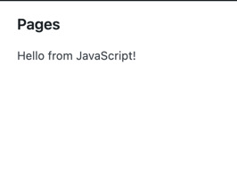

## Setup

We will build the application as a WordPress plugin, which means you need to have the WordPress itself installed. One way to do it is by following the instructions on [Getting Started](/docs/contributors/code/getting-started-with-code-contribution.md) page. Once your setup is finished, you can follow along with the rest of this tutorial.

## Creating a new plugin

To create a new plugin, create a `wp-content/plugins/first-gutenberg-app` directory in your local WordPress environment. We will need to create three files inside that directory:

* first-gutenberg-app.php – to create a new admin page
* script.js – for our JavaScript application
* style.css – for the minimal stylesheet

Go ahead and create these files using the following snippets:

**app.js:**
```js
function MyFirstApp() {
	return wp.element.createElement('span', {}, 'Hello from JavaScript!');
}

window.addEventListener( 'load', function() {
	wp.element.render(
		wp.element.createElement( MyFirstApp ),
		document.querySelector( '#my-first-gutenberg-app' )
	);
}, false );
```

**style.css:**
```css
.toplevel_page_my-first-gutenberg-app #wpcontent {
	background: #FFF;
}
#my-first-gutenberg-app {
	max-width: 500px;
}
#my-first-gutenberg-app ul,
#my-first-gutenberg-app ul li {
	list-style-type: disc;
}
#my-first-gutenberg-app ul {
	padding-left: 20px;
}
#my-first-gutenberg-app .components-search-control__input {
	height: 36px;
	margin-left: 0;
}
```

**first-gutenberg-app.php:**
```php
<?php
/**
 * Plugin Name: My first Gutenberg App
 *
 */

function my_admin_menu() {
	// Create a new admin page for our app
	add_menu_page(
		__( 'My first Gutenberg app', 'my-textdomain' ),
		__( 'My first Gutenberg app', 'my-textdomain' ),
		'manage_options',
		'my-first-gutenberg-app',
		function() {
			echo '
				<h2>Pages</h2>
				<div id="my-first-gutenberg-app"></div>
			';
		},
		'dashicons-schedule',
		3
	);
}

add_action( 'admin_menu', 'my_admin_menu' );

function load_custom_wp_admin_scripts( $hook ) {
	// Load only on ?page=my-first-gutenberg-app
	if ( $hook !== 'toplevel_page_my-first-gutenberg-app' ) {
		return;
	}

	// Load the style.css
	wp_register_style( 'my-first-gutenberg-app', plugins_url( 'my-first-gutenberg-app/style.css' ) );
	wp_enqueue_style( 'wp-components' );
	wp_enqueue_style( 'my-first-gutenberg-app' );

	// Load the required WordPress packages
	wp_enqueue_script( 'wp-components' );
	wp_enqueue_script( 'wp-data' );
	wp_enqueue_script( 'wp-core-data' );

	// Load the app.js
	wp_register_script(
		'my-first-gutenberg-app',
		plugins_url( 'my-first-gutenberg-app/app.js' ),
		array( 'wp-components', 'wp-data', 'wp-core-data' ),
	);
	wp_enqueue_script( 'my-first-gutenberg-app' );
}

add_action( 'admin_enqueue_scripts', 'load_custom_wp_admin_scripts' );
```

If you now go to the Plugins page, you should see a plugin called **My first Gutenberg App**. Go ahead and activate it. A new menu position labeled _My first Gutenberg app_ should show up. Once you click it, you will see a page that says _Hello from JavaScript!_:



Congratulations! You are now ready to start building the app!

## Trading readability for convenience

You don’t need any build tools to complete this tutorial. All the code examples work as provided even if you paste them into your browser’s developer tools.

The price to pay is in readability. The way React components are usually depicted is with the JSX syntax that looks like this:

```js
function MyFirstApp() {
	return <span> Hello from JavaScript! </span>;
}
```

It was tempting to use that syntax here, however, it would complicate the initial setup. We would need to install node.js, a build tool like webpack, and compile the app on each change. None of that is required for this tutorial. The trade-off is that we are restricted to the regular JavaScript syntax as below:

```js
function MyFirstApp() {
	return wp.element.createElement('span', {}, 'Hello from JavaScript!');
}
```

