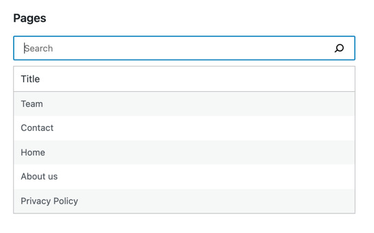
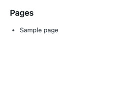
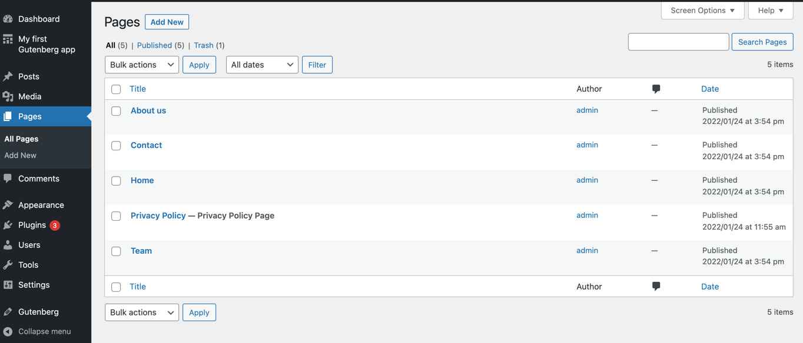
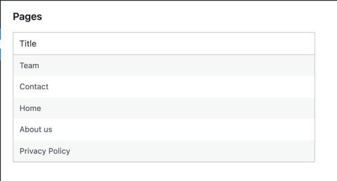
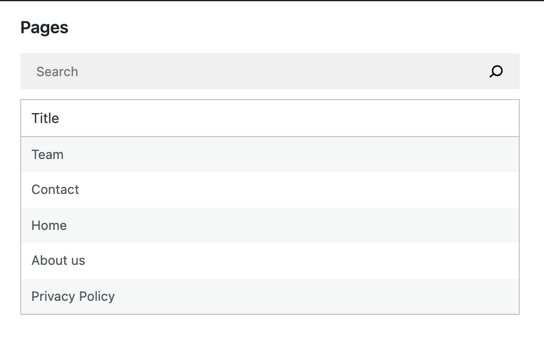
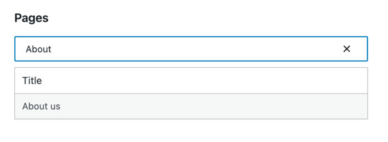
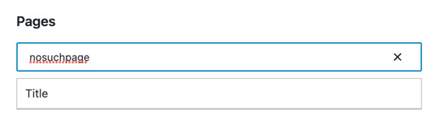
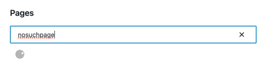
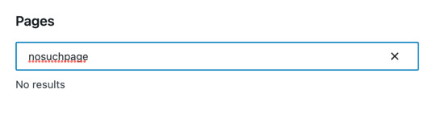

# Building a list of pages

In this part, we will build a filterable list of all WordPress pages. This is what the app will look like at the end of
this part:



Let’s see how we can get there step by step.

## Step 1: Build the PagesList component

Let’s start by building a minimal React component to display the list of pages:

```js
function MyFirstApp() {
	const pages = [{ id: 'mock', title: 'Sample page' }]
	return <PagesList pages={ pages }/>;
}

function PagesList( { pages } ) {
	return (
		<ul>
			{ pages?.map( page => (
				<li key={ page.id }>
					{ page.title }
				</li>
			) ) }
		</ul>
	);
}
```

Note that this component does not fetch any data yet, only presents the hardcoded list of pages. When you refresh the page,
you should see the following:



## Step 2: Fetch the data

The hard-coded sample page isn’t very useful. We want to display your actual WordPress pages so let’s fetch the actual
list of pages from the [WordPress REST API](https://developer.wordpress.org/rest-api/).

Before we start, let’s confirm we actually have some pages to fetch. Within WPAdmin, Navigate to Pages using the sidebar menu and
ensure it shows at least four or five Pages:



If it doesn’t, go ahead and create a few pages – you can use the same titles as on the screenshot above. Be sure to _
publish_ and not just _save_ them.

Now that we have the data to work with, let’s dive into the code. We will take advantage of the [`@wordpress/core-data` package](https://github.com/WordPress/gutenberg/tree/trunk/packages/core-data)
package which provides resolvers, selectors, and actions to work with the WordPress core API. `@wordpress/core-data` builds on top
of the [`@wordpress/data` package](https://github.com/WordPress/gutenberg/tree/trunk/packages/data).

To fetch the list of pages, we will use
the [`getEntityRecords`](/docs/reference-guides/data/data-core/#getentityrecords) selector. In broad strokes, it will
issue the correct API request, cache the results, and return the list of the records we need. Here’s how to use it:

```js
wp.data.select( 'core' ).getEntityRecords( 'postType', 'page' )
```

If you run that following snippet in your browser’s dev tools, you will see it returns `null`. Why? The pages are only
requested by the `getEntityRecords` resolver after first running the _selector_. If you wait a moment and re-run it, it
will return the list of all pages.

Similarly, the `MyFirstApp` component needs to re-run the selector once the data is available. That’s exactly what
the `useSelect` hook does:

```js
import { useSelect } from '@wordpress/data';
import { store as coreDataStore } from '@wordpress/core-data';

function MyFirstApp() {
	const pages = useSelect(
		select =>
			select( coreDataStore ).getEntityRecords( 'postType', 'page' ),
		[]
	);
	// ...
}
```

Note that we use an `import` statement inside index.js. This enables the plugin to automatically load the dependencies using `wp_enqueue_script`. Any references to `coreDataStore` are compiled to the same `wp.data` reference we use in browser's devtools.

`useSelect` takes two arguments: a callback and dependencies. In broad strokes, it re-runs the callback whenever either
the dependencies or the underlying data store changes. You can learn more about [useSelect](#) in
the [data module documentation](/packages/data/README.md#useselect).

Putting it together, we get the following code:

```js
import { useSelect } from '@wordpress/data';
import { store as coreDataStore } from '@wordpress/core-data';

function MyFirstApp() {
	const pages = useSelect(
		select =>
			select( coreDataStore ).getEntityRecords( 'postType', 'page' ),
		[]
	);
	return <PagesList pages={ pages }/>;
}

function PagesList( { pages } ) {
	return (
		<ul>
			{ pages?.map( page => (
				<li key={ page.id }>
					{ page.title.rendered }
				</li>
			) ) }
		</ul>
	)
}
```

Refreshing the page should display a list similar to this one:


## Step 3: Turn it into a table

```js
function PagesList( { pages } ) {
	return (
		<table className="wp-list-table widefat fixed striped table-view-list">
			<thead>
				<tr>
					<th>Title</th>
				</tr>
			</thead>
			<tbody>
				{ pages?.map( page => (
					<tr key={ page.id }>
						<td>{ page.title.rendered }</td>
					</tr>
				) ) }
			</tbody>
		</table>
	);
}
```



## Step 4: Add a search box

The list of pages is short for now; however, the longer it grows, the harder it is to work with. WordPress admins
typically solves this problem with a search box – let’s implement one too!

Let’s start by adding a search field:

```js
import { SearchControl } from '@wordpress/components';
import { useState, render } from '@wordpress/element';

function MyFirstApp() {
	const [searchTerm, setSearchTerm] = useState( '' );
	// ...
	return (
		<div>
			<SearchControl
				onChange={ setSearchTerm }
				value={ searchTerm }
			/>
			{/* ... */ }
		</div>
	)
}
```

Note that instead of using an `input` tag, we took advantage of
the [SearchControl](https://developer.wordpress.org/block-editor/reference-guides/components/search-control/) component.
This is what it looks like:



The field starts empty, and the contents are stored in the `searchTerm` state value. If you aren’t familiar with
the [useState](https://reactjs.org/docs/hooks-state.html) hook, you can learn more
in [React’s documentation](https://reactjs.org/docs/hooks-state.html).

We can now request only the pages matching the `searchTerm`.

After checking with the [WordPress API documentation]([https://developer.wordpress.org/rest-api/reference/pages/]), we
see that the [/wp/v2/pages]([https://developer.wordpress.org/rest-api/reference/pages/]) endpoint accepts a `search`
query parameter and uses it to  _limit results to those matching a string_. But how can we use it? We can pass custom query
parameters as the third argument to `getEntityRecords` as below:

```js
wp.data.select( 'core' ).getEntityRecords( 'postType', 'page', { search: 'home' } )
```

Running that snippet in your browser’s dev tools will trigger a request to `/wp/v2/pages?search=home` instead of
just `/wp/v2/pages`.

Let’s mirror this in our `useSelect` call as follows:

```js
import { useSelect } from '@wordpress/data';
import { store as coreDataStore } from '@wordpress/core-data';

function MyFirstApp() {
	// ...
	const { pages } = useSelect( select => {
		const query = {};
		if ( searchTerm ) {
			query.search = searchTerm;
		}
		return {
			pages: select( coreDataStore ).getEntityRecords( 'postType', 'page', query )
		}
	}, [searchTerm] );

	// ...
}
```

The `searchTerm` is now used as a `search` query parameter when provided. Note that `searchTerm` is also specified
inside the list of `useSelect` dependencies to make sure `getEntityRecords` is re-run when the `searchTerm` changes.

Finally, here’s how `MyFirstApp` looks once we wire it all together:

```js
import { SearchControl } from '@wordpress/components';
import { useState, render } from '@wordpress/element';
import { useSelect } from '@wordpress/data';
import { store as coreDataStore } from '@wordpress/core-data';

function MyFirstApp() {
	const [searchTerm, setSearchTerm] = useState( '' );
	const pages = useSelect( select => {
		const query = {};
		if ( searchTerm ) {
			query.search = searchTerm;
		}
		return select( coreDataStore ).getEntityRecords( 'postType', 'page', query );
	}, [searchTerm] );

	return (
		<div>
			<SearchControl
				onChange={ setSearchTerm }
				value={ searchTerm }
			/>
			<PagesList pages={ pages }/>
		</div>
	)
}
```

Voila! We can now filter the results:



### Using core-data instead vs calling the API directly

Let’s take a pause for a moment to consider the downsides of an alternative approach we could have taken - working with the API directly. Imagine we sent the API requests directly:

```js
import { apiFetch } from '@wordpress/api-fetch';
function MyFirstApp() {
	// ...
	const [pages, setPages] = useState( [] );
	useEffect( () => {
		const url = '/wp-json/wp/v2/pages?search=' + searchTerm;
		apiFetch( { url } )
			.then( setPages )
	}, [searchTerm] );
	// ...
}
```

Working outside of core-data, we would need to solve two problems here.

Firstly, out-of-order updates. Searching for „About” would trigger five API requests filtering for `A`, `Ab`, `Abo`, `Abou`, and
`About`. Theese requests could finish in a different order than they started. It is possible that _search=A_ would resolve after _
search=About_ and thus we’d display the wrong data.

Gutenberg data helps by handling the asynchronous part behind the scenes. `useSelect` remembers the most recent call and
returns only the data we expect.

Secondly, every keystroke would trigger an API request. If you typed `About`, deleted it, and retyped it, it would
issue 10 requests in total even though we could reuse the data.

Gutenberg data helps by caching the responses to API requests triggered by `getEntityRecords()`  and reuses them on
subsequent calls. This is especially important when other components rely on the same entity records.

All in all, the utilities built into core-data are designed to solve the typical problems so that you can focus on your application
instead.

## Step 5: Loading Indicator

There is one problem with our search feature. We can’t be quite sure whether it’s still searching or showing no results:



A few messages like  _Loading…_ or _No results_ would clear it up. Let’s implement them! First,  `PagesList` has to be
aware of the current status:

```js
import { SearchControl, Spinner } from '@wordpress/components';
function PagesList( { hasResolved, pages } ) {
	if ( !hasResolved ) {
		return <Spinner/>
	}
	if ( !pages?.length ) {
		return <div>No results</div>
	}
	// ...
}

function MyFirstApp() {
	// ...

	return (
		<div>
			// ...
			<PagesList hasResolved={ hasResolved } pages={ pages }/>
		</div>
	)
}
```

Note that instead of building a custom loading indicator, we took advantage of
the [Spinner](https://developer.wordpress.org/block-editor/reference-guides/components/spinner/) component.

We still need to know whether the pages selector `hasResolved` or not. We can find out using
the  `hasFinishedResolution` selector:

`wp.data.select('core').hasFinishedResolution( 'getEntityRecords', [ 'postType', 'page', { search: 'home' } ] )`

It takes the name of the selector and the _exact same arguments you passed to that selector_ and returns either `true` if the data was already loaded or `false`
it we’re still waiting. Let’s add it to `useSelect`:

```js
import { useSelect } from '@wordpress/data';
import { store as coreDataStore } from '@wordpress/core-data';

function MyFirstApp() {
	// ...
	const { pages, hasResolved } = useSelect( select => {
		// ...
		return {
			pages: select( coreDataStore ).getEntityRecords( 'postType', 'page', query ),
			hasResolved:
				select( coreDataStore ).hasFinishedResolution( 'getEntityRecords', ['postType', 'page', query] ),
		}
	}, [searchTerm] );

	// ...
}
```

There is just one last problem. It is easy to make a typo and end up passing different arguments to `getEntityRecords` and `hasFinishedResolution`. It is critical that they are identical. We can remove this risk by storing the arguments in a variable:

```js
import { useSelect } from '@wordpress/data';
import { store as coreDataStore } from '@wordpress/core-data';
function MyFirstApp() {
	// ...
	const { pages, hasResolved } = useSelect( select => {
		// ...
		const selectorArgs = [ 'postType', 'page', query ];
		return {
			pages: select( coreDataStore ).getEntityRecords( ...selectorArgs ),
			hasResolved:
				select( coreDataStore ).hasFinishedResolution( 'getEntityRecords', selectorArgs ),
		}
	}, [searchTerm] );

	// ...
}
```

All the pieces are in place, great! Here’s the complete JavaScript code of our app:

```js
import { SearchControl, Spinner } from '@wordpress/components';
import { useState, render } from '@wordpress/element';
import { useSelect } from '@wordpress/data';
import { store as coreDataStore } from '@wordpress/core-data';

function MyFirstApp() {
	const [ searchTerm, setSearchTerm ] = useState( '' );
	const { pages, hasResolved } = useSelect(
		( select ) => {
			const query = {};
			if ( searchTerm ) {
				query.search = searchTerm;
			}
			const selectorArgs = [ 'postType', 'page', query ];
			return {
				pages: select( coreDataStore ).getEntityRecords(
					...selectorArgs
				),
				hasResolved: select( coreDataStore ).hasFinishedResolution(
					'getEntityRecords',
					selectorArgs
				),
			};
		},
		[ searchTerm ]
	);

	return (
		<div>
			<SearchControl onChange={ setSearchTerm } value={ searchTerm } />
			<PagesList hasResolved={ hasResolved } pages={ pages } />
		</div>
	);
}

function PagesList( { hasResolved, pages } ) {
	if ( ! hasResolved ) {
		return <Spinner />;
	}
	if ( ! pages?.length ) {
		return <div>No results</div>;
	}

	return (
		<table className="wp-list-table widefat fixed striped table-view-list">
			<thead>
				<tr>
					<td>Title</td>
				</tr>
			</thead>
			<tbody>
				{ pages?.map( ( page ) => (
					<tr key={ page.id }>
						<td>{ page.title.rendered }</td>
					</tr>
				) ) }
			</tbody>
		</table>
	);
}

window.addEventListener(
	'load',
	function () {
		render(
			<MyFirstApp />,
			document.querySelector( '#my-first-gutenberg-app' )
		);
	},
	false
);
```

All that’s left is to refresh the page and enjoy the brand new status indicator:




## What's next?

* **Previous part:** [Setup](./1-setup.md)
* **Next part:** Adding an „Edit page” feature (coming soon)
* (optional) Review the [finished app](https://github.com/WordPress/gutenberg-examples/tree/trunk/09-code-data-basics-esnext) in the gutenberg-examples repository
