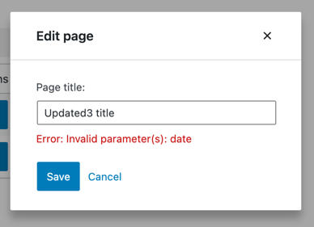
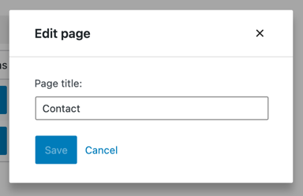
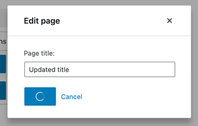

# Building an edit form

This part is about adding an *Edit* feature to our app. Here's a glimpse of what we're going to build:


### Step 1: Add an _Edit_ button

We can't have an *Edit* form without an *Edit* Button, so let's start by adding one to our `PagesList` component:

```js
import { Button } from '@wordpress/components';
import { decodeEntities } from '@wordpress/html-entities';

const PageEditButton = () => (
	<Button variant="primary">
		Edit
	</Button>
)

function PagesList( { hasResolved, pages } ) {
	if ( ! hasResolved ) {
		return <Spinner />;
	}
	if ( ! pages?.length ) {
		return <div>No results</div>;
	}

	return (
		<table className="wp-list-table widefat fixed striped table-view-list">
			<thead>
				<tr>
					<td>Title</td>
					<td style={{width: 120}}>Actions</td>
				</tr>
			</thead>
			<tbody>
				{ pages?.map( ( page ) => (
					<tr key={page.id}>
						<td>{ decodeEntities( page.title.rendered ) }</td>
						<td>
							<PageEditButton pageId={ page.id } />
						</td>
					</tr>
				) ) }
			</tbody>
		</table>
	);
}
```

The only change in `PagesList` is the additional column labeled _Actions_:


### Step 2: Display an _Edit_ form

Our button looks nice but doesn't do anything yet. To display an edit form, we need to have one first – let's create it:

```js
import { Button, TextControl } from '@wordpress/components';
export function EditPageForm( { pageId, onCancel, onSaveFinished } ) {
	return (
		<div className="my-gutenberg-form">
			<TextControl
				value=''
				label='Page title:'
			/>
			<div className="form-buttons">
				<Button onClick={ onSaveFinished } variant="primary">
					Save
				</Button>
				<Button onClick={ onCancel } variant="tertiary">
					Cancel
				</Button>
			</div>
		</div>
	);
}
```

Now let's make the button display the form we just created. As this tutorial is not focused on web design, we will wire the two together using a component that requires the least code: [`Modal`](https://developer.wordpress.org/block-editor/reference-guides/components/modal/). Let's update `PageEditButton` accordingly:

```js
import { Button, Modal, TextControl } from '@wordpress/components';

function PageEditButton({ pageId }) {
	const [ isOpen, setOpen ] = useState( false );
	const openModal = () => setOpen( true );
	const closeModal = () => setOpen( false );
	return (
		<>
			<Button
				onClick={ openModal }
				variant="primary"
			>
				Edit
			</Button>
			{ isOpen && (
				<Modal onRequestClose={ closeModal } title="Edit page">
					<EditPageForm
						pageId={pageId}
						onCancel={closeModal}
						onSaveFinished={closeModal}
					/>
				</Modal>
			) }
		</>
	)
}
```

When you click the *Edit* button now, you should see the following modal:


Great! We now have a basic user interface to work with.

### Step 3: Populate the form with page details

We want the `EditPageForm` to display the title of the currently edited page. You may have noticed that it doesn't receive a `page` prop, only `pageId`. That's okay. Gutenberg Data allows us to easily access entity records from any component.

In this case, we need to use the [`getEntityRecord`](/docs/reference-guides/data/data-core/#getentityrecord) selector. The list of records is already available thanks to the `getEntityRecords` call in `MyFirstApp`, so there won't even be any additional HTTP requests involved – we'll get the cached record right away.

Here's how you can try it in your browser's dev tools:

```js
wp.data.select( 'core' ).getEntityRecord( 'postType', 'page', 9 );  // Replace 9 with an actual page ID
```

Let's update `EditPageForm` accordingly:

```js
export function EditPageForm( { pageId, onCancel, onSaveFinished } ) {
	const page = useSelect(
		select => select( coreDataStore ).getEntityRecord( 'postType', 'page', pageId ),
		[pageId]
	);
	return (
		<div className="my-gutenberg-form">
			<TextControl
				label='Page title:'
				value={ page.title }
			/>
			{ /* ... */ }
		</div>
	);
}
```

Now it should look like that:


### Step 4: Making the Page title field editable

There's one problem with our _Page title_ field: you can't edit it. It receives a fixed `value` but doesn't update it when typing. We need an `onChange` handler.


You may have seen a pattern similar to this one in other React apps. It's known as a ["controlled component"](https://reactjs.org/docs/forms.html#controlled-components):

```js
export function VanillaReactForm({ initialTitle }) {
	const [title, setTitle] = useState( initialTitle );
	return (
		<TextControl
			value={ title }
			onChange={ setTitle }
		/>
	);
}
```

Updating entity records in Gutenberg Data is similar but instead of using `setTitle` to store in local state, we use the `editEntityRecord` action which stores the updates in the _Redux_ state. Here's how you can try it out in your browser's dev tools:

```js
// Get a real page ID first
const pageId = wp.data.select( 'core' ).getEntityRecords( 'postType', 'page' )[0].id;

// Update the title
wp.data.dispatch( 'core' ).editEntityRecord( 'postType', 'page', pageId, { title: 'updated title' } );
```

At this point, you may ask _how is `editEntityRecord` better than `useState`? The answer is that it offers a few features you wouldn't otherwise get.

Firstly, we can save the changes as easily as we retrieve the data and ensure that all caches will be correctly updated.

Secondly, the changes applied via `editEntityRecord` are easily undo-able via the `undo` and `redo` actions.

Lastly, because the changes live in the _Redux_ state, they are "global" and can be accessed by other components. For example, we could make the `PagesList` display the currently edited title.

To that last point, let's see what happens when we use `getEntityRecord` to access the entity record we just updated:

```js
wp.data.select( 'core' ).getEntityRecord( 'postType', 'page', pageId ).title
```

It doesn't reflect the edits. What's going on?

Well, let's imagine for a second that it would reflect the edits. If it did, then anything you typed in the title field would be _immediately_ displayed inside the `PagesList`.

Gutenberg Data solves this problem by distinguishing between *Entity Records* and *Edited Entity Records*.

Calling `getEntityRecord` always returns the data retrieved _from the API_. To see the edits applied, we need to use `getEditedEntityRecord` instead:

```js
// Replace 9 with an actual page ID
wp.data.select( 'core' ).getEditedEntityRecord( 'postType', 'page', 9 ).title
// 'updated title'
```

Let's update `EditPageForm` accordingly. We can access the actions using the [`useDispatch`](/packages/data/README.md#usedispatch) hook similarly to how we use `useSelect` to access selectors:

```js
import { useDispatch } from '@wordpress/data';

export function EditPageForm( { pageId, onCancel, onSaveFinished } ) {
	const page = useSelect(
		select => select( coreDataStore ).getEditedEntityRecord( 'postType', 'page', pageId ),
		[ pageId ]
	);
	const { editEntityRecord } = useDispatch( coreDataStore );
	const handleChange = ( title ) => editEntityRecord( 'postType', 'page', pageId, { title } );

	return (
		<div className="my-gutenberg-form">
			<TextControl
				label="Page title:"
				value={ page.title }
				onChange={ handleChange }
			/>
			<div className="form-buttons">
				<Button onClick={ onSaveFinished } variant="primary">
					Save
				</Button>
				<Button onClick={ onCancel } variant="tertiary">
					Cancel
				</Button>
			</div>
		</div>
	);
}
```

We added an `onChange` handler to keep track of edits via the `editEntityRecord` action and then changed the selector to `getEditedEntityRecord` so that `page.title` always reflects the changes.

This is what it looks like now:


### Step 5: Saving the form data

Now that we can edit the page title let's also make sure we can save it. In Gutenberg data, we save changes to the WordPress REST API using the `saveEditedEntityRecord` action. It sends the request, processes the result, and updates the cached data in the Redux state.

Here's an example you may try in your browser's dev tools:

```js
// Replace 9 with an actual page ID
wp.data.dispatch( 'core' ).editEntityRecord( 'postType', 'page', 9, { title: 'updated title' } );
wp.data.dispatch( 'core' ).saveEditedEntityRecord( 'postType', 'page', 9 );
```

The above snippet saved a new title. Unlike before, the updated title is now returned by `getEntityRecord`:

```js
// Replace 9 with an actual page ID
wp.data.select( 'core' ).getEntityRecord( 'postType', 'page', 9 ).title
// "updated title"
```

This is how the `EditPageForm` looks like with a working *Save* button:

```js
export function EditPageForm( { pageId, onCancel, onSaveFinished } ) {
	// ...
	const { saveEditedEntityRecord } = useDispatch( coreDataStore );
	const handleSave = () => saveEditedEntityRecord( 'postType', 'page', pageId );

	return (
		<div className="my-gutenberg-form">
			{/* ... */}
			<div className="form-buttons">
				<Button onClick={ handleSave } variant="primary">
					Save
				</Button>
				{/* ... */}
			</div>
		</div>
	);
}
```

It works, but there's still one thing to fix: the form modal doesn't automatically close because we never call `onSaveFinished`. Lucky for us, `saveEditedEntityRecord` returns a promise that resolves once the save operation is finished. Let's take advantage of it in `EditPageForm`:

```js
export function EditPageForm( { pageId, onCancel, onSaveFinished } ) {
	// ...
	const handleSave = async () => {
		await saveEditedEntityRecord( 'postType', 'page', pageId );
		onSaveFinished();
	};
	// ...
}
```

### Step 6: Handle errors

We optimistically assumed that a *save* operation would always succeed. Unfortunately, it may fail in many ways:

* The website can be down
* The update may be invalid
* The page could have been deleted by someone else in the meantime

To tell the user when any of these happens, we have to make two adjustments. We don't want to close the form modal when the update fails. The promise returned by `saveEditedEntityRecord` is resolved with an updated record only if the update actually worked. When something goes wrong, it resolves with an empty value. Let's use it to keep the modal open:

```js
export function EditPageForm( { pageId, onSaveFinished } ) {
	// ...
	const handleSave = async () => {
		const updatedRecord = await saveEditedEntityRecord( 'postType', 'page', pageId );
		if ( updatedRecord ) {
			onSaveFinished();
		}
	};
	// ...
}
```

Great! Now, let's display an error message. The failure details can be grabbed using the `getLastEntitySaveError` selector:

```js
// Replace 9 with an actual page ID
wp.data.select( 'core' ).getLastEntitySaveError( 'postType', 'page', 9 )
```

Here's how we can use it in `EditPageForm`:

```js
export function EditPageForm( { pageId, onSaveFinished } ) {
	// ...
    const { lastError, page } = useSelect(
        select => ({
			page: select( coreDataStore ).getEditedEntityRecord( 'postType', 'page', pageId ),
			lastError: select( coreDataStore ).getLastEntitySaveError( 'postType', 'page', pageId )
		}),
        [ pageId ]
	)
	// ...
	return (
		<>
			{/* ... */}
			{ lastError ? (
				<div className="form-error">
					Error: { lastError.message }
				</div>
			) : false }
			{/* ... */}
		</>
	);
}
```

Great! `EditPageForm` is now fully aware of errors.

Let's see that error message in action. We'll trigger an invalid update and let it fail. The post title is hard to break, so let's set a `date` property to `-1` instead – that's a guaranteed validation error:

```js
export function EditPageForm( { pageId, onCancel, onSaveFinished } ) {
	// ...
	const handleChange = ( title ) => editEntityRecord( 'postType', 'page', pageId, { title, date: -1 } );
	// ...
}
```

Once you refresh the page, open the form, change the title, and hit save, you should see the following error message:



Fantastic! We can now **restore the previous version of `handleChange`** and move on to the next step.

### Step 7: Status indicator

There is one last problem with our form: no visual feedback. We can’t be quite sure whether the *Save* button worked until either the form disappears or an error message shows.

We're going to clear it up and communicate two states to the user: _Saving_ and _No changes detected_. The relevant selectors are `isSavingEntityRecord` and `hasEditsForEntityRecord`. Unlike `getEntityRecord`, they never issue any HTTP requests but only return the current entity record state.

Let's use them in `EditPageForm`:

```js
export function EditPageForm( { pageId, onSaveFinished } ) {
	// ...
	const { isSaving, hasEdits, /* ... */ } = useSelect(
		select => ({
			isSaving: select( coreDataStore ).isSavingEntityRecord( 'postType', 'page', pageId ),
			hasEdits: select( coreDataStore ).hasEditsForEntityRecord( 'postType', 'page', pageId ),
			// ...
		}),
		[ pageId ]
	)
}
```

We can now use `isSaving` and `hasEdits` to display a spinner when saving is in progress and grey out the save button when there are no edits:

```js

export function EditPageForm( { pageId, onSaveFinished } ) {
	// ...
	return (
		// ...
		<div className="form-buttons">
			<Button onClick={ handleSave } variant="primary" disabled={ ! hasEdits || isSaving }>
				{ isSaving ? <Spinner/> : 'Save' }
			</Button>
		</div>
		// ...
	);
}
```

Note that we disable the save button when there are no edits and when the page is currently being saved. This is to prevent the user from accidentally pressing the button twice.

Here's what it looks like in action:




### Wiring it all together

All the pieces are in place, great! Here’s everything we built in this chapter in one place:

```js
import { useDispatch } from '@wordpress/data';
import { Button, Modal, TextControl } from '@wordpress/components';

function PageEditButton( { pageId } ) {
	const [ isOpen, setOpen ] = useState( false );
	const openModal = () => setOpen( true );
	const closeModal = () => setOpen( false );
	return (
		<>
			<Button onClick={ openModal } variant="primary">
				Edit
			</Button>
			{ isOpen && (
				<Modal onRequestClose={ closeModal } title="Edit page">
					<EditPageForm
						pageId={ pageId }
						onCancel={ closeModal }
						onSaveFinished={ closeModal }
					/>
				</Modal>
			) }
		</>
	);
}

export function EditPageForm( { pageId, onCancel, onSaveFinished } ) {
	const { page, lastError, isSaving, hasEdits } = useSelect(
		( select ) => ( {
			page: select( coreDataStore ).getEditedEntityRecord( 'postType', 'page', pageId ),
			lastError: select( coreDataStore ).getLastEntitySaveError( 'postType', 'page', pageId ),
			isSaving: select( coreDataStore ).isSavingEntityRecord( 'postType', 'page', pageId ),
			hasEdits: select( coreDataStore ).hasEditsForEntityRecord( 'postType', 'page', pageId ),
		} ),
		[ pageId ]
	);

	const { saveEditedEntityRecord, editEntityRecord } = useDispatch( coreDataStore );
	const handleSave = async () => {
		const savedRecord = await saveEditedEntityRecord( 'postType', 'page', pageId );
		if ( savedRecord ) {
			onSaveFinished();
		}
	};
	const handleChange = ( title ) =>  editEntityRecord( 'postType', 'page', page.id, { title } );

	return (
		<div className="my-gutenberg-form">
			<TextControl
				label="Page title:"
				value={ page.title }
				onChange={ handleChange }
			/>
			{ lastError ? (
				<div className="form-error">Error: { lastError.message }</div>
			) : (
				false
			) }
			<div className="form-buttons">
				<Button
					onClick={ handleSave }
					variant="primary"
					disabled={ ! hasEdits || isSaving }
				>
					{ isSaving ? <Spinner /> : 'Save' }
				</Button>
				<Button onClick={ onCancel } variant="tertiary">
					Cancel
				</Button>
			</div>
		</div>
	);
}
```

## What's next?

* **Previous part:** [Building a list of pages](/docs/how-to-guides/data-basics/2-building-a-list-of-pages.md)
* **Next part:** Building a *New Page* form (coming soon)
* (optional) Review the [finished app](https://github.com/WordPress/gutenberg-examples/tree/trunk/09-code-data-basics-esnext) in the gutenberg-examples repository
