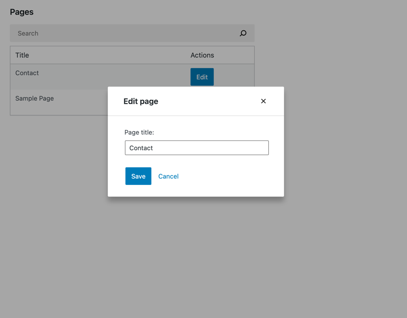
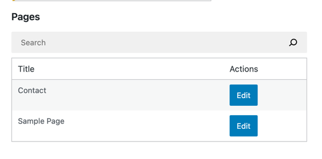
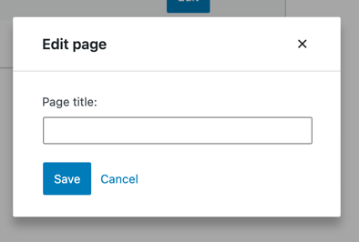
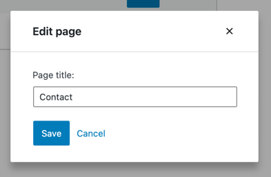
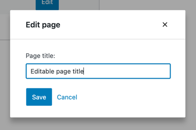

# Building an edit form

In this part, we will add an edit feature to the pages list we built in the last step:



Let’s see how we can get there step by step.

### Adding an edit button

Firstly, we need to add an *Edit* button to the `PagesList` component. The minimal required change looks like this:

```js
import { Button } from '@wordpress/components';

function PagesList( { hasResolved, pages } ) {
	if ( ! hasResolved ) {
		return <Spinner />;
	}
	if ( ! pages?.length ) {
		return <div>No results</div>;
	}

	return (
		<table className="wp-list-table widefat fixed striped table-view-list">
			<thead>
			<tr>
				<td>Title</td>
				<td style={{width: 120}}>Actions</td>
			</tr>
			</thead>
			<tbody>
			{ pages?.map( ( page ) => (
				<tr key={page.id}>
					<td>{ page.title.rendered }</td>
					<td>
						<PageEditButton pageId={ page.id } />
					</td>
				</tr>
			) ) }
			</tbody>
		</table>
	);
}

const PageEditButton = () => (
	<Button variant="primary">
		Edit
	</Button>
)
```

Once you refresh the page, you should see the following:



The button is in place, but it doesn't do anything yet. We want it to display the page edit form. A convenient way to make it happen is by using the [`Modal` component from the `@wordpress/components` package](https://developer.wordpress.org/block-editor/reference-guides/components/modal/). Let's update the  `PageEditButton` accordingly:

```js
import { Button, Modal, TextControl } from '@wordpress/components';

function PageEditButton({ pageId }) {
	const [ isOpen, setOpen ] = useState( false );
	const openModal = () => setOpen( true );
	const closeModal = () => setOpen( false );
	return (
		<>
			<Button
				onClick={ openModal }
				variant="primary"
			>
				Edit
			</Button>
			{ isOpen && (
				<Modal onRequestClose={ closeModal } title="Edit page">
					<PageTitleForm
						pageId={pageId}
						onCancel={closeModal}
						onSaveFinished={closeModal}
					/>
				</Modal>
			) }
		</>
	)
}

export function PageTitleForm( { pageId, onCancel, onSaveFinished } ) {
	return (
		<div className="my-gutenberg-form">
			<TextControl
				value={ '' }
				label={ "Page title:" }
			/>
			<div className="form-buttons">
				<Button onClick={ onSaveFinished } variant="primary">
					Save
				</Button>
				<Button onClick={ onCancel } variant="tertiary">
					Cancel
				</Button>
			</div>
		</div>
	);
}
```

When you click the *Edit* button now, you should see the following modal:



Great! We now have a basic user interface to work with. Our `PageTitleForm` doesn't do anything yet, though. Let's change that!

### Populating the title field

We need to populate the input field with the actual page title. But how can we do that when the `PageTitleForm` only has access to the `pageId` and not the actual `page`? Enter the [`getEntityRecord`](/docs/reference-guides/data/data-core/#getentityrecord) selector.

[`getEntityRecord`](/docs/reference-guides/data/data-core/#getentityrecord) retrieves the appropriate from WordPress REST API, or reuses the one already retrieved if available. Here’s how to try it in your browser's dev tools:

```js
wp.data.select( 'core' ).getEntityRecord( 'postType', 'page', 9 );  // Replace 9 with an actual page ID
```

The records we're interested in are already cached by the `getEntityRecords` call inside the `MyFirstApp` component, so `getEntityRecord` won't trigger any extra HTTP requests.

Let's put it to use in `PageTitleForm`:

```js
export function PageTitleForm( { pageId, onCancel, onSaveFinished } ) {
	const page = useSelect(
		select => select( coreDataStore ).getEntityRecord( 'postType', 'page', pageId ),
		[pageId]
	);
	return (
		<div className="my-gutenberg-form">
			<TextControl
				value={ page.title }
				label={ "Page title:" }
			/>
			{ /* ... */ }
		</div>
	);
}
```



Splendid, it looks like a real form already! Unfortunately, the input field isn't editable yet – let's fix that.

### Making the title field editable

The `TextControl` we use has a `value`, but that `value` never changes. We're missing an `onChange` handler that would update it. You may have seen a pattern similar to this one in other React apps:

```js
export function VanillaReactForm({ initialTitle }) {
	const [title, setTitle] = useState( initialTitle );
	return (
		<TextControl
			value={ title }
			onChange={ setTitle }
		/>
	);
}
```

Working with entity records in Gutenberg data is similar. The counterpart of `setTitle` is a `editEntityRecord` Redux action. It takes the entity kind, name, id, and changes, and stores them in a Redux state for later. Here's how you can try out in your browser's dev tools:

```js
// Replace 9 with an actual page ID
wp.data.dispatch( 'core' ).editEntityRecord( 'postType', 'page', 9, { title: 'updated title' } );
```

How do we know if it worked? We could use `getEntityRecord` to check the current title:

```js
// Replace 9 with an actual page ID
wp.data.select( 'core' ).getEntityRecord( 'postType', 'page', 9 ).title
```

But, surprisingly, it shows the original title without any changes. What is going on?

Gutenberg Data distinguishes between *Entity Records* and *Edited Entity Records*. Calling `getEntityRecord` always returns the data retrieved from the API. This allows us to edit the pages without affecting the titles displayed inside of `PagesList`.

To work with the API data with user edits applied, we need to use `getEditedEntityRecord`:

```js
// Replace 9 with an actual page ID
wp.data.select( 'core' ).getEditedEntityRecord( 'postType', 'page', 9 ).title
// 'updated title'
```

This is how it all comes together in `PageTitleForm`:

```js
import { useDispatch } from '@wordpress/data';

export function PageTitleForm( { pageId, onCancel, onSaveFinished } ) {
	const page = useSelect(
		select => select(coreDataStore).getEditedEntityRecord('postType', 'page', pageId),
		[ pageId ]
	);
	const { editEntityRecord } = useDispatch( coreDataStore );

	return (
		<div className="my-gutenberg-form">
			<TextControl
				value={ page.title }
				label={ "Page title:" }
				onChange={ ( title ) => editEntityRecord( 'postType', 'page', page.id, { title } ) }
			/>
			<div className="form-buttons">
				<Button onClick={ onSaveFinished } variant="primary">
					Save
				</Button>
				<Button onClick={ onCancel } variant="tertiary">
					Cancel
				</Button>
			</div>
		</div>
	);
}
```

And here's how it looks like:



#### `useState` vs `editEntityRecord`

There are three major upsides of using `editEntityRecord` instead of React's `useState`.

First, we can lean on Gutenberg data to save the edits with the same ease as it retrieves the data.

Second, we get access to undo and redo features.

Third, other components have access to the changes. For example, we could make the `PagesList` display the currently edited title by leveraging `getEditedEntityRecord`.

### Saving the updated title

`saveEditedEntityRecord` action

```js
export function PageTitleForm( { pageId, onCancel, onSaveFinished } ) {
	// ...
	const { editEntityRecord, saveEditedEntityRecord } = useDispatch( coreDataStore );
	const handleSave = async () => {
		await saveEditedEntityRecord( 'postType', 'page', pageId );
		onSaveFinished();
	};

	return (
		<div className="my-gutenberg-form">
			{/* ... */}
			<div className="form-buttons">
				<Button onClick={ handleSave } variant="primary">
					Save
				</Button>
				{/* ... */}
			</div>
		</div>
	);
}
```

### Progress indicator
### Handle errors
### Wiring it all together


## What's next?

* **Previous part:** [Building a list of pages](./2-building-a-list-of-pages.md)
* **Next part:** Building a *New Page* form (coming soon)
* (optional) Review the [finished app](https://github.com/WordPress/gutenberg-examples/tree/trunk/09-code-data-basics-esnext) in the gutenberg-examples repository
