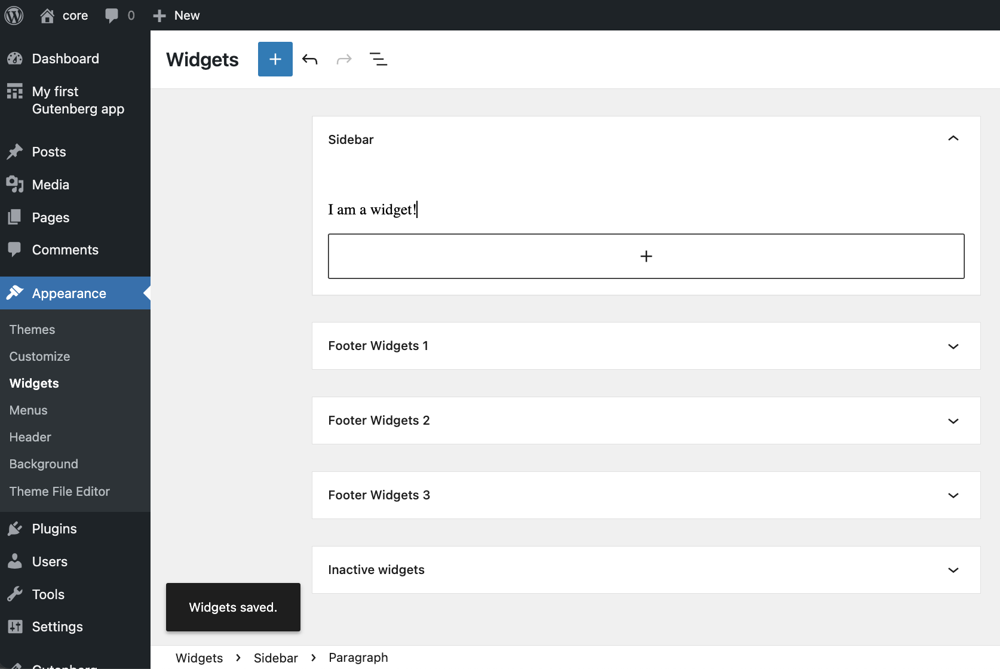
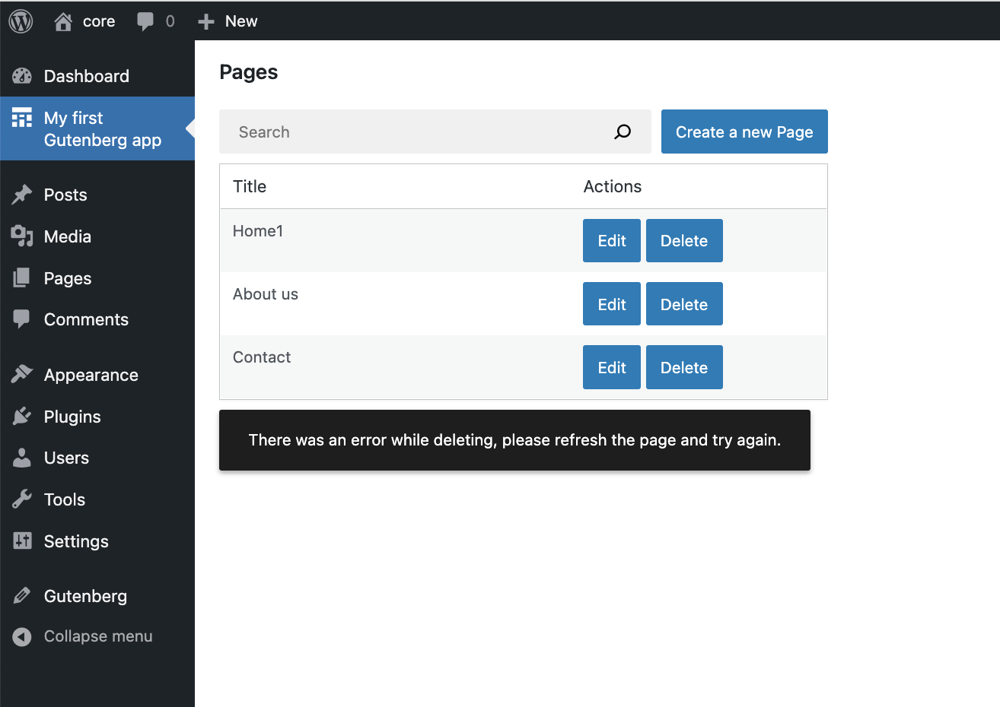

# Adding a delete button

This part is about adding a *Delete* feature to our app. Here's a glimpse of what we're going to build:


### Step 1: Add a _Delete_ button

Let's start by creating the `DeletePageButton` component and updating the user interface of our `PagesList` component:

```js
import { Button } from '@wordpress/components';
import { decodeEntities } from '@wordpress/html-entities';

const DeletePageButton = () => (
	<Button variant="primary">
		Delete
	</Button>
)

function PagesList( { hasResolved, pages } ) {
	if ( ! hasResolved ) {
		return <Spinner />;
	}
	if ( ! pages?.length ) {
		return <div>No results</div>;
	}

	return (
		<table className="wp-list-table widefat fixed striped table-view-list">
			<thead>
				<tr>
					<td>Title</td>
					<td style={{width: 190}}>Actions</td>
				</tr>
			</thead>
			<tbody>
				{ pages?.map( ( page ) => (
					<tr key={page.id}>
						<td>{ decodeEntities( page.title.rendered ) }</td>
						<td>
							<div className="form-buttons">
								<EditPageButton pageId={ page.id } />
								<DeletePageButton pageId={ page.id } />
							</div>
						</td>
					</tr>
				) ) }
			</tbody>
		</table>
	);
}
```

This is how the PagesList should look like now:


### Step 2: Wire the button to a delete action

In Gutenberg data, we delete entity records from the WordPress REST API using the `deleteEntityRecord` action. It sends the request, processes the result, and updates the cached data in the Redux state.

Here's how you can try it in your browser's dev tools:

```js
// We need a valid page ID to call deleteEntityRecord, so let's get the first available one using getEntityRecords.
const pageId = wp.data.select( 'core' ).getEntityRecords( 'postType', 'page' )[0].id;

// Now let's delete that page:
const promise = wp.data.dispatch( 'core' ).deleteEntityRecord( 'postType', 'page', pageId );

// promise gets resolved or rejected when the API request succeeds or fails.
```

Once the REST API request is finished, you will notice one of the pages has disappeared from the list. This is because that list is populated by using `useSelect()` and the `select( coreDataStore ).getEntityRecords( 'postType', 'page' )` selector. Anytime the underlying data changes, the list gets re-rendered with fresh data. That's pretty convenient!

Let's dispatch that action when `DeletePageButton` is clicked:

```js
const DeletePageButton = ({ pageId }) => {
	const { deleteEntityRecord } = useDispatch( coreDataStore );
	const handleDelete = () => deleteEntityRecord( 'postType', 'page', pageId );
	return (
		<Button variant="primary" onClick={ handleDelete }>
			Delete
		</Button>
	);
}
```

### Step 3: Add visual feedback

It may take a few moments for the REST API request to finish after clicking the _Delete_ button. Let's communicate that with a `<Spinner />` component in a similar fashion as we did in the previous parts of this tutorial.

We'll need the `isDeletingEntityRecord` selector for that. It is similar to the `isSavingEntityRecord` selector we've already seen in [part 3](/docs/how-to-guides/data-basics/3-building-an-edit-form.md): it returns `true` or `false` and never issues any HTTP requests:

```js
const DeletePageButton = ({ pageId }) => {
	// ...
	const { isDeleting } = useSelect(
		select => ({
			isDeleting: select( coreDataStore ).isDeletingEntityRecord( 'postType', 'page', pageId ),
		}),
		[ pageId ]
	)
	return (
		<Button variant="primary" onClick={ handleDelete } disabled={ isDeleting }>
			{ isDeleting ? (
				<>
					<Spinner />
					Deleting...
				</>
			) : 'Delete' }
		</Button>
	);
}
```

Here's what it looks like in action:


### Step 4: Handle errors

We optimistically assumed that a *delete* operation would always succeed. Unfortunately, under the hood, it is a REST API request that can fail in many ways:

* The website can be down
* The update may be invalid
* The page could have been deleted by someone else in the meantime

To tell the user when any of these happens, we need to extract the error information using the `getLastEntityDeleteError` selector:

```js
// Replace 9 with an actual page ID
wp.data.select( 'core' ).getLastEntityDeleteError( 'postType', 'page', 9 )
```

Here's how we can apply it in `DeletePageButton`:

```js
import { useEffect } from '@wordpress/element';
const DeletePageButton = ({ pageId }) => {
	// ...
	const { error, /* ... */ } = useSelect(
		select => ( {
			error: select( coreDataStore ).getLastEntityDeleteError( 'postType', 'page', pageId ),
			// ...
		} ),
		[pageId]
	);
	useEffect( () => {
		if ( error ) {
			// Display the error
		}
	}, [error] )

	// ...
}
```

The `error` object comes from the `@wordpress/api-fetch` and contains information about the failure reason. It has the following properties:

* `message` – a human-readable error message such as `Invalid post ID`.
* `code` – a string-based error code such as `rest_post_invalid_id`. To learn about all possible error codes you'd need to refer to the [`/v2/pages` endpoint's source code](https://github.com/WordPress/wordpress-develop/blob/2648a5f984b8abf06872151898e3a61d3458a628/src/wp-includes/rest-api/endpoints/class-wp-rest-revisions-controller.php#L226-L230).
* `data` (optional) – error details, contains the `code` property containing the HTTP response code for the failed request.

In this tutorial, we will display the `error.message` to the user.

In WordPress, there is an established patterns of displaying status information using the `Snackbar` component:





```js
import { SnackbarList } from '@wordpress/components';
import { store as noticesStore } from '@wordpress/notices';

function SnackbarNotices() {
	const notices = useSelect(
		( select ) => select( noticesStore ).getNotices(),
		[]
	);
	const { removeNotice } = useDispatch( noticesStore );
	const snackbarNotices = notices.filter( ({ type }) => type === 'snackbar' );

	return (
		<SnackbarList
			notices={ snackbarNotices }
			className="components-editor-notices__snackbar"
			onRemove={ removeNotice }
		/>
	);
}

function MyFirstApp() {
	// ...
	return (
		<div>
			{/* ... */}
			<SnackbarNotices />
		</div>
	);
}
```

Now we're ready to tell the user about any errors that may have occurred.

```js
import { useEffect } from '@wordpress/element';
const DeletePageButton = ({ pageId }) => {
	const { deleteEntityRecord } = useDispatch( coreDataStore );
	// ...
	const { error, /* ... */ } = useSelect(
		select => ( {
			error: select( coreDataStore ).getLastEntityDeleteError( 'postType', 'page', pageId ),
			// ...
		} ),
		[pageId]
	);
	useEffect( () => {
		if ( error ) {
			// Display the error
		}
	}, [error] )

	// ...
}
function DeletePageButton( { pageId } ) {
	const { createErrorNotice } = useDispatch( noticesStore );
	// ...
	const { error, isDeleting } = useSelect(
		select => ( {
			error: select( coreDataStore ).getLastEntityDeleteError( 'postType', 'page', pageId ),
			isDeleting: select( coreDataStore ).isDeletingEntityRecord( 'postType', 'page', pageId ),
		} ),
		[ pageId ]
	);

	useEffect( () => {
		if ( error ) {
			const message = ( error?.message || 'There was an error.' ) + ' Please refresh the page and try again.'
			createErrorNotice( , {
				type: 'snackbar',
			} );
		}
	}, [ error ] )
    // ...
}
```

Great! `DeletePageButton` is now fully aware of errors. Let's see that error message in action. We'll trigger an invalid delete and let it fail. One way to do it is to set the `id` to `-1`:

```js
export function DeletePageButton( { pageId, onCancel, onSaveFinished } ) {
	// ...
	pageId = pageId * -1;
	const handleDelete = () => deleteEntityRecord( 'postType', 'page', pageId );
	// ...
}
```

Once you refresh the page and click any `Delete` button, you should see the following error message:




Fantastic! We can now **remove the `pageId = pageId * -1;` line.**

Before we move on to the next step, let's also confirm a successful deletion with another snackbar message:

```js

function DeletePageButton( { pageId } ) {
	const { deleteEntityRecord } = useDispatch( coreDataStore );
	const { createSuccessNotice, createErrorNotice } = useDispatch( noticesStore );
	const handleDelete = async () => {
		const success = await deleteEntityRecord( 'postType', 'page', pageId );
		if ( success ) {
			createSuccessNotice( "The page was deleted!", {
				type: 'snackbar',
			} );
		}
	}
	// ...
}
```

Here's what you should see after applying these changes and deleting a page:


And that's it!

### Wiring it all together

All the pieces are in place, great! Here’s all the changes we've made in this chapter:

```js
import { useSelect, useDispatch } from '@wordpress/data';
import { useState, useEffect } from '@wordpress/element';
import { Button, Modal, TextControl } from '@wordpress/components';

function MyFirstApp() {
	const [searchTerm, setSearchTerm] = useState( '' );
	const { pages, hasResolved } = useSelect(
		( select ) => {
			const query = {};
			if ( searchTerm ) {
				query.search = searchTerm;
			}
			const selectorArgs = ['postType', 'page', query];
			const pages = (
				select( coreDataStore )
					.getEntityRecords( ...selectorArgs )
					?.filter( page => ! select( coreDataStore ).isDeletingEntityRecord('postType', 'page', page.id ) )
			);
			return {
				pages,
				hasResolved: select( coreDataStore ).hasFinishedResolution(
					'getEntityRecords',
					selectorArgs,
				),
			};
		},
		[searchTerm],
	);

	return (
		<div>
			<div className="list-controls">
				<SearchControl onChange={ setSearchTerm } value={ searchTerm }/>
				<PageCreateButton/>
			</div>
			<PagesList hasResolved={ hasResolved } pages={ pages }/>
			<SnackbarNotices />
		</div>
	);
}

function SnackbarNotices() {
	const notices = useSelect(
		( select ) => select( noticesStore ).getNotices(),
		[]
	);
	const { removeNotice } = useDispatch( noticesStore );
	const snackbarNotices = notices.filter( ( { type } ) => type === 'snackbar' );

	return (
		<SnackbarList
			notices={ snackbarNotices }
			className="components-editor-notices__snackbar"
			onRemove={ removeNotice }
		/>
	);
}

function PagesList( { hasResolved, pages } ) {
	if ( !hasResolved ) {
		return <Spinner/>;
	}
	if ( !pages?.length ) {
		return <div>No results</div>;
	}

	return (
		<table className="wp-list-table widefat fixed striped table-view-list">
			<thead>
				<tr>
					<td>Title</td>
					<td style={ { width: 190 } }>Actions</td>
				</tr>
			</thead>
			<tbody>
				{ pages?.map( ( page ) => (
					<tr key={ page.id }>
						<td>{ page.title.rendered }</td>
						<td>
							<div className="form-buttons">
								<PageEditButton pageId={ page.id }/>
								<DeletePageButton pageId={ page.id }/>
							</div>
						</td>
					</tr>
				) ) }
			</tbody>
		</table>
	);
}

function DeletePageButton( { pageId } ) {
	const { deleteEntityRecord } = useDispatch( coreDataStore );
	const { createSuccessNotice, createErrorNotice } = useDispatch( noticesStore );
	const handleDelete = async () => {
		const success = await deleteEntityRecord( 'postType', 'page', pageId);
		if ( success ) {
			createSuccessNotice( "The page was deleted!", {
				type: 'snackbar',
			} );
		}
	}

	const { error, isDeleting } = useSelect(
		select => ( {
			error: select( coreDataStore ).getLastEntityDeleteError( 'postType', 'page', pageId ),
			isDeleting: select( coreDataStore ).isDeletingEntityRecord( 'postType', 'page', pageId ),
		} ),
		[ pageId ]
	);

	useEffect( () => {
		if ( error ) {
			const message = ( error?.message || 'There was an error.' ) + ' Please refresh the page and try again.'
			createErrorNotice( message, {
				type: 'snackbar',
			} );
		}
	}, [ error ] )

	return (
		<Button variant="primary" onClick={ handleDelete } disabled={ isDeleting }>
			{ isDeleting ? (
				<>
					<Spinner />
					Deleting...
				</>
			) : 'Delete' }
		</Button>
	);
}
```

## What's next?

* **Previous part:** [Building a *Create page form*](/docs/how-to-guides/data-basics/4-building-a-create-page-form.md)
* (optional) Review the [finished app](https://github.com/WordPress/gutenberg-examples/tree/trunk/09-code-data-basics-esnext) in the gutenberg-examples repository
