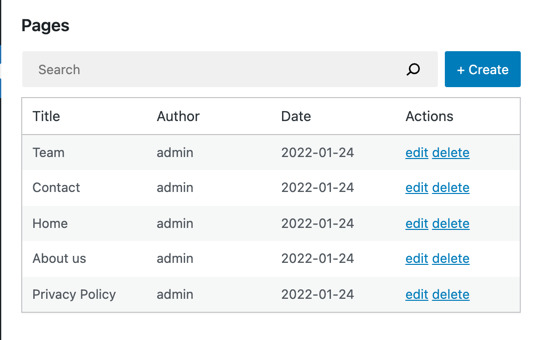

# Create your First App with Gutenberg Data

This tutorial aims to get you comfortable with the Gutenberg data layer. It guides you through building a React application that enables the user to manage their WordPress pages. The finished app will look like this:

### Table of Contents

1. [Setup](./1-setup)
2. [Building a basic list of pages](./2-building-a-list-of-pages.md)

Coming soon:
3. Adding an „Edit page” feature
4. Adding a „Create a new page” feature
5. Adding a „Delete” feature
6. Advanced pages list (author column, Treegrid)

