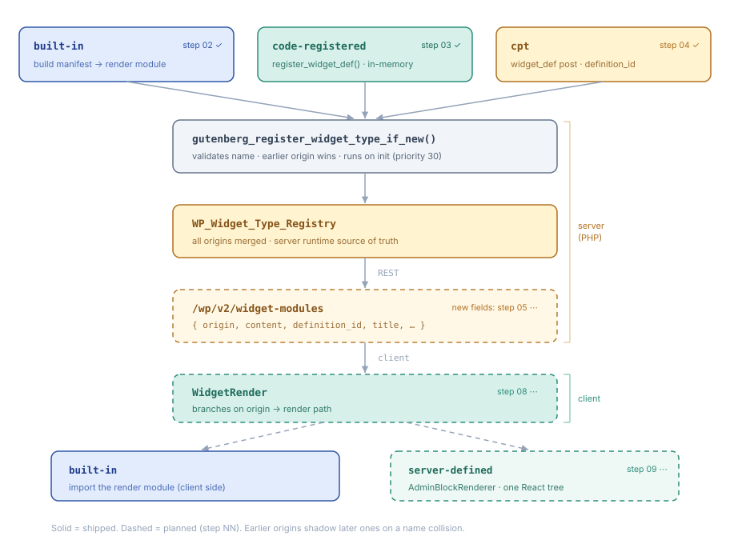

# Widget Type Composer, architecture

## What it is

A way to define a widget type as a **composition of blocks** instead of a
hand-written render module, and to render that composition in the admin as a
single React tree. Two declarative, serializable languages sit on top of the
composition: **bindings** (attribute values sourced at render time) and
**connections** (events wired to operations).

It builds on the existing widget framework (`@wordpress/widget-primitives` +
`WP_Widget_Type_Registry` + `/wp/v2/widget-modules`). A widget type gains an
`origin`:

-   `built-in`, a build-discovered render module. The existing path, unchanged.
-   `code-registered`, declared in PHP via `gutenberg_register_widget_def()`,
    held in an in-memory registry, carrying its composition `content` inline.
-   `cpt`, a `widget_def` post; editable, persistent, queryable.

`built-in` renders client-side from its module; `code-registered` and `cpt`
render through the **admin block renderer**.

## What it extends

This is not a parallel system. Each piece is an existing WordPress API used for
what it already does, and the shape it lands on is a familiar one.

A widget definition is closest to a **synced pattern with overrides, rendered
in the admin instead of the front end**.

-   **Composition as content.** A definition carries block markup as a `content`
    string, registered from PHP with no build step. Same substrate as
    `register_block_pattern()`.
-   **The same dual origin.** Patterns are code-registered plus a CPT (`wp_block`
    for synced ones). Definitions are code-registered
    (`gutenberg_register_widget_def()`) plus a CPT (`widget_def`).
-   **A type, not a template.** A regular pattern is copied on insert and its
    identity disappears. A definition stays the identity of every instance, so it
    behaves like a synced pattern, not a loose one.
-   **Per-instance values through the Bindings API.** `core/instance-attribute` is
    registered with `register_block_bindings_source()`, the same core extension
    point behind `core/pattern-overrides`. Instances vary through
    `metadata.bindings` exactly as pattern overrides do; only the source differs.
-   **Rendering is `do_blocks()`.** Dynamic blocks work without a client
    reimplementation.

The one thing core does not provide is a way to render blocks **in the admin**
as a live React tree. That gap is what the admin block renderer fills, and why
blocks with no admin component need a per-block SSR fallback.

## Layers (bottom to top)

1. **Server framework**, the three origins, the resolver that merges them into
   `WP_Widget_Type_Registry`, the REST exposure (`/wp/v2/widget-modules`
   carrying `origin`/`content`/`definition_id`/`title`/`description`/`icon`), and
   the SSR render endpoint (`/wp/v2/widget-defs/render`, `do_blocks()` with
   per-instance attributes seeded into block context).
2. **Discovery**, `useWidgetTypes(records)` builds a `WidgetType` per record:
   for server-defined origins from the inline metadata, for built-in by
   importing the module.
3. **Render**, `WidgetRender` branches on `origin`; server-defined flows to
   `AdminBlockRenderer`, which parses the composition with the grammar parser
   (`@wordpress/block-serialization-default-parser`, not `blocks.parse`) and
   mounts, per block and in order, either a registered admin component or a
   per-block SSR fallback, as one React tree.
4. **Admin blocks**, declarative specs mapping block attributes to a
   component's props (`createAdminBlock`). UI primitives (stack, text, button,
   icon, badge, card, link, icon-button) plus data-bound blocks:
   `core-admin/form` over `DataForm`, `core-admin/collection` over `DataViews`.
5. **Bindings**, `metadata.bindings` resolves an attribute from a named source
   (e.g. `core/instance-attribute`) against ambient block context
   (`providesContext`/`usesContext`, mirroring `block.json`).
6. **Connections**, `metadata.connections` wires a logical event to an ordered,
   async-aware list of steps with `when` guards and connection-level `onError`.
   Argument values and guards use a serializable subset of CEL
   (`{ "$expr": "..." }`). Each step names an **operation**; handlers receive a
   context of two tiers: intrinsic (core-data via `registry`) and host-boundary
   (`host.navigate`/`host.notify`, silent no-ops if the host omits them), so a
   widget stays host-agnostic. Shipped operations: `save-entity`, `refetch`,
   `navigate`, `notify`.

## Operations, not actions

A step names an **operation**, not an action. The distinction is not cosmetic:
`action` is already taken, twice, and the two meanings sit at different levels.

| Term                      | What it is                                               | Where it lives |
| ------------------------- | -------------------------------------------------------- | -------------- |
| `WidgetAction`            | A verb a user triggers: an envelope plus one fulfillment | `widget.json`  |
| `WidgetDashboard.Actions` | Dashboard chrome: edit toggle, reset, add widget         | the host       |
| operation                 | What one step of a connection invokes                    | this vertical  |

An action is a **promise**; an operation is a **thing that happens**. Naming
both "action" would put the affordance and its machinery under one word.

They do meet. A widget action's fulfillment is named by the key that carries it,
and `href` is only the first: a `steps` fulfillment is a connection's step list,
which is why the runtime below is written to be callable from two entry points,
an event on a block and a declared action. Wiring the second is not this
vertical's work; being callable from it is.

See the widget-primitives _Actions_ doc for the envelope, the fulfillments, and
what the host decides.

## Who provides what

`@wordpress/widget-primitives` is host-agnostic on purpose: it depends on
`@wordpress/element`, `@wordpress/dataviews`, and the grammar parser, and
nothing else. Everything it cannot do itself, it **declares as a seam** and a
caller fills in. `ResolveWidgetModule` is the original example.

Those seams split into two kinds, and the difference decides where the
implementation belongs.

**WordPress implementations.** The host is not choosing anything; it is writing
the way WordPress does it, and every WordPress host would write the same code.

| Seam                  | The WordPress way                                |
| --------------------- | ------------------------------------------------ |
| `resolveWidgetModule` | dynamic `import()` against the page's import map |
| `renderBlocks`        | `POST /wp/v2/widget-defs/render`                 |
| widget-type records   | the `widgetModule` core-data entity              |

**Host decisions.** These legitimately differ between hosts, and no shared
implementation would be correct.

| Concern               | Why it varies                                |
| --------------------- | -------------------------------------------- |
| `navigate`            | depends on the host's router, or its absence |
| `notify`              | depends on the host's notice surface         |
| field-type vocabulary | the application owns what a type name means  |
| placement and chrome  | the host owns its surfaces                   |
| governance            | depends on the host's permission model       |

Governance is a host decision with no seam in the contract. The dashboard
answers it through `WidgetDashboard.Policy` (`canPerform( request )`), and
`widget-primitives` never sees it: the host translates policy into what it
lends, a capability present or absent, a host-boundary operation injected or
not. Widgets consume existence, never permission, so the `WidgetHost` bag never
carries the policy itself. The two providers compose differently on purpose:
the bag merges over what it inherits (abilities accumulate), the policy ANDs
(permissions only narrow).

The first table is duplication waiting to happen: written once by the dashboard,
written again by a sidebar, again by a plugin panel. It belongs in a **WordPress
adapter layer** between the contract and the hosts, not inside either.

`@wordpress/dashboard-init` is already an unnamed piece of that layer: a package
whose only job is registering the `widgetModule` entity before the page renders.

Until a second WordPress host exists, the adapter is not its own package. The
implementations live grouped in one module in the dashboard, named for what they
are, so extraction is mechanical rather than archaeology. Extract on the second
WordPress host, or once the set reaches three or four seams.

## Reference

The full behavior, edge cases, and worked examples live in the renderer's own
`README.md` (recreated in its step) and in the oracle branch
`recovered/widget-type-composer`. Treat those as the source of truth for exact
shapes.

## Status

Experimental, behind `gutenberg-widget-type-composer`. Runtime only: no editor
face yet (no `registerBlockType`, inserter, or inspector), but the specs are
shaped so an editor face can read the same declarations later.
