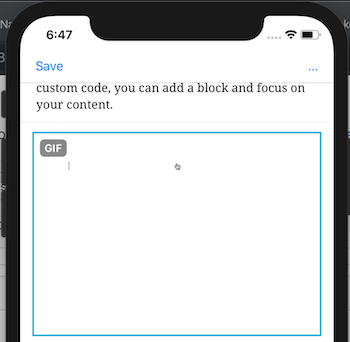

# Badgeable

Badgeable wraps a component and adds a `Badge` overlay to that component. It looks like this:



A Badgeable component allows us to easily add badges to existing components without duplicating code for overlaying and positioning the Badge component. Moreover, with this approach, changing the positioning of badges can be done in one place instead of every place where a badge is visible.

## Usage

```jsx
import { Image } from 'react-native';
import { Badgeable } from '@wordpress/components';
const BadgeableImage = ()	=> (
  <Badgeable text="gif" show={ url.includes( '.gif' ) }>
    <Image 
      style={ { width: 50, height: 50 } }
      source={ { uri: 'https://facebook.github.io/react-native/img/tiny_logo.png' } }
    />
  </Badgeable>
)} >
```

### Props

#### text

- Type: `String`
- Required: Yes

The text to display within the badge. An uppercase transform will be applied.

#### show

- Type: `Boolean`
- Required: No
- Default: `true`

Whether to overlay the badge. 