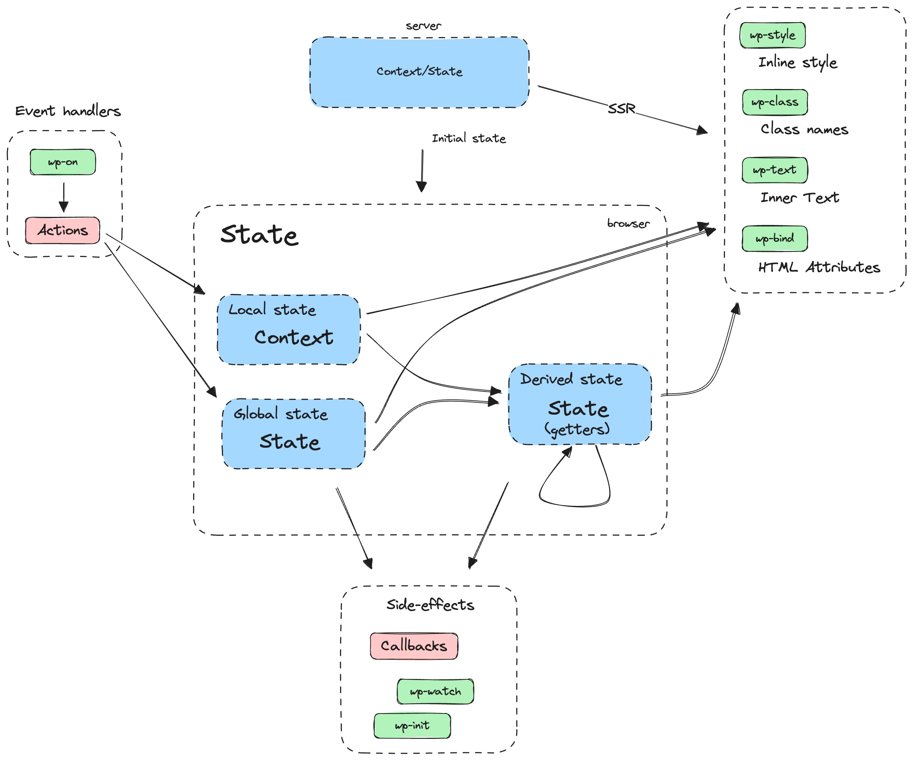

# API Reference

To add interactivity to blocks using the Interactivity API, developers can use:

- **Directives** - added to the markup to add specific behavior to the DOM elements of block.
- **Store** - that contains the logic and data (state, actions, or effects among others) needed for the behaviour.

DOM elements are connected to data stored in the state & context through directives. If data in the state or context change, directives will react to those changes updating the DOM accordingly (see [diagram](https://excalidraw.com/#json=rEg5d71O_jy3NrgYJUIVd,yjOUmMvxzNf6alqFjElvIw)).



## Table of Contents

- [The directives](#the-directives)
  - [List of Directives](#list-of-directives)
    - [`wp-interactive`](#wp-interactive) 
    - [`wp-context`](#wp-context) 
    - [`wp-bind`](#wp-bind) 
    - [`wp-class`](#wp-class) 
    - [`wp-style`](#wp-style) 
    - [`wp-text`](#wp-text) 
    - [`wp-on`](#wp-on) 
    - [`wp-effect`](#wp-effect) 
    - [`wp-init`](#wp-init) 
  - [Values of directives are references to store properties](#values-of-directives-are-references-to-store-properties)
- [The store](#the-store)
  - [Elements of the store](#elements-of-the-store)
    - [State](#state)
    - [Actions](#actions)
    - [Effects](#effects)
    - [Selectors](#selectors)
  - [Arguments passed to callbacks](#arguments-passed-to-callbacks)
  - [Setting the store](#setting-the-store)
    - [On the client side](#on-the-client-side)
    - [On the server side](#on-the-server-side)


## The directives

Directives are custom attributes that are added to the markup of your block to add behaviour to its DOM elements. This can be done in the `render.php` file (for dynamic blocks) or the `save.js` file (for static blocks).

Interactivity API directives use the `data-` prefix.

_Example of directives used in the HTML markup_

```html
<div
  data-wp-context='{ "myNamespace" : { "isOpen": false } }'
  data-wp-effect="effects.myNamespace.logIsOpen"
>
  <button
    data-wp-on--click="actions.myNamespace.toggle"
    data-wp-bind--aria-expanded="context.myNamespace.isOpen"
    aria-controls="p-1"
  >
    Toggle
  </button>
 
  <p id="p-1" data-bind--hidden="!context.myNamespace.isOpen">
    This element is now visible!
  </p>
</div>
```

> **Note**
> The use of Namespaces to define the context, state or any other elements of the store is highly recommended to avoid possible collision with other elements with the same name. In the following examples we have not used namespaces for the sake of simplicity.

Directives can also be injected dynamically using the [HTML Tag Processor](https://make.wordpress.org/core/2023/03/07/introducing-the-html-api-in-wordpress-6-2).

### List of Directives

With directives we can manage directly in the DOM behavior related to things such as side effects, state, event handlers, attributes or content.

#### `wp-interactive` 

The `wp-interactive` directive "activates" the interactivity for the DOM element and its children through the Interactivity API (directives and store). 

```html
<!-- Let's make this element and its children interactive -->
<div 
  data-wp-interactive
  data-wp-context='{ "myColor" : "red", "myBgColor": "yellow" }'
>
  <p>I'm interactive now, <span data-wp-style--background-color="context.myBgColor">>and I can use directives!</span></p>
  <div>
    <p>I'm also interactive, <span data-wp-style--color="context.myColor">and I can also use directives!</span></p>
  </div>
</div>
```

> **Note**
> The use of `wp-interactive` is a requirement for the Interactivity API "engine" to work. In the following examples the `wp-interactive` has not been added for the sake of simplicity.


#### `wp-context` 

It provides **local** state available to a specific HTML node and its children.

The `wp-context` directive accepts a stringified JSON as value.

_Example of `wp-context` directive_ 
```php
//render.php
<div data-wp-context='{ {"post": { "id": <?php echo $post->ID; ?> } } ' >
  <button data-wp-on--click="actions.logId" >
    Click Me!
  </button>
</div>
```

<details>
  <summary><em>See store used with the directive above</em></summary>

```js
store( {
  actions: {
    logId: ( { context } ) => {
      console.log( context.post.id );
    },
  },
} );
```

</details>
<br/>

Different contexts can be defined at different levels and deeper levels will merge their own context with any parent one:

```html
<div data-wp-context="{ foo: 'bar' }">
  <span data-wp-text="context.foo"><!-- Will output: "bar" --></span>

  <div data-wp-context="{ bar: 'baz' }">
    <span data-wp-text="context.foo"><!-- Will output: "bar" --></span>

    <div data-wp-context="{ foo: 'bob' }">
      <span data-wp-text="context.foo"><!-- Will output: "bob" --></span>
    </div>

  </div>
</div>
```

#### `wp-bind` 

It allows setting HTML attributes on elements based on a boolean or string value.

> This directive follows the syntax `data-wp-bind--attribute`.

_Example of `wp-bind` directive_ 
```html
<li data-wp-context='{ "isMenuOpen": false }'>
  <button
    data-wp-on--click="actions.toggleMenu"
    data-wp-bind--aria-expanded="context.isMenuOpen"
  >
    Toggle
  </button>
  <div data-wp-bind--hidden="!context.isMenuOpen">
    <span>Title</span>
    <ul>
      SUBMENU ITEMS
    </ul>
  </div>
</li>
```
<details>
  <summary><em>See store used with the directive above</em></summary>

```js
store( {
	actions: {
		toggleMenu: ( { context } ) => {
      context.isMenuOpen = !context.isMenuOpen;
    },
	},
} );
```

</details>
<br/>

The `wp-bind` directive is executed:
  - when the element is created. 
  - each time there's a change on any of the properties of the `state` or `context` involved on getting the final value of the directive (inside the callback or the expression passed as reference).

When `wp-bind` directive references a callback to get its final value: 
- The `wp-bind` directive will be executed each time there's a change on any of the properties of the `state` or `context` used inside this callback.
- The callback receives the attribute name: `attribute`.
- The returned value in the callback function is used to change the value of the associated attribute.

The `wp-bind` will do different things over the DOM element is applied depending on its value:
  - If the value is `true`, the attribute is added: `<div attribute>`.
  - If the value is `false`, the attribute is removed: `<div>`.
  - If the value is a string, the attribute is added with its value assigned: `<div attribute="value"`.
  - If the attribute name starts with `aria-` or `data-` and the value is boolean (either `true` or `false`), the attribute is added to the DOM with the boolean value assigned as a string: `<div aria-attribute="true">`.

#### `wp-class` 

It adds or removes a class to an HTML element, depending on a boolean value.

> This directive follows the syntax `data-wp-class--classname`.

_Example of `wp-class` directive_ 
```php
<div>
  <li 
    data-wp-context='{ "isSelected": false } '
    data-wp-on--click="actions.toggleSelection"
    data-wp-class--selected="context.isSelected"
  >
    Option 1
  </li>
  <li 
    data-wp-context='{ "isSelected": false } '
    data-wp-on--click="actions.toggleSelection"
    data-wp-class--selected="context.isSelected"
  >
    Option 2
  </li>
</div>
```

<details>
  <summary><em>See store used with the directive above</em></summary>

```js
store( {
  actions: {
    toggleSelection: ( { context } ) => {
      context.isSelected = !context.isSelected
    }
  }
} );
```

</details>
<br/>

The `wp-class` directive is executed:
  - when the element is created.
  - each time there's a change on any of the properties of the `state` or `context` involved on getting the final value of the directive (inside the callback or the expression passed as reference).

When `wp-class` directive references a callback to get its final boolean value, the callback receives the class name: `className`.

The boolean value received by the directive is used to toggle (add when `true` or remove when `false`) the associated class name from the `class` attribute.


#### `wp-style` 

It adds or removes inline style to an HTML element, depending on its value.

> This directive follows the syntax `data-wp-style--css-property`.

_Example of `wp-style` directive_ 
```html
<div data-wp-context='{ "color": "red" }' >
  <button data-wp-on--click="actions.toggleContextColor">Toggle Color Text</button>
  <p data-wp-style--color="context.color">Hello World!</p>
</div>
>
```

<details>
  <summary><em>See store used with the directive above</em></summary>

```js
store( {
  actions: {
    toggleContextColor: ( { context } ) => {
      context.color = context.color === 'red' ? 'blue' : 'red';
    },
  },
} );
```

</details>
<br/>

The `wp-style` directive is executed:
  - when the element is created.
  - each time there's a change on any of the properties of the `state` or `context` involved on getting the final value of the directive (inside the callback or the expression passed as reference).

When `wp-style` directive references a callback to get its final value, the callback receives the class style property: `css-property`.

The value received by the directive is used to add or remove the style attribute with the associated CSS property: :
  - If the value is `false`, the style attribute is removed: `<div>`.
  - If the value is a string, the attribute is added with its value assigned: `<div style="css-property: value;">`.

#### `wp-text` 

It sets the inner text of an HTML element.

```html
<div data-wp-context='{ "text": "Text 1" }'>
  <span data-wp-text="context.text"></span>
  <button data-wp-on--click="actions.toggleContextText">
    Toggle Context Text
  </button>
</div>
```

<details>
  <summary><em>See store used with the directive above</em></summary>

```js
store( {
  actions: {
    toggleContextText: ( { context } ) => {
      context.text = context.text === 'Text 1' ? 'Text 2' : 'Text 1';
    },
  },
} );
```

</details>
<br/>

The `wp-text` directive is executed:
  - when the element is created.
  - each time there's a change on any of the properties of the `state` or `context` involved on getting the final value of the directive (inside the callback or the expression passed as reference).

The returned value is used to change the inner content of the element: `<div>value</div>`.

#### `wp-on` 

It runs code on dispatched DOM events like `click` or `keyup`. 

> The syntax of this directive is `data-wp-on--[event]` (like `data-wp-on--click` or `data-wp-on--keyup`).

_Example of `wp-on` directive_ 
```php
<button data-wp-on--click="actions.logTime" >
  Click Me!
</button>
```

<details>
  <summary><em>See store used with the directive above</em></summary>

```js
store( {
  actions: {
    logTime: () => console.log( new Date() ),
  },
} );
```

</details>
<br/>

The `wp-on` directive is executed each time the associated event is triggered. 

The callback passed as reference receives [the event](https://developer.mozilla.org/en-US/docs/Web/API/Event) (`event`) and the returned value by this callback is ignored.


#### `wp-effect` 

It runs a callback **when the node is created and runs it again when the state or context changes**. 

You can attach several effects to the same DOM element by using the syntax `data-wp-effect--[unique-id]`. _The unique id doesn't need to be unique globally, it just needs to be different than the other unique ids of the `wp-effect` directives of that DOM element._

_Example of `wp-effect` directive_
```html
<div 
  data-wp-context='{ "counter": 0 }'
  data-wp-effect="effects.logCounter"
>
  <p>Counter: <span data-wp-text="context.counter"></span></p>
  <button data-wp-on--click="actions.increaseCounter">+</button>
  <button data-wp-on--click="actions.decreaseCounter">-</button>
</div>
```

<details>
  <summary><em>See store used with the directive above</em></summary>

```js
store( {
  actions: {
    increaseCounter: ({ context }) => {
      context.counter++;
    },
    decreaseCounter: ({ context }) => {	
      context.counter--;
    },
  }
  effects: {
    logCounter: ({ context }) => console.log("Counter is " + context.counter + " at " + new Date() ),
  },
} );
```

</details>
<br/>

The `wp-effect` directive is executed:
  - when the element is created.
  - each time that any of the properties of the `state` or `context` used inside the callback changes.

The `wp-effect` directive can return a function. If it does, the returned function is used as cleanup logic, i.e., it will run just before the callback runs again, and it will run again when the element is removed from the DOM.

As a reference, some use cases for this directive may be: 
- logging.
- changing the title of the page.
- setting the focus on an element with `.focus()`.
- changing the state or context when certain conditions are met.

#### `wp-init` 

It runs a callback **only when the node is created**.

You can attach several `wp-init` to the same DOM element by using the syntax `data-wp-init--[unique-id]`. _The unique id doesn't need to be unique globally, it just needs to be different than the other unique ids of the `wp-init` directives of that DOM element._

_Example of `data-wp-init` directive_ 
```html
<div data-wp-init="effects.logTimeInit">
  <p>Hi!</>
</div>
```

_Example of several `wp-init` directives on the same DOM element_
```html
<form 
  data-wp-init--log="effects.logTimeInit" 
  data-wp-init--focus="effects.focusFirstElement"
>
  <input type="text">
</form>
```

<details>
  <summary><em>See store used with the directive above</em></summary>

```js
store( {
  effects: {
    logTimeInit: () => console.log( `Init at ` + new Date() ),
    focusFirstElement: ( { ref } ) =>
      ref.querySelector( 'input:first-child' ).focus(),
  },
} );
```

</details>
<br/>


The `wp-init` can return a function. If it does, the returned function will run when the element is removed from the DOM.

### Values of directives are references to store properties

The value assigned to a directive is a string pointing to a specific state, selector, action, or effect. *Using a Namespace is highly recommended* to define these elements of the store. 

In the following example we use the namespace `wpmovies` (plugin name is usually a good namespace name) to define the `isPlaying` selector.

```js
store( {
	selectors: {
		wpmovies: {
			isPlaying: ( { state } ) => state.wpmovies.currentVideo !== '',
		},
	},
} );
```

And then, we use the string value `"selectors.wpmovies.isPlaying"` to assign the result of this selector to `data-bind--hidden`.

```php
<div data-bind--hidden="!selectors.wpmovies.isPlaying" ... >
  <iframe ...></iframe>
</div>
```

These values assigned to directives are **references** to a particular property in the store. They are wired to the directives automatically so that each directive “knows” what store element (action, effect...) refers to without any additional configuration.


## The store

The store is used to create the logic (actions, effects…) linked to the directives and the data used inside that logic (state, selectors…).

**The store is usually created in the `view.js` file of each block**, although it can be initialized from the `render.php` of the block.

The store contains the reactive state and the actions and effects that modify it.

### Elements of the store

#### State 

Defines data available to the HTML nodes of the page. It is important to differentiate between two ways to define the data:
   - **Global state**:  It is defined using the `store()` function, and the data is available to all the HTML nodes of the page. It can be accessed using the `state` property.
   - **Context/Local State**: It is defined using the `data-wp-context` directive in an HTML node, and the data is available to that HTML node and its children. It can be accessed using the `context` property.
	
```html
<div data-wp-context='{ "someText": "Hello World!" }'>

  <!-- Access global state -->
  <span data-wp-text="state.someText"></span>

  <!-- Access local state (context) -->
  <span data-wp-text="context.someText"></span>

</div>
```

```js
store( {
  state: {
    someText: "Hello Universe!"
  }
  actions: {
    someAction: ({ state, context }) => {
      state.someText // Access or modify global state - "Hello Universe!"
      context.someText // Access or modify local state (context) - "Hello World!"
    },
  },
} )
```

#### Actions 

Usually triggered by the `data-wp-on` directive (using event listeners) or other actions.

#### Effects 

Automatically react to state changes. Usually triggered by `data-wp-effect` or `data-wp-init` directives.

#### Selectors

Also known as _derived state_, returns a computed version of the state. They can access both `state` and `context`.

```js
// view.js  
store( {
	state: {
		amount: 34,
		defaultCurrency: 'EUR',
		currencyExchange: {
			USD: 1.1,
			GBP: 0.85,
		},
	},
	selectors: {
		amountInUSD: ( { state } ) =>
			state.currencyExchange[ 'USD' ] * state.amount,
		amountInGBP: ( { state } ) =>
			state.currencyExchange[ 'GBP' ] * state.amount,
	},
} );
```

### Arguments passed to callbacks

When a directive is evaluated, the reference callback receives an object with:

- The **`store`** containing all the store properties, like `state`, `selectors`, `actions` or `effects`
- The **context** (an object containing the context defined in all the `wp-context` ancestors).
- The reference to the DOM element on which the directive was defined (a `ref`).
- Other properties relevant to the directive. For example, the `data-wp-on--click` directive also receives the instance of the [MouseEvent](https://developer.mozilla.org/en-US/docs/Web/API/MouseEvent) triggered by the user.

_Example of action making use of all values received when it's triggered_
```js
// view.js
store( {
	state: {
		theme: false,
	},
	actions: {
		toggle: ( { state, context, ref, event, className } ) => {
			console.log( state );
			// `{ "theme": false }`
			console.log( context );
			// `{ "isOpen": true }`
			console.log( ref );
			// The DOM element
			console.log( event );
			// The Event object if using the `data-wp-on`
			console.log( className );
			// The class name if using the `data-wp-class`
		},
	},
} );
```

This approach enables some functionalities that make directives flexible and powerful:

- Actions and effects can read and modify the state and the context.
- Actions and state in blocks can be accessed by other blocks.
- Actions and effects can do anything a regular JavaScript function can do, like access the DOM or make API requests.
- Effects automatically react to state changes.

### Setting the store

#### On the client side

*In the `view.js` file of each block* we can define both the state and the elements of the store referencing functions like actions, effects or selectors.

`store` method used to set the store in javascript can be imported from `@wordpress/interactivity`.  

```js
// store
import { store } from '@wordpress/interactivity';

store( {
  actions: {
    toggle: ( { context } ) => {
      context.isOpen = !context.isOpen;
    },
  },
  effects: {
    logIsOpen: ( { context } ) => {
      // Log the value of `isOpen` each time it changes.
      console.log( `Is open: ${ context.isOpen }` );
    }
  },
});
```

#### On the server side

The store can also be initialized on the server using the `wp_store()` function. You would typically do this in the `render.php` file of your block (the `render.php` templates were [introduced](https://make.wordpress.org/core/2022/10/12/block-api-changes-in-wordpress-6-1/) in WordPress 6.1). 

The store defined on the server with `wp_store()` gets merged with the stores defined in the view.js files.

The `wp_store` function receives an [associative array](https://www.php.net/manual/en/language.types.array.php) as a parameter. 


_Example of store initialized from the server with a `state` = `{ someValue: 123 }`_

```php
// render.php
wp_store( array(
  'state' => array(
    'myNamespace' => array(
      'someValue' = 123
    )
  )
);
```

Initializing the store in the server also allows you to use any WordPress API. For example, you could use the Core Translation API to translate part of your state:

```php
// render.php
wp_store(
  array(
    "state" => array(
      "favoriteMovies" => array(
        "1" => array(
          "id" => "123-abc",
          "movieName" => __("someMovieName", "textdomain")
        ),
      ),
    ),
  )
);
```

### Store options

The `store` function accepts an object as a second argument with the following optional properties:

#### `afterLoad`

Callback to be executed after the Interactivity API has been set up and the store is ready. It receives the global store as argument.

```js
// view.js
store(
	{
		state: {
			cart: [],
		},
	},
	{
		afterLoad: async ( { state } ) => {
			// Let's consider `clientId` is added
			// during server-side rendering.
			state.cart = await getCartData( state.clientId );
		},
	}
);
```


