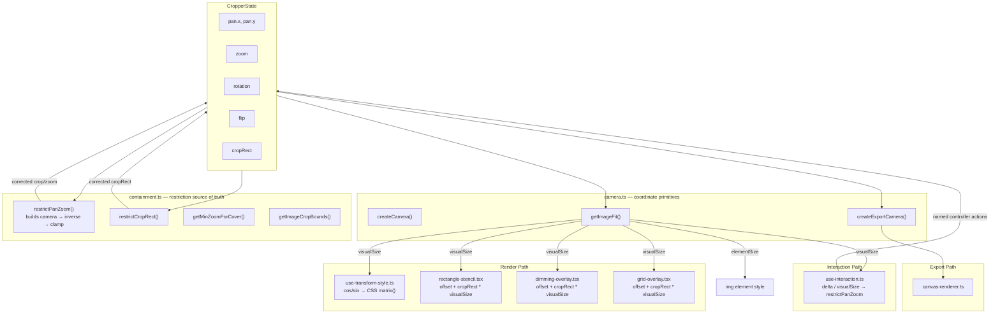

# Image Editor — Architecture

## Coordinate spaces

| Space | What lives here | Coordinates |
| ----- | --------------- | ----------- |
| **World** | Image, crop rect | Normalized 0–1, origin top-left of image |
| **Camera** | View transform (zoom, pan, rotation, flip) | A `mat2d` mapping world → screen |
| **Screen** | DOM container, mouse events, CSS | Pixels relative to container |

## Data flow

The camera is the source of truth for restriction (ensuring the image covers the crop). The render path uses lightweight manual math for CSS transforms and stencil positioning — these are simple, correct, and deliberately not routed through the camera to avoid prop-threading complexity.

### Design decisions

**Why restriction uses the camera but rendering doesn't:**

-   `restrictPanZoom` builds a camera internally and projects crop corners through its inverse. This guarantees the restriction and rendering agree on geometry — the camera IS the screen transform.
-   The render path (`use-transform-style`, stencils, overlays) uses simple manual math because the CSS transform operates in a different coordinate system (element-center origin vs container-center). Deriving CSS matrix from the camera mat2d would be more complex, not less.

**Why `getImageFit` exists:**

-   `createCamera` needs to know the fitted image dimensions to build its matrix. `cropper.tsx` also needs it to size the `` element and compute `visualSize` for overlays. `getImageFit` is the shared contain-fit calculation used by both — no duplication.

**UX invariant:**

> After `restrictPanZoom`, transforming the 4 crop corners through `screenToWorld(camera, corner)` must produce world points inside [0,1]×[0,1].

This is both the restriction algorithm AND the test. If the camera says it's covered, it's covered on screen — because the camera IS the screen transform.

## Where to change UX

Most UX changes should stay in the React adapter or modal components. Reach into `core/` only when the behavior changes the cropper's geometry, transform semantics, or export parity.

| Change | Primary files | Notes |
| ------ | ------------- | ----- |
| Aspect-ratio presets, zoom slider, resize-handle toggle | `components/media-editor-crop-panel/` | Modal-level crop options. Keep preset state outside core unless it affects reusable cropper semantics. |
| Rotate, flip, fine rotation, undo, redo, reset controls | `components/media-editor-toolbar/` and `components/rotation-ruler/` | Toolbar controls call the React controller. Undo/redo policy belongs to the adapter and modal shell, not core. |
| Canvas focus, image load, grid/dimming display, stencil wiring, gesture callbacks | `image-editor/react/components/cropper.tsx` | This is the main React bridge between DOM events, visual overlays, and the controller. |
| Crop handle UI and resize affordances | `image-editor/react/components/stencils/` | Keep pointer and keyboard resize behavior equivalent. Pure resize math belongs in `core/stencil-math.ts`. |
| Pan, wheel zoom, pinch zoom, double-tap, keyboard panning/zooming | `image-editor/react/hooks/use-interaction.ts` and `core/interaction-controller.ts` | Use the hook for DOM/event wiring and the core controller for framework-independent interaction math. |
| Transform geometry, containment, camera math, source-region conversion | `image-editor/core/` | Changes here affect preview/export parity. Add or update pure tests with each behavior change. |
| Canvas export | `image-editor/core/export/` | Browser-only helpers. Keep output equivalent to the preview and source-region helpers. |
| WordPress REST `/edit` modifiers | `components/media-editor-modal/build-modifiers.ts` | Bridge from cropper state to Core's attachment edit endpoint. This is WordPress-specific and should stay out of reusable cropper core. |
| Modal save, discard, notices, attachment metadata | `components/media-editor/` and `components/media-editor-modal/` | Modal integration owns attachment records, metadata fields, notices, and close behavior. |

## API and history boundaries

The core image cropper API is plain cropper state plus deterministic helpers: transform operations, source-region conversion, containment/camera math, and export. It should stay independent of React, DOM events, attachment records, and history policy.

The React adapter exposes a controller object rather than reducer dispatch. UI should call named methods such as `setZoom`, `setRotation`, `setCropRect`, `snapRotate90`, and `toggleFlip` instead of importing reducer actions.

Undo/redo is bundled with the current React implementation because the media editor modal needs it, but it is not core API. Continuous interactions should be grouped at user-meaningful boundaries by the adapter/modal shell:

-   Pointer drag starts/ends.
-   Resize handle drag starts/ends.
-   Wheel, pinch, slider, and ruler interactions after the debounce window.
-   Keyboard resize after the keyboard settle delay.

Discrete interactions such as flip, 90° rotation, reset, and pipeline operations should create one undo entry per command.

## Extension points

See [recipes.md](recipes.md) for the full developer guide. Summary:

| Extension | Mechanism |
| --------- | --------- |
| Custom crop area UI | `stencil` prop — any component implementing `StencilProps` |
| Programmatic control | `TransformOperation[]` pipeline — JSON-serializable, replayable |
| Custom export | `exportCroppedImage()` or `applyToCanvas()` for multi-step pipelines |
| Theming | BEM CSS classes (`.wp-media-editor-image-editor__*`) |
| State observation | `onStateChange` (every frame), `onGestureStart`/`onGestureEnd` (gesture boundaries) |
| Undo/redo | React adapter/modal policy; core remains history-agnostic |
