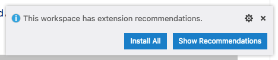

# Mobile Gutenberg

This is the mobile version of [Gutenberg](https://github.com/WordPress/gutenberg), targeting Android and iOS. It's a React Native library bootstrapped by CRNA and now ejected.

## Getting Started

### Prerequisites

For a developer experience closer to the one the project maintainers current have, make sure you have the following tools installed:

* git
* [nvm](https://github.com/creationix/nvm)
* Node.js and npm (use nvm to install them)
* yarn (`npm install -g yarn`)
* [AndroidStudio](https://developer.android.com/studio/) to be able to compile the Android version of the app
* [Xcode](https://developer.apple.com/xcode/) to be able to compile the iOS app
* [Carthage](https://github.com/Carthage/Carthage#installing-carthage) needed for fetching the Aztec dependency.


Note that the OS platform used by the maintainers is macOS but the tools and setup should be usable in other platforms too.

### Clone the project

* Clone the project and submodules:
```
git clone --recurse-submodules https://github.com/wordpress-mobile/gutenberg-mobile.git
```

* Or if you already have the project cloned, initialize and update the submodules:
```
git submodule init
git submodule update
```

## Set up

Before running the demo app, you need to download and install the project dependencies. This is done via the following command:

```
nvm install --latest-npm
yarn install
```

## Run

```
yarn start
```

Runs the packager (Metro) in development mode. The packager stays running to serve the app bundle to the clients that request it.

With the packager running, open another terminal window and use the following command to compile and run the Android app:

```
yarn android
```

The app should now open in a connected device or a running emulator and fetch the JavaScript code from the running packager.

To compile and run the iOS variant of the app using the _default_ simulator device, use:

```
yarn ios
```

which will attempt to open your app in the iOS Simulator if you're on a Mac and have it installed.

### Running on Other iOS Device Simulators

To compile and run the app using a different device simulator, use:

```
yarn ios --simulator="DEVICE_NAME"
```

For example, if you'd like to run in an iPhone Xs Max, try:

```
yarn ios --simulator="iPhone Xs Max"
```

To see a list of all of your available iOS devices, use `xcrun simctl list devices`.

### When things seem crazy

Some times, and especially when tweaking anything in the `package.json`, Babel configuration (`.babelrc`) or the Jest configuration (`jest.config.js`), your changes might seem to not take effect as expected. On those times, you might need to clean various caches before starting the packager. To do that, run the script: `yarn start:reset`. Other times, you might want to reinstall the NPM packages from scratch and the `yarn clean:install` script can be handy.

## Developing with Visual Studio Code

Although you're not required to use Visual Studio Code for developing gutenberg-mobile, it is the recommended IDE and we have some configuration for it.

When you first open the project in Visual Studio, you will be prompted to install some recommended extensions. This will help with some things like type checking and debugging.



One of the extensions we are using is the [React Native Tools](https://marketplace.visualstudio.com/items?itemName=vsmobile.vscode-react-native). This allows you to run the packager from VSCode or launch the application on iOS or Android. It also adds some debug configurations so you can set breakpoints and debug the application directly from VSCode. Take a look at the [extension documentation](https://marketplace.visualstudio.com/items?itemName=vsmobile.vscode-react-native) for more details.

## Unit Tests

Use the following command to run the test suite:

```
yarn test
```

It will run the [jest](https://github.com/facebook/jest) test runner on your tests. The tests are running on the desktop against Node.js.

To run the tests with debugger support, start it with the following CLI command:

```
yarn test:debug
```

Then, open `chrome://inspect` in Chrome to attach the debugger (look into the "Remote Target" section). While testing/developing, feel free to springle `debugger` statements anywhere in the code that you'd like the debugger to break.

## Writing and Running Unit Tests

This project is set up to use [jest](https://facebook.github.io/jest/) for tests. You can configure whatever testing strategy you like, but jest works out of the box. Create test files in directories called `__tests__` or with the `.test.js` extension to have the files loaded by jest. See an example test [here](https://github.com/wordpress-mobile/gutenberg-mobile/blob/develop/src/index.test.js). The [jest documentation](https://facebook.github.io/jest/docs/en/getting-started.html) is also a wonderful resource, as is the [React Native testing tutorial](https://facebook.github.io/jest/docs/en/tutorial-react-native.html).

## UI Tests

This repository uses Appium to run UI tests. The tests live in `__device-tests__` and are written using Appium to run tests against simulators and real devices. To run these you'll need to check off a few things: 

* For now when running the tests you'll need to ensure the metro bundler is not running. 
* [Appium cli](https://github.com/appium/appium/blob/master/docs/en/about-appium/getting-started.md) installed and available globally, I'd also recommend using [appium doctor](https://github.com/appium/appium-doctor) to ensure all of Appium's dependencies are good to go. You don't have to worry about starting the server yourself, the tests handle starting the server on port 4723, just be sure that the port is free or feel free to change the port number in the test file. 
* For iOS a simulator should automatically launch but for Android you'll need to have an emulator *with at least platform version 8.0* fired up and running.

After those are checked off to run the UI tests on iOS run 

`yarn test:e2e:ios:local`

and for android run, 

`yarn test:e2e:android:local`

Note, you might experience problems that seem to be related to the tests starting the Appium server, for example errors that say `Connection Refused`, `Connection Reset` or `The requested environment is not available`. Sorry about that this is still a WIP, you can manually start the Appium server via [appium desktop](https://github.com/appium/appium-desktop) or the cli, then change the port number in the tests while optionally commenting out related code in the `beforeAll` and `afterAll` block. 

For a more detailed outline of the UI tests and how to get started writing one please visit the [UI Test documentation](https://github.com/wordpress-mobile/gutenberg-mobile/blob/develop/__device-tests__/README.md) and our [contributing guide](https://github.com/wordpress-mobile/gutenberg-mobile/blob/develop/__device-tests__/CONTRIBUTING.md).

## Static analysis and code style

The project includes a linter (`eslint`) to perform codestyle and static analysis of the code. The configuration used is the same as [the one in the Gutenberg project](https://github.com/WordPress/gutenberg/blob/master/eslint/config.js). To perform the check, run:

```
yarn lint
```

To have the linter also _fix_ the violations run: `yarn lint:fix`.

In parallel to `eslint` the project uses `Prettier` for codestyling. Run:

```
yarn prettier
```
to enforce the style. This will modify the source files to make them conform to the rules.

`Flow` is used as a static type checker for JavaScript code. Flow checks JavaScript code for errors through static type annotations. These types allow you to tell Flow how you want your code to work, and Flow will make sure it does work that way. To perform the check run:

```
yarn flow
```

You might want to use Visual Studio Code as an editor. The project includes the configuration needed to use the above codestyle and lint tools automatically.

## License

Gutenberg Mobile is an Open Source project covered by the [GNU General Public License version 2](LICENSE).

