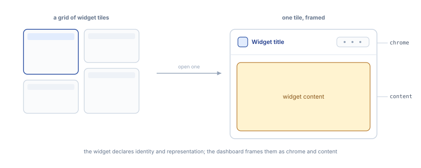

# Anatomy of the dashboard

This package is still experimental. “Experimental” means this is an early implementation subject to drastic and breaking changes.

The dashboard lays widget instances out in a grid. Each instance sits in a tile, and the dashboard wraps it in chrome; the widget owns only what renders inside.

## The grid

Instances are placed through `@wordpress/grid`. The consumer owns the committed `layout` array: for each instance, its widget type, position, and span.

## Two modes

The dashboard reads in _Normal_ and edits in _Customize_; the application's policy decides whether _Customize_ is offered at all (see _Policy_).

-   **Normal.** Instances render with their chrome. High-relevance attributes may be edited inline in the header, without opening a separate surface.
-   **Customize.** The layout becomes editable: reorder by drag, resize, insert through a modal, and open per-instance settings.

Edits are staged internally until they are committed, at which point `onLayoutChange` fires with the new array.

## Chrome and content

One boundary runs through every tile: the dashboard owns the **chrome**, the widget owns the **content**.

The widget declares three layers: identity, framing, and representation (see _Widget Primitives / Anatomy_).

The dashboard consumes each in its own way: it reads _identity_ into the chrome header, translates _framing_ into how much chrome to paint, and mounts _representation_ as the content.

The widget never paints its own header or toolbar; those are chrome.

How that chrome is built, and how it adapts when space runs short, is the subject of **Widget Chrome**.
