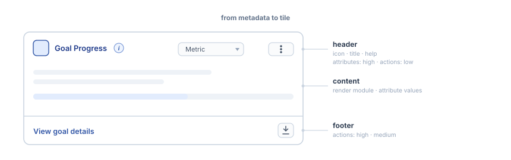
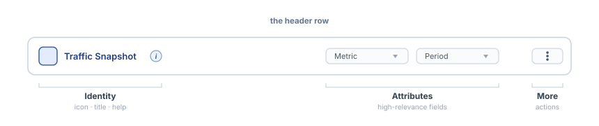
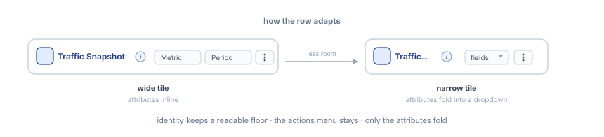
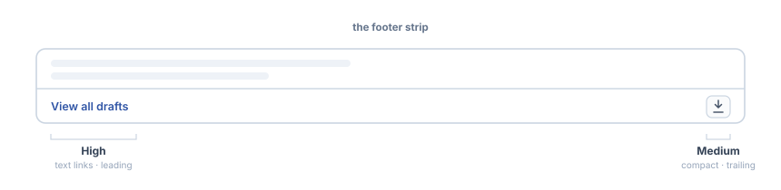

# Anatomy of the Widget Chrome

This package is still experimental. “Experimental” means this is an early implementation subject to drastic and breaking changes.

The chrome is everything the dashboard wraps around a widget instance: the header, its controls, the footer, and the boundaries that catch errors and loading.

The widget declares its identity and how it wants to be framed; the chrome materializes both.
The widget never paints its own header or toolbar.

## From metadata to tile

The chrome reads the widget type and materializes each field in one of three areas.

The header takes the identity (`icon`, `title`, `help`), the high-relevance `attributes` inline plus the settings trigger for the full schema, and the low-relevance `actions` in the More menu. The content belongs to the render module, fed the attribute values. The footer takes the promoted `actions`.

## The frame

The dashboard widget interprets `presentation` and determines how much chrome a widget gets.

-   `framed` paints a header and pads the content.
-   `content-bleed` keeps the header but lets the content fill the available area.
-   `full-bleed` hides the header and the footer and gives the widget the whole tile, while keeping the identity available to assistive technology.

Whatever the presentation, an error boundary and a loading fallback wrap the content, so a widget that throws or suspends never breaks the tile.

## The header

The header is a single row of three sections.

The sections are semantic. A control belongs to a section by its nature, not by how it renders.

-   **Identity.** The widget's icon, title, and help. It names the tile, and its title truncates rather than wrapping when the row runs short.
-   **Attributes.** The widget's high-relevance attributes: quick in-place editing or a dropdown button when there isn't enough space.
-   **More.** The widget's low-relevance actions, gathered in a menu on the trailing edge.

### Fitting the row

Only the attributes change form. The identity truncates its title, and the actions menu is compact throughout.

Attributes are inline fields when they fit, or a form within a dropdown when they do not.

The header decides from what it measures: the row's own width, and the width each section reports.

It measures the identity as it stands, discounts the sections that keep their size, and gives the attributes what is left; when that is less than their inline width, they fold.

Because the decision measures the real row, every section counts on its own.

The widget declares its sections; the header measures the fit.

## The footer

A persistent strip under the body, for the actions the widget promotes.

`relevance` routes every action to its surface.

-   **`high`.** Text links on the leading edge, labels always visible, a declared icon as prefix.
-   **`medium`.** Compact affordances on the trailing edge: icon-only with a declared icon, text links otherwise.
-   **`low`** (default). The header's More menu.

Every affordance is a real anchor: middle-click, copy address, and download survive.

The divider spans the tile, and the body above keeps no bottom padding, so scrolled content runs flush against it.

The widget declares importance; the footer materializes it.
