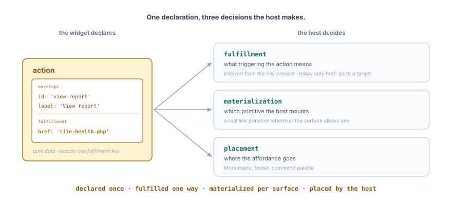
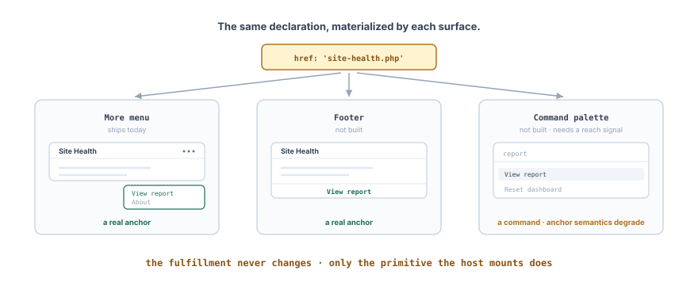

# Actions

<div class="callout callout-alert">
This package is still experimental. “Experimental” means this is an early implementation subject to drastic and breaking changes.
</div>

A widget declares its data through `attributes`; it declares the verbs a user can trigger through `actions`.

An action is something to _do_: open a report, download a file, etc. Like other widgets' props, it's declarative and serializable, so it can ride in `widget.json`.

The widget names the intent and, through the key it writes, how the action is fulfilled. Two decisions are left, and both are the host's: which primitive to mount, and where to put it.



## Envelope and fulfillment

Every action carries an **envelope**, an `id` and a `label`, and exactly one **fulfillment**, which says what triggering it means.

The fulfillment is named by the key that carries it, not by a separate discriminator. Today the only key is `href`, so the only fulfillment is a link: triggering the action goes to a target.

```ts
{
	id: 'view-report',
	label: __( 'View report' ),
	href: 'admin.php?page=reports',
}
```

`href`: absolute URL, admin `.php` entry point, root-relative path, or a file
next to the widget (resolved to a plugin URL on the server). `data:` and
`javascript:` hrefs are rejected at registration. Use `downloadBlob` for client-generated
files. Query strings on local filenames (e.g. `report.csv?v=2`) are not
resolved as widget files.

Two more keys belong to the link, not to the envelope, so they only mean something alongside an `href`:

-   `download`: download instead of navigate; a string sets the filename.
-   `openInNewTab`: open in a new tab.

```ts
{
	id: 'export',
	label: __( 'Export CSV' ),
	href: 'report.csv', // widgets/{name}/report.csv
	download: 'report.csv',
}
```

## Materialization is the host's

The fulfillment says what triggering means. It does not say which control the user clicks. The host picks that per surface, and the same declaration can end up as a menu item, a footer link, or a palette command.



A link fulfillment carries one obligation: **where the surface allows a link primitive, the host must mount one**. A real link keeps middle-click and copy address, which routing the same target through a click handler destroys. That is why a link is a first-class fulfillment rather than a shorthand for one.

Its accessible role follows the surface rather than the element: mounted inside the dashboard's "More" menu, the anchor is exposed as a menu item, not as a link.

Which link primitive is also the host's call. The widget declares _where_ to go; the host decides _how to get there_. A target inside the host's own routes can use its router's link, which is still an anchor and keeps the same behaviors; anything else is a plain anchor and a full page load. The widget cannot make that call: whether a target is reachable in-page depends on the routes the host registered, which changes per host and over time.

Where no link primitive fits, as in a command palette, the host mounts what the surface offers and those semantics degrade. That is a real cost of reaching beyond the widget, not an oversight.

## Placement is the host's

The widget lists its actions; it never specifies where they go. The host maps them to its surfaces: a dashboard might gather them in a "More" menu, a footer, or a command palette.

This is the contract that the `relevance` attribute already uses: the widget declares intent, and the host owns the surface.
