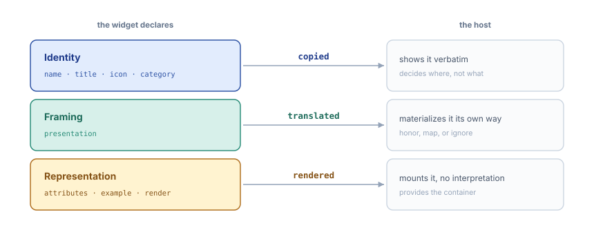
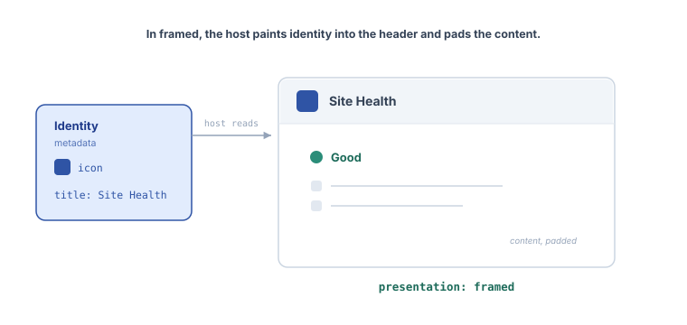
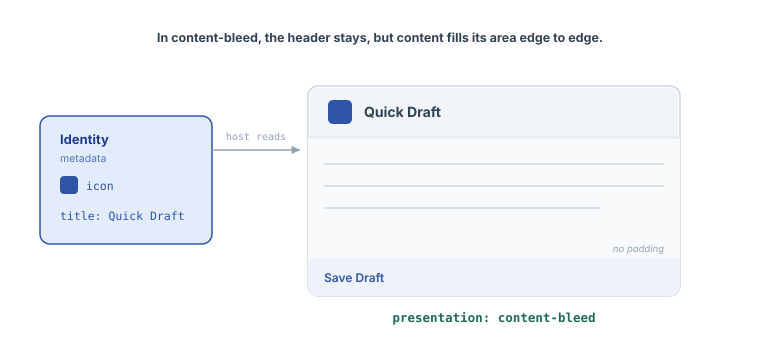
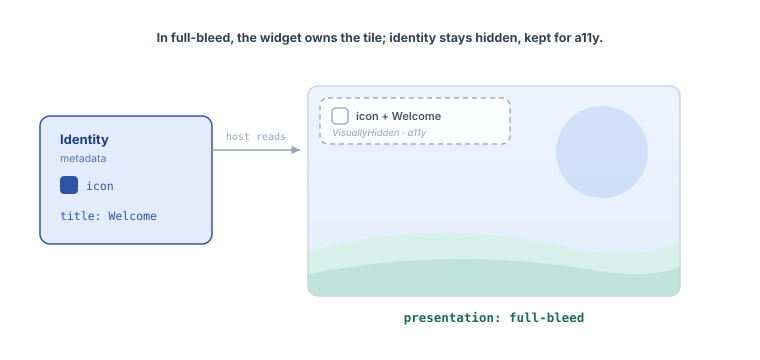
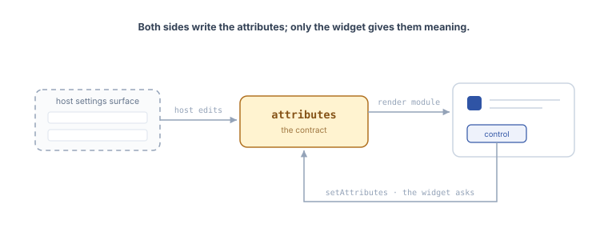

# Anatomy of a widget type

This package is still experimental. “Experimental” means this is an early implementation subject to drastic and breaking changes.

A widget type is a blueprint: the metadata and modules that describe one kind of widget, independent of any place it is rendered. Everything that blueprint declares falls into three layers. What separates them is not the subject matter but how much freedom the host has over each one.

Naming the layers settles a recurring confusion between what a widget says it _is_, how it _asks_ to be framed, and what it _shows_. Most disagreements about the contract ("should a widget define its own size? its own title?") dissolve once a property is placed in the right layer.

## Identity

What the widget is: `name`, `title`, `description`, `icon`, `category`, `keywords`.

The host shows this almost verbatim, in pickers, headers, and help. It decides _where_ identity appears and _whether_ to show it, never _what it says_. Identity is copied, not interpreted: two hosts displaying the same widget show the same title.

## Framing

How the widget asks to sit in the host's frame. Today this layer holds one property, `presentation`; a size hint is under discussion.

`presentation` suggests how much chrome the widget wants around it. The widget speaks in its own vocabulary ("render me without a frame"); the host decides how to materialize it. Its three values are one axis, from the most chrome to none.

`framed` (the default): the host paints the header from identity and pads the content. Site Health renders inside that frame.

`content-bleed`: the header stays, but the content fills its area edge to edge, with no padding. Quick Draft uses it.

`full-bleed`: no visible header; the widget owns the whole tile. The dashboard, the host shipping today, keeps the identity it did not paint in a VisuallyHidden node, so assistive tech still names the tile. Welcome uses it.

This is the only layer that is translated, and the only one where the same declaration yields different results in different hosts. The dashboard makes these calls; another host could honor the same three values differently.

## Representation

How the widget represents its data: `attributes`, `example`, and the render module.

The `attributes` are the contract between host and widget. The widget owns their shape and meaning; the host owns their values.

A value can change from either side, and changing one changes what the widget renders. The widget can ask, when the host grants it `setAttributes` (optional: without it the widget renders read-only). The host can also edit values on its own, mounting a settings form from the `attributes` schema. Both paths write the same instance state.

Either way the host never interprets the meaning. It mounts the form straight from the declarative schema, with no idea what a field means. It stores, passes, and re-renders; the meaning stays the widget's.

The `WidgetRender` stories show both: Default, where the widget asks, and With Settings, where the host edits.

## Why the split matters

The three verbs are the point: identity is _copied_, framing is _translated_, representation is _rendered_. The boundary each layer draws is a boundary of ownership.

A widget does not declare its own header, because the header is host chrome, not something the widget owns. A widget does not declare a width in pixels, because pixels belong to the host's translation of framing, not to the framing itself. Both questions look like they are about the widget; the layer model shows they are about the host.

The same separation is what makes a widget portable. Only the framing layer is re-translated when the host changes; identity and representation are consumed the same way everywhere. A host is free to render a widget in a context its author never anticipated, as long as it honors the three layers for what they are.
