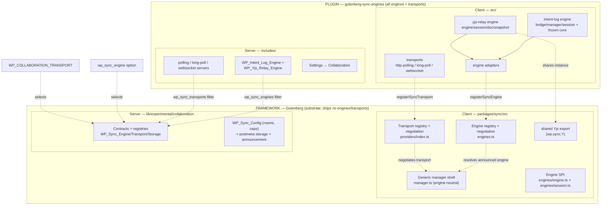
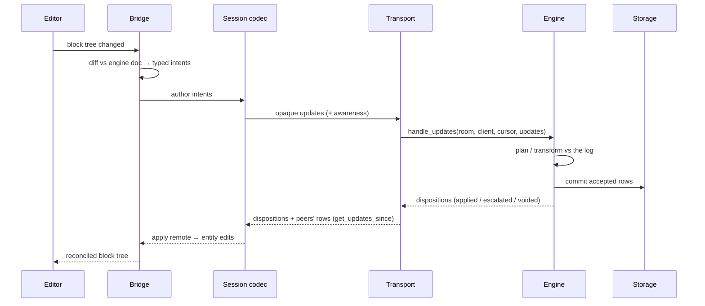
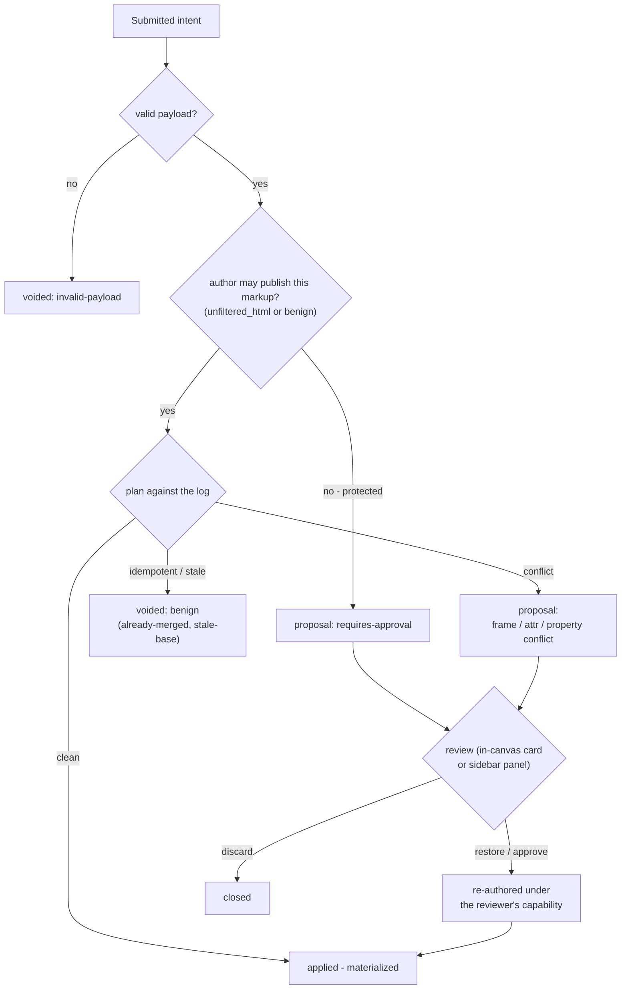

# Swappable sync architecture — integration plan

Status: **realized + split (2026-08-10).** The plan below is implemented, and
the pluggable surface has since been fully extracted into a separate plugin
(see _The framework/plugin split_ under _Architecture at a glance_). Companion
to `SPEC.md` (engine) and `INTEGRATION.md` (capture/Redux analysis). Original
target — the intent-log engine fully integrated into WordPress + Gutenberg —
under these constraints:

1. Engines swappable (intent-log ↔ Automerge ↔ Yjs relay) — a class swap
   server-side, a config change client-side.
2. Transports supremely swappable (short-poll → long-poll → WebSocket).
3. Engine/transport mismatch between server and client is detected and
   degrades to a post lock, never to corruption.
4. No Yjs/deprecated code removed yet; mark `@deprecated` only where it
   aids clarity.
5. Short-polling transport first.

> **How to read this doc.** The section immediately below —
> _Architecture at a glance (as built)_ — is the current, shipped picture.
> Everything from _Three-plane model_ onward is the ORIGINAL PLAN
> (interface sketches, phasing); it is kept for provenance, but where a
> sketch disagrees with the as-built overview or the phase log (2d-i …
> 2d-xxv near the end), the code and the phase log win.

## Architecture at a glance (as built)

Collaboration is a **three-plane** stack — bridge (capture) / engine
(meaning) / transport (movement) — mirrored on client and server, with
**two independent registries** (engines, transports) so either axis swaps
without touching the other. Both are announced on the wire and negotiated;
no match on either falls back to WordPress post locking.

### The framework/plugin split (2026-08-10)

Gutenberg hosts only the engine-and-transport-agnostic **substrate**. Every
engine and transport — the entire pluggable surface, client *and* server —
lives in the **Gutenberg Sync Engines plugin** (`~/Code/gutenberg-sync-engines`,
its own git repo). Without the plugin active the registries are empty, the
server announces no engine, the client resolves none, and RTC is disabled (the
classic post lock). The framework ships **no engine and no transport code**; it
keeps:

- the generic, engine-neutral **sync-manager shell** (`manager.ts` —
  `createSyncManager( engine, { debug } )`);
- the two **registries + negotiation** (`engines.ts` for engines,
  `providers/index.ts` for transports) and the `registerSyncEngine` /
  `registerSyncTransport` private APIs a plugin registers through;
- the **engine SPI** — `SyncEngine` → `EngineEntity` / `EngineCollection`
  (own the document model) → `EngineSessionCodec` (transport-facing), plus the
  `SyncEngineAdapter` / `TransportRegistration` shapes;
- the room/permission/storage **contracts** (`WP_Sync_Engine` /
  `WP_Sync_Transport` / `WP_Sync_Storage`, `WP_Sync_Config`), the server
  registries, and the entity bridge + review UI in `core-data`/`editor`;
- its shared **Yjs export** (`wp.sync.Y`) so a plugin's Yjs shares the one
  instance (yjs/issues/438).

An engine plugin implements `SyncEngine` and composes it —
`createManager: (debug) => createSyncManager( createMyEngine(), { debug } )` —
in a `SyncEngineAdapter`; a transport implements a `ProviderCreator`. Both
register client-side by unlocking `@wordpress/sync`'s private APIs, and
server-side through the `wp_sync_engines` / `wp_sync_transports` filters.

### Component map



### An edit's round trip



### How a submitted intent settles

The engine is server-authoritative: every intent settles into exactly one
outcome, and nothing is silently dropped — conflicts go to review, benign
collisions void idempotently.



Key files by plane (F = framework/Gutenberg, P = plugin):

- **Substrate** (F): client `packages/sync/src` — `manager.ts` (engine-neutral
  shell), `engines.ts` + `providers/index.ts` (registries + negotiation),
  `engines/engine.ts` + `engines/session.ts` (the SPI), `private-apis.ts` (the
  unlockable registration surface); server `lib/experimental/collaboration/`
  (the `WP_Sync_*` contracts + registries, `WP_Sync_Config`, storage,
  announcement); store + UI `packages/core-data/src` (`sync.ts`,
  `retrySyncConnection → manager.retry()`, the entity bridge) and
  `packages/editor/src/components/collaboration-review-panel/` (panel +
  in-canvas markers + inline approval card).
- **Bridge + Engine** (P, both languages): `src/engines/intent-log-bridge.ts`,
  `-manager.ts`, `-session.ts`; frozen cross-language core
  `src/engines/intent-log/` (rebase/document/rich-text/sync-id +
  `test-vectors/`); `src/engines/yjs-relay/` (session/engine/doc/snapshot/
  constants); adapters `src/engines/{intent-log,yjs-relay}-adapter.ts`; PHP
  twins under `includes/engines/`.
- **Transport** (P): client `src/providers/{http-polling,http-long-polling,
  websocket}/` (one folder per transport); server `includes/transports/`
  (registry-registered routes; `websocket/` holds the daemon + token + CLI).
- **Tooling** (P): `src/debug/inspector.ts` (console inspector),
  `tools/sync-engine-benchmarks/` (seam-native engine benchmark).

## Starting surface (pre-refactor baseline — superseded by the split above)

> This was the trunk surface the plan below started from. It is kept for
> provenance; the shipped picture is _Architecture at a glance_ above (the
> `SyncManager` is now the engine-neutral shell, and the Yjs stack + transports
> have moved into the plugin).

Server — `lib/experimental/collaboration/`:

- `WP_HTTP_Polling_Sync_Server`: REST short-poll route; conflates transport
  mechanics (rooms, cursors, auth, awareness) with engine semantics
  (update type enum `sync_step1`/`sync_step2`/`compaction`, compactor
  election).
- `WP_Sync_Config`: room grammar + capability checks. Engine-agnostic.
- `WP_Sync_Storage` interface + `WP_Sync_Post_Meta_Storage`. Engine-agnostic
  rows of `{ type, data, actor }`.
- `WP_Sync_Save_Server`: persists the materialized CRDT doc
  (`_crdt_document` meta).

Client:

- `packages/sync`: `SyncManager` (Yjs-coupled: creates Y.Docs, awareness,
  Yjs undo manager), transport providers behind `ProviderCreator` with a
  `sync.providers` filter — the transport seam ALREADY exists.
- `packages/core-data/src/utils/crdt*`: the entity bridge
  (`applyPostChangesToCRDTDoc` / `getPostChangesFromCRDTDoc`, positional
  block diff, rich-text delta merge).
- Gate: `wp_collaboration_enabled` option → `window._wpCollaborationEnabled`.

## Three-plane model

```
┌────────────────────────────────────────────────────────────┐
│ BRIDGE (editor/entity integration)                         │
│   capture local changes → engine; engine → entity updates  │
│   engine-specific adapters behind one interface            │
├────────────────────────────────────────────────────────────┤
│ ENGINE (merge semantics)                                   │
│   interprets update payloads; dispositions; materialization│
│   intent-log │ yjs-relay │ automerge …                     │
├────────────────────────────────────────────────────────────┤
│ TRANSPORT (movement)                                       │
│   rooms, cursors, auth, awareness, connection status       │
│   payload-opaque │ short-poll │ long-poll │ websocket …    │
└────────────────────────────────────────────────────────────┘
```

The transport moves envelopes and never interprets `data`:

```
{ room, engine: 'intent-log', engineProtocol: 1,
  kind: 'update' | 'awareness' | 'control', data: <opaque> }
```

The existing storage `type` enum values remain valid (they become the
yjs-relay engine's update kinds); new engines use their own kinds. Each
room's storage is stamped with the engine that owns it.

## Server seams (PHP)

```php
interface WP_Sync_Engine {
	public function get_slug();             // 'intent-log' | 'yjs-relay' | …
	public function get_protocol_version(); // int; bump on breaking change

	// Ingest one client's batch; returns per-update dispositions
	// (intent-log: applied/escalated/voided; yjs-relay: trivially stored).
	public function handle_updates( $room, $actor_id, $updates, $storage );

	// Entries since cursor, in server order, plus new cursor.
	public function get_updates_since( $room, $cursor, $storage );

	// Serialized post_content for persistence/save (null = not supported).
	public function materialize( $room, $storage );

	// Genesis payload for a joining client (intent-log: doc snapshot +
	// seq; yjs-relay: nothing — updates carry the state).
	public function bootstrap( $room, $post );

	// Engine-owned compaction/snapshot policy hook.
	public function maybe_compact( $room, $storage );
}
```

- `WP_Sync_Engine_Registry` + filters: `wp_sync_engines` (register),
  `wp_sync_engine_for_room` (select; site-wide default via option, per
  room-kind override). **Engine swap = registering/selecting a different
  class.** Constraint 1, server side.
- `WP_Yjs_Relay_Engine`: pure code motion — the current opaque-update
  storage, sync_step1/2 semantics, and compactor election move out of the
  polling server into this class. Nothing is deleted; the Yjs path becomes
  the seam's first implementation and stays runnable for benchmarking.
- `WP_Intent_Log_Engine`: the PHP twin of `planBatch` (prototype
  `src/rebase.js`) + reducer + document model. `handle_updates` = plan and
  commit, returning dispositions; `get_updates_since` = log slice;
  `materialize` = replay → block serialization; `maybe_compact` = snapshot
  at seq + trim below all-client cursor floor.
- `WP_HTTP_Polling_Sync_Server` becomes transport-only: auth (via
  `WP_Sync_Config`, unchanged), room parsing, cursor bookkeeping, awareness,
  and delegation to the room's engine. Long-poll and WebSocket transports
  (already prototyped on `arch-decision`) later reuse the same delegation —
  constraint 2, server side.

Storage: keep `WP_Sync_Storage`. Rows gain an engine stamp; the first write
to a room fixes its engine lineage. `WP_Sync_Save_Server` generalizes to
"engine document persistence" (`_crdt_document` stays for yjs; intent-log
persists `_intent_log_snapshot` + seq).

## Client seams (TS)

Two independent, filterable registries:

1. **Transports** — exists today (`sync.providers` filter,
   `ProviderCreator`). Short-poll = current http-polling provider.
   One required change: providers currently receive Yjs objects
   (Y.Doc/Awareness) — the interface narrows to envelopes in/out +
   connection status, so transports stop knowing the engine. This is the
   one real client-side untangling job.
2. **Engine adapters** — new:

```ts
interface SyncEngineAdapter {
	slug: string;
	protocolVersion: number;
	createSession( opts: {
		room: RoomId;
		bootstrap: unknown;   // engine-specific, from server handshake
		actorId: string;
	} ): EngineSession;
}

interface EngineSession {
	// Bridge side (core-data):
	applyLocalChanges( record: EntityChanges, cursorHint?: CursorHint ): void;
	onRemoteChanges( cb: ( record: EntityChanges ) => void ): void;
	// Transport side:
	outgoingUpdates(): Envelope[];             // drained on each poll
	receiveUpdates( entries: Envelope[], dispositions?: Disposition[] ): void;
	// Awareness passthrough; teardown.
	getAwareness(): unknown;
	destroy(): void;
}
```

- `yjs` adapter: wraps today's `SyncManager` + `crdt*` bridge — code
  motion, not rewrite. Direct call sites that bypass the adapter get
  `@deprecated` notes pointing at it (constraint 4).
- `intent-log` adapter: capture (INTEGRATION.md phase 1 —
  selection-anchored rich-text diff with verify-and-degrade, structure
  from tree diff keyed by syncId) + the prototype's client replica
  (`planBatch` over a local log copy) + remote apply via targeted entity
  updates. Undo: the Yjs undo manager does not apply; intent-log rides
  core's default undo initially (open item).
- **The client never chooses the engine.** The server announces it; the
  client looks the slug up in its registry. Engine swap = the server
  config change, client follows — constraint 1, client side.

## Handshake and mismatch → post lock (constraint 3)

Two enforcement levels; both fall back to the SAME degraded path.

1. **Bootstrap**: editor settings (preloaded) carry, per room-kind:
   `{ engine, engineProtocol, transports: ['short-poll'], transportProtocol }`.
   The client checks its registries. Missing engine slug, incompatible
   protocol version, or no mutually supported transport → the client does
   not join the room and instead falls back to **WordPress native post
   locking** (the classic heartbeat single-writer lock that collaboration
   currently supersedes), with a notice ("Live collaboration unavailable —
   editing with an exclusive lock"). No sync traffic is sent at all.
2. **Per-request**: every sync request stamps `engine` + `engineProtocol`
   per room. The server rejects on mismatch with `409
   sync_engine_mismatch` — checked against BOTH current server config and
   the room's storage lineage (a room whose rows are stamped `yjs-relay`
   rejects `intent-log` writes even if the site default changed
   mid-session; no cross-engine corruption, ever). A client receiving the
   409 tears down its session and enters the same lock fallback as (1).
   This covers stale tabs across a server-side engine swap: the stale tab
   drops to the lock path, and heartbeat lock arbitration resolves who
   edits — the already-shipped conflict UX.

Precedent to generalize: `CRDT_DOC_VERSION` in `packages/sync/src/config.ts`
becomes the yjs adapter's `protocolVersion`.

## Short-poll fit (constraint 5)

The existing poll shape (request: rooms + cursors + pending updates;
response: entries since cursor + awareness) fits the intent log with one
addition: a `dispositions` array in the response for the batch just
ingested (`{ intentId, status, reason? }`). The yjs-relay engine returns an
empty array. Cursor = log seq for intent-log; the client's `baseSeq` rides
inside intent payloads, not the transport.

## What deliberately does not change

- `WP_Sync_Config` room grammar + capability model (engine-agnostic,
  57-test coverage).
- Awareness (engine-agnostic; intent-log uses it for presence/selection).
- `wp_collaboration_enabled` gating; post locking machinery.
- All `crdt*` code and the Yjs stack — wrapped, not removed.

## Phasing

- **Phase 0 — extract seams, zero behavior change.** Server: engine
  interface + registry + `WP_Yjs_Relay_Engine` (code motion) + engine
  stamp on rooms + handshake settings + 409 path. Client: adapter
  interface + `yjs` adapter wrapping SyncManager; providers narrowed to
  envelopes. Gate: every existing PHPUnit/jest/e2e suite stays green with
  the yjs engine selected.

  **Status (2026-08-05): LANDED except provider narrowing.**
  - Server: `interface-wp-sync-engine.php`, `class-wp-sync-engine-registry.php`
    (`wp_sync_engines` / `wp_sync_engine_for_room` filters + `wp_sync_engine`
    option), `class-wp-yjs-relay-engine.php` (code motion incl. compaction
    election); polling server is transport-only and delegates; optional
    `engine`/`engine_protocol` request args → 409
    `rest_sync_engine_mismatch`; room lineage stamped on first write
    (oldest-row-wins, cache-hygienic direct DB), cross-engine writes
    rejected; handshake announced via `window._wpCollaborationSync`.
    PHPUnit: 176 pre-existing green + 11 new
    (`wpSyncEngineRegistry.php`).
  - Client: `packages/sync/src/engines.ts` (`SyncEngineAdapter`,
    `sync.engines` filter, `resolveEngineAdapter()` honoring the
    announcement with pre-handshake fallback to yjs-relay);
    `core-data/sync.ts#getSyncManager()` returns undefined on mismatch
    (post-lock posture) and warns once; transport handshake gates
    `getProviderCreators()`; `createSyncManager` marked `@deprecated` in
    private APIs in favor of the resolver. Jest: 247 sync + 885 core-data
    green.
  - Deferred from Phase 0: narrowing `ProviderCreatorOptions` to
    envelopes (transports still receive Y.Doc/Awareness) — scheduled with
    Phase 1 since the intent-log transport payloads force it anyway; and
    a visible editor notice on mismatch (currently console warning +
    no-join; the notice belongs with the Phase 2 UX pass).
- **Phase 1 — intent-log core lands.** JS engine core moves from
  `prototypes/sync/src` to a dependency-free home (proposal:
  `packages/sync/src/engines/intent-log/`, no Yjs imports); PHP planner
  twin (`planBatch` port) validated against the frozen `test-vectors/` and
  ported matrix/scenario suites. No editor wiring yet.

  **Status (2026-08-05): LANDED except provider narrowing.**
  - PHP twin: `WP_Intent_Log_Document` + `WP_Intent_Log_Planner` in
    `lib/experimental/collaboration/`, validated by frozen golden
    transcripts (`test-vectors/planner.json`: 6 seeded simulations, 220
    batches, 1065 intents — every disposition, proposal, transformed log
    entry, and canonical final doc must match) plus the 30 genesis syncId
    vectors, redelivery idempotency, and fresh-replay convergence.
  - JS core graduated to `packages/sync/src/engines/intent-log/` (engine
    modules + simulator + SPEC.md + vectors + tools; `prototypes/sync/`
    is docs-only now). Browser-safe: `node:crypto` replaced with a
    vector-pinned pure-JS SHA-256 and `globalThis.crypto.randomUUID`.
    All 81 engine tests converted to jest; vector generator reproduces
    byte-identical output post-move.
  - Excluded from tsc (`checkJs` vs generic JSDoc) with a precedented
    tsconfig exclude; proper typing lands with the Phase 2 adapter, the
    first TS consumer.
  - Provider narrowing: DONE (2026-08-05). Transports are payload-opaque:
    `EngineSessionCodec` (`src/engines/session.ts`) carries the engine's
    client half — initial announcements, receive/respond, awareness
    encode/apply, compaction payloads, local-update subscription with
    byte sizes for transport limits. The extracted yjs implementation
    lives in `src/engines/yjs-relay/session.ts` (13 focused tests);
    `ProviderCreatorOptions` is `{ objectType, objectId, session }` and
    the polling manager/provider import nothing from Yjs. SyncManager
    still owns Y.Doc/Awareness and hands a codec closed over them to the
    transport. Zero wire-format change; behavioral assertions relocated
    with the code they pin. **Phase 1 is complete.**
- **Phase 2 — intent-log end to end.** Capture v1 in the bridge, server
  engine behind the filter, dispositions in the poll response, escalations
  surfaced minimally (notice + console; proposal-lane UI comes from the
  review-lane work, later). **The swap test: flip a site between
  `yjs-relay` and `intent-log` via the filter, both ways, mid-content-
  lifetime — mismatched tabs must land in the lock fallback, never
  corrupt.** This is where constraints 1–3 get their proof.

  **Status (2026-08-05): 2a (server engine) LANDED.**
  `WP_Intent_Log_Engine` registered alongside the relay; wire kinds
  `snapshot` / `intent` / `proposal` / `voided` over the existing poll
  route; genesis from parse_blocks (metadata.syncId or deterministic
  ids); planner-backed ingest with per-intent dispositions as the ack;
  transformed intents relayed to all clients (author included); voided
  markers make redelivery exactly-once; materialize() round-trips block
  markup with syncIds; server-stamped `u{user}c{client}` actor ids
  (resolves the multi-tab open item). Eight route-level tests including
  the engine-flip 409. Server-side mismatch demo is live NOW: setting
  `wp_sync_engine=intent-log` makes clients (no intent-log adapter yet)
  warn and fall back to post locking.

  **2b (client session codec) LANDED.** `createIntentLogSession()`
  (`packages/sync/src/engines/intent-log-session.ts`) implements
  EngineSessionCodec: snapshot → replica bootstrap, intent rows appended
  to the log copy with pending work replanned (shared planner),
  proposals recorded, optimistic authoring with wire emission. New
  optional `receiveDispositions` codec member; the transport delivers
  the ack AFTER the same response's rows (rows settle what they
  supersede; the document never regresses mid-response) — ordering
  pinned by manager tests. Engine core typed via hand-written lockstep
  .d.ts files. Seven session tests run two sessions against the
  in-memory JS server (the vector-pinned PHP twin). NOT yet registered
  as an adapter — the mismatch fallback stays until 2c.

  **2c (capture bridge + manager + adapter) LANDED.**
  `intent-log-bridge.ts`: block trees ↔ engine documents; identity-keyed
  diff derivation (moves stay moves), verify-or-degrade against the
  bridge's projection, loud failure on unverifiable batches (duplicate
  syncIds). `intent-log-manager.ts`: the SyncManager surface over one
  session per entity — capture on update(), editRecord on remote
  changes, echo suppression both directions (canonical comparison + a
  capture guard for the session's synchronous change events). Registered
  as a default adapter: `wp_sync_engine=intent-log` now resolves a
  working client. v1 scope: blocks only, core default undo, console-
  warned escalations, no client persistence. 16 new tests (11 bridge
  incl. end-to-end convergence through the in-memory server twin, 5
  manager over a capturing fake transport).

  **2d-i (live two-browser editing) LANDED.** `wp_sync_engine` is a
  registered setting (writing group, show_in_rest) so the swap is
  scriptable; `collaboration-intent-log-engine.spec.ts` flips the site
  to intent-log over REST, runs two-user editing through the full stack
  in real browsers (text sync both directions; concurrent different-
  block edits converging on both editors — both passed first run), and
  restores the default, after which the yjs multibyte suite still
  passes. Build note: hand-written .d.ts files need explicit `declare`
  on consts (esbuild parses declaration files as source).

  **2d-viii (presence) LANDED.** The intent-log manager constructs the
  entity syncConfig's typed awareness (`PostEditorAwareness`) over a stub
  doc — the y-protocols `Awareness` class only needs `clientID` and a
  destroy listener from its doc — and the session bridges it to the poll
  wire via `engines/awareness-sync.ts` (`applyServerAwarenessStates`,
  extracted from the yjs codec and now shared by both engines). The
  collaborator UI (avatars, list) works unchanged; consumers reaching
  through `awareness.doc` for real Y.Doc features (selection anchoring,
  peer-save notifications, debug doc dump) degrade gracefully on stub
  docs and are engine-side future work. The intent-log e2e suite is back
  on the shared presence-gated `openCollaborativeSession` fixture, so
  every spec doubles as a presence assertion; 9/9 green.

  **2d-ix (client 409 handling) DONE.** Session codecs stamp their
  engine identity (`engine`/`engine_protocol`, already accepted by the
  server) on every poll, fencing stale tabs BEFORE their first stored
  update — the lineage check alone cannot cover fresh rooms. The polling
  manager maps 409 `rest_sync_engine_mismatch` to the lock posture:
  disconnected with the new `ENGINE_MISMATCH` error code, room
  unregistered without a disconnect beacon, surviving rooms keep polling
  with restored updates. The editor modal gains dedicated copy
  ('Collaboration settings changed' → refresh) on the no-delay
  unrecoverable path. E2e: mid-session engine flip drops both tabs into
  the modal (one 409 each, no retry loop). Harness find: nulling
  `wp_sync_engine` via REST 500s when the row is already absent — the
  settings controller validates the stored value first.

  **2d-x (escalation notice) DONE.** `RecordHandlers.onEscalation`
  (optional; reason + local/remote attribution) replaces the manager's
  console.warn; core-data's resolver dispatches a dismissible warning
  notice with a stable per-entity id (repeats replace, not stack). E2e:
  sustained concurrent typing into the same paragraph reliably provokes
  a frame-conflict escalation and the notice appears in the editor.

  **2d-xi (save flow + dev-bundle smoke) DONE.** E2e: two users edit
  concurrently, converge, one saves — persisted content carries both
  users' settled work, leaks no engine-internal state (_wrapper,
  attrVersions), and the peer's editor is unaffected. The two-tab
  observer's four scenarios all converge cleanly against the
  SCRIPT_DEBUG=true dev environment (the bundle-divergence class).

  **2d-xii (title/entity-property sync) DONE.** The engine gains an
  entity family: `set_property { name, value, observedVersion }` writes
  document-level per-name registers (`props`/`propVersions`, emitted in
  canonical form only when non-empty so pre-entity documents — and the
  six frozen vector seeds — stay byte-identical). Conflict semantics
  are the rule-3 analog: concurrent same-property writes escalate
  (`property-conflict`), different properties and property-vs-block
  edits merge clean; whole-value registers, not text merging (short
  scalars where reviewing the loser beats character interleaving).
  PHP twin mirrors it; three new frozen vector seeds run property ops
  (37 intents, 17 conflicts) and the twin reproduces them exactly.
  Integration: PHP genesis seeds the title from the post; the manager
  captures title edits (presence-is-intent — an edits object carries a
  property only when changed), pushes remote values via editRecord,
  and seeds echo suppression from the loaded record so a matching
  genesis is not re-pushed while a NEWER room title still pushes on
  join. E2e: title syncs both directions and persists through a save
  by the non-author; concurrent divergent titles escalate a notice and
  both editors converge on the winner.

  **2d-xiii (deterministic client-side genesis) DONE.** The stamper now
  implements both minting regimes: on the first populated pass over a
  pristine (not-yet-dirty) editor, unstamped blocks get DETERMINISTIC
  genesis ids — the WebCrypto mirror of genesis_sync_id (sha256 of
  `postId:0:path`, first 16 bytes, base64url), the same function the
  server's room genesis uses, pinned by the frozen sync-id vectors.
  Every independent minter (each tab, the server, a tab that never
  connects) derives identical ids from the same saved content, so
  identity agreement needs no adoption heuristics and survives
  sessions. Blocks created later (insert, paste, split, duplicate
  re-mints) stay random-regime; if the user edited before the first
  pass, everything falls back to random + adoption (the safety net
  stays). Known limitation: classic/freeform content shifts server
  paths — such posts fall back to adoption. E2e: a legacy post's ids
  in both tabs equal the imported engine function's output exactly and
  persist verbatim through an edit + save.

  **2d-xiv (hardening: the adversarial review's top findings) DONE.**
  See REVIEW-2026-08-05.md for the full findings list. Landed:
  - Transport recovery is codec-driven (optional
    `createRecoveryUpdate`; Yjs = full state, intent-log = restore
    exact updates, created before the queue is cleared). Previously
    one transient network error while typing lost queued intents and
    permanently killed polling (finding 1.2).
  - Bootstrap engine mismatch flips `collaborationSupported` false so
    WordPress post locking re-engages, with a notice — previously
    no-sync-AND-no-lock silent overwrites (finding 1.1).
  - Server ingest is serialized per room (MySQL GET_LOCK around
    load→plan→commit; 503 `rest_sync_room_busy` on contention), and
    intent payloads are schema-validated at the route (400, incl. the
    `::`-in-syncId frame-key guard). The engine's genesis write stamps
    room lineage, closing the read-poll → engine-flip hole (findings
    1.5, 1.8).
  - Planner policy: identity-addressed intents on merge-absorbed
    blocks escalate (`target-deleted`) instead of silently voiding;
    same-pair merge×merge voids `already-merged` (idempotent
    convergence); ingest is idempotent for duplicates WITHIN a batch;
    nested duplicate ids in inserted subtrees void (findings 1.3a,
    1.9a, 3.2).
  - Text coordinates are PINNED to UTF-16 code units cross-language:
    the PHP twin slices via UTF-16LE conversion, the vocabulary words
    are multibyte, and a hand-authored vector case exercises every
    rule-2 range reason, four void reasons, merge absorption, and
    intra-batch idempotency at exact boundaries over multibyte text.
    A new JS-side replay test pins planner.json against the JS engine
    too — regeneration can no longer silently rewrite the contract
    (findings 1.9e, 3.4). Surrogate-pair-interior offsets remain a
    documented open edge (BMP only in vectors).
  - PHPUnit group fix: four collaboration test files (engine route,
    planner vectors, internals, registry) lacked `@group
    collaboration` and were invisible to group-filtered runs — the
    group now runs 210 tests, up from 176.

  **2d-xv (compaction & growth bounds — review 1.6) DONE.** The
  engine's history is bounded on both sides:
  - The server appends a compaction CHECKPOINT snapshot row
    ({doc, seq, checkpoint: true}) once the retained window crosses
    the interval (filter `wp_sync_intent_log_checkpoint_interval`,
    default 100 intent rows), records it in per-room storage meta,
    and TRIMS all rows behind the PREVIOUS checkpoint — after
    re-appending any proposal rows that would fall behind the floor
    (escalated work parked for review survives compaction, the
    substrate half of finding 1.3b). Retention invariant: one full
    interval of history is always kept.
  - load_room reconstructs from the latest checkpoint (bounded work);
    pure read polls no longer reconstruct engine state at all (the
    O(session-length)-per-poll cost is gone). Late joiners bootstrap
    from the checkpoint; a cursor below the trim floor is served the
    retained checkpoint as a RESET snapshot.
  - The shared planner core gained an explicit `firstSeq` (log arrays
    may start at a checkpoint; absolute seqs remain the public
    coordinate; both twins, vectors byte-stable at firstSeq 0).
    Intents authored below the retention horizon settle as voided
    `stale-base` — a one-sided transform over trimmed history is
    impossible — and the client re-derives that work from its editor
    tree after its reset.
  - The client session accepts reset snapshots (seq > cursor):
    replica re-bootstraps, pending intents drop, the manager clears
    its echo-suppression state and the next capture re-authors from
    the editor tree. The client replica also trims its own observed
    log below the replan floor (min pending baseSeq / cursor) —
    sweeps hold prediction parity through every trim.
  Verified live: two-tab observer converged across a mid-session
  checkpoint on the dev env with zero console errors.

  **2d-xvi (CAPTURE REWRITE onto rich-text coordinates — review 1.4,
  the big one) DONE.** The engine that was validated is now the engine
  that runs:
  - A vector-frozen rich-text codec (`rich-text.js` +
    `WP_Intent_Log_Rich_Text`, `test-vectors/rich-text.json`, 28
    cases) converts inline HTML ↔ { plain text, format spans } in both
    languages — the PHP twin reproduced every vector first-run. Format
    ids encode tag+attributes; `<br>` = newline; unknown elements
    collapse to one object char preserving raw source; unsupported
    input degrades to a whole-field object (safe, never wrong).
  - The bridge diffs PLAIN TEXT (offsets never count markup, so
    concurrent merges cannot produce invalid HTML), captures every
    registry-declared rich-text attribute as its own field
    (SyncConfig.richTextFields, backed by getBlockType source
    html/rich-text), derives `split_block`/`merge_blocks` from
    identity+concatenation signals, and derives `format_text` by
    scratch-applying the batch and diffing spans — the reducer's own
    span shifting means an edit under a format produces no format
    churn. Verification now covers formats; the coarse fallback
    restores spans after replace_attr_content (which clears them).
  - Server genesis and materialize run the codec twin, so client and
    server agree on the coordinate space from the first snapshot, and
    materialized content carries formatting markup back.
  - E2e: formatted genesis→sync→save round trip, and the marquee —
    one user bolds a word while the other types in the SAME paragraph,
    both changes surviving on both editors (first-run pass). 18 specs,
    1317 jest, 214 PHPUnit, observer clean.

  **2d-xvii (proposal read API + resolution — review 1.3b complete)
  DONE.** Design in PROPOSAL-REVIEW.md; the read API is the stream:
  - New `resolved` wire row (client-sendable): closes a proposal
    idempotently by id, server-stamped resolvedBy/time, acked through
    dispositions; unknown/duplicate resolutions settle without rows.
  - Proposal rows enriched at the engine layer (settlement seq,
    timestamp, target-field excerpt) for content-centric review.
  - Retention rule: compaction re-appends only UNRESOLVED proposals;
    resolved pairs age out with the trim. Open parked work persists
    indefinitely; bounded by construction.
  - Session: getOpenProposals/onProposalsChange/resolveProposal.
    Manager: mapped review items via RecordHandlers.onProposalsChange;
    resolveProposal/restoreProposal (restore = best-effort re-author
    of the lost content as ORDINARY intents, then resolve — no
    privileged replay). Escalation notices derive from the SETTLED
    open list on a microtask, so bootstrap replays never re-surface
    long-resolved conflicts.
  - core-data: escalation notices show the lost content and offer
    Restore/Discard (per-proposal notice ids); private actions wrap
    the manager methods.
  - E2e: the concurrent-typing conflict spec now discards every
    parked edit through the notice actions and proves resolution is
    DURABLE across a reload. Manager tests cover the resolved-in-
    same-batch no-notify case and restore-re-author round trip; route
    tests cover context enrichment, idempotency, and the retention
    rule. 18 e2e, 1319 jest, 216 PHPUnit.

  **2d-xviii (dev tooling: the sync wire inspector) DONE.** Opt-in
  console tooling replacing Network-tab archaeology: the polling
  manager taps every poll into `packages/sync/src/debug/inspector.ts`
  — `wpSync.enable()` + `wpSync.tail()` live-print decoded non-empty
  polls (one-line intent summaries), with a ring buffer, filters,
  per-syncId history (`wpSync.intents('p1')`), session state
  accessors, and `wpSync.export()` for bug reports. Enabled requests
  set `debug: true` per room; the engine answers with a `_debug`
  envelope (lock wait, window size, head seq, plan counts, checkpoint
  flag, row counts) gated by SCRIPT_DEBUG / `wp_sync_debug_enabled`.
  `qm/debug` breadcrumbs fire at engine hot spots (checkpoints,
  trims, escalations, stale-base voids, lock timeouts, engine
  mismatches) — no-ops without Query Monitor. Deliberately NOT built:
  a debug UI, and a QM panel (QM is page-request-scoped; polls are
  background fetches — console-first is the right tool; a QM
  collector for editor-load room state can come later if the console
  tool shows we keep reaching for it). Verified live on the dev env:
  decoded summaries + full server envelope through real typing.

  **2d-xix (review panel UI) DONE.** The consolidated review surface
  the actionable notices couldn't be: a "Collaboration conflicts (N)"
  panel in the editor's document settings sidebar
  (`packages/editor/src/components/collaboration-review-panel/`),
  fed by a new `syncReviewItems` core-data reducer (keyed
  `kind/name:recordId`, mirrored from the manager's
  `onProposalsChange` settled list via the private
  `setSyncReviewItems` action / `getSyncReviewItems` selector).
  Items group by unitId (a typing batch reads as one conflict) with
  attribution ("your edit" vs "a collaborator's"), humanized reason
  (frame-conflict / dependent-on-escalated), the lost content, and
  per-group Restore/Discard plus a bulk "Discard all" — all routed
  through the existing resolve/restore private actions, so
  resolution stays durable and cross-collaborator. Notice policy:
  below 4 open items, per-item actionable notices as before; past
  that threshold the resolvers sweep them and show ONE counter
  notice pointing at the panel (onProposalsChange fires before the
  same batch's onEscalation calls, so the aggregate flag reliably
  suppresses the flood), and notices for proposals resolved
  elsewhere (peer, panel, other tab) are reconciled away. The
  concurrent-typing e2e now resolves the burst through the panel's
  Discard all and re-asserts durability across reload.

  **2d-xx (in-canvas conflict markers; panel demoted to index) DONE.**
  Direct response to "a sidebar list strips the context": review items
  now carry `targetId` (the escalated intent's target syncId), the
  editor resolves it to a block clientId by scanning block
  `metadata.syncId` attributes, and every conflicted block gets a
  marker badge anchored via the block-editor's private BlockPopover
  (mounted in VisualEditor OUTSIDE the iframe so editor styles apply
  — chrome-side popovers avoid the canvas-stylesheet problem
  entirely). The badge opens the shared conflict card (attribution,
  reason, lost content, Restore/Discard) in place; the sidebar panel
  reuses the same card/group/data modules
  (`collaboration-review-panel/review-{data,group}.js`) and becomes
  an index — entries link to the block (selectBlock scrolls the
  canvas, flashBlock points) — plus the bulk Discard all and the
  fallback surface for conflicts whose block no longer exists
  (targetless entity-property conflicts land there too). Design
  direction (from the arch-decision DE prototype comparison): adopt
  its in-canvas review-affordance PATTERN, not its void-block
  machinery — live concurrency conflicts stay in the sync log;
  materializing unresolved proposals into pending-review blocks at
  save time is earmarked for the offline phase, and kses/capability
  conflicts (`requires-approval` lane, ingest enforcement — a known
  gap) would join this same surface with capability-gated actions.

  **2d-xxi (kses/approval ingest lane) DONE.** Closes the capability
  gap called out in the review-panel design discussion: intent-log
  ingest did no kses enforcement, so a filtered user's protected
  markup would materialize into every collaborator's editor and then
  persist under a privileged saver's capability (laundering). Now
  `handle_updates_locked` parks any unit containing a protected
  intent as a `requires-approval` proposal BEFORE planning, judged
  per the AUTHORING user's `unfiltered_html` at ingest (attribution
  is a server-side fact). Protected surfaces: format_text span ids
  (obj formats judged on their verbatim HTML, element formats
  through the codec's own serializer — the exact emitted bytes are
  what kses sees), insert_block specs (field formats recursively,
  block-level text/formats shorthand, `attrs._wrapper` which
  materialize re-emits raw, and every attr's STRING LEAVES), and
  set_attr (wrapper-judged for `_wrapper`, string-leaf-judged
  otherwise). The attr surface matters: blocks whose content
  attribute has no html/rich-text source (core/html!) ride the attr
  lane, not the codec field lane, and their save() re-emits the
  attr as raw markup in every collaborator's editor — the first
  manual test of this lane (user2 + Custom HTML block) found
  exactly that bypass. Plain field text is entity-encoded and
  always safe. NOTE for manual testing: on single site, editors
  and admins HAVE unfiltered_html — the lane only triggers for
  filtered roles (author/contributor) or under a cap-revoking
  filter; and the test post must be EDITABLE by the filtered user
  (authors can't open others' posts — use a post they own).

  **2d-xxi follow-up 2 (the Custom HTML block never synced AT
  ALL).** Chris's repro attempt exposed a pre-existing capture bug
  masking everything: on some passes the editor presents
  role:"local" attributes (core/html content) as explicitly
  undefined; the bridge derived `set_attr { value: undefined }`,
  JSON.stringify DROPPED the value key, the server 400'd the
  batch, and the transport retried the poisoned batch forever —
  wedging the room's whole outbox, so not even the valid
  insert_block ever landed (for ANY user, kses aside). Two-layer
  fix: (1) bridge — undefined attr values are normalization
  artifacts, not testimony; they now carry the document's current
  value through diffing AND verification (and never read as
  removals); (2) engine — malformed rows settle per-intent as
  `invalid-payload` voids instead of a request-level 400, so one
  bad row can't starve a batch or wedge an outbox (unrecoverable
  rows are dropped; wrong update TYPES and malformed resolutions
  stay 400). Live-verified on the dev env: author-owned post,
  user2 inserts Custom HTML + script → parks; admin's panel shows
  'requires-approval' with the full lost markup; script never
  reaches admin's canvas. Debugging method that found it: two-user
  Playwright probe capturing 400 response AND request bodies — the
  wire, not the code, told the story.

  **2d-xxi follow-up 3 (raw-content blocks: the REAL Custom HTML
  model).** Still not syncing after the wedge fix — because the
  Custom HTML block was REDESIGNED (7.1): its markup lives in
  `innerContent` fragments + inner blocks, NOT the deprecated
  `content` attribute (edit.js migrates the attr to undefined —
  the source of the earlier artifact). The bridge's BridgeBlock
  model ignored innerContent entirely, so there was nothing to
  capture. Fix: raw-content blocks sync their full inner HTML as
  the engine's content FIELD through the codec — exactly the form
  server genesis/materialize already uses for innerHTML, so the
  two sides finally agree. Seam: `SyncConfig.isRawContentBlock`
  (core-data: name === 'core/html', mirroring the block
  serializer's own special case) + `serializeRawContent`
  (getBlockContent — fragments + serialized inner blocks
  flattened); bridge `RawContentAdapter` threads through spec
  building (fields.content = htmlToField(serialize), children
  flattened), reconstruction (field → innerContent: [html]),
  diffing, and bridgeCanonical/verification via fieldNamesFor
  (raw blocks always carry ['content']). Content edits derive
  format_text with obj-format ids → the kses lane judges them
  (insert_block field spans already covered). Peer receives
  innerContent-form blocks; nested blocks inside custom HTML
  degrade to static fragments on the peer (edit re-parses).
  Live-probed: benign div syncs to admin's canvas; script parks;
  new e2e spec pins sync + save persistence. LESSON (twice now):
  capture surfaces must be enumerated from the BLOCK'S OWN
  content model (save/serializer behavior), not from attribute
  schemas alone.

  **2d-xxii (quick wins) DONE.** (1) CLASSIC CONTENT: server
  genesis silently DROPPED comment-less freeform runs (an
  `empty(blockName) → continue` with a fatal comment: real
  classic content was erased from the shared doc and every
  collaborator's editor). Genesis now emits non-whitespace runs
  as core/freeform specs (full run through the codec, no wrapper
  strip — classic is multi-fragment); materialize serializes them
  BARE (null blockName → no comment delimiters, no persisted
  identity — ids re-derive from genesis paths); the client treats
  core/freeform as a raw-content block hydrating to its
  raw-sourced `content` ATTRIBUTE via the new
  `SyncConfig.hydrateRawContent` hook (vs core/html's
  innerContent form). (2) CAPABILITY-GATED RESTORE:
  `window._wpCollaborationCanUnfilteredHtml` joins the bootstrap
  flags; review surfaces hide Restore on requires-approval
  conflicts for filtered users and say why ("Only someone allowed
  to publish unfiltered HTML can restore it"), capable reviewers
  see "publishes under your account"; Discard stays universal.
  UI hint only — ingest re-enforces regardless. An internals test
  asserting the OLD drop-freeform behavior was updated (the
  asserted behavior WAS the bug).

  **2d-xxiii (INLINE APPROVAL UI) DONE.** The block-anchored
  markers (2d-xx) only cover conflicts on blocks that EXIST in the
  reviewer's canvas; a parked insert_block (the Custom HTML
  approval case) proposes NEW content with no anchor block, so it
  showed only in the sidebar as escaped text. Now
  SyncReviewItem.proposedInsertion carries {blockType, decoded
  html (via the codec — obj-span → readable markup, not the U+FFFC
  char), afterSiblingId, parentId}; the editor renders an inline
  card via BlockPopover anchored bottom-start of the afterSibling
  block (or top-start of the first root block for
  insert-at-top; anchor-gone / empty-canvas falls back to the
  panel). The card shows attribution + the proposed markup as
  INERT text in a <pre> (never live DOM — the security invariant:
  unapproved markup is shown, not executed) + Approve/Discard.
  Approve is the capability-gated restore (2d-xxii) — re-authors
  the block under the APPROVER's account (fresh identity,
  materializes to everyone); Discard universal. InsertionCardBody
  extracted as a pure export so the security + gating tests run
  without the popover. Live-verified full loop on the dev env:
  author's script parks → admin sees inline card with inert
  preview → Approve → core/html block lands in BOTH editors under
  the admin, card gone. E2e harness uses editor-cap users (lane
  inert there), so this path is covered by manager/component tests
  + the live probe, not an e2e spec.
  Approval needs NO new machinery: proposals use the ordinary row
  shape (replay/retention/resolution/review UI unchanged), and
  restore re-authors content under the RESTORER's capability — a
  privileged restore IS the approval, an unprivileged restore
  re-escalates harmlessly. Policy layer only: planner untouched,
  vectors byte-stable, no JS-twin analog (documented in SPEC.md).
  Bonus validity fix found en route: block type names materialize
  into comment delimiters UNESCAPED (`serialize_block` escapes
  attrs, not names) — `core/x --><script>` would break out of the
  comment; `is_valid_payload` now enforces the block-name grammar
  for insert_block and transform_block for EVERY user. 7 new
  route-level PHPUnit tests (park + deliver + redeliver + resolve,
  benign formats pass, plain-text encode, whole-unit park, wrapper
  gate both ways, privileged direct-author, grammar 400s), with
  capability control via map_meta_cap filters so single-site and
  multisite behave identically.

  Remaining in 2d, design-scoped: selection/caret sharing for
  intent-log (presence works; carets need engine-side transport).
  Review findings NOT yet addressed (next tier):
  frame/txn state across request boundaries (1.3c), independent
  effect-model oracles (3.1), and the invasiveness cleanups (identity
  triplication, lockstep .d.ts, delayed re-push).
- **Swappable transports — DONE (2d-xxv).** Transports (how updates move)
  are now independently swappable from engines (what updates mean), selected
  by ONE site config value (`wp_get_collaboration_transport()`:
  `WP_COLLABORATION_TRANSPORT` constant / env / `wp_collaboration_transport`
  filter, default `http-polling`) and organized as sibling classes under
  `lib/experimental/collaboration/transports/` + sibling folders under
  `packages/sync/src/providers/`. Server: `WP_Sync_Transport` interface +
  `WP_Sync_Transport_Registry` (mirrors the engine registry), the bootstrap
  registers every transport's routes and announces the available slugs
  active-first. Client: a slug-keyed transport registry + real negotiation
  (first announced slug it has registered whose protocol matches, else post
  lock). Three transports: `http-polling` (default), `http-long-polling`
  (the polling server held open on `/long-poll` until the engine has
  something, peeked via `get_updates_since`; client reuses the polling
  manager pointed at the held route — live-verified: config value flips the
  announced list, client sends only to `/long-poll`), and `websocket` (a
  ported PHP daemon `WP_WebSocket_Sync_Server` run via
  `wp collaboration sync-server`, re-pointed off arch-decision's Yjs
  `WP_Sync_Server_Core` onto OUR shared seam via a new
  `WP_HTTP_Polling_Sync_Server::process_room_request` — so all transports
  drive rooms through the same `WP_Sync_Engine`; the web process only
  registers a one-time `/ws-token` route + announces the socket URL; a
  codec-driven client provider replaces arch-decision's 800-line Yjs
  manager). Daemon verified to bind live; full two-browser WS sync is a
  documented live smoke (a daemon can't run in the wp-env e2e harness).
  Tests: transport registry + config value, long-poll route/hold, WS
  transport/token/url, client negotiation, ws manager (mock socket).

- **Phase 3 — benchmark through the seam. STARTED (2d-xxiv).** A
  seam-native harness lives at `test/php/sync-engine-benchmarks/`: it drives
  the REAL `WP_Sync_Engine::handle_updates` / `get_updates_since` for both
  registered engines (intent-log, yjs-relay) over identical seeded
  workloads, swapping ONLY storage for an in-memory backend (isolates engine
  CPU from DB I/O; measures storage growth exactly). Reports cost
  (service-time percentiles, payload bytes, row/byte growth) and — for the
  intent log — POLICY-CORRECT quality: applied / escalated-for-review /
  voided dispositions, escalation rate (reported, not penalized), and a
  never-lose-work assertion (0 in every scenario). This deliberately
  INVERTS the old refreshed-de-rtc harness's silent-merge "retention" score,
  which rewarded the last-write-wins behavior the project rejects (the flaw
  flagged in [[rtc-sessions-audit]]). yjs quality is reported as
  not-server-observable (client CRDT — no PHP oracle), honestly, not faked.
  Head-to-head (mixed-newsroom, 600 requests): intent-log ~0.67ms/req mean,
  296 storage rows (bounded via checkpointing), 480 applied / 114 to review
  / 0 lost / converged; yjs-relay ~0.0004ms/req (dumb relay), 600 rows
  (one per edit, unbounded — no server compaction), quality invisible.
  Under contended-paragraph (4 editors on one block) intent-log escalates
  ~74% and still loses nothing. Run via `wp eval-file benchmark.php` (see
  README). 6 correctness PHPUnit tests (assert what's measured, not timing).
  DEFERRED refinement: the DE-RTC multi-process request-queue model (tail
  latency under worker saturation) can layer on top of these adapters.

- **Framework/plugin split — DONE (2026-08-10).** The entire pluggable surface
  — every engine and transport, client and server — moved into a separate
  **Gutenberg Sync Engines plugin**; the framework became a pure substrate
  (manager shell + registries + SPI + contracts). Landed as a sequence of
  behavior-preserving steps, each unit- and e2e-verified:
  - **Engine SPI + engine-neutral manager.** Extracted `SyncEngine` /
    `EngineEntity` / `EngineCollection` (`engines/engine.ts`); rewrote the
    manager's Yjs-specific entity *and* collection paths to delegate to an
    injected engine, then flipped the signature to
    `createSyncManager( engine, { debug } )`. Adapters compose it; the vestigial
    `SyncEngineAdapter.createSessionCodec` is gone (the engine owns the codec).
  - **Transport-agnostic retry (E2).** `retrySyncConnection` no longer reaches
    into the http-polling singleton — `SyncManager.retry()` asks each live
    provider (`ProviderCreatorResult.retry?()`) to retry, driven by core-data's
    active manager. (Also fixed a latent bug: retry hit http-polling even when a
    different transport was active.)
  - **Engine relocation (4b).** The whole Yjs stack (session/engine/doc/snapshot/
    constants/awareness) moved to the plugin; `getDefaultEngineAdapters()` → `[]`;
    `resolveEngineAdapter()` requires the announcement (no built-in fallback).
    The intent-log engine had moved earlier.
  - **Transport relocation.** All three transports moved to the plugin;
    `getDefaultTransports()` → `[]`; `negotiateTransport()` requires the
    announcement.

  Verified: the framework built bundle contains zero engine and zero transport
  code; both engines pass their e2e sourced solely from the plugin (yjs
  collaboration-sync 4/4, intent-log 20/20). Plugin-side docs live in its
  `README.md` + `PORTING.md`.

## Open items / TODOs

Resolved since the plan: provider narrowing (Phase 1); the JS engine core's home
(now the plugin); multi-tab same-user (server-stamped `u{user}c{client}` actor
ids); and the whole engine/transport hosting split (above). Remaining:

- **Intent-log has no first-class undo (the undo seam has landed).** Undo is now
  engine-provided: `SyncEngine.createUndoManager?()`. The Yjs undo manager
  (`undo-manager.ts` + `y-utilities/`) moved into the plugin's yjs-relay engine;
  the framework carries no undo implementation, only the `SyncUndoManager` type
  (core-data's contract for replacing the editor's undo while synced). Remaining:
  (a) give the **intent-log** engine its own `createUndoManager` — inverse
  intents (invert the user's own local intents and re-author them; the server
  rebases like any intent, so undo is collaboratively correct and never
  corrupts) — instead of leaving undo undefined; (b) neutralize the
  `SyncUndoManager.addToScope(Y.Map)` type leak so the framework's undo type
  carries no Yjs (make per-entity scoping engine-internal, the yjs
  `EngineEntity.addToUndoScope` casting to its own concrete undo type).
- **The frozen intent-log core is dual-homed.** The framework still ships
  `packages/sync/src/engines/intent-log/` solely so the intent-log e2e can
  `import { genesisSyncId }` at compile time; the plugin holds the authoritative
  copy. Consolidate (e2e imports the plugin's copy, or the genesis helper is
  published) so the framework carries no engine code at all.
- **CRDT wire constants are duplicated.** The plugin's
  `engines/yjs-relay/constants.ts` copies the `CRDT_*` values that used to live
  in the framework's `config.ts` — a frozen contract, but a drift risk. A shared
  source or a cross-repo contract test would harden it.
- **The e2e plugin mount is not persistent.** The intent-log/yjs e2e runs against
  a plugin `docker cp`'d into the wp-env test container plus a gitignored
  `.wp-env.override.json` — neither is committed. For repeatable/CI runs, mount
  the plugin from the tests-env config (or add a CI step that builds + installs
  it). Note the stale-copy/opcache gotcha this caused: the container serves a
  `docker cp`'d copy, and php-fpm opcache won't revalidate it — re-copy the
  plugin (with `build/`) and restart the container.
- **WebSocket full path is a live smoke only.** Two-browser WS sync can't run in
  wp-env's e2e harness (no long-lived daemon); the daemon is verified to bind and
  the client provider is unit-tested, but the full loop is a documented manual
  check.
- **Design-scoped:** selection/caret sharing for intent-log (presence works;
  carets need an engine-side transport); the deeper review-model items
  (frame/txn state across request boundaries 1.3c, independent effect-model
  oracles 3.1); and the DE-RTC multi-process request-queue benchmark refinement.
