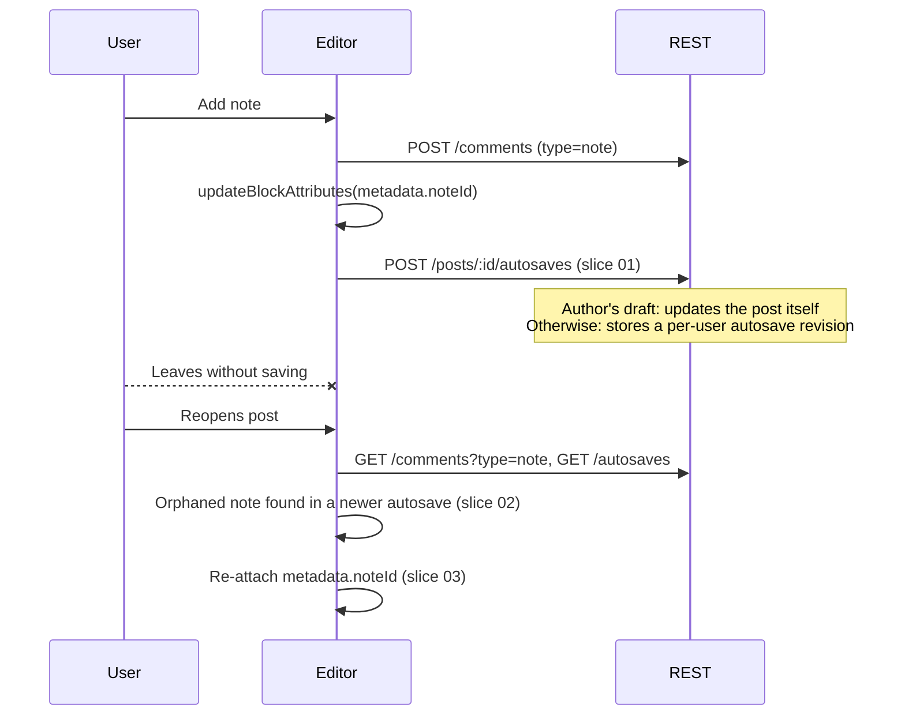

# Notes: keep note anchors through autosave

Spec for [#83398](https://github.com/WordPress/gutenberg/issues/83398) and [#72717](https://github.com/WordPress/gutenberg/issues/72717), based on [this proposal](https://github.com/WordPress/gutenberg/issues/83398#issuecomment-5825474889).

## Next Agent Prompt

**Status (2026-09-24):** Spec only. No code yet.

**Pick up at:** [Slice 01](slices/01-autosave-after-anchor-change.md). Write the e2e test first, watch it fail on trunk, then add the fix.

**Warnings:**

- New files are TypeScript (`.ts` / `.tsx`). New unit tests are Vitest.
- `block-editor` must not learn about autosaves. All of this work stays in `packages/editor`.
- Don't make anchor edits "non-dirty" (see [Deferred](#deferred-not-dirtying-the-post)). This spec deliberately leaves that out.

**TODO:**

- [ ] Slice 01: autosave right after a note anchor is added or removed
- [ ] Slice 02: pure matcher that finds orphaned note anchors in autosaves
- [ ] Slice 03: re-attach orphaned notes on load

Before you end your pass, update this section: the status, the next pickup point, and the checkboxes.

## Problem

A note is saved in two places:

1. The note itself is a `note` comment. REST saves it the moment it is created or deleted.
2. The link from the note to its block is `metadata.noteId` on the block (plus a `core/note` format marker for inline notes). That's an ordinary block attribute edit. It only persists when the post is saved.

If the user leaves without saving, the comment exists but no block points to it. The notes sidebar shows it as an orphan ("Original block deleted"). Deleting a note doesn't have this problem because the comment is gone either way.

## Idea

Autosave already stores the block content, so it's a free place to keep the anchor:

1. Autosave right after a note anchor changes, instead of waiting for the 60 second interval.
2. On load, look up each orphaned note in the autosaves. If an autosave has a block carrying that note id, and the same block exists in the current content, put the id back.

## Is it viable?

Yes, with limits. What the code says:

| Fact | Where | What it means |
| --- | --- | --- |
| An autosave by the post author, on a draft, with no post lock, updates the post itself instead of making a revision. | `WP_REST_Autosaves_Controller::create_item()` | Slice 01 alone fixes the most common case (an author notes their own draft). No reload logic needed. |
| core-data treats that response as a regular save. | `saveEntityRecord` in `packages/core-data/src/actions.js` ("An autosave may be processed by the server as a regular save") | The post is clean afterwards, so the unsaved changes warning goes away too. |
| For published posts, or drafts by another author, the autosave is a revision owned by the current user. | Same controller | The anchor survives, but only in the autosave. Slice 03 is needed. |
| `GET /wp/v2/posts/:id/autosaves` returns autosaves from **all** users. | `WP_REST_Autosaves_Controller::get_items()` | A reviewer's autosave can re-attach a note for the author. Not limited to the same user. |
| Autosave only fires when the post is autosaveable (saveable, not locked, type supports `autosave`, existing autosave fetched). | `isEditedPostAutosaveable` | The immediate autosave is best-effort. When it can't run, behavior matches trunk. |
| Orphans are already computed in one place. | `useNoteThreads` in `collab-sidebar/hooks.js` | Slice 03 has a clear input: root threads with no `blockClientId`. |

**Limits**, compared with the targeted-persistence stack in [#81718](https://github.com/WordPress/gutenberg/pull/81718):

- Autosave writes every pending edit, not just the anchor. That's what the 60 second autosave does anyway, but here it happens sooner.
- Re-attaching depends on finding the block again. If the block changed a lot after the autosave, the note stays orphaned, like today.
- Post types without `autosave` support get no benefit.
- Published posts still show the unsaved changes warning after adding a note. See [Deferred](#deferred-not-dirtying-the-post).

#81718 persists just the anchor to the saved post. That's more robust, but it needs six stacked PRs of new core-data and CRDT machinery. This spec only uses what autosave already does, and gets most of the benefit.

## Slices

| # | Slice | Unlocks | Review surface |
| --- | --- | --- | --- |
| 01 | [Autosave after anchor change](slices/01-autosave-after-anchor-change.md) | Author drafts keep anchors without a save | e2e: add a note, reload, still attached |
| 02 | [Autosave anchor matcher](slices/02-autosave-anchor-matcher.md) | A pure, tested answer to "where does this orphan belong?" | Vitest fixtures |
| 03 | [Re-attach on load](slices/03-reattach-on-load.md) | Published posts and other users' drafts | e2e: published post, reload, still attached |

01 ships on its own. 02 and 03 ship together or 02 first.

## Contracts

- **One owner for anchor reading.** `getNoteIdsFromMetadata` (in `collab-sidebar/utils.js`) is the only thing that reads note ids off a block. The matcher uses it and does not parse `metadata.noteId` itself.
- **One owner for orphans.** `useNoteThreads` decides which notes are orphans. Slice 03 uses that result and does not compute orphans again.
- **Re-attaching never overwrites.** It only adds a note id to a block that doesn't already have it, and only for notes that are orphaned right now.
- **No new REST endpoints, no PHP.** Only `/comments` and `/autosaves`, which the editor already calls.

## Firewalls

- Don't change autosave timing, what it saves, or the "more recent autosave" notice for anything other than notes.
- Don't touch the #81718 stack's files (core-data persistence, CRDT snapshots).
- Replies (`parent !== 0`) have no anchor. Leave them alone.

## Deferred: not dirtying the post

The proposal suggests not dirtying the post when the only change is a note id. That's left out for now:

- Dirty state is what makes a post autosaveable. If the anchor edit isn't dirty, slice 01 has nothing to save.
- On a published post the anchor lives only in memory until the autosave lands. The unsaved changes warning is the only thing guarding it.
- After slice 01, author drafts are clean anyway because the autosave is treated as a save.

A later option: skip the unsaved changes warning when the latest autosave already contains every pending edit. That would help every autosaveable edit, not just notes, so it should be its own issue.

## Open questions

- After re-attaching on load (slice 03), should a snackbar say so ("Notes reattached from an autosave")? Proposed: yes, one snackbar, only when at least one note was re-attached.
- Should deleting a note also autosave, so the saved content doesn't keep an id pointing to a deleted comment? Proposed: yes, in slice 01, so create and delete behave the same way (that's what #83398 asks for).
